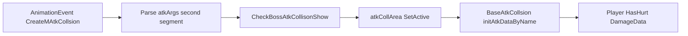

# BossMogut 的攻击系统

面向策划与程序：说明 **Boss Mogut** 每一招对应的 **CollArea**、动画事件参数、与玩家受击的关系及验收要点。

---

## 1. 概述

- Boss 的攻击碰撞体与特效 **直接挂在 BOSS 预制体/场景实例上**，通过动画事件 **`CreateMAtkCollsion` / `RemoveMAtkCollsion`** 做 **显隐**，而不是像部分小怪那样在运行时从技能节点单独 `Instantiate` 一条独立路径。
- 代码里用字符串 **`Atk1` / `Atk2` / `Trample`** 区分三招，并绑定到 `BossMogutLogic` 上序列化的 **`skillNode_*`、`atkCollArea_*`、`effectAtk_*`**。对应逻辑见 [`BossMogutLogic.CheckBossAtkCollisonShow`](f:/Yaer/yaer/Yaer/Assets/Scripts/Game/GameRuntime/Entities/Monster/BossMogut/BossMogutLogic.cs)（约 400–488 行）。

---

## 2. 招式与 CollArea / 特效节点对应表

| 动画事件里的 `atkTypeName`（`atkArgs` 第二段） | 状态机 | Inspector 引用（`BossMogutLogic`） | 备注 |
|---|---|---|---|
| **`Atk1`** | `BossMogutAttack1State` | `skillNode_1`、`atkCollArea_1`、`effectAtk_1` | 偏「轻击」；震屏强度约 `(7, 7, 7)` |
| **`Atk2`** | `BossMogutAttack2State` | `skillNode_2`、`atkCollArea_2`、`effectAtk_2` | 偏「重击」；震屏约 `(10, 10, 10)` |
| **`Trample`** | `BossMogutTrampleState` | `skillNodeTrample`、`atkCollAreaTrample`、`effectAtkTrample` | 践踏；震屏约 `(7, 7, 7)` |

**重要**：动画里 **`CreateMAtkCollsion` / `RemoveMAtkCollsion`** 传入的 `atkArgs` 格式为 **`怪物名,招式类型`**（逗号分隔两段）。第二段必须是上表中的 **`Atk1` / `Atk2` / `Trample`** 之一，否则 [`CheckBossAtkCollisonShow`](f:/Yaer/yaer/Yaer/Assets/Scripts/Game/GameRuntime/Entities/Monster/BossMogut/BossMogutLogic.cs) 无法进入对应分支。解析见 [`BaseBossMogutBattleState.CreateMAtkCollsion`](f:/Yaer/yaer/Yaer/Assets/Scripts/Game/GameRuntime/Entities/Monster/BossMogut/StateMachine/BaseBossMogutBattleState.cs)。

---

## 3. 攻击流程（与史莱姆等怪的差异）

1. **显隐**：`CreateMAtkCollsion` 时对 `collArea` **`SetActive(true)`**，`RemoveMAtkCollsion` 时 **`SetActive(false)`**（碰撞区域「瞬间出现/消失」）。
2. **初始化伤害**：显示时从 `collArea` 取 [`BaseAtkCollsion`](f:/Yaer/yaer/Yaer/Assets/Scripts/Game/GameRuntime/Entities/Effect/AtkCollsion/BaseAtkCollsion.cs)，调用 `initAtkDataByName(this, curAtkCollsionType, atkName)` 与 `clearData()`（清除上一段攻击已命中列表）。
3. **特效**：`effectAtk_*` 节点下子物体如 `stoneIn`、`stoneOut` 等参与显示与淡出；关闭时通过 DOTween 淡出后再把节点挂回 `skillNode` 并隐藏（详见 `CheckBossAtkCollisonShow` 内 `effectSprites` 逻辑）。

**资源对照（美术/预制体）**：独立 AtkCollion 预制体可参考目录  
`Assets/GameRes/Prefabs/Entity/Effect/Monster/AtkCollsion/BossMogut/`  
下的 `CollArea_Atk1`、`CollArea_Atk2`、`CollArea_Trample`。场景中实际使用的对象以 **BOSS 上 Inspector 拖拽的 `atkCollArea_*`** 为准。

---

## 4. 技能释放与 AI（为什么有时会出某一招）

- 入口：[`BossMogutMoveState.SkillCastLogic`](f:/Yaer/yaer/Yaer/Assets/Scripts/Game/GameRuntime/Entities/Monster/BossMogut/StateMachine/BossMogutMoveState.cs)。
- **状态机侧技能名**（随机池）：`Attack1`、`Attack2`、`Trample`、`CreartWormWood`。  
  这与动画事件里的 **`Atk1` / `Atk2` / `Trample` 不是同一套字符串**：前者决定进入哪个攻击状态，后者决定 **`CheckBossAtkCollisonShow` 打开哪一组 CollArea**。
- **特殊规则摘要**（以代码为准，数值可调）：
  - 与玩家水平距离 **≤ 6** 且上一招不是 `Attack2` 时，下一招 **强制** 走 `Attack2` 分支（易打出重击态）。
  - **`IsBrokenLeg`**（不能起身阶段）时，随机结果 **固定为 `CreartWormWood`**（召唤蠕虫），不再在三招近战里随机。
  - 召唤蠕虫：若当前场上虫数已达上限且非断腿阶段，可能 **回退为轻击** `BossMogutAttack1State`；成功召唤后会缩短攻击 CD 等（见 `SkillCastLogic` 内分支）。

---

## 5. 与玩家受击的关系

- 玩家侧流程与全项目一致：**`BaseAtkCollsion` 组 `DamageData` → `BattleComponent` → `PlayerLogic.OnApplyStatusEffects`**。
- **击退 / 击飞 / Break** 等表现由 **对应 `atkCollArea_*` 上配置的 `DamageData`（及 `Atk Type`）** 决定；调参应改 **BOSS 侧碰撞体/预制体**，而不是改玩家通用逻辑。更细的字段说明见 [玩家受击系统.md](f:/Yaer/yaer/Yaer/Assets/Doc/玩家受击系统.md)。

---

## 6. 数据流（示意）

---

## 7. 策划验收清单

- [ ] 三招动画中 **`CreateMAtkCollsion` / `RemoveMAtkCollsion`** 的 **第二段** 与第 2 节表格一致（`Atk1` / `Atk2` / `Trample`）。
- [ ] 每招 **开启** 时对应 **CollArea** 出现，**结束** 时关闭；特效 **`stoneIn` / `stoneOut`** 淡出与节点复位正常。
- [ ] 修改对应 **CollArea** 上 **伤害与击退/击飞** 参数后，玩家受击表现符合预期。
- [ ] **距离强制重击**、**断腿只召唤虫** 等 AI 行为与当前版本 `SkillCastLogic` 一致。

---

## 8. 相关脚本索引

| 说明 | 路径 |
|---|---|
| 碰撞显隐与特效 | [`BossMogutLogic.cs`](f:/Yaer/yaer/Yaer/Assets/Scripts/Game/GameRuntime/Entities/Monster/BossMogut/BossMogutLogic.cs) |
| 动画事件解析、震屏 | [`BaseBossMogutBattleState.cs`](f:/Yaer/yaer/Yaer/Assets/Scripts/Game/GameRuntime/Entities/Monster/BossMogut/StateMachine/BaseBossMogutBattleState.cs) |
| 移动与技能选择 | [`BossMogutMoveState.cs`](f:/Yaer/yaer/Yaer/Assets/Scripts/Game/GameRuntime/Entities/Monster/BossMogut/StateMachine/BossMogutMoveState.cs) |
| 三招攻击状态 | `BossMogutAttack1State` / `BossMogutAttack2State` / `BossMogutTrampleState`（同目录 `StateMachine`） |
