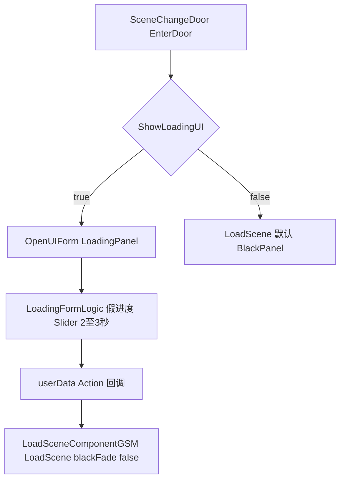

# 加载地图的加载条功能（策划案）

面向策划与程序：说明「场景切换时中间出现的读条界面」对应的**预制体、脚本逻辑、与纯黑幕转场的区别**，便于验收与配场景。

---

## 1. 预制体与脚本（你要找的「读条」）

| 项目 | 路径 / 说明 |
|------|-------------|
| **UI 预制体** | [`Assets/GameRes/Prefabs/UI/LoadingPanel.prefab`](f:/Yaer/yaer/Yaer/Assets/GameRes/Prefabs/UI/LoadingPanel.prefab) |
| **逻辑类** | [`LoadingFormLogic.cs`](f:/Yaer/yaer/Yaer/Assets/Scripts/Game/GameRuntime/UI/FormLogic/Loading/LoadingFormLogic.cs)（命名空间 `Game.GameRuntime.UI.FormLogic.Loading`） |
| **常量路径** | [`UIPrefabPath.LoadingPanel`](f:/Yaer/yaer/Yaer/Assets/Scripts/Game/Static/Path/UIPrefabPath.cs) → `Assets/GameRes/Prefabs/UI/LoadingPanel.prefab` |
| 运行时实例 | 一般为 **`LoadingPanel(Clone)`**（以 Unity 实例化命名为准） |

预制体内主要绑定（以 Inspector 为准）：

- **`MainGO`**：主显示根节点（读条过程中显示，结束后会关掉）。
- **`PicturesRtf`**：插图区域，子物体为多张图，**随机显示其中一张**。
- **`TipsRtf`**：提示文案区域，子物体为多条 Tips，**随机显示其中一条**。
- **`ProgressSlider`**：**Unity UI `Slider`**，用作读条表现。

---

## 2. 读条是不是「真实加载进度」？

**不是。** 当前实现里，进度条走的是 **程序写死的协程动画**，与 GameFramework 的 `LoadSceneUpdateEventArgs`（真实异步加载进度）**没有绑定**。

[`LoadingFormLogic.Progress`](f:/Yaer/yaer/Yaer/Assets/Scripts/Game/GameRuntime/UI/FormLogic/Loading/LoadingFormLogic.cs) 逻辑摘要：

- 总时长约 **随机 2～3 秒**（`Random.Range(2f, 3f)`）。
- 中间会插入 **随机时刻的停顿**（每次约 `WaitForSeconds(0.5f)`），制造「卡顿一下再继续」的感觉。
- 协程把 `ProgressSlider.value` 从 0 推到 1。
- 结束后调用 **`BlackFadeComponent`** 渐隐，再执行 **`OnFinishLoading`**（即打开界面时传入的 `userData`，类型为 **`Action`**），最后关闭本界面。

因此：**策划看到的「读满」≈ 动画播完**，不等于资源/场景字节级加载百分比。若以后要「真进度」，需要改 `LoadingFormLogic`，订阅资源或场景的进度回调后再驱动 `Slider`。

---

## 3. 什么时候会弹出 LoadingPanel？

当前代码里**显式打开** `LoadingPanel` 的入口较少，典型如下。

### 3.1 场景门（传送门）勾选「显示加载 UI」

[`SceneChangeDoor`](f:/Yaer/yaer/Yaer/Assets/Scripts/Game/GameRuntime/Entities/SceneEntities/CommonEntity/SceneChangeDoor.cs)：

- 字段 **`ShowLoadingUI`**（Inspector）为 **true** 时：先 **`OpenUIForm(LoadingPanel)`**，在 **`callBack`** 里再调用 **`LoadSceneComponentGSM.LoadScene(NextSceneName, null, blackFade: false)`**（即**不用**默认的黑幕条带转场，由 Loading 面板承担表现）。
- **`ShowLoadingUI`** 为 **false** 时：**不**打开 LoadingPanel，直接走 **`LoadScene(..., blackFade: true)`**，即下面说的 **BlackPanel** 流程。

因此：**只有门上勾了 ShowLoadingUI 的传送**，玩家才会看到 LoadingPanel 读条；其它很多切场景走的是黑幕，不是这个预制体。

### 3.2 其它 / 测试

- [`SelectHardFormLogic`](f:/Yaer/yaer/Yaer/Assets/Scripts/Game/GameRuntime/UI/FormLogic/SelectHard/SelectHardFormLogic.cs) 内有**注释掉的测试代码**，曾用于打开 `LoadingPanel`，正式流程以当前未注释逻辑为准。

---

## 4. 与「黑幕转场 BlackPanel」的区别（容易混淆）

| 对比 | LoadingPanel | BlackPanel（黑幕） |
|------|----------------|-------------------|
| 典型用途 | 带插图 + Tips + **Slider 读条** 的过渡界面 | **全屏渐黑/渐亮**，无单独读条 UI |
| 主要入口 | `SceneChangeDoor` 且 **`ShowLoadingUI == true`** | [`LoadSceneComponentGSM.LoadScene`](f:/Yaer/yaer/Yaer/Assets/Scripts/Game/GameRuntime/GameSceneManager/Component/LoadSceneComponentGSM.cs) 默认 **`blackFade == true`** 时打开 |
| 预加载 | [`InitSceneResConfig`](f:/Yaer/yaer/Yaer/Assets/Scripts/Game/GameMgr/Manager/Res/SceneRes/Config/InitSceneResConfig.cs) 会预加载 **BlackPanel** 与 **LoadingPanel** 资源 |

一句话：**「中间读条界面」= LoadingPanel；「一黑到底」= BlackPanel。** 同一次切场景一般不会两个都走同一套表现，由 `SceneChangeDoor` 的 `ShowLoadingUI` 与 `LoadScene` 的 `blackFade` 参数组合决定。

---

## 5. 数据流（示意）

---

## 6. 策划验收清单

- [ ] 需要「读条 + 插图 + Tips」的门：在对应 **`SceneChangeDoor`** 上勾选 **`ShowLoadingUI`**，进游戏走门，应出现 **`LoadingPanel`**，**Slider** 从空到满，再进入下一场景。
- [ ] **`Pictures`** / **`Tips`** 子物体增删后，是否仍能随机到（子物体数量 0 时需程序兜底，当前逻辑假设至少各 1 个）。
- [ ] 明确：**读条长度 ≠ 真实加载时间**，仅观感；若策划要求与真实加载同步，需提需求改 `LoadingFormLogic`。
- [ ] 不需要读条、只要黑幕的门：**不要**勾 `ShowLoadingUI`，验收黑幕流程即可。

---

## 7. 相关索引（程序扩展用）

- 场景加载模块：[`LoadSceneComponentGSM.cs`](f:/Yaer/yaer/Yaer/Assets/Scripts/Game/GameRuntime/GameSceneManager/Component/LoadSceneComponentGSM.cs)
- 切场景：[`ChangeSceneComponentGM.cs`](f:/Yaer/yaer/Yaer/Assets/Scripts/Game/GameMgr/Component/ChangeScene/ChangeSceneComponentGM.cs)
- GameFramework 场景进度事件（未接 UI）：`LoadSceneUpdateEventArgs`（`GameFramework.Scene` / UnityRuntime 封装）

**注意**：[`LoadGamePanel`](f:/Yaer/yaer/Yaer/Assets/GameRes/Prefabs/UI/LoadGamePanel.prefab) 是**存档读档界面**，与地图 LoadingPanel **不是同一个**，验收时不要混用名称。
