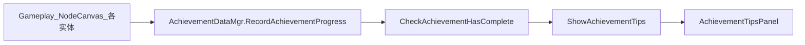

# 成就动画系统（AchievementTipsPanel / AchievementPanel）

面向策划：区分**游戏中解锁成就时的弹窗动画**与**主菜单成就列表界面**，说明预制体、配置、数据流、DOTween 时序及音频行为，便于验收并与音频/动效对齐。

---

## 1. 功能概述与两条线区分

「成就」在工程里对应两套 UI，请勿混为一谈：

| 场景 | 预制体 | 逻辑脚本 | 说明 |
|------|--------|----------|------|
| **游戏中解锁成就** | `AchievementTipsPanel` | [`AchieveTipsFormLogic`](f:/Yaer/yaer/Yaer/Assets/Scripts/Game/GameRuntime/UI/FormLogic/AchievementTipsPanel/AchieveTipsFormLogic.cs) | 使用 **DOTween** 做淡入 → 停留 → 淡出，即文档所称**「成就动画」**的主体 |
| **主菜单浏览成就列表** | `AchievementPanel` | [`AchievementFormLogic`](f:/Yaer/yaer/Yaer/Assets/Scripts/Game/GameRuntime/UI/FormLogic/Achievement/AchievementFormLogic.cs) | 滚动列表、悬停提示条、选中看详情；**没有**与 Tips 相同的解锁序列动画 |

- **主菜单入口**：[`StartFormLogic.OnClickAchievement`](f:/Yaer/yaer/Yaer/Assets/Scripts/Game/GameRuntime/UI/FormLogic/Start/StartFormLogic.cs) 在黑幕过渡后打开 `UIPrefabPath.AchievementPanel`（即 `Assets/GameRes/Prefabs/UI/AchievementPanel.prefab`）。

---

## 2. 预制体与路径

| 项目 | 路径 / 说明 |
|------|-------------|
| 解锁弹窗 | [`Assets/GameRes/Prefabs/UI/AchievementTipsPanel.prefab`](f:/Yaer/yaer/Yaer/Assets/GameRes/Prefabs/UI/AchievementTipsPanel.prefab)（代码中 `GetUIPrefabPath("AchievementTipsPanel")`） |
| 成就列表 | `Assets/GameRes/Prefabs/UI/AchievementPanel.prefab` |
| 成就配置表 | [`Assets/GameRes/Config/AchievementConfig/AchievementConfig.json`](f:/Yaer/yaer/Yaer/Assets/GameRes/Config/AchievementConfig/AchievementConfig.json) |

配置表常用字段：`id`（与 `AchievementType` 枚举对应）、`value`（目标进度）、`condition` / `desc` 及多语言字段、`tag`（列表详情区人物图，见 [`AchievementFormLogic.OnItemSelected`](f:/Yaer/yaer/Yaer/Assets/Scripts/Game/GameRuntime/UI/FormLogic/Achievement/AchievementFormLogic.cs)）。

---

## 3. 数据与触发链（解锁弹窗）

1. 游戏内通过 [`AchievementDataMgr.RecordAchievementProgress(AchievementType, int)`](f:/Yaer/yaer/Yaer/Assets/Scripts/Game/GameMgr/Component/Archive/ArchiveDataClass/Achievement/AchievementDataMgr.cs) 累加进度；若该成就**已完成**则直接返回，不再处理。
2. 进度变化后 `CheckAchievementHasComplete(achieveId, true)` 判断是否达到配置 `value`；达标则调用 **`ShowAchievementTips(achieveId)`**，并保存完成状态与存档。
3. **`ShowAchievementTips`**：若 **`AchievementTipsPanel` 当前未打开**，则 `OpenUIForm(..., EUIGroup.Top, userData: achieveId)`；**若已打开则不再打开新实例**。

**设计约束（策划/程序需知）**：连续、极短时间解锁多条成就时，**可能只会播放第一条**的 Tips（因为第二条到达时面板仍算「已打开」）。若产品需要逐条排队，需另行设计队列（当前版本无队列逻辑）。

**调用示例（非完整列表）**：`Slime`、`WoodWormLogic`、`AchievementRecordAction`（NodeCanvas）等工程内检索 `RecordAchievementProgress` 可查全部调用点。

---

## 4. 动画与时序（`AchieveTipsFormLogic`）

以下均来自 [`AchieveTipsFormLogic`](f:/Yaer/yaer/Yaer/Assets/Scripts/Game/GameRuntime/UI/FormLogic/AchievementTipsPanel/AchieveTipsFormLogic.cs)，使用 [`GameActionMgr`](f:/Yaer/yaer/Yaer/Assets/Scripts/Utils/GameActionMgr.cs) 与 **DOTween**。

| 阶段 | 行为 |
|------|------|
| `OnInit` | `textArea` 上 `CanvasGroup.alpha = 0`（初始不可见） |
| `OnOpen` | 从 `userData` 读取 `AchievementType` 为 `curAchType` |
| `UpdateUI` → `initData` | 按当前语言从 `name` / `name_en` / `name_jp` 图集加载**成就名称图**，键为成就 **id** 字符串，赋给 `imgRealName` |
| 序列第 1 段 | `runFadeAction(textArea, 1f, 1f)`：**1 秒**内淡入到完全不透明 |
| 序列第 2 段 | `runDelayTimeAction(6, FadeOutUI)`：**再经过 6 秒**后执行 `FadeOutUI` |
| `FadeOutUI` | `textArea` 与各 `tagObjList` 元素在 **1 秒**内淡出；`textArea` 淡出结束回调 **`CloseForm()`** |

**表现细节**：`tagObjList` 在 `UpdateUI` 中被直接设为 `alpha = 1f`，**未参与与 `textArea` 同步的淡入**；若预制体上装饰图与文字区视觉节奏不一致，可在预制体或后续动效上再统一。

**粗算总时长**：约 **1s（淡入）+ 6s（停留）+ 1s（淡出）≈ 8s** 后关闭（以实际 DOTween 与帧情况为准）。

---

## 5. 音频与「音画不同步」

- 基类 [`BaseUIFormLogic.OnOpen`](f:/Yaer/yaer/Yaer/Assets/Scripts/Game/GameRuntime/UI/FormLogic/Base/BaseUIFormLogic.cs) 会调用 **`PlayerOpenAudio()`**（默认 `UIUtils.PlayTapExChangeSfx`）。
- **`AchieveTipsFormLogic` 将 `PlayerOpenAudio` 重写为空**，因此**不会**播放上述默认「打开界面」音效。
- 若成就专属音效挂在 **Animator / Timeline / 预制体上其他组件**，其时间轴与 **`UpdateUI` 内 DOTween 序列无代码层绑定**，容易出现**音画不同步**或节奏与策划预期不符。

### 5.1 已知问题 / 待调（保留原共识）

- **成就动画节奏需要调整，而且音画不同步**。

### 5.2 可调方向（文档建议，不强制改代码）

- 在 **`UpdateUI` 序列的关键时间点**（例如淡入开始、停留结束）由脚本统一触发 `AudioSource` 或音效接口，使时长与 `runFadeAction` / `runDelayTimeAction` 参数一致。
- 或将**动效总时长、分段时长与音频长度**写入同一张策划表，与程序对齐后再改预制体或代码。

---

## 6. 成就列表界面（`AchievementPanel`）与资源

- **列表项**：[`AchievementItem`](f:/Yaer/yaer/Yaer/Assets/Scripts/Game/GameRuntime/UI/FormLogic/Achievement/AchievementItem.cs) 使用名称图集显示成就名；已完成显示 `Tag`。
- **详情与悬停**：选中项用 `GetAchievementDesc`；悬停提示条用 `GetAchievementTips`（与配置中 `condition` 等字段对应，以 [`AchievementDataMgr`](f:/Yaer/yaer/Yaer/Assets/Scripts/Game/GameMgr/Component/Archive/ArchiveDataClass/Achievement/AchievementDataMgr.cs) 为准）。
- **图集**（与代码一致）：
  - 列表详情人物立绘：`Assets/GameRes/Atlas/YaerQImgAtlas.spriteatlas`
  - 成就名称多语言：`Assets/GameRes/Atlas/AchievementPanel/name.spriteatlas`、`name_en.spriteatlas`、`name_jp.spriteatlas`

---

## 7. 相关脚本索引

| 脚本 | 作用 |
|------|------|
| [`AchievementDataMgr.cs`](f:/Yaer/yaer/Yaer/Assets/Scripts/Game/GameMgr/Component/Archive/ArchiveDataClass/Achievement/AchievementDataMgr.cs) | 进度、达标、存档、`ShowAchievementTips` |
| [`AchieveTipsFormLogic.cs`](f:/Yaer/yaer/Yaer/Assets/Scripts/Game/GameRuntime/UI/FormLogic/AchievementTipsPanel/AchieveTipsFormLogic.cs) | 解锁弹窗动效与关闭 |
| [`AchievementFormLogic.cs`](f:/Yaer/yaer/Yaer/Assets/Scripts/Game/GameRuntime/UI/FormLogic/Achievement/AchievementFormLogic.cs) | 成就列表面板 |
| [`AchievementRecordAction.cs`](f:/Yaer/yaer/Yaer/Assets/Scripts/Game/GameRuntime/NodeCanvas/NodeCanvasNode/ActionTask/Common/AchievementRecordAction.cs) | NodeCanvas 中记录成就进度 |
| [`StartFormLogic.cs`](f:/Yaer/yaer/Yaer/Assets/Scripts/Game/GameRuntime/UI/FormLogic/Start/StartFormLogic.cs) | 主菜单打开成就列表 |

---

## 8. 策划验收清单（建议）

1. 在游戏中触发**单条**成就解锁：弹窗出现，`textArea` 约 1s 淡入，约 6s 停留后约 1s 淡出并关闭。
2. 名称图与当前语言一致；`imgRealName` 与配置 `id` 对应图集键一致。
3. **连续快速解锁两条**：确认是否只显示第一条（与「单实例不重复打开」策略一致）；若产品需要两条都提示，需另提需求。
4. 主菜单进入成就列表：列表、悬停、选中详情与解锁状态（`Tag`）正确。
5. 音画：若仍使用预制体动画/音效，对照第 5 节已知问题与可调方向。
