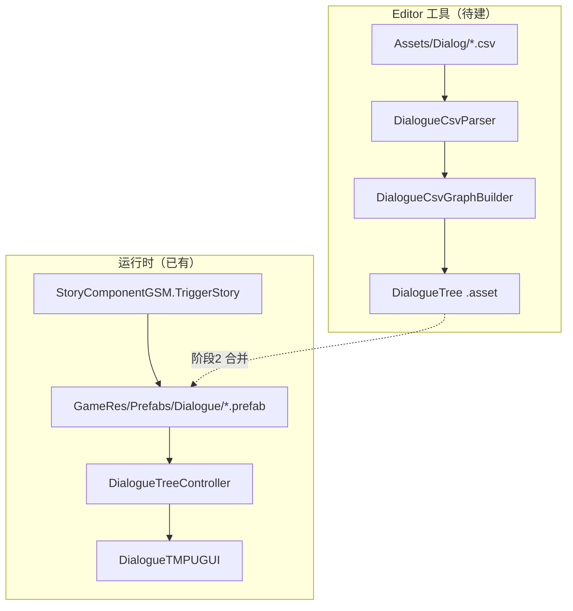

# CSV → NodeCanvas DialogueTree 自动生成工具 — 架构溯源与执行说明

**文档性质**：架构侦探产出（只读分析 + 施工指引，**本阶段不改代码**）  
**依据**：`Assets/Doc/00_MASTER_PROMPT.md`【架构侦探】模式；任务卡 `Assets/Doc/任务卡/0525/制作一个“CSV → NodeCanvas DialogueTree 自动生成工具”。.md`；样例数据 `Assets/Dialog/村内第一段对话.csv`；台本 `Assets/Doc/技术文档/精灵村Village_KenMuNi_对话台本.md`  
**Unity 版本**：2020.3.48f1  

---

## 1. 结论（一句话）

**本项目对话运行时吃的是 `GameRes/Prefabs/Dialogue/*.prefab` 上绑定的 NodeCanvas 图（`StatementNodeEx` + 立绘/Action 前奏），不是裸 `.asset`；CSV 导入工具应优先用 Graph 官方 `AddNode` / `ConnectNodes` API 生成图数据，并单独维护「策划简称 → 图内 Actor 参数名」映射，生成结果建议先落独立 `.asset` 供校对，再按既有预制体规范合并进 Prefab。**

---

## 2. 业务背景与数据现状

### 2.1 策划在做什么

- 在 Excel/CSV 里按行写对白（ID、类型、说话人、文本、下一跳、选项文案）。
- 目标是**少用手点** NodeCanvas 里的 Say / 选项节点和连线。
- 当前样例 `Assets/Dialog/村内第一段对话.csv` 仅 3 句线性对白，与台本 §二 序号 1～3 一致：

| ID | Type | Speaker | Text | Next |
|----|------|---------|------|------|
| 1 | Dialogue | 雅 | 好漂亮的村子。 | 2 |
| 2 | Dialogue | 古 | 雅尔一定是第一次来吧… | 3 |
| 3 | Dialogue | 雅 | 我挺好奇的。 | （空） |

### 2.2 与现有工程资产的关系

| 资源 | 路径 | 说明 |
|------|------|------|
| CSV 策划稿 | `Assets/Dialog/*.csv` | 导入源，**不参与** AB/运行时加载 |
| 对话预制体 | `Assets/GameRes/Prefabs/Dialogue/{名}.prefab` | `StoryComponentGSM.TriggerStory(名)` → `DialoguePath.GetPath` |
| 已有 Excel 管线 | `Assets/Editor/Tool/ExcelTool/DialogueConfigExcelTool.cs` | Excel → **JSON**（`GameRes/Config/DialogueConfig/`），与 NodeCanvas **无直接关系** |
| 村线成品示例 | `Village_KenMuNiStart.prefab` | 图内 Actor 名为 **「雅尔」「古莎」**，节点类型为 **StatementNodeEx**，前有 **ActionNode**（UI 淡入、立绘 CanvasGroup 等） |

**重要差异**：任务卡示例 Speaker 为 `Dog`/`NPC`；本项目实际为中文简称 **雅/古**，运行时 Actor 参数为 **雅尔/古莎**（见 §5.3）。

---

## 3. NodeCanvas 架构分析（项目实测）

### 3.1 版本与位置

- NodeCanvas 以源码形式位于 `Assets/ParadoxNotion/`（含 `CanvasCore` + `NodeCanvas`），**无**独立 `package.json` 版本号；与 Unity 2020.3.48f1 配套使用。
- 官方菜单已有：`Tools/ParadoxNotion/NodeCanvas/Create/Dialogue Tree Object`（创建带 `DialogueTreeController` 的空物体）。

### 3.2 核心类型一览

| 用途 | 类名 | 命名空间 | 路径 |
|------|------|----------|------|
| 对话图资产 | `DialogueTree` | `NodeCanvas.DialogueTrees` | `.../Modules/DialogueTrees/DialogueTree.cs` |
| 图宿主（运行时） | `DialogueTreeController` | 同上 | `.../DialogueTreeController.cs` |
| 图基类 API | `Graph` | `NodeCanvas.Framework` | `CanvasCore/Framework/Runtime/Graphs/Graph.cs` |
| 对话节点基类 | `DTNode` | `NodeCanvas.DialogueTrees` | `.../DTNode.cs` |
| 标准对白节点 | `StatementNode` | 同上 | `.../Nodes/StatementNode.cs` |
| **项目实际对白节点** | **`StatementNodeEx`** | **`Game.GameRuntime.Story.NodeCanvasExtend`** | `Assets/Scripts/Game/GameRuntime/NodeCanvas/NodeCanvasExtend/StatementNodeEx.cs` |
| 分支选项节点 | `MultipleChoiceNode` | `NodeCanvas.DialogueTrees` | `.../Nodes/MultipleChoiceNode.cs`（编辑器显示名 **Multiple Choice**） |
| 显式结束 | `FinishNode` | 同上 | `.../Nodes/FinishNode.cs` |
| 连线类型 | `DTConnection` | 同上 | 由 `DTNode.outConnectionType` 固定 |
| 台词数据 | `Statement` | 同上 | `IStatement.cs`（`text` / `text_en` / `text_jp` / `audio` / `meta`） |
| Actor 参数 | `DialogueTree.ActorParameter` | 同上 | `name` + `ID` + `IDialogueActor` 引用 |

### 3.3 节点创建 API（禁止臆造，以 `Graph.cs` 为准）

```csharp
// 创建节点（自动 UndoUtility.RecordObject）
T node = dialogueTree.AddNode<T>(new Vector2(x, y));
Node node = dialogueTree.AddNode(typeof(StatementNodeEx), position);

// 连线：sourceIndex 对 MultipleChoice 为「第几个选项」出口
Connection c = dialogueTree.ConnectNodes(sourceNode, targetNode, sourceIndex: -1, targetIndex: -1);
// -1 表示追加到 outConnections 末尾
```

- 首个加入图的节点会成为 **`primeNode`**（对话入口）。现有预制体入口多为 **ActionNode**，不是第一句对白。
- 删除/改连线：`RemoveNode` / `RemoveConnection`（同样带 Undo）。

### 3.4 字段名称（导入时要写的序列化字段）

| CSV 概念 | 应写入的节点字段 | 备注 |
|----------|------------------|------|
| Speaker | `DTNode` 私有 `_actorName` + `_actorParameterID` | 公开属性 `actorName` 的 **setter 为 private**，Editor 代码需用 **`SerializedObject`** 写 `_actorName`，并在 `actorParameters` 存在时写 `_actorParameterID` |
| Text | `StatementNode(Ex).statement.text` | 英/日字段 `text_en`、`text_jp` 第一阶段可留空 |
| 表情（台本有、CSV 暂无） | `StatementNodeEx.FaceType`（`BBParameter<DialogueFaceType>`） | 默认 `DialogueFaceType.Normal` 或与台本表对照扩展 CSV |
| Choice 文案 | `MultipleChoiceNode` 内 `List<Choice> availableChoices` | 每项 `Choice.statement.text`；**私有列表**，需 `SerializedObject` 或反射扩容后再 `ConnectNodes(..., sourceIndex: i)` |
| Choice 题干 | 节点自身可配 `requireActorSelection` 的 actor；CSV 的 `Text` 列在任务卡示例中作提问句 | 与 `MultipleChoiceNode` 的 `OnExecute` 一致 |

### 3.5 Choice 节点行为要点

- 类名是 **`MultipleChoiceNode`**，不是 `ChoiceNode`。
- `maxOutConnections` = `availableChoices.Count`；**必须先加够选项，再按选项下标连线**。
- `Next` 列用 `4|5` 时，应解析为两个目标 ID，分别 `ConnectNodes(choiceNode, targetA, sourceIndex: 0)`、`ConnectNodes(choiceNode, targetB, sourceIndex: 1)`。
- `Extra` 列用 `商店|离开` 与选项一一对应。

### 3.6 END 与无下一跳

- 任务卡：`Next = END`。
- NodeCanvas 规则：**无出边的节点**也会以 Success 结束对话（`FinishNode` 注释原文）。
- **施工建议**：`END` 或空 `Next` 均可不连出边；若需明确失败结束再挂 `FinishNode`。

### 3.7 DialogueTree 资源创建方式（两种，项目并存）

| 方式 | 说明 | 本项目使用度 |
|------|------|----------------|
| **A. ScriptableObject `.asset`** | `[CreateAssetMenu] Dialogue Tree Asset`；`EditorUtils.CreateAsset<DialogueTree>(path)` | 仓库内 **未发现** 独立 `.asset` 对话树，可作导入中间产物 |
| **B. Prefab 内嵌图（Bound Graph）** | `DialogueTreeController` + `_boundGraphSerialization` JSON | **主流**：所有 `GameRes/Prefabs/Dialogue/*.prefab` |

运行时加载链：

```
StoryComponentGSM.TriggerStory(prefabName)
  → ResComponentGM.LoadAsset(DialoguePath: GameRes/Prefabs/Dialogue/{name}.prefab)
  → NormalDialogueFormNewLogic.StartDialogue(go)
  → Instantiate → DialogueTreeController.StartDialogue()
  → DialogueTMPUGUI 订阅 DialogueTree.OnSubtitlesRequest / OnMultipleChoiceRequest
```

**结论**：任务卡「保存 .asset」可作为 **阶段 1 交付**；要进游戏必须 **阶段 2** 合并到 Prefab（或提供「从 .asset 生成/更新 Prefab」按钮）。

### 3.8 Actor 参数与说话人映射（项目特有风险）

`DialogueTree.actorParameters` 列表存放 **ActorParameter**（`name` 为图内键，如「雅尔」）。

- `GetActorReferenceByName`：未配置引用时用 **ProxyDialogueActor**（能播字幕，但 **立绘刷新依赖** `DialogueActorEx` + `DialogueRoleName`）。
- 样例 CSV 的 **「雅」「古」** 与成品图 **「雅尔」「古莎」** 不一致；`Village_KenMuNiStart` 中 `_actorName` 为 Unicode **雅尔 / 古莎**。

**必须在导入器中维护映射表**（建议 `ScriptableObject` 或 Editor 窗口可编辑字典）：

| CSV Speaker（策划简称） | 建议 Actor 参数名（图内） | DialogueRoleName（立绘逻辑） |
|-------------------------|---------------------------|------------------------------|
| 雅 | 雅尔 | `DialogueRoleName.Yaer` |
| 古 | 古莎 | `DialogueRoleName.Gusha` |

映射未命中时应 **报错并中止导入**，避免静默生成 `* 雅 *` 红色未定义 Actor（`DTNode.name` 的显示逻辑）。

### 3.9 为何必须用 StatementNodeEx

- 运行时 UI：`DialogueTMPUGUI` 将 `info.actor` 转为 **`DialogueActorEx`** 刷新立绘；`SubtitlesRequestInfoEx` 携带 **`DialogueFaceType`**。
- 现有预制体序列化 `$type` 均为 **`Game.GameRuntime.Story.NodeCanvasExtend.StatementNodeEx`**。
- 若导入器生成原生 `StatementNode`，**能显示文字**，但表情/立绘链路弱一档，与项目规范不符。

---

## 4. 导入流程设计（对齐任务卡 + 项目约束）

### 4.1 菜单与窗口

- 菜单路径（任务卡）：**`Tools/Dialogue/Import CSV`**
- 实现形式：`EditorWindow`（选 CSV、输出路径、映射配置、生成按钮）+ 内部静态 `MenuItem` 亦可。

### 4.2 数据结构（必先建）

```csharp
// 建议路径：Assets/Editor/Tool/Dialogue/DialogueRow.cs
class DialogueRow {
    public int id;
    public string type;      // Dialogue | Choice
    public string speaker;
    public string text;
    public string next;      // 单 ID | "4|5" | END | 空
    public string extra;     // 选项文案 "A|B"
}
```

解析注意：

- 跳过表头；`int.TryParse` 失败行写入 Log 并跳过。
- CSV 含中文逗号时需用正规 CSV 解析（引号包裹），不要 `string.Split(',')` 裸拆。
- 编码：UTF-8（与现有 `村内第一段对话.csv` 一致）。

### 4.3 六步生成算法

```
Step1  File.ReadAllText / 选中的 TextAsset → 解析为 List<DialogueRow>
Step2  校验 ID 唯一；Next 引用的 ID 均存在（END 除外）
Step3  var tree = ScriptableObject.CreateInstance<DialogueTree>();
       按 Speaker 收集 actorParameters（去重后 Add new ActorParameter(name)）
Step4  第一轮：foreach row → AddNode，Dictionary<int, Node> map
       - Dialogue → StatementNodeEx，写 statement.text、FaceType 默认、position 纵向递增（如 y += 120）
       - Choice   → MultipleChoiceNode，按 Extra 拆分添加 availableChoices
Step5  第二轮：foreach row → 解析 Next
       - 单 ID → ConnectNodes(src, map[id])
       - 多 ID → 按 | 拆分，MultipleChoice 用 sourceIndex 0..n-1
       - END/空 → 不连出边（或连 FinishNode，可配置）
Step6  设置 primeNode = 最小 ID 节点（或配置「起始 ID」）
       Undo.RegisterCreatedObjectUndo(tree, "Import CSV Dialogue");
       AssetDatabase.CreateAsset(tree, 用户选择路径);
       AssetDatabase.SaveAssets();
```

**Undo**：NodeCanvas 内部 `AddNode`/`ConnectNodes` 已调用 `UndoUtility.RecordObject`；创建 asset 用 `Undo.RegisterCreatedObjectUndo`。

### 4.4 节点布局建议

- `flowDirection` 为 **Vertical**；`_position` 使用 `(baseX, baseY + rowIndex * spacing)`。
- 同 ID 仅一个节点；Choice 的 `Text` 可作为节点注释或第一个 choice 的占位（与任务卡示例一致）。

---

## 5. 与现有预制体结构的差距（阶段划分依据）

以 `Village_KenMuNiStart.prefab` 为代表的**完整剧情**通常包含：

1. **ActionNode**：`NormalDialogueUIAlphaAnimationTaskAction`、立绘 `CanvasGroupAlphaActionTask`、`FightingPanelVisibleActionTask` 等。
2. **StatementNodeEx** 链：带 `FaceType` 与三语文本。
3. 子物体 **DialogueActorEx** + **StoryFormPainting**（`GushaPainting`、`GoOutStoryYaerPainting` 等）绑定 `actorParameters` 的 Object 引用。

**CSV 工具阶段 1** 只生成 **纯对白子图** 是合理最小范围；**不要**在阶段 1 自动删改已有 Prefab 上的 Action/立绘引用。

| 阶段 | 范围 | 验收 |
|------|------|------|
| **1（必须）** | CSV → `DialogueTree` `.asset`；Dialogue + Choice + 连线；`StatementNodeEx` + Actor 映射 | 在 NodeCanvas 编辑器打开 asset，图结构正确、可 Play 预览字幕 |
| **2（建议）** | 从模板 Prefab 克隆，替换 `_boundGraphSerialization` 或合并节点；保留 Action 前奏与 Painting 引用 | `TriggerStory` 实机对白与立绘正常 |
| **3（可选）** | CSV 增列 `Face`/`text_en`/`text_jp`；旁白/动作行 → `ActionNode` 或 Meta 字卡 | 与台本三语一致 |

---

## 6. 拟新增文件与职责（施工员清单）

| 文件（建议） | 职责 |
|--------------|------|
| `Assets/Editor/Tool/Dialogue/DialogueRow.cs` | 行数据结构 |
| `Assets/Editor/Tool/Dialogue/DialogueCsvParser.cs` | CSV → `List<DialogueRow>`，校验 |
| `Assets/Editor/Tool/Dialogue/DialogueSpeakerMapping.cs` | 简称 → Actor 参数名（可 ScriptableObject） |
| `Assets/Editor/Tool/Dialogue/DialogueCsvGraphBuilder.cs` | `DialogueTree` 构建：加节点、连线、Actor 表 |
| `Assets/Editor/Tool/Dialogue/DialogueCsvImportWindow.cs` | UI：`Tools/Dialogue/Import CSV`，路径选择与生成 |
| `Assets/GameRes/DialogueTrees/Generated/*.asset`（输出目录，可配置） | 生成产物，**不硬编码**到代码常量 |

**禁止**：

- 修改 `StoryComponentGSM`、玩家逻辑、村庄移动等无关系统（与 `0512` 执行文档「禁止修改剧情系统」精神一致，本工具仅 Editor）。
- 硬编码 `Assets/Dialog/xxx.csv`；应用 `EditorUtility.OpenFilePanel` 或拖拽 TextAsset。

**已有可参考的 Editor 风格**：`Assets/Editor/Tool/ExcelTool/*`（MenuItem + `AssetDatabase.Refresh`）。

---

## 7. 替代方案说明

| 方案 | 优点 | 缺点 |
|------|------|------|
| **A. 本任务：CSV → Graph API → .asset**（推荐阶段 1） | 与 NodeCanvas 一致、可 diff、可手调 | 进游戏还需 Prefab 步骤 |
| **B. 直接改 Prefab JSON `_boundGraphSerialization`** | 一步到位 | 极易破坏引用 GUID；难 Undo；难维护 |
| **C. 扩展现有 Excel → JSON 管线** | 策划熟悉 Excel | 运行时仍非 NodeCanvas，需另写播放器 |
| **D. 仅生成 Graph 文本 JSON 手贴** | 实现快 | 无 Undo、无校验，违背任务卡要求 |

---

## 8. 待确认问题（建议记入 `Docs/OPEN_QUESTIONS.md`）

1. **产物形态**：阶段 1 是否接受仅 `.asset`，还是必须一次生成可 `TriggerStory` 的 Prefab？
2. **起始节点**：纯对白图的 `primeNode` 是否允许不含 UI 淡入 Action？若不允许，是否提供「模板 Prefab」下拉？
3. **Speaker 映射表**：是否由策划维护统一 SO？新角色（林恩、哥布林等）命名规范？
4. **CSV 扩展**：台本中的表情列、旁白/动作行是否纳入 CSV 还是继续手做 ActionNode？
5. **与 `Village_KenMuNiStart` 关系**：`村内第一段对话.csv` 是替换该 Prefab 片段，还是新 Prefab 名？

---

## 9. 验证清单（施工完成后）

### 9.1 Editor 内

- [ ] 菜单 `Tools/Dialogue/Import CSV` 可打开窗口，选择 `Assets/Dialog/村内第一段对话.csv` 无报错。
- [ ] 生成 `.asset` 在 NodeCanvas 中打开：3 个 `StatementNodeEx` 线性连接，`actorParameters` 含「雅尔」「古莎」。
- [ ] 任一句 `statement.text` 与 CSV 一致；Undo 可撤销整次导入。

### 9.2 若已做阶段 2（Prefab）

- [ ] 预制体置于 `Assets/GameRes/Prefabs/Dialogue/{Name}.prefab`，命名与 `TriggerStory("{Name}")` 一致。
- [ ] 实机：字幕、立绘、选项分支与 CSV 一致；对话结束 `StoryComponentGSM.OnStoryEnd` 正常。

### 9.3 回归

- [ ] 未改动 `StoryComponentGSM`、`DialogueTMPUGUI` 运行时逻辑（除非单独立项修 bug）。
- [ ] `DialogueConfigExcelTool` JSON 管线仍可用，互不影响。

---

## 10. 调用链简图（给程序看的）



---

## 11. 关键代码索引（溯源锚点）

| 主题 | 路径 |
|------|------|
| Graph 增删节点/连线 | `Assets/ParadoxNotion/CanvasCore/Framework/Runtime/Graphs/Graph.cs`（约 1024–1122 行） |
| 对白节点（项目） | `Assets/Scripts/Game/GameRuntime/NodeCanvas/NodeCanvasExtend/StatementNodeEx.cs` |
| 选项节点 | `Assets/ParadoxNotion/NodeCanvas/Modules/DialogueTrees/Nodes/MultipleChoiceNode.cs` |
| Actor 名 | `Assets/ParadoxNotion/NodeCanvas/Modules/DialogueTrees/DTNode.cs`（`_actorName` / `_actorParameterID`） |
| 剧情加载 | `Assets/Scripts/Game/GameRuntime/GameSceneManager/Component/StoryComponentGSM.cs` |
| 预制体路径 | `Assets/Scripts/Game/Static/Path/DialogueFilePath.cs` |
| 字幕 UI | `Assets/Scripts/Game/GameRuntime/NodeCanvas/NodeCanvasExtend/DialogueTMPUGUI.cs` |

---

**文档版本**：2026-05-25  
**下一步**：由【施工员】按 §6 文件清单实现阶段 1；实现前建议与策划确认 §8 五项。
