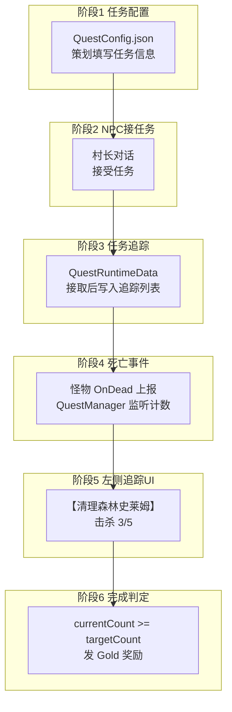
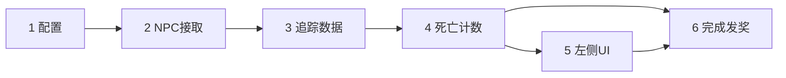

# 经典 MMO 式「击杀任务」— 架构溯源与分阶段执行说明

**文档性质**：架构侦探产出（只读分析 + 六阶段施工指引；各阶段按序交付、最小增量）  
**依据**：`Assets/Doc/00_MASTER_PROMPT.md`【架构侦探】；`Assets/Doc/02_SYSTEM_SPEC.md`；策划白板 `Assets/Doc/未命名.canvas`  
**Unity 版本**：2020.3.48f1  

---

## 1. 结论（一句话）

**击杀任务拆成六个阶段：先让策划能填 `QuestConfig.json`，再经 NPC 对话接任务、运行时追踪进度、怪物死亡上报、左侧追踪 UI，最后做完成判定与发奖；配置加载、进度累加、存档、NodeCanvas 挂钩等能力大量对齐现有成就系统，但任务保留「须先接取、仅进行中计数」的独立运行时状态，不与成就枚举混用。**

---

## 2. 玩家全流程 & 六阶段对应关系



| 玩家看到的现象 | 对应阶段 |
|----------------|----------|
| （策划侧）在 JSON 里新增/修改任务条目 | **阶段 1** |
| 与村长对话，点「接受任务」 | **阶段 2** |
| 接取后任务进入「进行中」列表（Console / 内存可查） | **阶段 3** |
| 杀史莱姆，进度从 0 涨到 3、5… | **阶段 4** |
| 屏幕左侧出现任务条「击杀史莱姆 3/5」 | **阶段 5** |
| 杀满 5 只，任务标记完成并发放金币 | **阶段 6** |

### 2.1 首版样例 Quest_001（策划已裁定）

| 字段 | 值 |
|------|-----|
| `questId` | `Quest_001` |
| `title` | 清理森林史莱姆 |
| `objectiveText` | 击杀史莱姆 5 只 |
| `targetMonster` | `Slime`（绑定 `MonsterConfig.name`） |
| `targetCount` | `5` |
| `rewards` | 仅 `Gold` × 100 |

---

## 3. 与成就系统的关系（可复用什么、不能混什么）

成就系统是本项目**最接近「计数 + 判定 + 存档」的成熟参考**，任务系统应在同一套基建上「并排生长」，而非从零造轮子。

### 3.1 建议复用（对齐成就模式）

| 能力 | 成就系统（已有） | 任务系统（待建，建议命名） |
|------|------------------|---------------------------|
| 静态配置 JSON | `AchievementConfig.json` | `QuestConfig.json` |
| DataTable 行类 | `AchievenmentDataTableRow` | `QuestDataTableRow` |
| 配置加载 | `AchievementDataMgr.Init()` → `ResComponentGM.LoadConfig` | `QuestConfigMgr.Init()`（阶段 1） |
| 运行时进度字典 | `AchievementData.achievementProData` | `PlayerQuestData.questProgress`（阶段 3） |
| 累加进度 | `RecordAchievementProgress(id, delta)` | `QuestManager.RecordKillProgress(questId, delta)`（阶段 4） |
| 达标检测 | `CheckAchievementHasComplete` | `QuestManager.CheckQuestComplete(questId)`（阶段 6） |
| 实时存档 | `SaveAchievementProgress()` | `SaveQuestProgress()`（阶段 3 起） |
| NodeCanvas 挂钩 | `AchievementRecordAction` | `QuestAcceptAction`（阶段 2） |
| 达成提示 UI | `AchievementTipsPanel` | 阶段 6 可仿造「任务完成」条；阶段 5 追踪 UI 独立 |

### 3.2 必须区分（勿混用）

| 维度 | 成就 | 任务 |
|------|------|------|
| 主键 | `AchievementType` 枚举 + int id | **`questId` 字符串**（如 `Quest_001`） |
| 触发前提 | 无「接取」；击杀即累计 | **须先 `AcceptQuest`**，仅 `InProgress` 计数 |
| 配置扩展 | 每成就可能要改枚举 | **只改 JSON**，不改 C# 枚举 |
| 展示 | 成就图鉴 / 达成弹窗 | **左侧进行中列表** + 完成发奖 |
| 与击杀挂钩方式 | 各怪物 `OnDead` 硬编码成就 ID | 阶段 4 统一从 `BaseMonster.OnDead` 上报，由 `QuestManager` 过滤 |

**结论**：任务管理器在 API 形态上**参考** `AchievementDataMgr`，数据结构与存档**并列**存放，**不**把 `Quest_001` 塞进 `AchievementType`。

### 3.3 怪物死亡：现状与目标

| 项 | 说明 |
|----|------|
| 现状 | `Slime.OnDead()` 内直接 `AchievementDataMgr.RecordAchievementProgress`；无全局 `EventCenter` |
| 阶段 4 目标 | `BaseMonster.OnDead()` 末尾统一上报 `monsterId`；`QuestManager` 查 `MonsterDataMgr.GetMonsterName(id)` 与任务 `targetMonster` 比对后累加 |
| 与成就共存 | 阶段 4 **不删除**史莱姆成就逻辑；任务计数走独立 `QuestManager` 分支（两套并行） |

---

## 4. 阶段 1 — 任务配置文件（策划可填写任务信息）

**目标**：策划在 JSON 中维护任务静态数据；程序能加载、校验、按 `questId` 查询。

### 4.1 文件约定

| 项 | 约定 |
|----|------|
| 路径 | `Assets/GameRes/Config/QuestConfig/QuestConfig.json` |
| 格式 | JSON 数组（同 `MonsterConfig` / `AchievementConfig`） |
| 主键 | `questId`（字符串，全局唯一） |
| 策划操作 | 复制样例行 → 改 `questId`、标题、目标怪、数量、金币奖励 |

### 4.2 字段说明

| 字段 | 类型 | 必填 | 说明 |
|------|------|------|------|
| `id` | int | 是 | DataTable 行 ID |
| `questId` | string | 是 | 逻辑主键，NPC / 对话 / 存档均引用 |
| `title` / `title_en` / `title_jp` | string | 标题必填 | 多语言对齐成就表 |
| `objectiveText` | string | 是 | 展示文案，如「击杀史莱姆 5 只」 |
| `objectiveType` | string | 是 | 首版仅 `KillMonster` |
| `targetMonster` | string | 是 | **`MonsterConfig.name`**，首版 `Slime` |
| `targetCount` | int | 是 | ≥ 1 |
| `rewards` | array | 否 | 首版仅 `{ type: Gold, amount: N }` |
| `prerequisiteQuestIds` | string[] | 否 | 前置任务 |
| `autoAccept` / `repeatable` / `sortOrder` | — | 否 | 预留 |

### 4.3 首版样例（可直接落盘）

```json
[
  {
    "id": "1",
    "questId": "Quest_001",
    "title": "清理森林史莱姆",
    "title_en": "Clear the Forest Slimes",
    "title_jp": "森のスライムを掃討せよ",
    "objectiveText": "击杀史莱姆 5 只",
    "objectiveType": "KillMonster",
    "targetMonster": "Slime",
    "targetCount": "5",
    "rewards": [
      { "type": "Gold", "amount": "100" }
    ],
    "prerequisiteQuestIds": [],
    "autoAccept": "false",
    "repeatable": "false",
    "sortOrder": "1"
  }
]
```

### 4.4 阶段 1 程序交付

| 交付物 | 路径 / 说明 |
|--------|-------------|
| 配置 JSON | `GameRes/Config/QuestConfig/QuestConfig.json` |
| 行类 | `Scripts/Game/DataTable/QuestConfig/QuestDataTableRow.cs` |
| 只读管理器 | `QuestConfigMgr`（`Init` + `GetQuestRow(questId)`） |
| 怪物 name 解析 | 扩展 `MonsterDataTableRow.ParseDataRow` 读 `name` |
| 怪物 name 查询 | `MonsterDataMgr.GetMonsterName` / `TryGetMonsterIdByName` |
| 启动加载 | `ProcedureComponentGM` 与 `MonsterDataMgr`、`AchievementDataMgr` 并列 `Init` |

### 4.5 阶段 1 验收

- [ ] 策划在 JSON 新增第二行任务，重启后 Console 打印加载条数 + 1  
- [ ] `targetMonster` 与 `MonsterConfig.name` 大小写一致，否则启动 Warning  
- [ ] **不做** NPC、UI、死亡计数

---

## 5. 阶段 2 — NPC 对话接任务

**目标**：玩家与 NPC 对话，通过选项或按钮**接取**配置表中的任务。

### 5.1 原则（遵守 `02_SYSTEM_SPEC.md` §2）

- 接任务演出由 **NodeCanvas 对话图** 驱动，不在怪物脚本里接任务。  
- 加载链与现有对话一致：`SimpleStoryTrigger` → `StoryComponentGSM.TriggerStory` → `Dialogue/*.prefab`。

### 5.2 建议实现（参考成就 NodeCanvas 节点）

| 交付物 | 说明 |
|--------|------|
| `QuestAcceptAction` | 仿 `AchievementRecordAction`；参数 `questId`；内部调 `QuestManager.AcceptQuest(questId)` |
| 对话图 | 村长台词 + 选项「接受任务 / 拒绝」；接受分支挂 `QuestAcceptAction(Quest_001)` |
| NPC 配置 | `offerQuestIds` 可写在场景物体或对话 Blackboard（**不进** `QuestConfig.json`） |

### 5.3 阶段 2 验收

- [ ] 对话点「接受」后 Console：`[Quest] Accept Quest_001`  
- [ ] 重复接取有明确拒绝或幂等提示  
- [ ] **不要求**左侧 UI、**不要求**击杀计数（留给阶段 3、4）

---

## 6. 阶段 3 — 任务追踪系统（运行时数据）

**目标**：接取后任务进入追踪列表，可查询状态与当前进度（先不依赖 UI）。

### 6.1 运行时数据结构（对齐成就 `achievementProData`）

```csharp
// 单条任务运行时（对应白板 QuestRuntimeData）
class QuestRuntimeEntry
{
    public string questId;
    public int currentCount;      // 当前击杀数
    public QuestState state;      // 见下表
}

enum QuestState
{
    Locked,       // 前置未满足
    Available,    // 可接未接（可选，阶段 2 简化可跳过）
    InProgress,   // 已接取进行中
    Complete,     // 已达 targetCount，待领奖/交付（Q4 细则在阶段 6）
    TurnedIn      // 已交付/已领奖励（Q4 裁定后启用）
}
```

**存档**：新建 `PlayerQuestData`（或等价），挂 `ArchiveInfo`，字段形态参考 `AchievementData`：

| 字段 | 类型 | 说明 |
|------|------|------|
| `questProgress` | `Dictionary<string, int>` | `questId` → `currentCount` |
| `questStates` | `Dictionary<string, QuestState>` | `questId` → 状态 |

### 6.2 QuestManager 核心 API（参考 AchievementDataMgr）

| 方法 | 行为 |
|------|------|
| `AcceptQuest(questId)` | 校验配置存在、前置满足、未重复接取 → `state = InProgress`，`currentCount = 0`，存档 |
| `GetActiveQuests()` | 返回所有 `InProgress` 条目（供阶段 5 UI） |
| `GetQuestProgress(questId)` | 返回 `currentCount` / `targetCount` |
| `SaveQuestProgress()` | 对标 `SaveAchievementProgress()` |

### 6.3 阶段 3 验收

- [ ] 阶段 2 接取后，调试面板或 Console 能读到 `InProgress` + `0/5`  
- [ ] 读档后状态与进度保留  
- [ ] 未接取任务 **不** 出现在追踪列表  
- [ ] **不做**死亡计数、**不做**左侧 UI

---

## 7. 阶段 4 — 怪物死亡事件 & 任务监听

**目标**：击杀对应怪物时，**仅对进行中任务**累加 `currentCount`。

### 7.1 死亡上报链

```
BaseMonster.OnDead()
  → （现有逻辑保留：场景记录、成就等）
  → QuestKillReport(monsterId)          // 新增统一上报
       → name = MonsterDataMgr.GetMonsterName(monsterId)
       → QuestManager.OnMonsterKilled(name)
            → 遍历 InProgress 且 objectiveType==KillMonster 的任务
            → 若 quest.targetMonster == name → currentCount++
            → SaveQuestProgress()
            → （不在此阶段调完成判定 UI，计数达标可打 Debug 日志）
```

### 7.2 与成就并行（重要）

| 调用点 | 成就 | 任务 |
|--------|------|------|
| `Slime.OnDead` | 继续 `RecordAchievementProgress(KillSlime_*)` | **不在这里写** |
| `BaseMonster.OnDead` | 不改动成就 | 统一 `QuestManager.OnMonsterKilled` |

**击杀计数规则（已裁定）**：不区分野外 / 剧情，同 `name` 即计入。

### 7.3 阶段 4 验收

- [ ] 接 `Quest_001` 后杀 5 只 Slime，`currentCount` 增至 5  
- [ ] 未接任务时杀 Slime，`currentCount` 不变  
- [ ] 杀其他怪物（如 WoodWorm）不增加史莱姆任务进度  
- [ ] 成就击杀统计仍正常

---

## 8. 阶段 5 — 左侧任务追踪 UI

**目标**：进行中任务展示在屏幕左侧，实时显示「标题 + 目标 + 当前/目标数量」。

### 8.1 UI 规格（对齐白板）

```
【清理森林史莱姆】
击杀史莱姆  3 / 5
```

| 项 | 说明 |
|----|------|
| 数据源 | `QuestManager.GetActiveQuests()` + `QuestConfigMgr` 读标题/文案 |
| 刷新时机 | `QuestManager` 进度变化时发事件（可参考成就 `ShowAchievementTips` 的订阅方式） |
| 多任务 | 按 `sortOrder` 纵向列表；首版一条即可 |
| 完成态 | 本阶段可灰显或保留最后一帧；**完成弹窗/发奖在阶段 6** |

### 8.2 阶段 5 验收

- [ ] 接任务后左侧出现条目，初始 `0/5`  
- [ ] 击杀过程中数字递增，无需关开 UI  
- [ ] 无进行中任务时列表为空或隐藏  
- [ ] **不做**自动发奖、**不做**完成态终态（阶段 6）

---

## 9. 阶段 6 — 任务完成判定 & 奖励

**目标**：`currentCount >= targetCount` 时标记完成，发放 `Gold` 奖励。

### 9.1 完成判定（参考 `CheckAchievementHasComplete`）

```
OnMonsterKilled 累加后：
  if currentCount >= targetCount:
    state = Complete   // 或按 Q4 裁定直接 TurnedIn
    触发完成回调（日志 / 提示 / 发奖）
```

| 逻辑 | 说明 |
|------|------|
| 计数封顶 | 与成就一致：`currentCount = Min(currentCount, targetCount)` |
| 奖励 | 首版仅解析并发放 `rewards` 中 `type == Gold` |
| Q4（暂保留） | 自动完成+自动发奖 **vs** 须回 NPC 对话交付 → 决定 `Complete` 与 `TurnedIn` 及是否自动 `GrantRewards` |

### 9.2 阶段 6 验收

- [ ] 杀满 5 只后任务状态变为 `Complete`（或裁定后的终态）  
- [ ] 金币 +100（或 Console 明确打印 `[Quest] Grant Gold 100` 若货币 API 未就绪）  
- [ ] 完成后左侧 UI 更新为完成态或移除  
- [ ] 读档后不会重复发奖

---

## 10. 六阶段总览表

| 阶段 | 名称 | 核心交付 | 策划/用户可感知 | 依赖 |
|------|------|----------|-----------------|------|
| **1** | 任务配置文件 | `QuestConfig.json` + DataTable + `Monster name` | 可填任务信息 | — |
| **2** | NPC 接任务 | `QuestAcceptAction` + 对话图 | 对话接取 | 1 |
| **3** | 任务追踪 | `QuestManager` + `PlayerQuestData` 存档 | 接取后系统「记住」 | 1、2 |
| **4** | 死亡事件 | `BaseMonster` 上报 + `OnMonsterKilled` | 杀怪涨进度 | 1、3 |
| **5** | 左侧追踪 UI | Quest Tracker Panel | 屏幕左侧 3/5 | 3、4 |
| **6** | 完成判定 | `CheckQuestComplete` + Gold 发放 | 杀满完成领金币 | 4、5 |



**施工纪律**：每阶段独立验收后再进下一阶段；禁止跨阶段「顺手做 UI / 顺手改 Slime 删成就」。

---

## 11. 策划裁定记录

### 11.1 已定稿

| # | 议题 | 裁定 |
|---|------|------|
| Q1 | 首版样例怪物 | `Slime`（`Quest_001`） |
| Q2 | `targetMonster` | 绑定 `MonsterConfig.name` |
| Q3 | 首版奖励 | 仅 `Gold`；`Exp` 后续 |
| Q5 | 击杀计数范围 | 不区分野外 / 剧情 |
| Q6 | `MonsterDataTableRow` | 阶段 1 扩展解析 `name` |
| — | 阶段划分 | **六阶段**（见 §10） |
| — | 成就关系 | **复用基建与 API 形态，数据与枚举分离**（见 §3） |

### 11.2 仍待定

| # | 问题 | 影响阶段 |
|---|------|----------|
| Q4 | 达标后自动完成发奖 vs 回 NPC 交付 | **阶段 6** 状态机与 UI |

---

## 12. 分阶段检查清单（施工员）

### 阶段 1

- [ ] `QuestConfig.json` + `QuestDataTableRow` + `QuestConfigMgr.Init`
- [ ] `MonsterDataTableRow` / `MonsterDataMgr` 扩展 `name`
- [ ] 策划可独立增删 JSON 行并重启验证

### 阶段 2

- [ ] `QuestAcceptAction`（NodeCanvas）
- [ ] 村长（或测试 NPC）对话图 + `SimpleStoryTrigger`
- [ ] `QuestManager.AcceptQuest` 最小实现（可先仅改内存状态）

### 阶段 3

- [ ] `PlayerQuestData` 存档结构
- [ ] `QuestManager` 完整状态机（至少 `InProgress`）
- [ ] `SaveQuestProgress` / 读档恢复

### 阶段 4

- [ ] `BaseMonster.OnDead` → `QuestManager.OnMonsterKilled`
- [ ] 仅 `InProgress` + `targetMonster` 匹配时 `currentCount++`
- [ ] 成就逻辑保持不动

### 阶段 5

- [ ] 左侧 Tracker UI Prefab + FormLogic
- [ ] 订阅 `QuestManager` 进度变更事件

### 阶段 6

- [ ] `CheckQuestComplete` + `GrantRewards(Gold)`
- [ ] 完成态 UI / 防重复发奖
- [ ] 按 Q4 裁定补全 `TurnedIn` 或 NPC 交付流

---

## 13. 给程序看的文件清单

| 用途 | 路径 |
|------|------|
| 成就配置范例 | `Assets/GameRes/Config/AchievementConfig/AchievementConfig.json` |
| 成就管理器（API 参考） | `Assets/Scripts/Game/GameMgr/Component/Archive/ArchiveDataClass/Achievement/AchievementDataMgr.cs` |
| 成就 NodeCanvas 节点 | `Assets/Scripts/Game/GameRuntime/NodeCanvas/.../AchievementRecordAction.cs` |
| 怪物表 | `Assets/GameRes/Config/MonsterConfig/MonsterConfig.json` |
| 怪物行类 | `Assets/Scripts/Game/DataTable/MonsterConfig/MonsterDataTableRow.cs` |
| 怪物死亡入口 | `Assets/Scripts/Game/GameRuntime/Entities/Monster/BaseMonster.cs` |
| 成就击杀参考 | `Assets/Scripts/Game/GameRuntime/Entities/Monster/Slime/Slime.cs` |
| 对话触发参考 | `Assets/Scripts/Game/GameRuntime/Entities/SceneEntities/CommonEntity/SimpleStoryTrigger.cs` |
| 策划白板 | `Assets/Doc/未命名.canvas` |

---

## 14. 修订记录

| 日期 | 说明 |
|------|------|
| 2026-06-06 | 初版：任务配置规范 + 与成就/怪物边界 |
| 2026-06-06 | 策划裁定：Slime / name / 仅 Gold / 击杀不区分场景 |
| 2026-06-06 | **六阶段路线图**：配置 → NPC接取 → 追踪数据 → 死亡事件 → 左侧UI → 完成判定；明确成就系统复用策略 |
