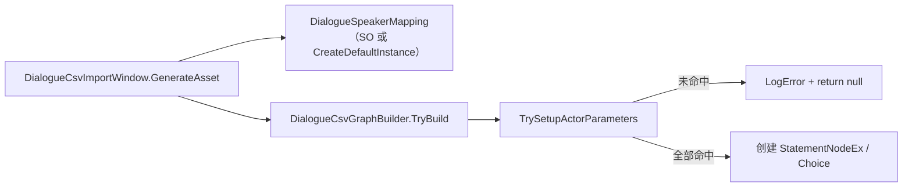

# CSV 导入工具 — 埃吉尔 Speaker 映射缺失 — 架构溯源与执行说明

**文档性质**：架构侦探产出（逻辑溯源 + 分阶段修复指引）  
**依据**：
- `Assets/Doc/00_MASTER_PROMPT.md`【架构侦探】
- `Assets/Doc/02_SYSTEM_SPEC.md` §2（NodeCanvas 驱动剧情）
- 报错现场：`DialogueCsvGraphBuilder` Console 输出 `Speaker「埃吉尔」（ID n）未在映射表中找到，导入已中止。`
- 关联台本：`Assets/Doc/执行文档/0607/Village_HomeScene2_埃吉尔接任务对白台本_架构溯源与执行说明.md`
- 同类先例：`Assets/Doc/执行文档/0601/CSV导入工具_Speaker映射扩展_施工执行说明.md`（艾米/艾莉/村）

**Unity 版本**：2020.3.48f1  

---

## 1. 结论（一句话）

**CSV 里 Speaker 列写了「埃吉尔」，但当前 Speaker 映射表（内置默认 + `DialogueSpeakerMapping_Default.asset`）只有雅/古/艾米/艾莉/村五条，导入器在「收集 Actor 参数」阶段发现未命中映射后主动中止；修复方式是在映射表补一行 `埃吉尔 → 埃吉尔`（若导入完整版 CSV 还需补 `— → 旁白`），然后重新执行 `Tools → Dialogue → Import CSV`。**

---

## 2. 玩家 / 策划侧现象

| 你在做什么 | 你会看到什么 |
|------------|--------------|
| 打开 **Tools → Dialogue → Import CSV**，选中埃吉尔台本 CSV，点「生成 DialogueTree .asset」 | Console 连续报错：`Speaker「埃吉尔」（ID 2/4/6/8/10/12）未在映射表中找到，导入已中止。` |
| 窗口底部 | 红字：`建图失败，详见 Console。` |
| 输出目录 | **不会**生成新的 `.asset` 文件 |

**生活类比**：CSV 里的角色简称像「快递单上的昵称」，映射表是「姓名对照册」。昵称「埃吉尔」没登记，系统宁可整批拒收，也不生成带「红色未定义 Actor」的坏图——这是**有意设计的安全机制**，不是 CSV 格式坏了。

---

## 3. 逻辑溯源（给程序）

### 3.1 调用链



### 3.2 关键代码行为

| 步骤 | 位置 | 行为 |
|------|------|------|
| 取映射 | `DialogueCsvImportWindow.GenerateAsset` | 窗口 **Speaker 映射** 为空 → 调用 `DialogueSpeakerMapping.CreateDefaultInstance()` |
| 校验 Speaker | `DialogueCsvGraphBuilder.TrySetupActorParameters` | 遍历每行 CSV；`mapping.TryResolve(row.speaker)` 失败 → 收集错误 |
| 中止 | 同上 | `errors.Count > 0` → **销毁半成品树、return null** |
| 报错文案 | 同上 L259 | `Speaker「{speaker}」（ID {id}）未在映射表中找到，导入已中止。` |

### 3.3 当前映射表内容（缺什么）

**内置默认**（`DialogueSpeakerMapping.CreateDefaultInstance`）与 **项目 SO**（`Assets/Editor/Tool/Dialogue/DialogueSpeakerMapping_Default.asset`）均为 **5 条**：

| CSV Speaker | 图内 Actor 名 | 状态 |
|-------------|---------------|------|
| `雅` | `雅尔` | ✅ 已有 |
| `古` | `古莎` | ✅ 已有 |
| `艾米` | `艾米` | ✅ 已有 |
| `艾莉` | `艾莉` | ✅ 已有 |
| `村` | `村长` | ✅ 已有 |
| **`埃吉尔`** | **`埃吉尔`** | ❌ **缺失 → 本次报错根因** |
| **`—`** | **`旁白`** | ❌ 缺失（仅完整版 CSV 需要，见 §5.2） |

### 3.4 与报错 ID 的对应关系

你当前导入的 CSV 极可能是：

**`Assets/Dialog/Village_HomeScene2_埃吉尔接任务对白台本.csv`**

其中 Speaker=`埃吉尔` 的行 ID 为 **2、4、6、8、10、12**，与 Console 报错 **完全一致**。

> 工程内另有完整版 **`Assets/Dialog/Village_HomeScene2_Aegir_QuestOffer.csv`**（含选项分支、旁白行 `—`、埃吉尔 FaceType）。补映射后应优先用完整版导入，再合并 Prefab。

---

## 4. 修复方案（两选一）

### 方案 A — 仅改 Unity 资产（策划 / 程序均可，**无需改代码**）

**适用**：急着出 `.asset` 试播；或暂时只有这一份埃吉尔台本。

| 步骤 | 操作 |
|------|------|
| A1 | Project 窗口打开 **`Assets/Editor/Tool/Dialogue/DialogueSpeakerMapping_Default.asset`** |
| A2 | Inspector → **Entries** → **+** 新增一行：`csvSpeaker = 埃吉尔`，`actorParameterName = 埃吉尔` |
| A3 | （若导入 `Village_HomeScene2_Aegir_QuestOffer.csv`）再增一行：`csvSpeaker = —`，`actorParameterName = 旁白` |
| A4 | **Ctrl+S** 保存资产 |
| A5 | **Tools → Dialogue → Import CSV** → **Speaker 映射** 拖入 **`DialogueSpeakerMapping_Default`**（或保持为空但依赖你已改过的 SO——**注意**：窗口为空时仍走**内存内置默认**，不含你刚改的 SO 内容，**必须拖入 SO** 或走方案 B） |

**重要**：窗口 **未拖 Speaker 映射** 时，用的是 `CreateDefaultInstance()` **内存副本**，与 `.asset` 文件**不同步**。方案 A 使用时 **务必在 Import 窗口拖入刚编辑过的 SO**。

### 方案 B — 改代码 + 同步 SO（**施工员**，推荐团队长期维护）

**适用**：新角色会反复出现；避免每人手动改 SO、避免「不拖 SO 就失败」。

| 文件 | 操作 |
|------|------|
| `Assets/Editor/Tool/Dialogue/DialogueSpeakerMapping.cs` | `CreateDefaultInstance()` 追加 `埃吉尔 → 埃吉尔`；可选追加 `— → 旁白` |
| `Assets/Editor/Tool/Dialogue/DialogueSpeakerMapping_Default.asset` | 与代码保持 **相同条目** |
| `Assets/Editor/Tool/Dialogue/DialogueCsvImportWindow.cs` | HelpBox 文案更新为含埃吉尔（及旁白）摘要 |
| `Assets/Editor/Tool/Dialogue/DialogueFaceTypeCsvDefaults.cs` | **建议**：`GetDefaultForActor` 增加 `埃吉尔 → Normal`（与村长同理，立绘未就绪时空 FaceType 列不阻塞） |
| `Assets/Doc/技术文档/CSV转NodeCanvas对话树导入工具_开发文档.md` | §3 映射表补一行 |

**代码追加示例**（施工员直接照抄）：

```csharp
// 埃吉尔台本：CSV 简称与 Prefab Actor 名一致（恒等映射）
new Entry { csvSpeaker = "埃吉尔", actorParameterName = "埃吉尔" },
// 旁白行：Speaker 列填 em dash「—」，图内 Actor 统一为「旁白」（仅字幕，不绑立绘）
new Entry { csvSpeaker = "—", actorParameterName = "旁白" },
```

**替代方案说明**：

| 方案 | 优点 | 缺点 |
|------|------|------|
| **A 只改 SO + 窗口拖入** | 零编译、立刻可试 | 不拖 SO 仍失败；易与队友分叉 |
| **B 改 CreateDefaultInstance** | 不拖 SO 也能导入；与 0601 艾米/村  precedent 一致 | 需提交 Editor 脚本 |
| **C CSV 直接写 Actor 全名绕过映射** | 不改工具 | **不可行**——仍须映射表有对应键；且破坏台本「简称列」约定 |
| **D 缩短为 `埃 → 埃吉尔`** | CSV 更短 | 与现有 CSV 已写「埃吉尔」不一致，需改表或双条目 |

**推荐**：**B** 为主；若当天不能合代码，临时用 **A + 窗口必拖 SO**。

---

## 5. 导入前 CSV 检查清单

### 5.1 精简版（当前报错文件）

路径：`Assets/Dialog/Village_HomeScene2_埃吉尔接任务对白台本.csv`

| 检查项 | 说明 |
|--------|------|
| Speaker | 仅 `雅`、`埃吉尔` → 补映射后可通过 |
| FaceType | 埃吉尔多行 **空列** → 映射成功后走 `DialogueFaceTypeCsvDefaults`，默认 **Normal** 并 Warning（立绘未接入前可接受） |
| 选项分支 | **无** Choice 行 → 仅线性对白，适合先验字幕顺序 |
| 已知笔误 | ID 13 雅尔台词为「我会努力的！」——完整版中此句应在选项「我会努力的」**之后**（完整版用 Choice 行处理） |

### 5.2 完整版（推荐最终导入）

路径：`Assets/Dialog/Village_HomeScene2_Aegir_QuestOffer.csv`

| 检查项 | 说明 |
|--------|------|
| Speaker `—` | **必须**有 `— → 旁白` 映射，否则 ID 7、9 同样中止 |
| Choice ID 16 | `Extra = 我还有事\|我会努力的`，`Next = END\|17` |
| 埃吉尔 FaceType | 已填 `Unhappy/Angry/Smile` 等，不依赖空列默认 |

---

## 6. 导入成功后的后续步骤（阶段 1 → 2）

映射修复并 Import 成功后，按既有管线继续（**本任务不替代** 0607 全文）：

| 步骤 | 动作 | 产物 / 验证 |
|------|------|-------------|
| 1 | Import CSV，输出目录默认 `Assets/GameRes/DialogueTrees/Generated/` | `{CSV文件名}.asset` |
| 2 | NodeCanvas 打开 `.asset`，核对 Actor 参数含 **雅尔、埃吉尔**（及 **旁白** 若用完整版） | 无红色未定义 Actor |
| 3 | 复制参考 Prefab（如 `Village_KenMuNiStart.prefab`）→ 改名 **`Village_HomeScene2_Aegir_QuestOffer.prefab`** | 路径须在 `GameRes/Prefabs/Dialogue/` **根目录** |
| 4 | Bind Graph；**雅尔** 绑 `DialogueActorEx`；**埃吉尔** 首版可占位或仅字幕 | DialogDebug 试播 |
| 5 | 场景 `NpcAegir` 的 `SimpleStoryTrigger.StoryPrefabName` 指向同名 prefab | Play 模式点击 NPC 无加载失败 |

**运行时缺口（映射修复不解决）**：

- `DialogueRoleName` 尚无埃吉尔枚举 → 埃吉尔立绘可能不显示，字幕仍正常
- `QuestAcceptAction` 未实现 → 「我会努力的」分支暂不能接 `Quest_002`

---

## 7. 验收清单

### 7.1 映射修复验收

- [ ] 打开 Import CSV，选择 `Village_HomeScene2_埃吉尔接任务对白台本.csv`
- [ ] Console **无** `Speaker「埃吉尔」未在映射表中找到`
- [ ] 成功生成 `.asset`；窗口无「建图失败」
- [ ] 打开 `.asset`：`actorParameters` 含 **雅尔**、**埃吉尔**

### 7.2 完整版 CSV 验收（若采用 Aegir_QuestOffer）

- [ ] 同上，且无 `Speaker「—」未在映射表中找到`
- [ ] 图内含 **旁白** Actor；ID 7、9 节点 `_actorName = 旁白`
- [ ] ID 16 为 **MultipleChoiceNode**，两分支文案正确

### 7.3 回归（防破坏旧台本）

- [ ] 不拖 SO（方案 B 实施后）或拖 Default SO：导入 `Village_村内雅古开场对白台本.csv` 仍成功
- [ ] 导入 `Village_村长家晚宴对白台本.csv` 仍含 艾米/艾莉/村长

### 7.4 负例

- [ ] CSV 临时加 `Speaker=未登记角色` → 应失败且 Console 指明 ID

---

## 8. 待决问题（可选记入 OPEN_QUESTIONS）

| ID | 问题 | 建议 |
|----|------|------|
| Q1 | 埃吉尔 CSV 简称是否统一为 **`埃吉尔`** 还是改为单字 **`埃`**？ | 与策划台本 §6 一致，保持 **埃吉尔** 恒等映射 |
| Q2 | **`旁白`** 是否纳入内置默认（全局台本都会用 `—`）？ | 建议纳入，成本低且完整版 CSV 已依赖 |
| Q3 | 埃吉尔 `Avatar_Aegir` / `DialogueRoleName.Aegir` 何时入库？ | 映射与 CSV 导入 **不阻塞**；立绘另立项 |

---

## 9. 给程序的文件清单（施工员阶段）

| 文件 | 操作 |
|------|------|
| `Assets/Editor/Tool/Dialogue/DialogueSpeakerMapping.cs` | 修改 |
| `Assets/Editor/Tool/Dialogue/DialogueSpeakerMapping_Default.asset` | 修改 |
| `Assets/Editor/Tool/Dialogue/DialogueCsvImportWindow.cs` | 文案（可选） |
| `Assets/Editor/Tool/Dialogue/DialogueFaceTypeCsvDefaults.cs` | 建议修改 |
| `Assets/Doc/技术文档/CSV转NodeCanvas对话树导入工具_开发文档.md` | 文档同步 |

**禁止修改**：`DialogueCsvGraphBuilder` 中止逻辑、`StoryComponentGSM`、运行时对话 UI。

---

## 10. 相关文档索引

| 主题 | 路径 |
|------|------|
| 埃吉尔台本全文 + 任务分支 | `Assets/Doc/执行文档/0607/Village_HomeScene2_埃吉尔接任务对白台本_架构溯源与执行说明.md` |
| Speaker 映射扩展先例 | `Assets/Doc/执行文档/0601/CSV导入工具_Speaker映射扩展_施工执行说明.md` |
| CSV 工具总览 | `Assets/Doc/技术文档/CSV转NodeCanvas对话树导入工具_开发文档.md` |
| NPC 场景配置 | `Assets/Doc/执行文档/0607/Village_HomeScene2_NPC埃吉尔对话交互_施工执行说明.md` |

---

## 11. 文档修订

| 日期 | 说明 |
|------|------|
| 2026-06-08 | 初版：据 Console 报错溯源埃吉尔 Speaker 未映射；给出方案 A/B、双 CSV 差异与验收清单 |

**文档路径**：`Assets/Doc/执行文档/0608/CSV导入工具_埃吉尔Speaker映射缺失_架构溯源与执行说明.md`
