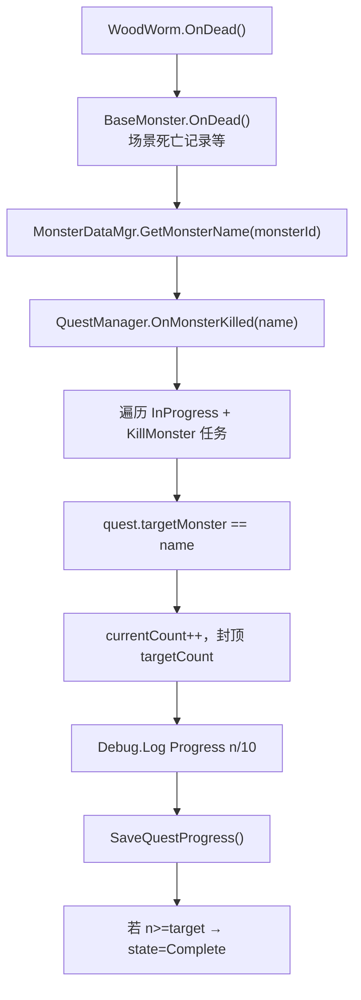
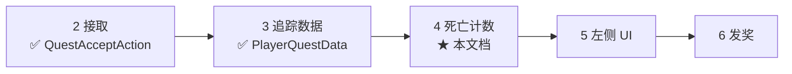

# Quest — 怪物死亡事件与任务监听 — 架构溯源与施工执行说明

**文档性质**：架构侦探产出（逻辑溯源 + 阶段 4 施工指引）  
**依据**：
- `Assets/Doc/00_MASTER_PROMPT.md`【架构侦探】
- 击杀任务六阶段：`Assets/Doc/执行文档/0606/经典MMO击杀任务_任务配置文件_架构溯源与执行说明.md` §7～§9
- 埃吉尔任务：`Assets/Doc/执行文档/0608/Village_Aegir_Quest001_接取追踪_架构溯源与施工执行说明.md`
- 村外虫子：`Assets/Doc/执行文档/0608/Village_OutSide_虫子虫巢摆放_架构溯源与施工执行说明.md`

**目标**：**虫子（`WoodWorm`）死亡时**统一上报击杀事件；**`QuestManager` 监听**并仅对 **已接取且进行中** 的 `KillMonster` 任务累加进度；验收时 Console 必须打印 **当前完成数量**（如 `3/10`）。  
**Unity 版本**：2020.3.48f1  

---

## 1. 结论（一句话）

**在 `BaseMonster.OnDead()` 末尾增加统一击杀上报（读 `monsterId` → `MonsterConfig.name`），调用 `QuestManager.OnMonsterKilled(monsterName)`；管理器遍历 `InProgress` 的击杀类任务，匹配 `targetMonster` 则 `currentCount++` 并打 `[Quest] Progress Quest_001: n/10` 日志——不在 `WoodWormLogic` 里单独写任务逻辑，成就计数保持不动。**

---

## 2. 你要验收的现象（Console 为准）

**推荐路径**：InitScene → 埃吉尔接 `Quest_001` → `Village_OutSide` 杀 `WoodWorm`。

| 时机 | Console 期望（示例） |
|------|----------------------|
| 接取任务后 | `[Quest] Accept Quest_001` |
| 接取后 | `[Quest] Progress Quest_001: 0/10 (InProgress)` |
| 击杀第 1 只虫子 | `[Quest] Kill report: WoodWorm`（或等价调试行） |
| 同上 | **`[Quest] Progress Quest_001: 1/10 (InProgress)`** |
| 击杀第 3 只 | **`[Quest] Progress Quest_001: 3/10 (InProgress)`** |
| 击杀第 10 只 | **`[Quest] Progress Quest_001: 10/10 (Complete)`** |
| **未接任务**时杀虫子 | 仅有成就日志（若有），**无** `[Quest] Progress` |
| 杀 **虫巢** `WoodWormRoot` | **无** `Quest_001` 进度变化 |
| 成就 | `WoodWormKill_*` 成就仍正常 +1 |

> 本批次 **不要求** 左侧任务 UI、**不要求** 自动发金币（属阶段 5～6）；杀满 10 只时状态改为 `Complete` 并打日志即可。

---

## 3. 架构溯源：死亡 → 任务进度

### 3.1 生活类比

怪物倒下时，村里贴两张表：

- **成就表**（老系统）：「你这辈子杀过多少蠕虫」——**不用接任务也记**。
- **任务表**（新系统）：「埃吉尔拜托你今天杀 10 只」——**只有接了 `Quest_001` 且在进行中才记**。

两张表听**同一场死亡**，但各记各的，互不替代。

### 3.2 目标调用链



### 3.3 工程现状（静态阅读）

| 能力 | 状态 | 路径 |
|------|------|------|
| `Quest_001` 配置 | ✅ `targetMonster: WoodWorm`，`targetCount: 10` | `QuestConfig.json` |
| `QuestManager.AcceptQuest` | ✅ 已有，接取打 `0/10` 日志 | `QuestManager.cs` |
| `PlayerQuestData` 存档 | ✅ | `PlayerQuestData.cs` |
| `QuestAcceptAction` | ✅ | 对话图可接取 |
| **`OnMonsterKilled`** | ❌ **未实现** | — |
| **`BaseMonster` 任务上报** | ❌ **未挂钩** | `BaseMonster.OnDead()` |
| `MonsterDataMgr.GetMonsterName` | ✅ 阶段 1 已扩展 | `MonsterDataMgr.cs` |
| `WoodWorm` 的 `monsterId` | ✅ `initBaseData(3)` → `name=WoodWorm` | `WoodWormLogic.cs` |
| `WoodWorm` 成就击杀 | ✅ 在子类 `OnDead` 写死 | **本任务不删** |

### 3.4 与成就的分工（必守）

| 调用点 | 成就 | 任务 |
|--------|------|------|
| `WoodWormLogic.OnDead` | `RecordAchievementProgress(WoodWormKill_*)` | **不写** |
| `BaseMonster.OnDead` 末尾 | 不改动 | **`OnMonsterKilled`** |
| `Slime.OnDead` | 史莱姆成就 | 走 Base 统一上报（未接任务则无进度日志） |

**重要修改原因**：击杀上报集中在 `BaseMonster`，避免每加一种怪改一次任务逻辑；与 `0606` §7.2 裁定一致。

### 3.5 哪些怪物计入 `Quest_001`

| `MonsterConfig.name` | 是否计入「击杀虫子 10 只」 | 说明 |
|----------------------|---------------------------|------|
| **`WoodWorm`** | ✅ | 静态虫 + 巢穴刷出的 `WoodWorm_1`（同 `WoodWormLogic`，id=3） |
| `WoodWormRoot` | ❌ | 虫巢，`initBaseData(5)` |
| `WoodWormEgg` | ❌ | 虫卵 |
| `Slime` | ❌ | 与任务目标无关 |

**击杀范围**：不区分场景（村内/村外/剧情），`name` 匹配即计数（`0606` Q5 裁定）。

---

## 4. 程序交付（施工员 · 阶段 4）

### 4.1 改动文件

| 文件 | 改动 |
|------|------|
| `QuestManager.cs` | 新增 **`OnMonsterKilled(string monsterName)`**；可选 **`OnQuestProgressChanged`** 事件（阶段 5 预留） |
| `BaseMonster.cs` | `OnDead()` 末尾调用任务上报 |

**不改**：`WoodWormLogic.cs` 成就分支、`Slime.cs`、`QuestAcceptAction.cs`。

### 4.2 `BaseMonster.OnDead` 挂钩（推荐位置）

在 `recordMonsterHasDead(this)` **之后**（或同一逻辑块末尾、函数 return 前）增加：

```csharp
// 统一击杀任务上报：由 QuestManager 按 MonsterConfig.name 过滤，子类勿重复调用。
if (monsterId > 0)
{
    var monsterName = MonsterDataMgr.getInstance().GetMonsterName(monsterId);
    if (!string.IsNullOrEmpty(monsterName))
    {
        QuestManager.getInstance().OnMonsterKilled(monsterName);
    }
}
```

**替代方案**：在 `WoodWormLogic.OnDead` 单独调用——仅覆盖蠕虫，**不推荐**（漏掉其他 `KillMonster` 任务目标怪）。

### 4.3 `QuestManager.OnMonsterKilled` 核心逻辑

```csharp
/// <summary>
/// 怪物死亡统一入口（阶段 4）。仅处理 objectiveType==KillMonster 且 state==InProgress 的任务。
/// </summary>
public void OnMonsterKilled(string monsterName)
{
    if (string.IsNullOrEmpty(monsterName)) return;

    Debug.Log($"[Quest] Kill report: {monsterName}");

    var configMgr = QuestConfigMgr.getInstance();
    var questData = GetPlayerQuestData();
    var anyChanged = false;

    foreach (var kvp in questData.questStates)
    {
        if (kvp.Value != QuestState.InProgress) continue;

        var questId = kvp.Key;
        var row = configMgr.GetQuestRow(questId);
        if (row == null || row.objectiveType != "KillMonster") continue;
        if (row.targetMonster != monsterName) continue;

        var current = questData.questProgress.TryGetValue(questId, out var c) ? c : 0;
        if (current >= row.targetCount) continue; // 已达标不再累加

        current = Mathf.Min(current + 1, row.targetCount);
        questData.questProgress[questId] = current;
        anyChanged = true;

        if (current >= row.targetCount)
        {
            questData.questStates[questId] = QuestState.Complete;
            Debug.Log($"[Quest] Progress {questId}: {current}/{row.targetCount} (Complete)");
        }
        else
        {
            Debug.Log($"[Quest] Progress {questId}: {current}/{row.targetCount} (InProgress)");
        }

        OnQuestProgressChanged?.Invoke(questId, current, row.targetCount);
    }

    if (anyChanged) SaveQuestProgress();
}
```

**设计说明**：

| 项 | 行为 |
|----|------|
| 未接取 / 非 `InProgress` | 静默跳过，**不打** Progress 日志 |
| 进度封顶 | `Min(current+1, targetCount)`，与成就一致 |
| 达标 | `state → Complete`，日志带 `(Complete)` |
| 存档 | 有变更才 `SaveQuestProgress()` |
| 发奖 | **本阶段不做** `GrantRewards`（阶段 6） |

**日志约定（验收必对）**：

| 前缀 | 含义 |
|------|------|
| `[Quest] Kill report: WoodWorm` | 死亡事件已进入任务系统 |
| `[Quest] Progress Quest_001: n/10 (InProgress)` | **当前完成数量** |
| `[Quest] Progress Quest_001: 10/10 (Complete)` | 杀满，任务完成（未发奖） |

### 4.4 可选：进度变更事件（阶段 5 预留）

```csharp
public event Action<string, int, int> OnQuestProgressChanged; // questId, current, target
```

在 `OnMonsterKilled` 累加后 `Invoke`；本阶段 **可不接 UI**。

### 4.5 本批次明确不做

| 项 | 阶段 |
|----|------|
| 左侧 Quest Tracker UI | 5 |
| `GrantRewards` 金币 | 6 |
| `repeatable` 日更重置 | 后续 |
| 回埃吉尔交付对话 | 6 / 剧情 |

---

## 5. 完整验收流程

**环境**：`InitScene` 启动；埃吉尔对白 + 村外虫子已按前置文档配置。

| # | 操作 | 通过标准 |
|---|------|----------|
| K0 | 新档或清任务存档 | 无残留 `Quest_001` 进度 |
| K1 | 埃吉尔对话 →「我会努力的」 | `[Quest] Accept Quest_001` + `0/10` |
| K2 | 进村外，**未接任务**时杀 1 虫 | **无** `[Quest] Progress` |
| K3 | 接任务后杀 1 只 `WoodWorm` | `Kill report: WoodWorm` + **`Progress … 1/10`** |
| K4 | 再杀 2 只 | **`3/10 (InProgress)`** |
| K5 | 杀满 10 只 | **`10/10 (Complete)`** |
| K6 | 第 11 只 | 进度仍 **10/10**，状态 **Complete**，不继续涨 |
| K7 | 读档 | 进度与 `Complete` 保留 |
| K8 | 成就 | `WoodWormKill` 成就仍增加 |

### 5.1 故障排查

| 现象 | 原因 | 处理 |
|------|------|------|
| 有 `Kill report` 无 `Progress` | 未接任务 / 非 `InProgress` / `targetMonster` 不匹配 | 查接取日志与 `QuestConfig.json` |
| 完全无 `Kill report` | `BaseMonster.OnDead` 未挂钩或 `monsterId==0` | 查 `initBaseData(3)` |
| 杀巢穴也涨进度 | 错误匹配 `WoodWormRoot` | 查 `targetMonster` 与 `GetMonsterName` |
| 杀虫不涨、成就涨 | 只改了成就、未走 Base 上报 | 补 §4.2 |
| 名称对不上 | `MonsterConfig.name` 大小写 | 须 **`WoodWorm`** 完全一致 |

---

## 6. 改动范围汇总

| 类型 | 路径 |
|------|------|
| **必改** | `Assets/Scripts/Game/GameMgr/Component/Archive/ArchiveDataClass/Quest/QuestManager.cs` |
| **必改** | `Assets/Scripts/Game/GameRuntime/Entities/Monster/BaseMonster.cs` |
| **不改** | `WoodWormLogic.cs`、`Slime.cs`、`QuestConfig.json`（已配好） |
| **不改** | 对话图、场景摆放 |

---

## 7. 与六阶段路线图关系



| 阶段 | 本任务后玩家能感知 |
|------|------------------|
| 4（本文） | Console 见 **`n/10`**，杀满见 **Complete** |
| 5 | 屏幕左侧任务条同步数字 |
| 6 | 金币 + 完成提示 |

---

## 8. 待决问题

| # | 问题 | 影响 |
|---|------|------|
| O1 | `Complete` 后是否允许 `repeatable` 任务次日重置 | 日更逻辑 |
| O2 | 达标后自动发奖 vs 回找埃吉尔 | 阶段 6 |
| O3 | 巢穴刷出的 `WoodWorm_1` 是否永远等同 `WoodWorm` | 当前：同 Logic/id=3，计入 |

---

## 9. 相关文档

| 主题 | 路径 |
|------|------|
| 六阶段总纲 | `Assets/Doc/执行文档/0606/经典MMO击杀任务_任务配置文件_架构溯源与执行说明.md` |
| 接取任务 | `Assets/Doc/执行文档/0608/Village_Aegir_Quest001_接取追踪_架构溯源与施工执行说明.md` |
| 怪物死亡入口 | `Assets/Scripts/Game/GameRuntime/Entities/Monster/BaseMonster.cs` |
| 蠕虫死亡/成就 | `Assets/Scripts/Game/GameRuntime/Entities/Monster/WoodWorm/WoodWormLogic.cs` |
| 成就参考 | `Assets/Scripts/Game/GameMgr/Component/Archive/ArchiveDataClass/Achievement/AchievementDataMgr.cs` |

---

## 10. 文档修订

| 日期 | 说明 |
|------|------|
| 2026-06-08 | 初版：BaseMonster 统一上报 + QuestManager.OnMonsterKilled；Console 进度验收 |

**文档路径**：`Assets/Doc/执行文档/0608/Quest_怪物死亡事件与任务监听_架构溯源与施工执行说明.md`
