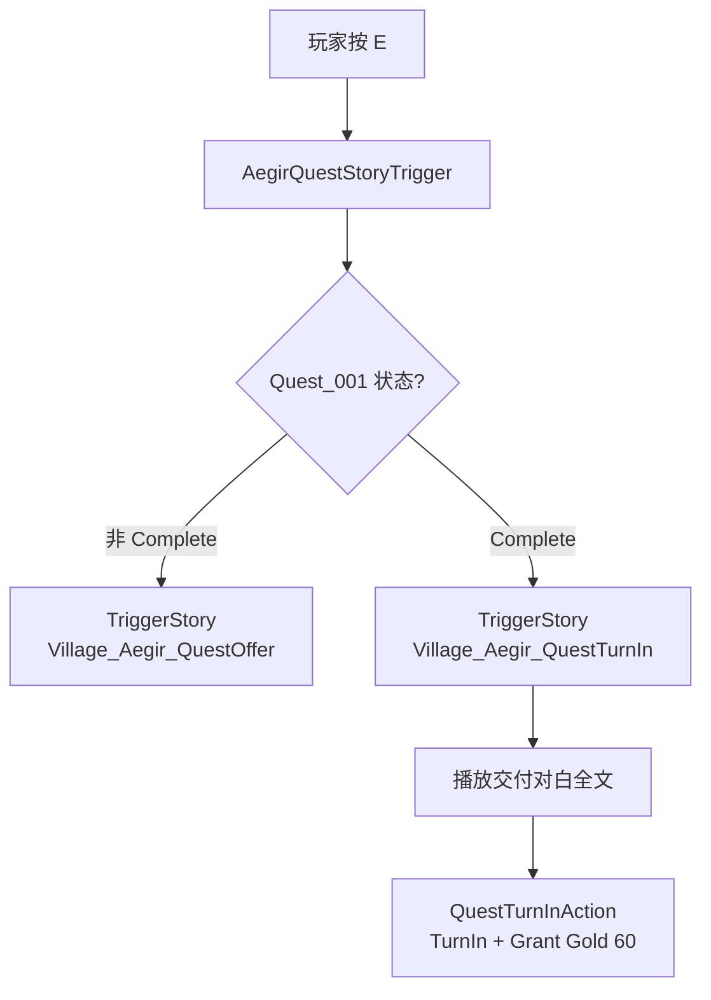
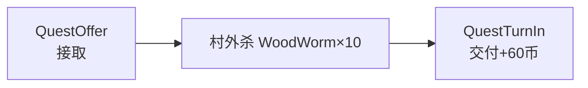

# Village_Aegir — Quest_001 任务交付（NPC 换对话 + 发 60 金币）— 架构溯源与施工执行说明

**文档性质**：架构侦探产出（逻辑溯源 + 分阶段施工指引；**本阶段不改代码**）  
**依据**：
- `Assets/Doc/00_MASTER_PROMPT.md`【架构侦探】
- 接取追踪：`Assets/Doc/执行文档/0608/Village_Aegir_Quest001_接取追踪_架构溯源与施工执行说明.md`
- 交付台本：`Assets/Doc/执行文档/0608/Village_HomeScene2_埃吉尔任务交付对白台本_架构溯源与执行说明.md`
- 击杀任务阶段 6：`Assets/Doc/执行文档/0606/经典MMO击杀任务_任务配置文件_架构溯源与执行说明.md`
- NPC 接任务样板：`Assets/Doc/执行文档/0608/Village_HomeScene2_NPC埃吉尔切换Village_Aegir_QuestOffer_施工执行说明.md`
- 换场通则：`Assets/Doc/执行文档/0518/SceneChangeDoor场景切换_架构溯源与执行说明.md`

**目标**：`Quest_001` 杀满 10 只虫子（`Complete`）后，玩家再按 **E** 找 **`NPC_埃吉尔`** 时播放 **`Village_Aegir_QuestTurnIn`**；**对白全部播完后**发放 **60 游戏币**，任务置 **`TurnedIn`**，且**不可重复领奖**。  
**Unity 版本**：2020.3.48f1  

---

## 1. 结论（一句话）

**`SimpleStoryTrigger` 只认一个 `StoryPrefabName`，无法按任务状态切对话；须为埃吉尔新增条件触发器（推荐 `AegirQuestStoryTrigger` 子类），`Complete` 时播 `Village_Aegir_QuestTurnIn`，否则播 `Village_Aegir_QuestOffer`。交付 prefab 已存在但缺「获得游戏币」字幕与收尾 Action；须新建 `QuestTurnInAction`（交付 + 发奖 + 存档）挂在对白**最后一句话之后**，并把 `QuestConfig.json` 奖励改为 **60**。工程尚无独立「游戏币」存档 API，发奖需本批次最小实现 `GrantQuestRewards`。**

---

## 2. 你要验收的现象

| 步骤 | 期望 |
|------|------|
| 未接任务，按 E | 播 `Village_Aegir_QuestOffer`（接任务对白） |
| 已接 `InProgress` 0～9/10，按 E | 仍播 `Village_Aegir_QuestOffer`（首版可接受；二期可换进度提示） |
| 杀满 10 只，状态 `Complete`，回屋按 E | 播 **`Village_Aegir_QuestTurnIn`**（交付对白） |
| 对白顺序 | 雅汇报 → 埃吉尔道谢给钱 → **「玩家获得游戏币60」** → 雅尴尬收尾 |
| **整段对白结束后** | 金币 **+60**；`Quest_001` → **`TurnedIn`**；Console：`[Quest] TurnIn Quest_001`、`[Quest] Grant Gold 60` |
| 已 `TurnedIn` 后再按 E | **不**再发奖；首版可仍播 `QuestOffer` 或短提示（见 §7.2） |
| 读档 | `TurnedIn` 与金币数量保持；重复交付无效 |

---

## 3. 架构溯源：为什么不能只改 `StoryPrefabName`

### 3.1 现状

| 项目 | 当前值 | 问题 |
|------|--------|------|
| `NPC_埃吉尔` 组件 | `SimpleStoryTrigger` | 仅一个 `StoryPrefabName` |
| `StoryPrefabName` | `Village_Aegir_QuestOffer` | 杀满后仍播接任务对白 |
| `Village_Aegir_QuestTurnIn.prefab` | ✅ 已存在 | 图内 **无** 发奖 Action；**缺** ID4 系统字幕 |
| `QuestManager` | 有 `AcceptQuest`、`OnMonsterKilled` | **无** `TurnInQuest` / `GrantRewards` |
| `QuestState` | 含 `Complete`、`TurnedIn` | 杀满时已写 `Complete` |
| 游戏币 API | ❌ 未实现 | `EMainItemName` 无 Gold；`PlayerBagData` 为道具背包 |

### 3.2 目标运行时链路



| 环节 | 说明 |
|------|------|
| 状态查询 | `QuestManager.GetQuestState("Quest_001")` |
| 交付条件 | **仅** `QuestState.Complete` 播 TurnIn；`InProgress` 不走交付 |
| 发奖时机 | **对白最后一句 Statement 之后**的 ActionNode（= 对话图意义上的「结束」） |
| 幂等 | `TurnInQuest` 内若已 `TurnedIn` 则直接 return，不重复加币 |

### 3.3 与 `HomeScene1Xiaer` 的对照

村里夏尔用**自定义脚本**按存档字段切换两段 `TriggerStory` 名——埃吉尔任务交付应采用**同一模式**，而非改场景里写死的单个 `StoryPrefabName`。

| 样板 | 条件 | 对话 A | 对话 B |
|------|------|--------|--------|
| `HomeScene1Xiaer` | `xiaerDialogue` 存档 | `HomeScene1GoOutXiaer` | `HomeScene1XiaerFinally` |
| **埃吉尔（本任务）** | `Quest_001 == Complete` | `Village_Aegir_QuestOffer` | **`Village_Aegir_QuestTurnIn`** |

---

## 4. 双侧资源一览

### 4.1 对话 Prefab

| Prefab | 路径 | 本任务 |
|--------|------|--------|
| `Village_Aegir_QuestOffer` | `Assets/GameRes/Prefabs/Dialogue/` | 保持；接任务 + `QuestAcceptAction` |
| **`Village_Aegir_QuestTurnIn`** | 同上 | 补系统字幕 + 末节点 `QuestTurnInAction` |

**`Village_Aegir_QuestTurnIn` 当前图结构（静态阅读）：**

```
#0～#2  前奏（FightingPanel / 立绘淡入）
#3      雅：今天的数量达成了。
#4      埃吉尔：好吧，我就看在你帮我的份上……
#5      埃吉尔：我也不是小气之人，这些钱你拿着吧……
#6      雅：啊……听到了些不好的事呢……
（结束 — 无收尾 Action、无发奖）
```

**目标图结构：**

```
#0～#2  前奏（保持）
#3～#5  对白前三句（保持）
#6      —：玩家获得游戏币60          ← 新增 Statement
#7      雅：啊……听到了些不好的事呢……  ← 原 #6 顺延
#8      QuestTurnInAction(Quest_001) ← 新增：TurnIn + Grant 60
#9      FightingPanelVisible(true)    ← 收尾（与 QuestOffer 一致）
```

### 4.2 配置表

| 文件 | 字段 | 改前 | 改后 |
|------|------|------|------|
| `QuestConfig.json` | `Quest_001.rewards[0].amount` | `50` | **`60`**（与策划图一致） |

---

## 5. 代码侧施工清单

### 5.1 新建 `AegirQuestStoryTrigger`（NPC 条件切对话）

**路径建议**：`Assets/Scripts/Game/GameRuntime/Entities/SceneEntities/Village_House/AegirQuestStoryTrigger.cs`

**职责**：继承 `SimpleStoryTrigger`，`override TriggerStory()`，按任务状态选择 prefab 名后调用 `StoryComponentGSM.TriggerStory`。

**核心逻辑（示意，施工时须加注释）：**

```csharp
// 埃吉尔专用：Complete → 交付对白；其余 → 接任务对白。
protected override void TriggerStory()
{
    const string questId = "Quest_001";
    const string offer = "Village_Aegir_QuestOffer";
    const string turnIn = "Village_Aegir_QuestTurnIn";

    var state = QuestManager.getInstance().GetQuestState(questId);
    var prefabName = state == QuestState.Complete ? turnIn : offer;

    // 复制父类 TriggerStory 的 onStoryEnd 订阅与 SingleUse 检查，
    // 仅将 StoryPrefabName 替换为 prefabName。
    // 替代方案：给 SimpleStoryTrigger 增加 protected virtual string ResolveStoryPrefabName() 一行扩展。
}
```

**场景改动**：`NPC_埃吉尔` 上 **移除** `SimpleStoryTrigger`，**挂载** `AegirQuestStoryTrigger`；`Trigger Type = Click` 等与现配置一致。

> **重要**：`SimpleStoryTrigger.StoryPrefabName` 为 `private`，子类无法直接读 Inspector 字段；子类内**写死两个常量**即可，Inspector 的 `Story Prefab Name` 可留 `Village_Aegir_QuestOffer` 作默认备忘或弃用。

### 5.2 新建 `QuestTurnInAction`（NodeCanvas 交付节点）

**路径建议**：`Assets/Scripts/Game/GameRuntime/NodeCanvas/NodeCanvasNode/ActionTask/Common/QuestTurnInAction.cs`  
**仿照**：`QuestAcceptAction.cs`

**`OnExecute` 须完成：**

1. `QuestManager.TurnInQuest(questId)` — 仅 `Complete` → `TurnedIn`  
2. `QuestManager.GrantQuestRewards(questId)` — 读 `QuestConfig.rewards` 发 **60 Gold**  
3. `EndAction()`

**分类/显示名**：`[Category("Story")]`、`[Name("交付任务")]`。

### 5.3 扩展 `QuestManager`（交付 + 发奖）

在 `QuestManager.cs` 新增：

| 方法 | 行为 |
|------|------|
| `TurnInQuest(string questId)` | `GetQuestState` 必须为 `Complete`；否则 `LogWarning` 并 return；写入 `TurnedIn`；`SaveQuestProgress`；`Debug.Log("[Quest] TurnIn {id}")` |
| `GrantQuestRewards(string questId)` | 遍历 `configRow.rewards`；`type == "Gold"` 时调用发币；`Debug.Log("[Quest] Grant Gold {amount}")` |
| `CanTurnInQuest(string questId)` | `state == Complete`（供 UI/调试） |

**防重复**：`TurnInQuest` 若已是 `TurnedIn`，直接 return，**不**再 `GrantQuestRewards`。

### 5.4 游戏币最小实现（本批次必做其一）

工程暂无 `PlayerGoldData`。首版任选：

| 方案 | 做法 | 取舍 |
|------|------|------|
| **A（推荐）** | 新建 `PlayerGoldData : BaseArchiveData`，字段 `int gold`；`AddGold(int)` + 存档；Menu UI 日后对接 | 语义正确，略多一个存档类 |
| **B** | `GrantQuestRewards` 仅 `Debug.Log` + Tips `OpenTipsForm` 显示获得金币 | 最快验收对白流程，**数值不进存档** |
| **C** | 误用 `GetItemActionTask` + 虚构 `ItemName` | **不推荐**：`MainItemConfig` 无 Gold，背包堆叠上限 10 不合理 |

**文档裁定**：用户明确要求「发放奖励 60 金币」，施工应采用 **方案 A**；若 UI 未接，验收以 Console + 存档 JSON 中 `gold` 字段为准。

`GrantQuestRewards` 伪代码：

```csharp
foreach (var reward in row.rewards)
{
    if (reward.type == "Gold")
    {
        GetPlayerGoldData().AddGold(reward.amount); // 方案 A
    }
}
```

### 5.5 对话图施工（`Village_Aegir_QuestTurnIn.prefab`）

在 NodeCanvas 编辑器中：

1. 在埃吉尔长句（#5）与雅尔收尾之间 **插入** Statement：`—` / `玩家获得游戏币60`。  
2. 在雅尔最后一句 **之后** 添加 ActionNode → **交付任务** → `questId = Quest_001`。  
3. 再接 **FightingPanelVisible** 收尾（对齐 `Village_Aegir_QuestOffer`）。  
4. **不要**在交付 Action 之前发奖（否则对白未播完已加币）。

**替代方案**：在 `AegirQuestStoryTrigger.OnStoryFinished` 里发奖——与「图内一眼可见」相悖，且难以保证仅 TurnIn prefab 触发，**不采用**。

---

## 6. Unity 施工步骤（按顺序）

### 6.1 程序：QuestManager + QuestTurnInAction + 游戏币（批次 P）

1. 实现 §5.3、§5.4 方法。  
2. 实现 `QuestTurnInAction` 并确保 Unity 编译通过。  
3. 将 `QuestConfig.json` 中 `Quest_001` 奖励改为 **60**。

### 6.2 对话：修补 TurnIn Prefab（批次 D）

1. 打开 `Village_Aegir_QuestTurnIn.prefab` → Dialogue Editor。  
2. 按 §4.1 目标图插入字幕节点与 `QuestTurnInAction`。  
3. DialogDebug 试播：全文顺序正确，末节点执行后 Console 有 TurnIn/Grant 日志。

### 6.3 场景：换 NPC 触发器（批次 S）

1. 打开 `Village_HomeScene2.unity` → `NPC_埃吉尔`。  
2. Remove `SimpleStoryTrigger` → Add **`AegirQuestStoryTrigger`**。  
3. `Trigger Type = Click`；`Single Use In Archive` **不勾选**。  
4. 确认 `SceneEntity` / `sceneObjs` 登记不变。  
5. Ctrl+S。

### 6.4 全流程 Play 验收

见 §8。

---

## 7. 状态分支与边界

### 7.1 `Quest_001` 状态 → 播哪段对话

| 状态 | 按 E 播放 | 说明 |
|------|-----------|------|
| `null` / 未接 | `Village_Aegir_QuestOffer` | 可接任务 |
| `InProgress` | `Village_Aegir_QuestOffer` | 首版复用；选项「我会努力的」幂等跳过 |
| **`Complete`** | **`Village_Aegir_QuestTurnIn`** | **本任务核心** |
| `TurnedIn` | 首版：`QuestOffer` 或静默 | 见 §7.2 |

### 7.2 `TurnedIn` 后再交互（待策划，首版建议）

| 方案 | 行为 |
|------|------|
| **首版** | 仍播 `QuestOffer`，`AcceptQuest` / `TurnInQuest` 均幂等；不发奖 |
| **二期** | `TurnedIn` 播日常闲聊 prefab，或 `repeatable` 日更后重置为 `Available` |

### 7.3 杀满但未回屋交付

- 进度在村外杀第 10 只时已 `Complete`（`OnMonsterKilled` 现有逻辑）。  
- **不**在杀第 10 只时自动发奖——须回埃吉尔播 TurnIn 才 `GrantQuestRewards`（符合「提交后」策划图）。

---

## 8. 验收清单

**从 `InitScene` 启动。**

| # | 操作 | 通过标准 |
|---|------|----------|
| T1 | 未接任务按 E | `QuestOffer`；可选「我会努力的」→ `InProgress` |
| T2 | 杀 9 只回屋按 E | 仍 `QuestOffer`；**不**播 TurnIn |
| T3 | 再杀 1 只（Console `Complete`）回屋按 E | 播 **`Village_Aegir_QuestTurnIn`** 全文 |
| T4 | 对白顺序 | 含「玩家获得游戏币60」字幕 |
| T5 | 对白结束后 | 金币 +60；`[Quest] TurnIn Quest_001`；`[Quest] Grant Gold 60` |
| T6 | 再次按 E 完成 TurnIn 后 | **不**再 +60 |
| T7 | 读档 | `TurnedIn` + 金币保持 |
| T8 | 未杀满时强改存档为 `Complete` 再按 E | 仍可交付（调试项） |

### 8.1 故障排查

| 现象 | 处理 |
|------|------|
| 杀满仍播 QuestOffer | `NPC_埃吉尔` 未换 `AegirQuestStoryTrigger`；或状态非 `Complete` |
| 播 TurnIn 但未加币 | Prefab 末节点未挂 `QuestTurnInAction`；或 `TurnInQuest` 提前 return |
| 对白未完就加币 | Action 插在雅尔最后一句**之前** → 后移 |
| 重复 +60 | `TurnInQuest` 未校验 `TurnedIn` |
| `QuestTurnInAction` 找不到 | 程序集未编译；Graph 未刷新 |
| 字幕无「游戏币」 | Prefab 缺 #6 旁白句 |

---

## 9. 改动范围

| 路径 | 改动 |
|------|------|
| **新建** `AegirQuestStoryTrigger.cs` | NPC 按状态切对话 |
| **新建** `QuestTurnInAction.cs` | 图内交付节点 |
| `QuestManager.cs` | `TurnInQuest`、`GrantQuestRewards` |
| **新建** `PlayerGoldData.cs`（方案 A） | 游戏币存档 |
| `QuestConfig.json` | Gold **60** |
| `Village_Aegir_QuestTurnIn.prefab` | 补字幕 + 末 Action |
| `Village_HomeScene2.unity` | `NPC_埃吉尔` 换触发器组件 |
| `Village_Aegir_QuestOffer.prefab` | **不改**（除非修 CanvasGroup 前置问题） |

---

## 10. 与任务线其它文档的关系



| 文档 | 关系 |
|------|------|
| `Village_Aegir_Quest001_接取追踪_…` | 前置：接取 + 进度 |
| `Quest_怪物死亡事件与任务监听_…` | 前置：杀满 → `Complete` |
| `Village_HomeScene2_埃吉尔任务交付对白台本_…` | 台本来源 |
| `Village_HomeScene2_HouseDoor换场…` / `Village_OutSide_RightDoor…` | 出屋 → 村外打虫路径 |

---

## 11. 分阶段交付建议

| 批次 | 内容 | 可独立验收 |
|------|------|------------|
| **P1** | `TurnInQuest` + `GrantQuestRewards` + `PlayerGoldData` | Console + 存档 |
| **P2** | `QuestTurnInAction` + TurnIn Prefab 图 | DialogDebug 末节点 |
| **P3** | `AegirQuestStoryTrigger` + 场景换组件 | Complete 时切对话 |
| **P4** | 全流程 T1～T8 | 端到端 |

**纪律**：P3 依赖 P1、P2；不要未做 P1 就在图里挂空 Action。

---

## 12. 相关代码与资源

| 用途 | 路径 |
|------|------|
| 接任务 Action | `Assets/Scripts/Game/GameRuntime/NodeCanvas/.../QuestAcceptAction.cs` |
| 任务管理器 | `Assets/Scripts/Game/GameMgr/.../Quest/QuestManager.cs` |
| 任务状态 | `Assets/Scripts/Game/GameMgr/.../Quest/QuestState.cs` |
| 夏尔双对话样板 | `Assets/Scripts/Game/GameRuntime/Entities/SceneEntities/HomeScene1/HomeScene1Xiaer.cs` |
| 交付 Prefab | `Assets/GameRes/Prefabs/Dialogue/Village_Aegir_QuestTurnIn.prefab` |
| 接任务 Prefab | `Assets/GameRes/Prefabs/Dialogue/Village_Aegir_QuestOffer.prefab` |
| 任务配置 | `Assets/GameRes/Config/QuestConfig/QuestConfig.json` |
| 场景 NPC | `Assets/GameRes/Scenes/Village_HomeScene2.unity` → `NPC_埃吉尔` |

---

## 13. 文档修订

| 日期 | 说明 |
|------|------|
| 2026-06-08 | 初版：Complete 切 TurnIn 对话 + 结束后发 60 金币 + TurnIn 状态机 |

**文档路径**：`Assets/Doc/执行文档/0608/Village_Aegir_Quest001_交付换场与发奖_架构溯源与施工执行说明.md`
