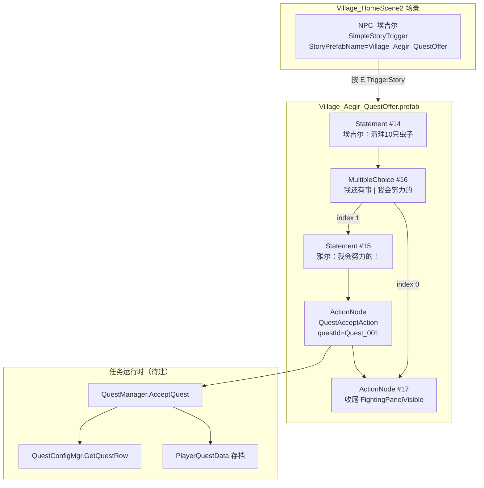
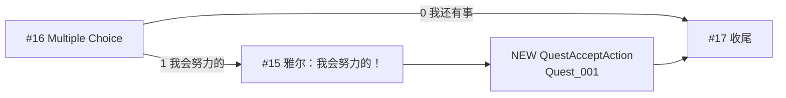
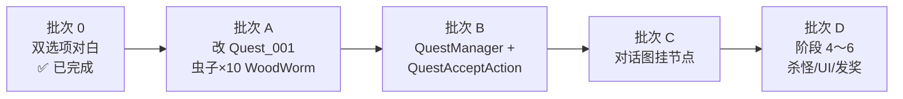

# Village_Aegir — Quest_001 接取与追踪 — 架构溯源与施工执行说明

**文档性质**：架构侦探产出（逻辑溯源 + 分阶段施工指引；**本阶段不改代码**）  
**依据**：
- `Assets/Doc/00_MASTER_PROMPT.md`【架构侦探】
- `Assets/Doc/02_SYSTEM_SPEC.md` §2（NodeCanvas 驱动剧情，接任务走对话图）
- 击杀任务六阶段：`Assets/Doc/执行文档/0606/经典MMO击杀任务_任务配置文件_架构溯源与执行说明.md`
- 埃吉尔对白台本：`Assets/Doc/执行文档/0607/Village_HomeScene2_埃吉尔接任务对白台本_架构溯源与执行说明.md`
- 对话双选项（已交付）：`Assets/Doc/执行文档/0608/Village_Aegir_QuestOffer_对话末尾双选项_架构溯源与施工执行说明.md`
- NPC 挂对话（已交付）：`Assets/Doc/执行文档/0608/Village_HomeScene2_NPC埃吉尔切换Village_Aegir_QuestOffer_施工执行说明.md`

**目标**：将 **`Quest_001`（击杀虫子 ×10）** 绑定到 **`Village_HomeScene2` 的 `NPC_埃吉尔`**；玩家对白选 **「我会努力的」** 后，任务进入 **追踪列表（InProgress，0/10）**。  
**Unity 版本**：2020.3.48f1  

---

## 1. 结论（一句话）

**埃吉尔 NPC 与任务的「绑定」不靠场景字段，而是靠对话图分支：前置对白与双选项已在 `Village_Aegir_QuestOffer.prefab` 就绪；本任务需（①）把 `QuestConfig.json` 的 `Quest_001` 改为击杀虫子 10 只（`targetMonster: WoodWorm`），（②）新建 `QuestAcceptAction` + `QuestManager` + `PlayerQuestData`（击杀任务阶段 2～3），（③）在「我会努力的」分支末句之后插入 `QuestAcceptAction(Quest_001)` 节点。阶段 4～6（杀怪计数、左侧 UI、发奖）属后续批次，不阻塞「接取后系统记住任务」。**

---

## 2. 你要验收的现象

| 步骤 | 期望 |
|------|------|
| InitScene → 进村 → `House_NPC2` → 与 `NPC_埃吉尔` 按 **E** | 播放 `Village_Aegir_QuestOffer` 全文 |
| 埃吉尔说完「……你帮我每天清理掉 10 个虫子」 | 弹出 **「我还有事」「我会努力的」** |
| 点 **「我还有事」** | 对话结束；**不**接任务；Console **无** `[Quest] Accept` |
| 重开对话，点 **「我会努力的」** | 雅尔说「我会努力的！」→ Console：`[Quest] Accept Quest_001` |
| 接取后（本批次最低标准） | 调试/Console 可读：`Quest_001` 状态 `InProgress`，进度 `0/10` |
| 读档后再查 | 同上，进度与状态保留 |
| 未接取时杀虫子（`WoodWorm`） | 任务进度 **不变**（阶段 4 验收项，可后做） |

---

## 3. 「绑定」是什么意思（架构澄清）

### 3.1 生活类比

把埃吉尔想成「发传单的人」：  
- **NPC 身上**只挂「按 E 播哪段对白」（`StoryPrefabName`）。  
- **任务内容**写在 `QuestConfig.json`（传单正文）。  
- **真正接任务**是玩家在对白里点了「我会努力的」那一刻，对话图执行 **`QuestAcceptAction`**，相当于签收传单。

**没有**单独的「NPC.offerQuestIds」配置表；埃吉尔 ↔ `Quest_001` 的绑定关系 = **对话图里写死的 `questId` 参数**。

### 3.2 完整运行时链路



| 层级 | 资源 / 类 | 职责 |
|------|-----------|------|
| 场景触发 | `NPC_埃吉尔` + `SimpleStoryTrigger` | 按 E → `TriggerStory("Village_Aegir_QuestOffer")` |
| 对白演出 | `Village_Aegir_QuestOffer.prefab` | NodeCanvas 图：对白 + 选项 + **接任务 Action** |
| 静态配置 | `QuestConfig.json` → `QuestConfigMgr` | `Quest_001` 目标怪、数量、奖励 |
| 运行时 | `QuestManager` + `PlayerQuestData` | `AcceptQuest` → `InProgress` + `currentCount=0` + 存档 |
| NodeCanvas 节点 | `QuestAcceptAction`（待建） | 仿 `AchievementRecordAction`；参数 `questId` |

---

## 4. 静态阅读：工程现状（2026-06-08）

### 4.1 已完成（本任务可复用）

| 项 | 状态 | 路径 / 说明 |
|----|------|-------------|
| 任务配置阶段 1 | ✅ | `QuestConfigMgr.Init()` 于 `ProcedureComponentGM` 启动加载 |
| `Quest_001` 样例行 | ✅ 需改目标 | `Assets/GameRes/Config/QuestConfig/QuestConfig.json`（当前为史莱姆 ×5，须改为 **虫子 ×10**） |
| `WoodWorm` 怪物名 | ✅ | `MonsterConfig.json` → `"name": "WoodWorm"`（工程内「虫子」对白绑定此名） |
| NPC 挂正式对白 | ✅ | `Village_HomeScene2.unity` → `NPC_埃吉尔.StoryPrefabName = Village_Aegir_QuestOffer` |
| 对话双选项 | ✅ | Prefab 图内已有 `MultipleChoiceNode` #16，选项文案与 CSV 一致 |
| 埃吉尔「虫子」末句 | ✅ | `StatementNodeEx` #14 |
| 雅尔「我会努力的！」 | ✅ | `StatementNodeEx` #15 |

### 4.2 当前对话图连线（静态解析 Prefab）

```
#14（虫子句）→ #16（Multiple Choice）
#16 → #17（收尾 Action，无选项 0 的「直接结束」路径）
#16 → #15（「我会努力的」分支）
#15 → （无出边）⚠️ 接任务 Action 与收尾 #17 均未连接
```

> **说明**：NodeCanvas 中 Multiple Choice 的两条出边顺序对应 `availableChoices` 下标 0、1。当前 `#16→#17` 与 `#16→#15` 并存，符合「0=我还有事→结束」「1=我会努力的→雅尔台词」；但 **接受分支在 #15 之后断线**，须补 `QuestAcceptAction` 并连到 #17。

### 4.3 未完成（本任务阻塞项）

| 能力 | 状态 | 对应阶段 |
|------|------|----------|
| `QuestAcceptAction` | ❌ 无此类 | 阶段 2 |
| `QuestManager` / `AcceptQuest` | ❌ 全工程无匹配 | 阶段 2～3 |
| `PlayerQuestData` 存档 | ❌ 无 | 阶段 3 |
| `BaseMonster.OnDead` 任务上报 | ❌ 无 | 阶段 4 |
| 左侧追踪 UI | ❌ 无 | 阶段 5 |
| 完成发奖 | ❌ 无 | 阶段 6 |

### 4.4 对白与任务配置对齐说明

| 来源 | 文案 / 数值 | 本任务裁定 |
|------|-------------|------------|
| 对白 #14 | 「清理掉 **10 个虫子**」 | 叙事与机制一致 |
| `Quest_001` 配置 | 击杀虫子 **10** 只 | `targetMonster: WoodWorm` |
| 旧 `Quest_001` 配置 | 击杀史莱姆 **5** 只（MMO 样例残留） | **整行改写**为埃吉尔线 |

**重要修改原因**：`MonsterConfig.json` 无 `"虫子"` / `"Bug"` 条目；村内/村外最接近的对白语义是 **`WoodWorm`（蠕虫）**，须与 `MonsterConfig.name` **大小写完全一致**，否则 `QuestConfigMgr.ValidateTargetMonsters` 启动 Warning。  
**替代方案**：若后续新增专用怪物名（如 `VillageBug`），只改 JSON 的 `targetMonster` 即可，**不必**改 `questId` 或对话图。

---

## 5. 配置表修改（策划 / 施工员）

### 5.1 `QuestConfig.json` — 更新 `Quest_001`

**路径**：`Assets/GameRes/Config/QuestConfig/QuestConfig.json`

| 字段 | 改前 | 改后 | 原因 |
|------|------|------|------|
| `title` | 清理森林史莱姆 | **埃吉尔的百合花** | 对齐埃吉尔任务剧情 |
| `title_en` / `title_jp` | 史莱姆相关 | **Aegir's Lilies** / **エギルのユリ** | 多语言同步 |
| `objectiveText` | 击杀史莱姆 5 只 | **击杀虫子 10 只** | 对齐对白 #14 |
| `targetMonster` | `Slime` | **`WoodWorm`** | 绑定 `MonsterConfig.name` |
| `targetCount` | `5` | **`10`** | 对齐对白数量 |
| `repeatable` | `false` | **`true`**（语义占位） | 对白含「每天」；日更逻辑后续单独立项 |

```json
{
  "id": "1",
  "questId": "Quest_001",
  "title": "埃吉尔的百合花",
  "title_en": "Aegir's Lilies",
  "title_jp": "エギルのユリ",
  "objectiveText": "击杀虫子 10 只",
  "objectiveType": "KillMonster",
  "targetMonster": "WoodWorm",
  "targetCount": "10",
  "rewards": [
    { "type": "Gold", "amount": "50" }
  ],
  "prerequisiteQuestIds": [],
  "autoAccept": "false",
  "repeatable": "true",
  "sortOrder": "1"
}
```

> **奖励金额**：对白未写明，`50` 为占位，策划可再调；不影响接取与追踪验收。

**验收**：重启后 Console `[QuestConfig] Loaded 1 quest(s).` 且无 `targetMonster` Warning。

---

## 6. 程序交付（施工员 · 阶段 2～3 最小集）

> 以下为实现「接取 + 追踪」的**最小增量**；严格对齐 `0606` 文档 §5～§6，API 形态参考 `AchievementDataMgr`。

### 6.1 新建文件清单

| 文件 | 职责 |
|------|------|
| `Assets/Scripts/Game/GameMgr/Component/Archive/ArchiveDataClass/Quest/QuestState.cs` | 枚举：`InProgress` / `Complete` 等（首版至少 `InProgress`） |
| `Assets/Scripts/Game/GameMgr/Component/Archive/ArchiveDataClass/Quest/PlayerQuestData.cs` | 存档：`questStates`、`questProgress` 字典；`ParseInternal` / `SerializeInternal` |
| `Assets/Scripts/Game/GameMgr/Component/Archive/ArchiveDataClass/Quest/QuestManager.cs` | `AcceptQuest`、`GetQuestProgress`、`GetActiveQuests`、`SaveQuestProgress` |
| `Assets/Scripts/Game/GameRuntime/NodeCanvas/NodeCanvasNode/ActionTask/Common/QuestAcceptAction.cs` | NodeCanvas Action；`BBParameter<string> questId` |

### 6.2 `QuestAcceptAction` 设计（仿成就节点）

**参考**：`AchievementRecordAction.cs`

```csharp
// 伪代码 — 施工员落盘时须加 XML 注释说明「为何在对话结束句之后调用」
[Category("Story")]
[Name("接取任务")]
public class QuestAcceptAction : ActionTask
{
    public BBParameter<string> questId;

    protected override void OnExecute()
    {
        QuestManager.getInstance().AcceptQuest(questId.value);
        EndAction();
    }
}
```

**日志约定**（验收用）：
- 成功：`[Quest] Accept Quest_001`
- 重复接取：`[Quest] Already accepted: Quest_001`（幂等，不报错）
- 配置不存在：`[Quest] Unknown questId: xxx`

### 6.3 `QuestManager.AcceptQuest` 核心行为

| 步骤 | 行为 |
|------|------|
| 1 | `QuestConfigMgr.GetQuestRow(questId)` 非空 |
| 2 | 查 `PlayerQuestData`：已 `InProgress` / `Complete` → 打日志返回 |
| 3 | `state = InProgress`，`currentCount = 0` |
| 4 | `SaveQuestProgress()` → `ArchiveComponentGM.SaveSpcData<PlayerQuestData>()` |
| 5 | （可选）`OnQuestAccepted` 事件，供阶段 5 UI 订阅 |

**存档键建议**（对齐成就 `Achievement_{id}` 风格）：

| 键模式 | 含义 |
|--------|------|
| `Quest_{questId}_State` | int 枚举值 |
| `Quest_{questId}_Count` | 当前击杀数 |

**替代方案**：单 JSON 字段存 `Dictionary` 序列化 blob；首版用分列键更易调试，与 `AchievementData` 一致。

### 6.4 本批次明确不做

| 项 | 原因 |
|----|------|
| `BaseMonster.OnDead` 上报 | 阶段 4；不影响「接取后 0/10 进追踪」 |
| 左侧 Quest Tracker UI | 阶段 5 |
| `GrantRewards` / 杀满发金币 | 阶段 6 |
| 对白「每天」日更重置 | `repeatable` 字段占位，逻辑单独立项 |

---

## 7. 对话图修改（Unity 手改 Graph）

**资源**：`Assets/GameRes/Prefabs/Dialogue/Village_Aegir_QuestOffer.prefab`  
**原则**：接任务 Action 挂在 **雅尔说完「我会努力的！」之后**，**收尾 Action #17 之前**（对白情绪完整，再签收任务）。

### 7.1 目标结构



### 7.2 操作步骤

1. Open Prefab → **Dialogue Tree Controller** → **Edit Graph**。  
2. 定位 **#15**（`_text` = 「我会努力的！」）。  
3. **Add Node → Action Node**；Action 选 **`QuestAcceptAction`**（程序交付后出现在 Story 分类）。  
4. 参数 **`questId`** = **`Quest_001`**（字符串，与 JSON 完全一致）。  
5. 连线（顺序敏感）：  

| 从 | 到 | 说明 |
|----|-----|------|
| #16 出口 **1** | #15 | 保持现有「我会努力的」分支 |
| #16 出口 **0** | #17 | 保持「我还有事」直接收尾 |
| #15 | **新 QuestAcceptAction** | 先播完台词再接任务 |
| **QuestAcceptAction** | #17 | 统一走收尾 |

6. **勿**在 #16 上直接挂接任务（否则未播「我会努力的！」就 Accept）。  
7. **勿**改 #0～#14 前奏与虫子句。  
8. Graph **Save** → Prefab **Apply**。

### 7.3 与 CSV 的关系

`Village_HomeScene2_Aegir_QuestOffer.csv` 的 ID 16～17 已描述分支语义；`QuestAcceptAction` **无法由 CSV 导入**，必须 Graph 手补（与 `0608` 双选项文档 §6 一致）。

---

## 8. 场景侧（本任务无需改场景）

| 项 | 当前值 | 本任务 |
|----|--------|--------|
| `NPC_埃吉尔.StoryPrefabName` | `Village_Aegir_QuestOffer` | **保持** |
| `sceneObjs` 登记 | 已含 `NPC_埃吉尔` | **保持** |
| `offerQuestIds` 等字段 | **不存在** | **不新增**；绑定在对话图 |

---

## 9. 分阶段施工顺序



| 批次 | 负责人 | 交付 | 依赖 |
|------|--------|------|------|
| **A** | 策划/施工 | `QuestConfig.json`：虫子 ×10、`targetMonster=WoodWorm` | — |
| **B** | 程序 | `QuestAcceptAction` + `QuestManager` + `PlayerQuestData` | A |
| **C** | 策划/施工 | `Village_Aegir_QuestOffer` Graph 挂节点 | B |
| **D** | 程序 | 死亡计数、左侧 UI、发奖 | C |

**纪律**：B 未合并前，C 可在 Editor 先占位 Action 节点，但 Play 会缺类型；建议 **B → C** 同 PR 或连续提交。

---

## 10. 验收清单

**环境**：`InitScene` 启动 → `House_NPC2` 进屋 → `NPC_埃吉尔`。

| # | 操作 | 通过标准 |
|---|------|----------|
| Q1 | 播放到双选项 | 「我还有事」「我会努力的」可见 |
| Q2 | 点「我还有事」 | 对话结束；无 `[Quest] Accept` |
| Q3 | 重开，点「我会努力的」 | 雅尔台词 → Console **`[Quest] Accept Quest_001`** |
| Q4 | 接取后查存档/调试 | `Quest_001` = `InProgress`，`0/10` |
| Q5 | 存档 → 读档 | 状态仍为 `InProgress`，`0/10` |
| Q6 | 未接取杀 `WoodWorm` | 进度不变（阶段 4 后必测） |
| Q7 | Console | 无 `Unknown questId`、无 NodeCanvas Action NRE |

### 10.1 故障排查

| 现象 | 原因 | 处理 |
|------|------|------|
| 点了「我会努力的」无 Accept 日志 | 图里无 `QuestAcceptAction` 或 #15 未连到该节点 | §7 补连线 |
| `Unknown questId` | 参数拼写与 JSON 不一致 | 必须为 `Quest_001` |
| Accept 成功但读档丢失 | `PlayerQuestData` 未 `SerializeInternal` / 未 `SaveSpcData` | 查 §6.3 存档链 |
| 接了任务杀怪不涨 | 阶段 4 未做 | 预期内；接 `0606` §7 |
| 配置仍是 5 只 | JSON 未改或未重启 | 改 `targetCount` 并重启 Play |

---

## 11. 改动范围汇总

| 类型 | 路径 | 改动 |
|------|------|------|
| **必改** | `Assets/GameRes/Config/QuestConfig/QuestConfig.json` | `Quest_001`：史莱姆样例 → 虫子 ×10、`targetMonster=WoodWorm` |
| **必改（程序）** | `QuestAcceptAction.cs`、`QuestManager.cs`、`PlayerQuestData.cs`、`QuestState.cs` | 新建 |
| **必改（图）** | `Assets/GameRes/Prefabs/Dialogue/Village_Aegir_QuestOffer.prefab` | #15 后 + `QuestAcceptAction(Quest_001)` → #17 |
| **不改** | `Village_HomeScene2.unity` | NPC 已挂对 Prefab |
| **不改** | `Village_HomeScene2_Aegir_QuestOffer.csv` | 语义已够；Action 不进 CSV |
| **后续** | `BaseMonster.cs`、`WoodWormLogic.cs`、Quest Tracker UI | 阶段 4～6 |

---

## 12. 待决问题（建议记入 `Docs/OPEN_QUESTIONS.md`）

| # | 问题 | 影响 |
|---|------|------|
| O1 | `WoodWorm` 是否即为村外「虫子」的唯一计数对象（是否含 `WoodWormEgg` / `WoodWormRoot`） | 阶段 4 死亡上报过滤规则 |
| O2 | 对白「每天」：`repeatable: true` 的日更重置何时实现 | 阶段 6 后 |
| O3 | 杀满 10 只后自动发奖 vs 回找埃吉尔对话交付 | 阶段 6 状态机 |
| O4 | 奖励金币数额（当前占位 50） | 策划定稿 |

---

## 13. 相关文档

| 主题 | 路径 |
|------|------|
| 击杀任务六阶段总纲 | `Assets/Doc/执行文档/0606/经典MMO击杀任务_任务配置文件_架构溯源与执行说明.md` |
| 埃吉尔 CSV 台本 | `Assets/Dialog/Village_HomeScene2_Aegir_QuestOffer.csv` |
| 双选项 Graph | `Assets/Doc/执行文档/0608/Village_Aegir_QuestOffer_对话末尾双选项_架构溯源与施工执行说明.md` |
| NPC 换对白 | `Assets/Doc/执行文档/0608/Village_HomeScene2_NPC埃吉尔切换Village_Aegir_QuestOffer_施工执行说明.md` |
| 成就 NodeCanvas 参考 | `Assets/Scripts/Game/GameRuntime/NodeCanvas/NodeCanvasNode/ActionTask/Common/AchievementRecordAction.cs` |
| 成就管理器 API 参考 | `Assets/Scripts/Game/GameMgr/Component/Archive/ArchiveDataClass/Achievement/AchievementDataMgr.cs` |

---

## 14. 文档修订

| 日期 | 说明 |
|------|------|
| 2026-06-08 | 初版：Quest_001×10 绑定埃吉尔；溯源接取链路；阶段 2～3 最小施工 + 对话图挂点 |
| 2026-06-08 | 修订：目标由史莱姆改为虫子；`targetMonster=WoodWorm`；对白与配置对齐 |

**文档路径**：`Assets/Doc/执行文档/0608/Village_Aegir_Quest001_接取追踪_架构溯源与施工执行说明.md`
