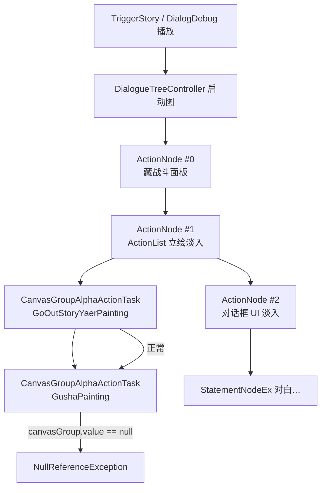

# Village_Aegir_QuestOffer — CanvasGroup 空引用 — 架构溯源与修复执行说明

**文档性质**：架构侦探产出（只读分析 + 分阶段修复指引）  
**依据**：
- `Assets/Doc/00_MASTER_PROMPT.md`【架构侦探】
- 报错现场：`NullReferenceException` @ `CanvasGroupAlphaActionTask+<Do>d__6.MoveNext()`
- 测试对象：`Assets/GameRes/Prefabs/Dialogue/Village_Aegir_QuestOffer.prefab`
- 前奏机制：`Assets/Doc/执行文档/0525/CSV导入工具_开场前奏选项_施工执行说明.md`
- 埃吉尔台本：`Assets/Doc/执行文档/0607/Village_HomeScene2_埃吉尔接任务对白台本_架构溯源与执行说明.md`

**Unity 版本**：2020.3.48f1  

---

## 1. 结论（一句话）

**对话一开场，NodeCanvas 前奏节点会依次给「雅尔立绘」「古莎立绘」做淡入动画；`Village_Aegir_QuestOffer` 是从村内开场模板拷来的，图里仍写着 `GushaPainting`，但 Prefab 里没有古莎立绘、Blackboard 里该变量也没绑 CanvasGroup，第二个淡入任务读到 `null` 就崩了——不是 CSV 对白内容的问题，是 Prefab 前奏与角色资源没对齐。**

---

## 2. 玩家 / 测试侧现象

| 你在做什么 | 你会看到什么 |
|------------|--------------|
| DialogDebug 或实机触发 `Village_Aegir_QuestOffer` | 对话 UI 可能刚要出来就卡住 |
| Console | `NullReferenceException: Object reference not set to an instance of an object`，堆栈指向 **`CanvasGroupAlphaActionTask`** |
| 对白 | **一句都播不出来**（崩在前奏链，还没走到 StatementNodeEx） |

**生活类比**：开场演出脚本写着「先开雅尔灯，再开古莎灯」，但舞台上只挂了雅尔和埃吉尔的灯，古莎那路开关是空的——按到第二路就短路。

---

## 3. 逻辑溯源（给程序）

### 3.1 运行时调用链



### 3.2 崩溃代码位置

`CanvasGroupAlphaActionTask.Do()` 第 23 行直接访问 `canvasGroup.value.alpha`，**未做空检查**：

```21:34:Assets/Scripts/Game/GameRuntime/NodeCanvas/NodeCanvasNode/ActionTask/Common/CanvasGroupAlphaActionTask.cs
    private async UniTask Do()
    {
        canvasGroup.value.alpha = StartAlpha.value;
        if (EndActionOnAnimationEnd.value)
        {
            await canvasGroup.value.DOFade(EndAlpha.value, Duration.value).AsyncWaitForCompletion();
            EndAction();
        }
        // ...
    }
```

当 Blackboard 变量 `GushaPainting` 未绑定场景里的 `CanvasGroup` 组件时，`canvasGroup.value` 为 **null** → 此处必崩。

### 3.3 Prefab 静态对比（根因证据）

| 检查项 | `Village_KenMuNiStart`（模板，正常） | `Village_Aegir_QuestOffer`（当前，异常） |
|--------|--------------------------------------|------------------------------------------|
| 前奏 ActionList | `GoOutStoryYaerPainting` → `GushaPainting` | **相同**（从模板继承，未改） |
| Blackboard `GoOutStoryYaerPainting` | 有 `_value`，绑定 Yaer 下嵌套立绘 | ✅ 已绑定 |
| Blackboard `GushaPainting` | 有 `_value`，绑定 Gusha 下嵌套立绘 | ❌ **无 `_value`，`_references: []`** |
| Hierarchy 子 Actor | Yaer + Gusha | Yaer + **Argir（埃吉尔）**，**无 Gusha、无古莎立绘节点** |
| 对白 Actor | 雅尔、古莎 | 雅尔、**埃吉尔** |

**结论**：Graph 仍按「雅尔 + 古莎」双立绘前奏执行，Prefab 已改成「雅尔 + 埃吉尔」，**前奏未同步**。

### 3.4 常见成因（本 Prefab 命中哪条）

| 成因 | 本案例 |
|------|--------|
| Import CSV 时勾选了「立绘 CanvasGroup 淡入」，参考 Prefab 选了 `Village_KenMuNiStart` | ✅ 极可能（生成的图含 GushaPainting 节点） |
| 合并 Graph 进新 Prefab 时只加了 Yaer/Argir Actor，未改前奏与 Blackboard | ✅ 已证实 |
| 复制 KenMuNiStart Prefab 改名但未删 Gusha 相关变量 | ✅ Blackboard 仍留空壳 `GushaPainting` |

---

## 4. 修复方案（三选一，按优先级）

### 方案 A — 首版快速止血（推荐：埃吉尔立绘未就绪）

**目标**：先让对白完整播完，接受「仅雅尔立绘淡入、埃吉尔暂不出立绘」。

| 步骤 | Unity 操作 |
|------|------------|
| A1 | 打开 `Assets/GameRes/Prefabs/Dialogue/Village_Aegir_QuestOffer.prefab` |
| A2 | 选中根物体 → **DialogueTreeController** → 打开 NodeCanvas 图 |
| A3 | 找到 **ActionNode #1**（ActionList，内含两个「CanvasGroup透明度渐变动画」） |
| A4 | 展开 ActionList → **删除** 绑定 **`GushaPainting`** 的那一条 Task |
| A5 | 选中根物体 **Blackboard** 组件 → 删除未使用的变量 **`GushaPainting`**（可选，建议删避免误导） |
| A6 | Apply Prefab，保存场景 |

**替代**：若希望完全无前奏，可删 ActionNode #0～#2 整链，把 **primeNode** 指到第一句对白（与 CSV 阶段 1 纯对白一致）。代价是无「藏战斗面板 / UI 淡入」演出。

### 方案 B — 正确对齐埃吉尔（埃吉尔立绘资源到位后）

**目标**：前奏淡入 **雅尔 + 埃吉尔**，与对白 Actor 一致。

| 步骤 | Unity 操作 |
|------|------------|
| B1 | 参考 `Village_KenMuNiStart`：在 **Gusha** 子物体下如何嵌套 `GushaPainting` 预制体（带 `CanvasGroup`） |
| B2 | 在 **Argir（埃吉尔）** 下同样嵌套埃吉尔立绘 Prefab（命名建议 **`AegirPainting`**，与 Blackboard 变量名一致） |
| B3 | Blackboard：删除 `GushaPainting`；新增 **`AegirPainting`**（类型 CanvasGroup），拖入刚嵌套的 `CanvasGroup` |
| B4 | NodeCanvas 图 ActionNode #1：把第二条 Task 的变量从 `GushaPainting` 改为 **`AegirPainting`** |
| B5 | `DialogueActorEx`（Argir）：`_roleName` 设为埃吉尔枚举（待 `DialogueRoleName.Aegir` 入库后）；立绘图集 `Avatar_Aegir` 就绪后绑定 |
| B6 | Apply + 试播 |

### 方案 C — 重新导入 CSV（避免手改 Graph）

**适用**：Graph 改动大、希望从工具重新生成。

| 步骤 | 操作 |
|------|------|
| C1 | **Tools → Dialogue → Import CSV** |
| C2 | CSV：`Assets/Dialog/Village_HomeScene2_Aegir_QuestOffer.csv` |
| C3 | **开场前奏**：若埃吉尔立绘未做，**不要勾选**「立绘 CanvasGroup 淡入」；仅按需勾选「藏战斗面板 / 对话框 UI 淡入」 |
| C4 | 若必须勾选立绘淡入：**立绘参考 Prefab** 不能再用 `Village_KenMuNiStart`，应选 **已配好 Yaer + Aegir 两个 CanvasGroup 变量** 的 Prefab（方案 B 完成后的本 Prefab） |
| C5 | 生成新 `.asset` → 合并进 `Village_Aegir_QuestOffer.prefab`（Replace Graph / Bind） |

> **工具侧说明**：`DialoguePreludeBuilder` 只把 CanvasGroup **变量名**写进 Task；**合并进 Prefab 后 Blackboard 必须存在同名且已赋值的变量**，否则实机仍空引用。见 `DialoguePortraitReferenceResolver` 与 0525 前奏文档 HelpBox。

---

## 5. 修复后自检清单

### 5.1 Editor 静态检查

- [ ] 打开 Prefab → Blackboard：所有 **CanvasGroup 类型变量** 在 Inspector 中 **非 None**
- [ ] NodeCanvas 图 → ActionList 中每个 `CanvasGroupAlphaActionTask` 的 `canvasGroup` 指向 **本 Prefab 存在的变量名**
- [ ] Hierarchy：**不存在** 图里引用但场景里没有的 `GushaPainting`（埃吉尔对话不应再引用古莎）

### 5.2 运行验收

- [ ] DialogDebug 或实机触发 `Village_Aegir_QuestOffer`
- [ ] Console **无** `CanvasGroupAlphaActionTask` / `NullReferenceException`
- [ ] 前奏播完后，ID 1「啊，是你呀。」正常显示
- [ ] 埃吉尔台词顺序正确（方案 A 下埃吉尔可能仅字幕无立绘，属预期）

### 5.3 回归

- [ ] `Village_KenMuNiStart` 仍正常双立绘淡入（勿误改模板 Prefab）

---

## 6. 与 CSV / Speaker 映射的关系（澄清）

| 问题 | 是否相关 |
|------|----------|
| Speaker「埃吉尔」未映射 | ❌ 无关（那是 **导入阶段** 报错；你已能进 Play 说明导入/Prefab 已做过） |
| CSV 台词内容错误 | ❌ 无关（崩在前奏，未执行 StatementNodeEx） |
| 前奏 + Blackboard + 立绘 Hierarchy | ✅ **直接相关** |

Speaker 映射修复见：`Assets/Doc/执行文档/0608/CSV导入工具_埃吉尔Speaker映射缺失_架构溯源与执行说明.md`

---

## 7. 可选程序增强（非本任务必须）

| 项 | 说明 | 优先级 |
|----|------|--------|
| `CanvasGroupAlphaActionTask` 空检查 + `LogError` 指明变量名 | 避免 NRE，Console 直接提示「Blackboard 变量 xxx 未绑定」 | 低（改善 DX） |
| Import CSV 合并 Prefab 向导 | 自动同步 Blackboard CanvasGroup 列表 | 阶段 2 |
| `DialogueRoleName.Aegir` + `Avatar_Aegir` | 埃吉尔立绘运行时加载 | 另立项（0607 §3.4） |

**本修复优先改 Prefab 配置，不要求先改运行时 C#。**

---

## 8. 施工员提交说明模板

```text
fix: Village_Aegir_QuestOffer 前奏 GushaPainting 空引用

修改：Village_Aegir_QuestOffer.prefab（删/换 GushaPainting 前奏 Task，同步 Blackboard）
原因：对话角色为雅尔+埃吉尔，模板残留古莎立绘变量未绑定导致 CanvasGroupAlphaActionTask NRE

验证：DialogDebug 播放完整对白，Console 无 NullReferenceException
```

---

## 9. 相关文档索引

| 主题 | 路径 |
|------|------|
| CSV 前奏选项机制 | `Assets/Doc/执行文档/0525/CSV导入工具_开场前奏选项_施工执行说明.md` |
| 埃吉尔台本与分阶段交付 | `Assets/Doc/执行文档/0607/Village_HomeScene2_埃吉尔接任务对白台本_架构溯源与执行说明.md` |
| DialogDebug 试播 | `Assets/Doc/执行文档/0525/DialogDebug对话测试场景_施工执行说明.md` |
| 正常双立绘样板 | `Assets/GameRes/Prefabs/Dialogue/Village_KenMuNiStart.prefab` |

---

## 10. 文档修订

| 日期 | 说明 |
|------|------|
| 2026-06-08 | 初版：据 Play 模式 NRE 溯源 Village_Aegir_QuestOffer 前奏 GushaPainting 未绑定；给出 A/B/C 修复与验收 |

**文档路径**：`Assets/Doc/执行文档/0608/Village_Aegir_QuestOffer_CanvasGroup空引用_架构溯源与修复执行说明.md`
