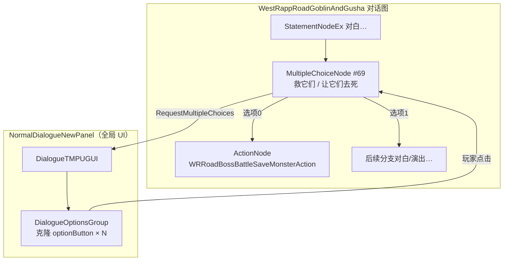
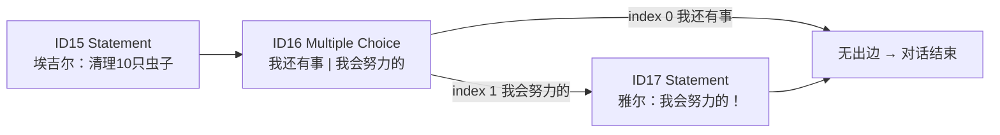

# Village_Aegir_QuestOffer — 对话末尾双选项 — 架构溯源与施工执行说明

**文档性质**：架构侦探产出（逻辑溯源 + 施工指引）  
**依据**：
- `Assets/Doc/00_MASTER_PROMPT.md`【架构侦探】
- 参考样板：西境之路「救不救哥布林」选项（`WestRappRoadGoblinAndGusha.prefab`）
- 埃吉尔台本 CSV：`Assets/Dialog/Village_HomeScene2_Aegir_QuestOffer.csv`
- 当前对话 Prefab：`Assets/GameRes/Prefabs/Dialogue/Village_Aegir_QuestOffer.prefab`
- 选项 UI：`Assets/GameRes/Prefabs/UI/NormalDialogueNewPanel.prefab`
- NodeCanvas 选项机制：`Assets/Doc/执行文档/0525/CSV转NodeCanvas对话树_架构溯源与执行说明.md` §3.5

**Unity 版本**：2020.3.48f1  

---

## 1. 结论（一句话）

**「救哥布林 / 让它们去死」并不是单独的选项 Prefab，而是对话图里的 `Multiple Choice` 节点 + 全局对话 UI（`NormalDialogueNewPanel`）动态生成按钮；埃吉尔要在「清理虫子」那句对白之后插入同样的 `MultipleChoiceNode`，选项文案为「我还有事」「我会努力的」，当前 `Village_Aegir_QuestOffer` 图里还没有这个节点（用的是无选项的精简 CSV 版），需要改 Graph 后重新 Bind 到 Prefab。**

---

## 2. 你要验收的现象

| 步骤 | 期望 |
|------|------|
| InitScene → 进村 → `House_NPC2` → 与 `NPC_埃吉尔` 按 **E** | 正常进入 `Village_Aegir_QuestOffer` 对白 |
| 顺序播放到埃吉尔说「……你帮我每天清理掉 10 个虫子」 | 字幕停在该句（或紧接该句） |
| **随后** | 对话框区域下方弹出 **两个可点按钮**：「我还有事」「我会努力的」 |
| 点「我还有事」 | 对话直接结束，回到场景 |
| 点「我会努力的」 | 雅尔说「我会努力的！」→ 对话结束 |

---

## 3. 哥布林选项：架构溯源（你要复用的机制）

### 3.1 用的是什么 Prefab？

| 层级 | 资源 | 作用 |
|------|------|------|
| **剧情图（核心）** | `Assets/GameRes/Prefabs/Dialogue/WestRappRoadGoblinAndGusha.prefab` | 内嵌 NodeCanvas 图；**选项逻辑在图里**，不是独立「选项 Prefab」 |
| **选项 UI 壳（全局）** | `Assets/GameRes/Prefabs/UI/NormalDialogueNewPanel.prefab` | 任意对话启动时由 `NormalDialogueFormNewLogic` 打开；内含 `DialogueTMPUGUI` |
| **按钮模板** | 同上 Prefab 内 `DialogueOptionsGroup` + `optionButton` | 运行时 **Instantiate 克隆** 成每个选项 |
| **场景落点（可选）** | `WestRappRoad.unity` 里 `OptionPos` 空物体 | 哥布林长线剧情在图**开头**用 Action 读取 `SimpleStoryTrigger.OptionPos`，把选项区挪到世界坐标 |

**没有**名为「ChoicePanel」或「GoblinChoice」的独立选项预制体。

### 3.2 运行时链路（生活类比）

1. 图执行到 **`MultipleChoiceNode`**（编辑器里叫 **Multiple Choice**）。  
2. 节点调用 `DialogueTree.RequestMultipleChoices` → 触发 `DialogueTMPUGUI.OnMultipleChoiceRequest`。  
3. UI 在 **`DialogueOptionsGroup`** 里按选项数克隆 **`optionButton`**，填入中文（读 `statement.text`）。  
4. 玩家点击 → `info.SelectOption(index)` → 图从该选项的 **出边** 继续（`DLGTree.Continue(index)`）。

### 3.3 哥布林选项节点静态数据（对照用）

| 项 | 值 |
|----|-----|
| 对话 Prefab | `WestRappRoadGoblinAndGusha.prefab` |
| 节点类型 | `NodeCanvas.DialogueTrees.MultipleChoiceNode`（图内 `$id` **69**） |
| 选项 0 文案 | **救它们**（`_text_en`: Save Them） |
| 选项 1 文案 | **让它们去死**（`_text_en`: Let Them Die） |
| 选项 0 出边 | → `ActionNode` **`WRRoadBossBattleSaveMonsterAction`**（`hasSave = true`，写存档「救了哥布林」） |
| 选项 1 出边 | → 另一条演出/对白链（不救分支） |
| Actor | 节点需绑定 Actor（哥布林线绑在说话角色上，`requireActorSelection = true`） |

**埃吉尔首版只需「弹出选项 + 分支结束/一句回应」**，**不必**抄 `WRRoadBossBattleSaveMonsterAction`；接任务 `QuestAcceptAction` 属后续批次。

### 3.4 选项 UI 代码锚点（给程序）

| 文件 | 职责 |
|------|------|
| `MultipleChoiceNode.cs` | 执行时组 `MultipleChoiceRequestInfo`，`showLastStatement = true`（保留上一句字幕） |
| `DialogueTMPUGUI.cs` → `OnMultipleChoiceRequest` | 显示/隐藏 `DialogueOptionsGroup`，实例化按钮 |
| `NormalDialogueFormNewLogic.cs` | 打开对话 UI；`SetDialogueOptionsGroupPosition` 供世界坐标对齐（可选） |

---

## 4. 埃吉尔现状与缺口

### 4.1 CSV 台本（目标内容，已有）

文件：**`Assets/Dialog/Village_HomeScene2_Aegir_QuestOffer.csv`**

| ID | Type | Speaker | Text | Next | Extra |
|----|------|---------|------|------|-------|
| 15 | Dialogue | 埃吉尔 | …你帮我每天清理掉 10 个虫子。 | 16 | |
| **16** | **Choice** | 埃吉尔 | （空） | **END\|17** | **我还有事\|我会努力的** |
| 17 | Dialogue | 雅 | 我会努力的！ | （空/END） | |

### 4.2 当前 Prefab 图（静态阅读）

| 检查项 | 状态 |
|--------|------|
| `Village_Aegir_QuestOffer.prefab` 含 `MultipleChoiceNode` | ❌ **无** |
| 末句是否为埃吉尔「虫子」后直接雅尔「我会努力的！」 | ⚠️ 当前图来自 **无 Choice 行的精简 CSV**，选项 **不会出现** |
| 场景 `NPC_埃吉尔.StoryPrefabName` | 应为 `Village_Aegir_QuestOffer`（见 `0608` 切换文档） |

### 4.3 CSV 导入与 `END|17` 的注意点

`DialogueCsvParser.SplitNextTargets("END|17")` 当前会把 **`END` 当非法 ID 忽略**，只解析出 **`[17]`**，与 2 个 Extra 选项 **数量不一致**，Import 可能 **校验失败**。

| 方案 | 说明 | 推荐 |
|------|------|------|
| **A. NodeCanvas 手改 Graph** | 在已有图上删错序末句、插 Multiple Choice、手连线 | ✅ **本任务首选** |
| **B. 重导 CSV + 手补 END 分支** | 若 Import 报错，仍用 A 补连线 | 可选 |
| **C. 改 Parser 支持 `END\|id` 占位** | 施工员小改 `SplitNextTargets`，使 END 计为一支空分支 | 后续优化 |

---

## 5. 目标 Graph 结构（埃吉尔）

**与哥布林相同点**：都用 **`MultipleChoiceNode`** + **`NormalDialogueNewPanel`** 选项 UI。  
**不同点**：埃吉尔选项 0 **不连出边**即结束；选项 1 只接一句雅尔台词，**暂不挂** `QuestAcceptAction`。

---

## 6. Unity 施工步骤（推荐：手改 Graph）

### 6.1 前置

- [ ] `Village_Aegir_QuestOffer.prefab` 前奏 **GushaPainting** 已修（见 `0608/Village_Aegir_QuestOffer_CanvasGroup空引用_…`）  
- [ ] Speaker 映射含 `埃吉尔`、`—`（旁白行若图中有）  
- [ ] DialogDebug 或实机可播到 ID 15 附近无 NRE  

### 6.2 打开并编辑对话图

1. Project → **`Assets/GameRes/Prefabs/Dialogue/Village_Aegir_QuestOffer.prefab`** → Open Prefab。  
2. 根物体 **Dialogue Tree Controller** → **Edit Graph**（NodeCanvas）。  
3. 定位 **埃吉尔「清理 10 个虫子」** 的 **Statement** 节点（对应该句字幕）。  
4. 若其后已有 **雅尔「我会努力的！」** 且 **中间没有 Choice**：  
   - **断开** 虫子句 → 我会努力的 的直连；  
   - 保留「我会努力的！」节点，留给选项分支 1 使用。  

### 6.3 添加 Multiple Choice 节点

1. 右键 → **Add Node** → **Multiple Choice**（`MultipleChoiceNode`）。  
2. **Actor**：选 **埃吉尔**（与 CSV Speaker 一致；节点要求 `requireActorSelection`）。  
3. **Add Choice** 两次，文案：  

| 下标 | 中文（statement.text） |
|------|------------------------|
| 0 | **我还有事** |
| 1 | **我会努力的** |

4. `availableTime` 保持 **0**（不限时，与哥布林该节点一致）。  
5. `saySelection` 保持 **不勾选**（点选后不重复朗读选项文字，与村内默认一致）。  

### 6.4 连线（顺序敏感）

| 从 | 到 | 说明 |
|----|-----|------|
| 埃吉尔「虫子」Statement | **Multiple Choice** | 对白结束后进入选项 |
| Choice **第 1 个出口**（我还有事） | **不连** | 无出边 = 对话 Success 结束（同 CSV `END`） |
| Choice **第 2 个出口**（我会努力的） | 雅尔「我会努力的！」Statement | 仅选此项才播 ID 17 |

> **NodeCanvas 规则**：必须先加够 Choice，再 **从选项出口拖线**；出口顺序与 `availableChoices` 列表顺序一致（0=上，1=下，与 UI 按钮从上到下一致）。

### 6.5 保存 Prefab

1. Graph **Save**。  
2. Prefab **Apply**。  
3. （可选）DialogDebug 拖 `Village_Aegir_QuestOffer` 试播，确认选项出现后再进 `Village_HomeScene2` 实机测。

### 6.6 选项位置（可选，首版可跳过）

哥布林/兔子会在图开头用 **`NormalDialogueSetOptionGroupWorldPosTaskAction`** 把选项对齐场景 `OptionPos`。  
`Village_HomeScene2` 的 `NPC_埃吉尔.OptionPos` 当前为 **空**，与 `Npc1` 等村内 NPC 相同 → 选项落在 **对话框默认位置** 即可，**首版不必**抄 WestRappRoad 的 OptionPos 链。

---

## 7. 替代方案：CSV 重新导入

若希望图与 CSV 完全一致：

1. **Tools → Dialogue → Import CSV**  
2. 选择 **`Village_HomeScene2_Aegir_QuestOffer.csv`**  
3. 若报 **Choice Extra 与 Next 分支数不一致** → 改用手改 Graph（§6），或单独立项改 Parser（§4.3 方案 C）。  
4. 生成 `.asset` 后 **合并/替换** `Village_Aegir_QuestOffer` 的 Bound Graph，保留 Prefab 上 Actor 绑定、Blackboard、前奏节点。  
5. 在 NodeCanvas 中 **检查** Choice 两出口：0 无连线，1 → ID 17。  

---

## 8. 验收清单

**环境**：InitScene 启动 → `House_NPC2` 进屋 → `NPC_埃吉尔` 按 E。

| # | 操作 | 通过标准 |
|---|------|----------|
| O1 | 播放到埃吉尔「清理 10 个虫子」 | 字幕正确 |
| O2 | 该句之后 | **`DialogueOptionsGroup` 出现两个按钮**：「我还有事」「我会努力的」 |
| O3 | 点「我还有事」 | 对话关闭，回场景，Console 无报错 |
| O4 | 重开对话，点「我会努力的」 | 雅尔说「我会努力的！」→ 对话结束 |
| O5 | Console | 无 `Multiple Choice Node has no available options` |
| O6 | Console | 无 `There are no connections to the Multiple Choice Node`（若出现说明 Choice 未正确连到后续或 Actor 未绑导致 0 选项） |

### 8.1 故障排查

| 现象 | 原因 | 处理 |
|------|------|------|
| 播完直接结束，无按钮 | 图里 **无 MultipleChoiceNode** 或虫子句 **直连** 了结束句 | 按 §6 插入 Choice |
| 只有一个按钮 | Choice 只加了一条，或某条 condition 不满足 | 补第二条；条件 Task 留空 |
| 按钮有但点了没反应 | 出边未从 **对应 sourceIndex** 连接 | 删线重连，对齐选项顺序 |
| 按钮在屏幕外 | 极少见；OptionPos/Canvas 锚点问题 | 对比 `NormalDialogueNewPanel` 默认布局 |
| 选项 0 也继续播「我会努力的」 | 虫子句仍直连 ID17 | 断开直连，必须经 Choice |

---

## 9. 改动范围

| 类型 | 路径 | 改动 |
|------|------|------|
| **必改** | `Assets/GameRes/Prefabs/Dialogue/Village_Aegir_QuestOffer.prefab` | Graph：+MultipleChoiceNode，改连线 |
| 可选 | `Assets/Editor/Tool/Dialogue/DialogueCsvParser.cs` | 支持 `END\|id` 多分支 Import |
| **不改** | `NormalDialogueNewPanel.prefab` | 全局 UI 已支持选项 |
| **不改** | `Village_HomeScene2.unity` | 仅换对话名时已改 StoryPrefabName 即可 |
| 后续 | Graph 选项 1 后 | 挂 `QuestAcceptAction(Quest_002)`（批次 B） |

---

## 10. 与哥布林实现的差异对照

| 维度 | 哥布林（WestRappRoad） | 埃吉尔（Village_HomeScene2） |
|------|------------------------|------------------------------|
| 对话 Prefab | `WestRappRoadGoblinAndGusha` | `Village_Aegir_QuestOffer` |
| 选项节点 | MultipleChoice #69 | 新建 MultipleChoice（建议接在虫子句后） |
| 选项文案 | 救它们 / 让它们去死 | **我还有事 / 我会努力的** |
| 选项后逻辑 | 存档 Action + 长线 Boss 演出 | 0=结束；1=一句雅尔台词（任务后续再加） |
| OptionPos | 场景 + 图内 Action 对齐 | 首版用 UI 默认位置 |
| 触发方式 | Boss 战剧情链 | `NPC_埃吉尔` + `SimpleStoryTrigger` |

---

## 11. 相关文档

| 主题 | 路径 |
|------|------|
| 哥布林对话 Prefab | `Assets/GameRes/Prefabs/Dialogue/WestRappRoadGoblinAndGusha.prefab` |
| 兔子双选项（结构更简单） | `Assets/GameRes/Prefabs/Dialogue/ForestSceneRabbit.prefab` |
| CSV Choice 列规范 | `0525/CSV转NodeCanvas对话树_架构溯源与执行说明.md` §3.5 |
| NPC 挂对话 | `0608/Village_HomeScene2_NPC埃吉尔切换Village_Aegir_QuestOffer_…` |
| 接任务后续 | `0607/Village_HomeScene2_埃吉尔接任务对白台本_…` §5 |

---

## 12. 文档修订

| 日期 | 说明 |
|------|------|
| 2026-06-08 | 初版：溯源哥布林 MultipleChoice + NormalDialogueNewPanel；埃吉尔双选项 Graph 施工与验收 |

**文档路径**：`Assets/Doc/执行文档/0608/Village_Aegir_QuestOffer_对话末尾双选项_架构溯源与施工执行说明.md`
