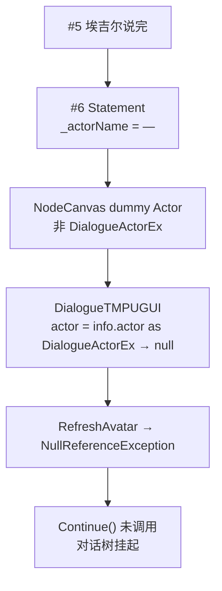

# Village_Aegir_QuestTurnIn — 交付对白「给钱」旁白空引用卡死 — 架构溯源与修复执行说明

**文档性质**：架构侦探产出（报错溯源 + 修复施工指引）  
**依据**：
- 交付链路：`Assets/Doc/执行文档/0608/Village_Aegir_Quest001_交付换场与发奖_架构溯源与施工执行说明.md`
- 交付台本：`Assets/Doc/执行文档/0608/Village_HomeScene2_埃吉尔任务交付对白台本_架构溯源与执行说明.md`
- CSV/立绘通则：`Assets/Doc/执行文档/0525/CSV转NodeCanvas对话树_架构溯源与执行说明.md`
- CanvasGroup 前奏：`Assets/Doc/执行文档/0608/Village_Aegir_QuestOffer_CanvasGroup空引用_架构溯源与修复执行说明.md`

**现象**：`Quest_001` 提交交付、播到 **「玩家获得游戏币60」** 时，Console 报 **`NullReferenceException`**（`DialogueTMPUGUI.Internal_OnSubtitlesRequestInfo`），对话框**无字**，玩家**无法推进/卡死**；`QuestTurnInAction` 发奖可能**尚未执行**。  
**Unity 版本**：2020.3.48f1  

---

## 1. 结论（一句话）

**根因是 `Village_Aegir_QuestTurnIn` 对话图 **#6** 使用 Speaker `—`（旁白）作 Statement，Prefab 的 `actorParameters` 未注册该 Actor，NodeCanvas 回退为无 `DialogueActorEx` 的 dummy；`DialogueTMPUGUI` 对 `info.actor as DialogueActorEx` 未判空即调用 `RefreshAvatar`，在「给钱」字幕句崩溃并阻断 `info.Continue()`，对话树挂起。修复首选：改 Prefab 去掉 `—` 旁白句或改为 Tips/有角色句；根治：给 `DialogueTMPUGUI` 增加旁白无立绘分支。**

---

## 2. Console 与现象对照

| 日志 | 含义 |
|------|------|
| `(Dialogue Tree Log): An actor entry '—' on DialogueTree has no reference. A dummy Actor will be used` | 图里写了说话人 `—`，但 **未绑定** Prefab 子物体上的 `DialogueActorEx` |
| `NullReferenceException` @ `DialogueTMPUGUI.Internal_OnSubtitlesRequestInfo` | `actor` 转型为 `DialogueActorEx` 失败（**null**），下一行 `actor.RefreshAvatar(...)` 空引用 |
| `[Quest] TurnIn` / `[Quest] Grant Gold 60` **未出现** | 崩溃发生在 **#6**，**#8 `QuestTurnInAction`** 尚未执行（发奖在对白后半段） |

---

## 3. 架构溯源：崩溃发生在哪一句

### 3.1 当前 `Village_Aegir_QuestTurnIn` 节点顺序（静态阅读）

```
#0～#2   前奏（FightingPanel / 立绘淡入）
#3       雅尔：今天的数量达成了。
#4       埃吉尔：好吧，我就看在你帮我的份上对你改观吧。
#5       埃吉尔：我也不是小气之人，这些钱你拿着吧……
#6       —：玩家获得游戏币60          ← ★ 崩溃点（无 Actor 引用）
#7       雅尔：啊……听到了些不好的事呢……
#8       QuestTurnInAction(Quest_001)  ← TurnIn + GrantRewards（崩溃时到不了）
#9       FightingPanelVisible(true)
```

### 3.2 调用链



### 3.3 代码落点

`DialogueTMPUGUI.Internal_OnSubtitlesRequestInfo`（约 192～211 行）：

```csharp
var actor = info.actor as DialogueActorEx;
// ...
actor.RefreshAvatar(info.FaceType, (sprite) => OnGetAvatar(sprite, text));  // actor 为 null 时崩溃
OnGetNewStatement?.Invoke(actor.RoleName, info.FaceType, text);             // 同理
```

| 设计事实 | 说明 |
|----------|------|
| 立绘刷新 | **仅** `DialogueActorEx` + `DialogueRoleName` + 图集 |
| 旁白 `—` | CSV/台本约定「只出字、不出立绘」，但 **运行时未实现无 Actor 分支** |
| `ProxyDialogueActor` / dummy | 能挂名，**不能**当 `DialogueActorEx` 用 |

### 3.4 为何 `Village_Aegir_QuestOffer` 未爆

接任务 Prefab 的 `actorParameters` **仅注册「雅尔」「埃吉尔」**；台本里兔子旁白（CSV 的 `—` 行）若未导入进图，或导入后未进 Play 路径，故未触发。交付 Prefab **显式加了 #6 `—` 句**，必现。

---

## 4. 修复方案（按优先级）

### 方案 A — 只改 Prefab（推荐 · 最快止血）

**不改 C#**，在 NodeCanvas 编辑器打开 `Village_Aegir_QuestTurnIn`：

| 子方案 | 做法 | 优点 |
|--------|------|------|
| **A1（最简）** | **删除 #6** 旁白 Statement；保留 #8 `QuestTurnInAction` 发奖；可选在 #8 后加 `AddTipsInfoActionTask` 弹「获得金币」Tips | 2 分钟，零代码 |
| **A2** | 将 #6 的 **Actor 改为「雅尔」**（或埃吉尔），文本仍为「玩家获得游戏币60」，`FaceType` 用 `Daze` 或项目内等价项；**勿用 `Normal`** | 保留字幕演出，有立绘可接受 |
| **A3** | 将 #6 改为 **ActionNode** → `AddTipsInfoActionTask`（需配置 Tips 文案 Key） | 系统提示与对白分离 |

**推荐组合**：**A1 + 保持 #8 发奖**（真实加币在 `GrantQuestRewards`，不依赖 #6 字幕）。

### 方案 B — 改 `DialogueTMPUGUI`（根治 · 惠及全项目旁白）

在 `Internal_OnSubtitlesRequestInfo` 中，当 `actor == null` 时：

1. **不调用** `RefreshAvatar`；`actorPortrait` 隐藏或保持上一帧。  
2. 仍执行 `TextAnimation(text)` 显示字幕。  
3. `OnGetNewStatement` 用占位 `DialogueRoleName` 或跳过。  
4. 正常 `Continue()`，避免卡死。

**重要修改原因**：台本与 CSV 规范里旁白 `—` 会长期存在；仅改一个 Prefab 不能防止下次导入再炸。

### 方案 C — 为 `—` 注册 Narrator Actor（不推荐首版）

在 Prefab 下挂带 `DialogueActorEx` 的旁白物体并写入 `actorParameters`——仍须合法 `DialogueRoleName` 与图集，工作量大，不如 B。

---

## 5. Unity 施工步骤（方案 A1 · 推荐）

### 5.1 修改对话图

1. Project → `Assets/GameRes/Prefabs/Dialogue/Village_Aegir_QuestTurnIn.prefab`。  
2. 打开 **NodeCanvas Dialogue Editor**。  
3. 选中 **#6**「— / 玩家获得游戏币60」→ **Delete**（或断开 #5→#7，跳过 #6）。  
4. 确认连线：`#5 → #7 → #8 QuestTurnInAction → #9 FightingPanelVisible`。  
5. 选中 **#8**，确认 `questId = Quest_001`。  
6. **Apply** Prefab。

### 5.2 （可选）加 Tips 提示

在 **#8 与 #9 之间** 插入 ActionNode → **AddTipsInfoActionTask**，`TipKey` 填项目已有「获得道具/金币」类 Key（无则暂用 Debug.Log，见 `QuestManager.GrantQuestRewards` 的 `[Quest] Grant Gold 60`）。

### 5.3 验收

见 §7。

---

## 6. 代码施工步骤（方案 B · 可选）

**文件**：`Assets/Scripts/Game/GameRuntime/NodeCanvas/NodeCanvasExtend/DialogueTMPUGUI.cs`

在 `Internal_OnSubtitlesRequestInfo` 内，`var actor = info.actor as DialogueActorEx;` 之后增加旁白分支（示意，施工须加注释）：

```csharp
var actor = info.actor as DialogueActorEx;

subtitlesGroup.gameObject.SetActive(true);
subtitlesGroup.anchoredPosition = originalSubsPosition;
actorSpeech.text = "";

if (actor != null)
{
    actor.RefreshAvatar(info.FaceType, (sprite) => OnGetAvatar(sprite, text));
    OnGetNewStatement?.Invoke(actor.RoleName, info.FaceType, text);
}
else
{
    // 旁白/未绑定 Actor：仅字幕，不刷新立绘，避免 dummy Actor 空引用
    actorPortrait.gameObject.SetActive(false);
}

// 后续 audio / TextAnimation / WaitForInput / Continue 保持不变
```

**注意**：若 `audio != null` 且 `actor == null`，原逻辑 `actor.transform.GetComponent<AudioSource>()` 也会空引用——旁白句应 **无 audio**，或一并判空。

---

## 7. 验收清单

| # | 操作 | 通过标准 |
|---|------|----------|
| F1 | `Quest_001` Complete，找埃吉尔交付 | 全文可播完，**无** NRE |
| F2 | 经过原 #6 位置 | 无字卡死；可按键推进 |
| F3 | 对白结束 | Console：`[Quest] TurnIn Quest_001`、`[Quest] Grant Gold 60` |
| F4 | 游戏币 | `PlayerGoldData.gold` +60（或 Menu 显示，若已接 UI） |
| F5 | 对话结束后 | 可移动、可再次按 E，不挂起 Fighting 状态 |
| F6 | DialogDebug 试播 `Village_Aegir_QuestTurnIn` | 若保留 `—` 句且未做方案 B，仍应失败；修后应通过 |

### 7.1 故障排查

| 现象 | 处理 |
|------|------|
| 仍报 `actor '—' has no reference` | #6 未删或未改 Actor → 重做 §5.1 |
| 无 NRE 但仍卡死 | 检查 #8 是否 `QuestTurnInAction`；状态是否 `Complete` |
| 有 TurnIn 无 Grant Gold | `GrantQuestRewards` 要求 `TurnedIn`；查 `TurnInQuest` 是否成功 |
| 前奏 NRE | 另见 `Village_Aegir_QuestOffer_CanvasGroup空引用_…`（`GushaPainting`） |

---

## 8. 改动范围

| 路径 | 方案 A | 方案 B |
|------|--------|--------|
| `Village_Aegir_QuestTurnIn.prefab` | **必改**（删/改 #6） | 可不改（若 B 已上线） |
| `DialogueTMPUGUI.cs` | 不改 | **建议改** |
| `QuestTurnInAction.cs` / `QuestManager.cs` | 不改 | 不改 |
| 交付台本文档 | 注明「`—` 句勿直接进图，或须 B」 | — |

---

## 9. 与交付文档的衔接修正

原交付文档建议插入：

> `#6 —：玩家获得游戏币60`

在 **未实现方案 B 前**，该句 **禁止** 以 `—` + Statement 形式存在于 Prefab。应改为：

- 发奖逻辑只在 **`QuestTurnInAction`（#8）**；或  
- 用 **Tips / 有角色名的 Statement** 代替旁白。

**节点顺序（修后推荐）**：

```
#5 埃吉尔给钱台词
#7 雅尔尴尬收尾
#8 QuestTurnInAction（TurnIn + Grant 60）
#9 FightingPanelVisible
（无 #6 旁白，或 #6 为 Tips Action）
```

---

## 10. 相关文件

| 用途 | 路径 |
|------|------|
| 崩溃脚本 | `Assets/Scripts/Game/GameRuntime/NodeCanvas/NodeCanvasExtend/DialogueTMPUGUI.cs` |
| 交付 Prefab | `Assets/GameRes/Prefabs/Dialogue/Village_Aegir_QuestTurnIn.prefab` |
| 交付 Action | `Assets/Scripts/Game/GameRuntime/NodeCanvas/.../QuestTurnInAction.cs` |
| 发奖 | `Assets/Scripts/Game/GameMgr/.../Quest/QuestManager.cs` |
| Actor 扩展 | `Assets/Scripts/Game/GameRuntime/NodeCanvas/NodeCanvasExtend/DialogueActorEx.cs` |
| CSV 旁白说明 | `Assets/Doc/执行文档/0525/CSV转NodeCanvas对话树_架构溯源与执行说明.md` §ProxyDialogueActor |

---

## 11. 文档修订

| 日期 | 说明 |
|------|------|
| 2026-06-08 | 初版：`—` 旁白 #6 致 DialogueTMPUGUI NRE；Prefab 与代码双路径修复 |

**文档路径**：`Assets/Doc/执行文档/0608/Village_Aegir_QuestTurnIn_旁白空引用卡死_架构溯源与修复执行说明.md`
