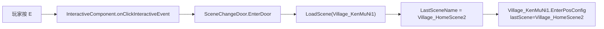

# Village_HomeScene2 — HouseDoor 交互换场至 Village_KenMuNi1 — 架构溯源与施工执行说明

**文档性质**：架构侦探产出（逻辑溯源 + Unity 关卡施工指引；**本阶段不改代码**）  
**依据**：
- `Assets/Doc/00_MASTER_PROMPT.md`【架构侦探】
- 换场通则：`Assets/Doc/执行文档/0518/SceneChangeDoor场景切换_架构溯源与执行说明.md`
- 进村链路（户外入口）：`Assets/Doc/执行文档/0606/Village_HomeScene2_House_NPC2进村换场_施工执行说明.md`
- 技术文档：`Assets/Doc/技术文档/场景相关/场景切换.md`

**目标**：配置 **`Village_HomeScene2`** 中 **`objRoot/HouseDoor`**，使玩家靠近并按 **E** 交互后，黑幕换场至 **`Village_KenMuNi1`**，落在第二户门外。  
**Unity 版本**：2020.3.48f1  

---

## 1. 结论（一句话）

**室内出门应走独立门物体 `HouseDoor`（`Stairs.prefab` + `SceneChangeDoor`），不靠 `MapLeft/LeftDoor`。当前 `HouseDoor` 已挂完整交互链且已登记 `sceneObjs`，但 `NextSceneName` 仍继承预制体默认值 `HomeScene1`；施工只需把 `NextSceneName` 改为 `Village_KenMuNi1`，并确认目标侧 `EnterPosConfig` 已有 `Village_HomeScene2` 回程落点。**

---

## 2. 你要验收的现象

| 步骤 | 期望 |
|------|------|
| `Village_KenMuNi1` → `House_NPC2` 按 E 进门 | 进入 `Village_HomeScene2`，落在 `EnterFrom_Village` 门口内侧 |
| 室内走到 **`HouseDoor`** 触发区 | 出现 **E** 提示 |
| 按 E | 黑幕换场 → **`Village_KenMuNi1`** |
| 出屋后落点 | 近 **`ExitFrom_HomeScene2`**（`House_NPC2` 门外，与进村门同一户） |
| 再次按 E 进门 | 可往返，无卡死 |
| Console | 无 `未配置下一场景名`、无 `HomeScene1` 误加载 |

---

## 3. 架构溯源：HouseDoor 与 MapLeft/LeftDoor 的区别

### 3.1 场景内两套「出门」物体

```
Village_HomeScene2
├── Map
│   └── MapLeft
│       └── LeftDoor          ← Map 标准左门（当前禁用，NextSceneName 已填 Village_KenMuNi1）
└── objRoot（SceneEntityComponentGSM）
    ├── NPC_埃吉尔
    └── HouseDoor             ← ★ 本任务改这里（独立 SceneEntity 门）
```

| 物体 | 初始化路径 | 交互方式 | 本任务定位 |
|------|------------|----------|------------|
| **`HouseDoor`** | `SceneEntityComponentGSM.sceneObjs` → `SceneEntity.OnInit` | `TriggerWhenMoveIn = false` → **靠近按 E** | **主出门**（与户外 `House_NPC2` 对称） |
| `MapLeft/LeftDoor` | `Map.OnInit()` → `leftDoor.OnInit()` | 同上（当前物体 **Inactive**） | **备用方案**，本任务保持禁用，避免双门同目标重复触发 |

**为何选 `HouseDoor` 而非 `LeftDoor`：**

1. 美术/关卡把室内门摆在 `objRoot` 下，与埃吉尔 NPC 同层，位置在屋内门口（约 `x=-9, y=1.3`），而非 `Map` 左缘模板位。  
2. 户外进村入口已是 `House_NPC2`（同 `Stairs.prefab`）；室内对称出口命名为 **`HouseDoor`**，策划语义一致。  
3. `LeftDoor` 虽已填 `Village_KenMuNi1`，但 **GameObject 禁用**；启用会与 `HouseDoor` 功能重叠，首版只维护一条出门链路。

### 3.2 `HouseDoor` 预制体与组件链

`HouseDoor` 为 **`Assets/Prefabs/Stairs.prefab`** 的场景实例（与村里 `House_NPC2` 同源）。

```
HouseDoor（Layer 21）
├── SpriteRenderer          ← 场景实例已移除（仅隐藏贴图，不影响碰撞与逻辑）
├── BoxCollider2D           ← IsTrigger，已按室内门调整 Size/Offset
├── SceneChangeDoor         ← ★ NextSceneName 待改
├── ComponentSystemMono
├── SceneEntity
└── BaseEntityControll      ← entityType=4, canTouchWithPlayer=1
    └── Components/InteractiveComponent
```

| 组件 | 现状（静态阅读 2026-06-08） | 是否阻塞 |
|------|---------------------------|----------|
| `SceneChangeDoor` | **存在且启用**（未在 `m_RemovedComponents` 中移除） | — |
| `NextSceneName` | 继承预制体默认 **`HomeScene1`**，场景 **无覆盖** | **是** |
| `TriggerWhenMoveIn` | `false`（按 E 换场，与户外 `House_NPC2` 一致） | 否 |
| `SceneEntity` → `sceneObjs` | **已登记**（`SceneEntityComponentGSM` 列表含 HouseDoor） | 否 |
| `InteractiveComponent` | 预制体内已挂，`onClickInteractiveEvent` → `EnterDoor` | 否 |

> **勘误**：早期摘要曾写「场景移除了 `SceneChangeDoor`」——静态复查 YAML 后确认，实例仅移除了 **`SpriteRenderer`**（`7435237835032165235`），**`SceneChangeDoor` 仍在**。若 Inspector 看不到门贴图属正常；交互靠 Trigger 与 E 提示。

### 3.3 运行时调用链



| 环节 | 说明 |
|------|------|
| 初始化 | `SceneEntityComponentGSM.OnInit` 遍历 `sceneObjs`，对每个 `SceneEntity` 调 `OnInit` → `SceneChangeDoor.OnInit` 订阅点击 |
| 与 Map 门差异 | **必须**在 `sceneObjs`（或 `objRoot` 子节点自动收集）；`Map` 门由 `Map.OnInit` 单独初始化，不走 `sceneObjs` |
| 落点 | 由 **目标场景** `EnterPosConfig` 按 `LastSceneName` 匹配；门上 `bornPos` **运行时不读** |
| 场景名 | `Village_HomeScene2SceneManager.nowSceneName = SceneName.Village_HomeScene2`（已就位，供回程表匹配） |

---

## 4. 双侧配置一览

### 4.1 出门侧 `Village_HomeScene2`（本任务核心）

| 配置位置 | 当前值 | 目标值 |
|----------|--------|--------|
| **`objRoot/HouseDoor`** → `SceneChangeDoor.NextSceneName` | `HomeScene1`（预制体默认） | **`Village_KenMuNi1`** |
| `TriggerWhenMoveIn` | `false` | **保持**（按 E） |
| `ShowLoadingUI` | `false` | **保持**（黑幕） |
| `SceneEntityComponentGSM.sceneObjs` | 含 HouseDoor | **保持** |
| `SceneManager.EnterPosConfig` | 已有 `Village_KenMuNi1` → `EnterFrom_Village` | **保持**（进村落点） |

**进村落点（已有，供验收对照）：**

| 节点 | 坐标（约） | 用途 |
|------|------------|------|
| `EnterFrom_Village` | `(-24.12, -3.65, 0)` | 从村里 `House_NPC2` 进入室内 |

### 4.2 目标侧 `Village_KenMuNi1`（回程，已基本就位）

| 配置位置 | 当前值 | 本任务 |
|----------|--------|--------|
| `House_NPC2` → `NextSceneName` | `Village_HomeScene2` | **不改**（进村） |
| `SceneManager.EnterPosConfig` | 已有 `lastScene: Village_HomeScene2` → `ExitFrom_HomeScene2` | **保持** |
| `ExitFrom_HomeScene2` 位置 | 约 `(-124.73, 3.85, 0)` | 出屋落点；若与门口美术不齐，微调 Transform |

**完整往返：**

```
Village_KenMuNi1 / House_NPC2  ──E──►  Village_HomeScene2 / EnterFrom_Village
Village_HomeScene2 / HouseDoor   ──E──►  Village_KenMuNi1 / ExitFrom_HomeScene2
```

---

## 5. Unity 施工步骤

### 5.1 `Village_HomeScene2` — 配置 HouseDoor（核心，约 2 分钟）

1. 打开 **`Assets/GameRes/Scenes/Village_HomeScene2.unity`**。  
2. Hierarchy：展开 **`SceneEntityComponentGSM`** 所在根下的 **`objRoot`** → 选中 **`HouseDoor`**。  
3. Inspector 找到 **`Scene Change Door`** 组件（脚本 `SceneChangeDoor`）：

| 字段 | 值 | 说明 |
|------|-----|------|
| **Next Scene Name** | `Village_KenMuNi1` | 必须与 `.unity` 文件名一致 |
| **Trigger When Move In** | ❌ 不勾选 | 保持「按 E」；若勾选则走进即换场，与户外门体验不一致 |
| **Show Loading UI** | ❌ 不勾选 | 使用黑幕 `LoadScene(..., blackFade: true)` |
| **Born Pos** | 可指向 `House_NPC2` 门外空节点 | **仅编辑器备忘**，运行时不读 |

4. 确认 **`Base Entity Controll`**：`Can Touch With Player` ✅。  
5. 选中 **`SceneEntityComponentGSM`**（或挂该组件的 SceneManager 子物体），确认 **`Scene Objs`** 列表含 **`HouseDoor`** 的 `SceneEntity`（当前已有，勿删）。  
6. **不要**启用 `Map/MapLeft/LeftDoor`（避免与 `HouseDoor` 双出口）；若日后改走 Map 左门，应禁用 `HouseDoor` 的 `SceneChangeDoor` 二选一。

### 5.2 `Village_KenMuNi1` — 核对回程落点（通常无需改）

1. 打开 **`Village_KenMuNi1.unity`**。  
2. **`SceneManager`** → **Enter Pos Config** → 确认存在：

| Last Scene | Pos |
|------------|-----|
| `Village_HomeScene2` | `ExitFrom_HomeScene2` |

3. 运行前在 Scene 视图看 `ExitFrom_HomeScene2` 是否在 `House_NPC2` 门外可站立处；偏差大则拖动空节点后保存。

### 5.3 `Village_HomeScene2` — 核对进村落点（通常无需改）

1. **`SceneManager`** → **Enter Pos Config** → 确认：

| Last Scene | Pos |
|------------|-----|
| `Village_KenMuNi1` | `EnterFrom_Village` |

### 5.4 保存

两个场景 **Ctrl+S**。

---

## 6. 验收清单

**从 `InitScene` 启动，勿单独 Play 室内场景。**

| # | 操作 | 通过标准 |
|---|------|----------|
| H1 | 村里 `House_NPC2` 按 E 进门 | 进入 `Village_HomeScene2`，近 `EnterFrom_Village` |
| H2 | 室内走到 `HouseDoor` | 出现 **E** 提示 |
| H3 | 按 E | 黑幕 → `Village_KenMuNi1` |
| H4 | 出屋后 | 落在 `ExitFrom_HomeScene2` 附近，可看见第二户门外景 |
| H5 | 再次进门 → 再出门 | 往返 2 次无卡死、无 `SceneChangeDoor已进入` 重复警告 |
| H6 | Console | 无 `HomeScene1` 误加载；`[VillageHomeScene2Debug] lastScene=Village_KenMuNi1` 在再次进门时出现 |

### 6.1 故障排查

| 现象 | 可能原因 | 处理 |
|------|----------|------|
| 按 E 无反应 | `NextSceneName` 仍为空或 `HomeScene1` | 改 `HouseDoor.NextSceneName = Village_KenMuNi1` |
| 按 E 跳进 `HomeScene1` | 未保存场景或未改 NextSceneName | 见上 |
| 无 E 提示 | `HouseDoor` 未在 `sceneObjs`；或 Collider 未 Trigger | 登记 `SceneEntity`；查 BoxCollider2D |
| 出村落点错 / 默认出生点 | `Village_KenMuNi1` 缺 `EnterPosConfig` 项 | 补 `lastScene: Village_HomeScene2` → `ExitFrom_HomeScene2` |
| 进村落点错 | `Village_HomeScene2` 缺 `Village_KenMuNi1` 项 | 补 → `EnterFrom_Village` |
| 黑屏加载失败 | 场景未进 Build / AB | 查 Resource Editor 与 `Village_KenMuNi1.unity` 登记 |
| 双门重复换场 | `LeftDoor` 与 `HouseDoor` 同时启用 | 只保留 `HouseDoor` 出门 |

---

## 7. 替代方案说明

| 方案 | 做法 | 适用 |
|------|------|------|
| **A（推荐）** | 仅改 `HouseDoor.NextSceneName`，`LeftDoor` 保持禁用 | 与关卡摆放一致，本任务采用 |
| **B** | 启用 `MapLeft/LeftDoor`（已填 `Village_KenMuNi1`），禁用 `HouseDoor` 的 `SceneChangeDoor` | 希望统一走 Map 模板左门时 |
| **C** | 改 `Stairs.prefab` 默认 `NextSceneName` | **不推荐**：会影响 `House_NPC2`、`House4` 等所有实例 |

---

## 8. 改动范围

| 路径 | 改动 |
|------|------|
| `Village_HomeScene2.unity` | **`HouseDoor`** → `NextSceneName = Village_KenMuNi1`（核心） |
| `Village_KenMuNi1.unity` | 通常 **仅核对** `EnterPosConfig` / `ExitFrom_HomeScene2` |
| `Stairs.prefab` | **不改** |
| `MapLeft/LeftDoor` | **保持禁用**（方案 A） |
| C# 脚本 | **本任务不需要** |

---

## 9. 与埃吉尔任务线的关系

| 链路 | 场景/物体 | 关系 |
|------|-----------|------|
| 接任务 | `Village_HomeScene2` / `NPC_埃吉尔` | 与出门独立；进屋后对话 |
| 出门去村外打虫 | `HouseDoor` → `Village_KenMuNi1` → `RightDoor` → `Village_OutSide` | 本任务打通第一段；村外见虫子摆放文档 |
| 进村 | `House_NPC2` → `Village_HomeScene2` | 0606 文档；与本任务构成闭环 |

---

## 10. 相关文档与代码

| 主题 | 路径 |
|------|------|
| SceneChangeDoor 通则 | `Assets/Doc/执行文档/0518/SceneChangeDoor场景切换_架构溯源与执行说明.md` |
| 户外进村 | `Assets/Doc/执行文档/0606/Village_HomeScene2_House_NPC2进村换场_施工执行说明.md` |
| 村里出村外 | `Assets/Doc/执行文档/0608/Village_KenMuNi1_RightDoor换场Village_OutSide_架构溯源与施工执行说明.md` |
| `SceneChangeDoor.cs` | `Assets/Scripts/Game/GameRuntime/Entities/SceneEntities/CommonEntity/SceneChangeDoor.cs` |
| `SceneEntityComponentGSM.cs` | `Assets/Scripts/Game/GameRuntime/GameSceneManager/Component/SceneEntityComponentGSM.cs` |
| 室内场景管理器 | `Assets/Scripts/Game/GameRuntime/GameSceneManager/Scene/Village_House/Village_HomeScene2SceneManager.cs` |
| 户外门预制体 | `Assets/Prefabs/Stairs.prefab` |

---

## 11. 文档修订

| 日期 | 说明 |
|------|------|
| 2026-06-08 | 初版：`HouseDoor` 交互换场至 `Village_KenMuNi1`；澄清仅移除 SpriteRenderer、非 SceneChangeDoor |

**文档路径**：`Assets/Doc/执行文档/0608/Village_HomeScene2_HouseDoor换场Village_KenMuNi1_架构溯源与施工执行说明.md`
