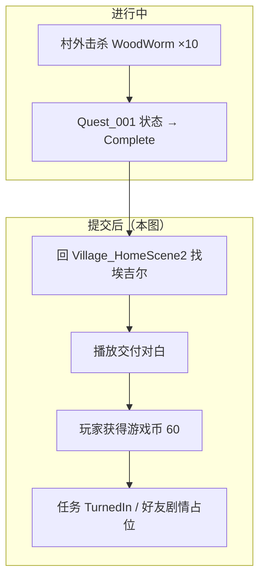

# Village_HomeScene2 — 埃吉尔任务交付对白台本 — 架构溯源与执行说明

**文档性质**：架构侦探产出（策划图文字提取 + 分阶段施工指引；**本阶段不改代码**）  
**依据**：
- `Assets/Doc/00_MASTER_PROMPT.md`【架构侦探】
- 接任务对白：`Assets/Doc/执行文档/0607/Village_HomeScene2_埃吉尔接任务对白台本_架构溯源与执行说明.md`
- 接取追踪：`Assets/Doc/执行文档/0608/Village_Aegir_Quest001_接取追踪_架构溯源与施工执行说明.md`
- 击杀任务阶段 6：`Assets/Doc/执行文档/0606/经典MMO击杀任务_任务配置文件_架构溯源与执行说明.md`
- CSV 导入管线：`Assets/Doc/执行文档/0525/CSV转NodeCanvas对话树_架构溯源与执行说明.md`

**策划图源**：埃吉尔任务 **提交后** 对白（雅 × 埃吉尔 · 屋内交付 + 发游戏币）  
**目标场景**：`Assets/GameRes/Scenes/Village_HomeScene2.unity`  
**Unity 版本**：2020.3.48f1  

---

## 1. 结论（一句话）

**策划图描述的是 `Quest_001` 杀满 10 只虫子后，玩家回 `NPC_埃吉尔` 交付时的对白：雅尔汇报数量 → 埃吉尔口嫌体正直道谢并塞钱 → 系统提示获得 60 游戏币 → 雅尔尴尬收尾。本段应做成独立对话 prefab（与接任务 `Village_Aegir_QuestOffer` 分离），在任务 `Complete` 且未 `TurnedIn` 时由 NPC 触发，对白末挂 `QuestTurnInAction` + `GrantRewards`；当前工程阶段 6 未实现，本文先交付台本与 CSV 草案。**

---

## 2. 玩家全流程（策划意图）



| 玩家看到的现象 | 对应系统（远期） |
|----------------|------------------|
| 杀满 10 只后回屋找埃吉尔 | NPC 根据任务状态切换 `StoryPrefabName` 或条件触发 |
| 雅尔：「今天的数量达成了。」 | 交付对白开场 |
| 埃吉尔态度软化、给钱 | 对白中段 + 表情立绘 |
| 屏幕提示「玩家获得游戏币 60」 | `GrantRewards(Gold, 60)` 或 UI Toast |
| 雅尔：「听到了些不好的事呢……」 | 对白收尾，对话结束 |

---

## 3. 策划图文字提取（对白台本 · 原文）

**场景标题（图内）**：**提交后**

| 序号 | Speaker | 原文 | 立绘备注（图） |
|------|---------|------|----------------|
| 1 | 雅 | 今天的数量达成了。 | 闭眼、平静 |
| 2 | 埃吉尔 | 好吧，我就看在你帮我的份上对你改观吧。 | — |
| 3 | 埃吉尔 | 我也不是小气之人，这些钱你拿着吧，反正我也用不上，那个店老板坏家伙每次去都要揉我，还说我小，我才不去呢。 | — |
| 4 | （系统） | 玩家获得游戏币 60 | 非角色台词，奖励提示 |
| 5 | 雅 | 啊。。。。。 听到了些不好的事呢。。。。。。 | 睁眼、错愕 |

---

## 4. CSV 九列草案（可直接扩写源稿）

**建议 CSV 路径**：`Assets/Dialog/Village_HomeScene2_Aegir_QuestTurnIn.csv`  
**建议 Prefab 名**：`Village_Aegir_QuestTurnIn`（与接任务 `Village_Aegir_QuestOffer` 区分）  
**Speaker 映射**：`雅 → 雅尔`；`埃吉尔 → 埃吉尔`；`— → 旁白`（系统提示行用旁白字幕）

| ID  | Type     | Speaker | Text                                                 | English | Next | Extra | FaceType  | Voice |
| --- | -------- | ------- | ---------------------------------------------------- | ------- | ---- | ----- | --------- | ----- |
| 1   | Dialogue | 雅       | 今天的数量达成了。                                            |         | 2    |       | Smile     |       |
| 2   | Dialogue | 埃吉尔     | 好吧，我就看在你帮我的份上对你改观吧。                                  |         | 3    |       | Unhappy   |       |
| 3   | Dialogue | 埃吉尔     | 我也不是小气之人，这些钱你拿着吧，反正我也用不上，那个店老板坏家伙每次去都要揉我，还说我小，我才不去呢。 |         | 4    |       | Smile     |       |
| 4   | Dialogue | —       | 玩家获得游戏币60                                            |         | 5    |       |           |       |
| 5   | Dialogue | 雅       | 啊。。。。。 听到了些不好的事呢。。。。。。                               |         |      |       | Surprised |       |

> **FaceType 规则**：对白行填 `DialogueFaceType` 枚举；旁白/系统行留空；雅尔**勿用 `Normal`**。  
> **标点**：原文省略号数量按策划图保留（全角 `。` 与半角 `.` 混用处已按图录入，导入后可统一润色）。  
> **奖励行（ID 4）**：CSV 仅作字幕展示；**实际加币须 Graph 末挂发奖 Action**（见 §5），避免只播字幕不加钱。

### 4.1 CSV 纯文本块（便于复制到 `.csv`）

```csv
ID,Type,Speaker,Text,English,Next,Extra,FaceType,Voice
1,Dialogue,雅,今天的数量达成了。,,2,,Smile,
2,Dialogue,埃吉尔,好吧，我就看在你帮我的份上对你改观吧。,,3,,Unhappy,
3,Dialogue,埃吉尔,我也不是小气之人，这些钱你拿着吧，反正我也用不上，那个店老板坏家伙每次去都要揉我，还说我小，我才不去呢。,,4,,Smile,
4,Dialogue,—,玩家获得游戏币60,,5,,,
5,Dialogue,雅,啊。。。。。 听到了些不好的事呢。。。。。。,,,,Surprised,
```

---

## 5. 与任务系统的关系（阶段 6 施工要点）

### 5.1 触发条件（建议）

| 条件 | 说明 |
|------|------|
| `Quest_001` 状态 | `Complete`（进度 10/10）且未 `TurnedIn` |
| 交互对象 | `Village_HomeScene2` / `NPC_埃吉尔` |
| 与接任务 prefab 关系 | **互斥**：已接未完成播进度提示（可选）；已接且可交付播 **本交付 prefab**；未接播 `Village_Aegir_QuestOffer` |

**替代方案**：

| 方案 | 做法 | 取舍 |
|------|------|------|
| **A（推荐）** | 同一 NPC 按任务状态切换 `StoryPrefabName` 或 `SimpleStoryTrigger` 条件分支 | 一个埃吉尔，状态驱动，维护清晰 |
| **B** | 杀满 10 只自动 `GrantRewards`，回 NPC 只播好友对白 | 无需「提交」状态，但与本图「提交后」语义不符 |
| **C** | 交付对白内手动写死 `+60 Gold`，不读 `QuestConfig` | 快但不利于策划改表 |

### 5.2 奖励金额：策划图 vs 配置表

| 来源 | 金额 |
|------|------|
| **本策划图** | **60** 游戏币 |
| `QuestConfig.json` → `Quest_001.rewards` | 当前为 **50** Gold |

**须策划裁定**以哪边为准；施工时 `QuestConfig` 与对白字幕、发奖 Action **三处一致**。建议以策划图 **60** 为准，同步改 JSON：

```json
"rewards": [
  { "type": "Gold", "amount": "60" }
]
```

### 5.3 Graph 节点建议（程序待建）

```
Statement #1～#3（对白）
  → Statement #4（系统字幕，可选）
  → ActionNode：QuestTurnInAction(questId=Quest_001)  // 标记已交付、防重复
  → ActionNode：GrantRewards（读 QuestConfig 或写死 60 Gold）
  → Statement #5（雅尔收尾）
  → 收尾 FightingPanelVisible 等（与 QuestOffer 一致）
```

| 节点 | 职责 |
|------|------|
| `QuestTurnInAction` | `TurnedIn` + 存档；重复交付拦截 |
| `GrantRewards` | 发放 Gold；与 ID 4 字幕同步 |
| 完成后 | 埃吉尔「做朋友」剧情可另开 prefab 或旗标（本图未写后续） |

---

## 6. 工程现状与缺口

| 项目 | 状态 | 与本台本关系 |
|------|------|--------------|
| `Village_Aegir_QuestOffer` | ✅ 已交付 | 接任务；**不含**本交付对白 |
| `Village_Aegir_QuestTurnIn` prefab | ❌ 不存在 | 须新建 CSV + Import |
| `QuestTurnInAction` / `GrantRewards` | ❌ 未实现 | 阶段 6 |
| NPC 按任务状态切对话 | ❌ 未实现 | 须在埃吉尔触发器或 GSM 补条件 |
| `Quest_001` 杀满检测 | 见死亡事件文档 | 前置：进度 10/10 |

---

## 7. 分阶段施工清单

| 批次 | 内容 | 依赖 |
|------|------|------|
| **T1（本文）** | 台本提取 + CSV 草案 + 奖励金额待决 | 无 |
| **T2** | 新建 `Village_HomeScene2_Aegir_QuestTurnIn.csv` → Import → prefab | T1 + Speaker 映射 |
| **T3** | `QuestTurnInAction` + `GrantRewards` + `QuestConfig` 金额对齐 | 击杀任务阶段 6 |
| **T4** | `NPC_埃吉尔` 可交付时切 `StoryPrefabName` 或条件触发 | T2、T3 |
| **T5** | Play 验收：杀满 → 回屋 → 对白 → +60 币 → 不可重复交付 | 全链路 |

---

## 8. 验收清单（T5）

| # | 操作 | 通过标准 |
|---|------|----------|
| Q1 | 未接任务时找埃吉尔 | 仍播 `Village_Aegir_QuestOffer`，**不**播交付本 |
| Q2 | 已接 0/10 | 不播交付本（或可选短句「还没清完」） |
| Q3 | 10/10 回屋按 E | 按序播放 §3 五句；ID 4 字幕出现 |
| Q4 | 对白结束 | 游戏币 **+60**（或裁定后金额）；`Quest_001` → `TurnedIn` |
| Q5 | 再次按 E | **不**重复发奖；可播日常/好友占位对白 |
| Q6 | 读档 | 已交付状态保持 |

---

## 9. 待决问题

| ID | 问题 | 影响 |
|----|------|------|
| Q1 | 奖励 **60** vs 配置 **50** | JSON、字幕、发奖 Action |
| Q2 | 杀满后是否必须先回屋交付才发奖 | 状态机 `Complete` vs `TurnedIn` |
| Q3 | 「店老板」是否预埋后续商店/NPC 任务 | 本台本仅台词，可不实现 |
| Q4 | `repeatable: true` 日更后是否复用本交付 prefab | 每日重置与重复交付 UI |

---

## 10. 相关文档

| 主题 | 路径 |
|------|------|
| 接任务对白 | `Assets/Doc/执行文档/0607/Village_HomeScene2_埃吉尔接任务对白台本_架构溯源与执行说明.md` |
| Quest_001 接取 | `Assets/Doc/执行文档/0608/Village_Aegir_Quest001_接取追踪_架构溯源与施工执行说明.md` |
| 杀怪计数 | `Assets/Doc/执行文档/0608/Quest_怪物死亡事件与任务监听_架构溯源与施工执行说明.md` |
| 击杀任务六阶段 | `Assets/Doc/执行文档/0606/经典MMO击杀任务_任务配置文件_架构溯源与执行说明.md` |
| 接任务 CSV 样板 | `Assets/Dialog/Village_HomeScene2_Aegir_QuestOffer.csv` |

---

## 11. 文档修订

| 日期 | 说明 |
|------|------|
| 2026-06-08 | 初版：自策划图提取「提交后」交付对白 + CSV 草案 + 阶段 6 衔接说明 |

**文档路径**：`Assets/Doc/执行文档/0608/Village_HomeScene2_埃吉尔任务交付对白台本_架构溯源与执行说明.md`
