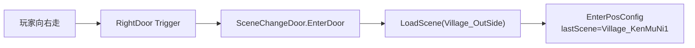

# Village_KenMuNi1 — MapRight/RightDoor 换场至 Village_OutSide — 架构溯源与施工执行说明

**文档性质**：架构侦探产出（逻辑溯源 + Unity 关卡施工指引；**本阶段不改代码**）  
**依据**：
- `Assets/Doc/00_MASTER_PROMPT.md`【架构侦探】
- `Assets/Doc/02_SYSTEM_SPEC.md` §1（村庄 2.5D）
- 换场通则：`Assets/Doc/执行文档/0518/SceneChangeDoor场景切换_架构溯源与执行说明.md`
- 技术文档：`Assets/Doc/技术文档/场景相关/场景切换.md`
- 村外内容：`Assets/Doc/执行文档/0608/Village_OutSide_虫子虫巢摆放_架构溯源与施工执行说明.md`

**目标**：配置 **`Village_KenMuNi1`** 的 **`Map/MapRight/RightDoor`**，使玩家向右走到地图右缘时 **自动换场** 至 **`Village_OutSide`**。  
**Unity 版本**：2020.3.48f1  

---

## 1. 结论（一句话）

**村里出村外靠 `RightDoor`（`SceneChangeDoor` + `TriggerWhenMoveIn`），不靠 `RightWall`。当前右门禁用且指向 `ForestEastScene`；施工只需启用 `RightDoor`、设 `NextSceneName = Village_OutSide`，并在 `Village_OutSide` 补 `EnterPosConfig` 与 `LeftDoor` 回程。**

---

## 2. 你要验收的现象

| 步骤 | 期望 |
|------|------|
| InitScene → 进入 `Village_KenMuNi1` | 村庄正常可走 |
| 向右走到 `MapRight` 右缘，进入 **`RightDoor`** 触发区 | 黑幕换场 → **`Village_OutSide`** |
| 进村外后落点 | 村外 **`LeftBorn`** 附近 |
| 村外 **`MapLeft/LeftDoor`** 向左走 | 回到 **`Village_KenMuNi1`**，落在 **`RightBorn`** |
| Console | 无未配置场景名、无加载失败 |

---

## 3. 架构溯源：RightDoor 换场链路

### 3.1 `MapRight` 下两个物体（只改 Door）

```
Map
└── MapRight
    ├── RightWall     ← 挡墙（本任务不改）
    └── RightDoor     ← ★ 换场入口（本任务改这里）
```

| 物体 | 职责 | 本任务 |
|------|------|--------|
| `RightWall` | 实心碰撞，挡住玩家继续往右 | **不改** |
| **`RightDoor`** | `SceneChangeDoor`，走进 Trigger 即 `LoadScene` | **启用 + 改目标场景** |

同级的 `RightWall` 负责挡路；玩家贴右缘时身体会进入 **`RightDoor` 的 Trigger 框**，从而换场——与 `ForestScene`、`VerdantCorridor` 等地图右门规范一致。

### 3.2 `RightDoor` 现状（`Village_KenMuNi1`）

| 检查项 | 当前值 | 目标值 |
|--------|--------|--------|
| 物体 Active | ❌ **禁用** | ✅ 启用 |
| `NextSceneName` | `ForestEastScene` | **`Village_OutSide`** |
| `TriggerWhenMoveIn` | `true` | **保持 true** |
| `ShowLoadingUI` | `true` | 建议 **`false`**（黑幕换场，与多数户外门一致） |

### 3.3 运行时调用链



| 环节 | 说明 |
|------|------|
| 初始化 | `Map.OnInit()` → `rightDoor.OnInit()`；**无需**登记 `sceneObjs` |
| 触发方式 | `TriggerWhenMoveIn`：走进即换，**不用按 E** |
| 落点 | 由 **目标场景** `EnterPosConfig` 决定；门上 `bornPos` **运行时不读** |

---

## 4. 双侧配置一览（必做）

| 场景 | 配置位置 | 改什么 |
|------|----------|--------|
| **Village_KenMuNi1** | `Map/MapRight/**RightDoor**` | 启用；`NextSceneName = Village_OutSide` |
| **Village_KenMuNi1** | `SceneManager` → `EnterPosConfig` | **+** `lastScene: Village_OutSide` → `pos: RightBorn` |
| **Village_OutSide** | `SceneManager` → `EnterPosConfig` | **+** `lastScene: Village_KenMuNi1` → `pos: LeftBorn` |
| **Village_OutSide** | `Map/MapLeft/**LeftDoor**` | `NextSceneName = Village_KenMuNi1` |

**落点节点（场景内已有）：**

| 场景 | Transform | 何时用 |
|------|-----------|--------|
| `Village_OutSide` | `Map/LeftBorn` | 从村里经 **RightDoor** 进入村外 |
| `Village_KenMuNi1` | `Map/RightBorn` | 从村外经 **LeftDoor** 回村 |

---

## 5. Unity 施工步骤

### 5.1 `Village_KenMuNi1` — 配置 RightDoor（核心）

1. 打开 **`Assets/GameRes/Scenes/Village_KenMuNi1.unity`**。  
2. Hierarchy：`Map` → **`MapRight`** → 选中 **`RightDoor`**。  
3. Inspector：**勾选 Active**（当前为禁用）。  
4. **`Scene Change Door`** 组件：

| 字段 | 值 |
|------|-----|
| **Next Scene Name** | `Village_OutSide` |
| **Trigger When Move In** | ✅ |
| **Show Loading UI** | 建议 ❌ |

5. **不要**修改 `RightWall`。  
6. （可选）确认 `Map/RightBorn` 位置适合从村外回村时的落点。

### 5.2 `Village_KenMuNi1` — EnterPosConfig（回程）

1. 选中 **`SceneManager`**。  
2. **Enter Pos Config** → **Add**：

| 字段 | 值 |
|------|-----|
| **Last Scene** | `Village_OutSide` |
| **Pos** | `Map/RightBorn` |
| **Date Pass** | `0,0,0` |

### 5.3 `Village_OutSide` — LeftDoor 回程 + 进村落点

1. 打开 **`Village_OutSide.unity`**。  
2. **`SceneManager`** → **Enter Pos Config** → **Add**：

| 字段 | 值 |
|------|-----|
| **Last Scene** | `Village_KenMuNi1` |
| **Pos** | `Map/LeftBorn` |
| **Date Pass** | `0,0,0` |

3. `Map` → **`MapLeft`** → **`LeftDoor`** → **Next Scene Name** = `Village_KenMuNi1`。

### 5.4 （推荐）SceneName 常量

`Assets/Scripts/Game/Static/Name/Res/SceneName.cs` 增加：

```csharp
/// <summary>肯姆尼村外（Assets/GameRes/Scenes/Village_OutSide.unity）</summary>
public const string Village_OutSide = "Village_OutSide";
```

### 5.5 保存

两个场景 **Ctrl+S**。

---

## 6. 验收清单

**从 `InitScene` 启动。**

| # | 操作 | 通过标准 |
|---|------|----------|
| D1 | 进村，向右走到右缘 | **`RightDoor`** 触发 → `Village_OutSide` |
| D2 | 进村外 | 落点近 `LeftBorn` |
| D3 | 村外向左走到头 | **`LeftDoor`** → 回 `Village_KenMuNi1` |
| D4 | 回村 | 落点近 `RightBorn` |
| D5 | 重复往返 | 无卡死、无重复 `SceneChangeDoor已进入` 警告 |

### 6.1 故障排查

| 现象 | 处理 |
|------|------|
| 贴右缘无换场 | 检查 **`RightDoor` Active** 与 `NextSceneName` |
| 进村外落点错 | `Village_OutSide.EnterPosConfig` 补 `Village_KenMuNi1` → `LeftBorn` |
| 回村落点错 | `Village_KenMuNi1.EnterPosConfig` 补 `Village_OutSide` → `RightBorn` |
| 回村进森林 | `Village_OutSide.LeftDoor` 仍指 `ForestEastScene` → 改为 `Village_KenMuNi1` |

---

## 7. 改动范围

| 路径 | 改动 |
|------|------|
| `Village_KenMuNi1.unity` | **`RightDoor`** 启用 + 目标场景；`EnterPosConfig` +1 |
| `Village_OutSide.unity` | `EnterPosConfig` +1；**`LeftDoor`** 目标场景 |
| `RightWall` | **不改** |
| `SceneName.cs` | 推荐 +`Village_OutSide` |

---

## 8. 与埃吉尔任务线

村里 **`RightDoor` 出村** → 村外杀 `WoodWorm`（见虫子摆放文档）；埃吉尔接任务在 **`House_NPC2` 室内**，与本次换场独立。

---

## 9. 相关文档

| 主题 | 路径 |
|------|------|
| SceneChangeDoor 通则 | `Assets/Doc/执行文档/0518/SceneChangeDoor场景切换_架构溯源与执行说明.md` |
| 村外虫子 | `Assets/Doc/执行文档/0608/Village_OutSide_虫子虫巢摆放_架构溯源与施工执行说明.md` |
| `SceneChangeDoor.cs` | `Assets/Scripts/Game/GameRuntime/Entities/SceneEntities/CommonEntity/SceneChangeDoor.cs` |
| `Map.cs` | `Assets/Scripts/Game/GameRuntime/Entities/Component/Map/Map.cs` |

---

## 10. 文档修订

| 日期 | 说明 |
|------|------|
| 2026-06-08 | 初版：MapRight 右边界换场（含 RightWall 说明） |
| 2026-06-08 | **修订**：明确换场对象为 **`RightDoor`**；精简 Wall 叙述；文件名改为 RightDoor |

**文档路径**：`Assets/Doc/执行文档/0608/Village_KenMuNi1_RightDoor换场Village_OutSide_架构溯源与施工执行说明.md`
