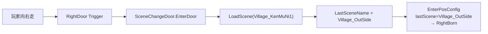

# Village_OutSide — MapRight/RightDoor 换场至 Village_KenMuNi1 — 架构溯源与施工执行说明

**文档性质**：架构侦探产出（逻辑溯源 + Unity 关卡施工指引；**本阶段不改代码**）  
**依据**：
- `Assets/Doc/00_MASTER_PROMPT.md`【架构侦探】
- 换场通则：`Assets/Doc/执行文档/0518/SceneChangeDoor场景切换_架构溯源与执行说明.md`
- 村里出村外（反向链路）：`Assets/Doc/执行文档/0608/Village_KenMuNi1_RightDoor换场Village_OutSide_架构溯源与施工执行说明.md`
- 村外打虫：`Assets/Doc/执行文档/0608/Village_OutSide_虫子虫巢摆放_架构溯源与施工执行说明.md`
- 技术文档：`Assets/Doc/技术文档/场景相关/场景切换.md`

**目标**：配置 **`Village_OutSide`** 的 **`Map/MapRight/RightDoor`**，使玩家向右走到村外右缘时 **自动换场** 回 **`Village_KenMuNi1`**。  
**Unity 版本**：2020.3.48f1  

---

## 1. 结论（一句话）

**村外回村右缘靠 `RightDoor`（`SceneChangeDoor` + `TriggerWhenMoveIn`），不靠 `RightWall`。当前 `RightDoor` 物体已启用，但 `SceneChangeDoor` 组件被禁用且 `NextSceneName` 为空；施工只需启用组件并填 `Village_KenMuNi1`。目标侧 `EnterPosConfig`（`Village_OutSide` → `RightBorn`）与村外进村落点（`Village_KenMuNi1` → `LeftBorn`）均已存在，通常无需改。**

---

## 2. 你要验收的现象

| 步骤 | 期望 |
|------|------|
| `Village_KenMuNi1` 向右出村（`RightDoor`） | 进入 `Village_OutSide`，落在 **`LeftBorn`** 附近 |
| 村外向右走到 **`RightDoor`** 触发区 | 黑幕换场 → **`Village_KenMuNi1`** |
| 回村后落点 | 近 **`RightBorn`**（村地图右缘，`x≈206.6`） |
| 村外 **`LeftDoor`** 向左走 | 同样可回村（已有配置，落在 `RightBorn`） |
| Console | 无 `未配置下一场景名`、无加载失败 |

---

## 3. 架构溯源：村外右缘回村链路

### 3.1 地图拓扑（与打虫任务闭环）

```
Village_KenMuNi1                          Village_OutSide
┌─────────────────┐                      ┌──────────────────────────────┐
│                 │  RightDoor ────────► │ LeftBorn          ...  RightBorn │
│    RightBorn ◄──┼──── RightDoor ◄──────┤         （打虫区域）              │
│                 │  LeftDoor  ◄─────────┤ LeftDoor                       │
└─────────────────┘                      └──────────────────────────────┘
```

| 方向 | 门 | 触发 | 落点 |
|------|-----|------|------|
| 村里 → 村外 | `KenMuNi1/MapRight/RightDoor` | 走进即换 | `OutSide/LeftBorn` |
| 村外右缘 → 村里 | **`OutSide/MapRight/RightDoor`**（本任务） | 走进即换 | `KenMuNi1/RightBorn` |
| 村外左缘 → 村里 | `OutSide/MapLeft/LeftDoor`（已有） | 走进即换 | `KenMuNi1/RightBorn` |

**设计意图**：玩家从村里右门进村外打虫，打完或探索完毕后**向右走到头**即可回到村里右缘（`RightBorn`），不必原路折返左缘。与埃吉尔 `Quest_001`（村外杀 `WoodWorm`×10）形成「出村 → 打虫 → 右缘回村」闭环。

### 3.2 `MapRight` 下两个物体（只改 Door）

```
Map
└── MapRight
    ├── RightWall     ← 挡墙（本任务不改）
    └── RightDoor     ← ★ 换场入口（本任务改这里）
```

| 物体 | 职责 | 本任务 |
|------|------|--------|
| `RightWall` | 实心碰撞，挡住玩家继续往右 | **不改** |
| **`RightDoor`** | `SceneChangeDoor`，走进 Trigger 即 `LoadScene` | **启用组件 + 填目标场景** |

### 3.3 `RightDoor` 现状（`Village_OutSide`，静态阅读 2026-06-08）

| 检查项 | 当前值 | 目标值 |
|--------|--------|--------|
| 物体 Active | ✅ 已启用 | 保持 |
| **`SceneChangeDoor` 组件 Enabled** | ❌ **禁用** | ✅ **启用** |
| `NextSceneName` | ❌ **空** | **`Village_KenMuNi1`** |
| `TriggerWhenMoveIn` | `true` | **保持 true** |
| `ShowLoadingUI` | `false` | **保持**（黑幕换场） |

> **重要**：`SceneChangeDoor.OnInit` 首行判断 `if (enabled)`——组件禁用时不订阅交互事件，**即使 GameObject 是 Active 也无法换场**。这是当前「贴右缘无反应」的主因之一。

### 3.4 运行时调用链



| 环节 | 说明 |
|------|------|
| 初始化 | `Map.OnInit()` → `rightDoor.OnInit()`；**无需**登记 `sceneObjs` |
| 触发方式 | `TriggerWhenMoveIn`：走进即换，**不用按 E** |
| 落点 | 由 **目标场景** `EnterPosConfig` 按 `LastSceneName` 匹配；门上 `bornPos` **运行时不读** |

---

## 4. 双侧配置一览

### 4.1 出门侧 `Village_OutSide`（本任务核心）

| 配置位置 | 当前值 | 目标值 |
|----------|--------|--------|
| **`Map/MapRight/RightDoor`** → 组件 Enabled | ❌ 禁用 | ✅ 启用 |
| **`NextSceneName`** | 空 | **`Village_KenMuNi1`** |
| `Map/MapLeft/LeftDoor` | 已填 `Village_KenMuNi1`，组件启用 | **保持**（左缘回程） |
| `SceneManager.EnterPosConfig` | 已有 `Village_KenMuNi1` → `LeftBorn` | **保持**（从村里进村外落点） |

**进村外落点（已有，供验收对照）：**

| 节点 | 坐标（约） | 用途 |
|------|------------|------|
| `LeftBorn` | `(-4.11, -6.61, 0)` | 从村里 `RightDoor` 进入村外 |

### 4.2 目标侧 `Village_KenMuNi1`（通常无需改）

| 配置位置 | 当前值 | 本任务 |
|----------|--------|--------|
| `Map/MapRight/RightDoor` | `NextSceneName: Village_OutSide`，已启用 | **保持**（村里出村外） |
| `SceneManager.EnterPosConfig` | 已有 `lastScene: Village_OutSide` → `RightBorn` | **保持**（村外回村落点） |
| `RightBorn` 位置 | 约 `(206.63, -6.61, 0)` | 与村外 `RightBorn`（`x≈213.5`）X 轴对齐，右缘衔接合理 |

**完整往返（本任务补齐右缘回程）：**

```
Village_KenMuNi1 / RightDoor  ──走──►  Village_OutSide / LeftBorn
Village_OutSide / RightDoor   ──走──►  Village_KenMuNi1 / RightBorn
```

---

## 5. Unity 施工步骤

### 5.1 `Village_OutSide` — 配置 RightDoor（核心，约 2 分钟）

1. 打开 **`Assets/GameRes/Scenes/Village_OutSide.unity`**。  
2. Hierarchy：`Map` → **`MapRight`** → 选中 **`RightDoor`**。  
3. Inspector：

| 操作 | 说明 |
|------|------|
| 确认 GameObject **Active** ✅ | 当前已启用 |
| **`Scene Change Door` 组件左上角勾选 Enabled** | 当前为 ❌，**必须打开** |
| **Next Scene Name** | 填 **`Village_KenMuNi1`** |
| **Trigger When Move In** | ✅ 保持勾选 |
| **Show Loading UI** | ❌ 保持不勾选 |

4. **不要**修改 `RightWall`（挡墙须保留，玩家贴右缘时身体进入 `RightDoor` Trigger 才换场）。

### 5.2 `Village_KenMuNi1` — 核对回程落点（通常无需改）

1. 打开 **`Village_KenMuNi1.unity`**。  
2. **`SceneManager`** → **Enter Pos Config** → 确认存在：

| Last Scene | Pos |
|------------|-----|
| `Village_OutSide` | `Map/RightBorn` |

3. 若落点与门口美术不齐，拖动 `RightBorn` 空节点后保存。

### 5.3 `Village_OutSide` — 核对进村落点（通常无需改）

1. **`SceneManager`** → **Enter Pos Config** → 确认：

| Last Scene | Pos |
|------------|-----|
| `Village_KenMuNi1` | `Map/LeftBorn` |

### 5.4 保存

两个场景 **Ctrl+S**。

---

## 6. 验收清单

**从 `InitScene` 启动。**

| # | 操作 | 通过标准 |
|---|------|----------|
| R1 | 村里向右走到 `RightDoor` | 进入 `Village_OutSide`，近 `LeftBorn` |
| R2 | 村外向右走到右缘 | **`RightDoor`** 触发 → `Village_KenMuNi1` |
| R3 | 回村后 | 落在 `RightBorn` 附近（村右缘） |
| R4 | 再次出村 → 再走右缘回村 | 往返 2 次无卡死 |
| R5 | 村外向左走到 `LeftDoor` | 同样回村 `RightBorn`（已有链路不退化） |
| R6 | Console | 无空场景名 Error；无 `SceneChangeDoor已进入` 重复警告 |

### 6.1 故障排查

| 现象 | 可能原因 | 处理 |
|------|----------|------|
| 贴右缘无换场 | `SceneChangeDoor` 组件仍 **Disabled** | 勾选组件 Enabled |
| 贴右缘无换场 | `NextSceneName` 仍为空 | 填 `Village_KenMuNi1` |
| 换场后落点错 / 默认出生点 | `KenMuNi1` 缺 `EnterPosConfig` | 补 `lastScene: Village_OutSide` → `RightBorn` |
| 被墙挡住、进不了 Trigger | `RightWall` 与 `RightDoor` 层级或碰撞异常 | 对照 `ForestScene` 等样板；勿删 `RightWall` |
| 回村后进森林 | `KenMuNi1.LeftDoor` 仍指 `ForestEastScene` | 改为 `Village_OutSide` 或保持禁用（见村里 RightDoor 文档） |

---

## 7. 替代方案与架构限制

### 7.1 落点共用说明

`EnterPosConfig` 按 **`LastSceneName`（来源场景名）** 匹配，**同一来源场景只能对应一个落点**。

因此：

- `OutSide/LeftDoor` → `KenMuNi1` 与 **`OutSide/RightDoor` → `KenMuNi1`** 的 `LastSceneName` 均为 `Village_OutSide`，**都会落在 `RightBorn`**。
- 若未来需要「左缘回村落 `LeftBorn`、右缘回村落 `RightBorn`」，当前架构**不支持**仅靠配置区分，须扩展代码（例如按门 ID 分支）或使用不同虚拟场景名——**本任务不采用**。

| 方案 | 做法 | 适用 |
|------|------|------|
| **A（推荐）** | 启用 `RightDoor`，左右缘回村均落 `RightBorn` | 打虫闭环、最小改动 |
| **B** | 仅保留 `LeftDoor` 回村，不启用 `RightDoor` | 只要左缘单程回程时 |
| **C** | 改 `Stairs` 类预制体默认值 | **不适用**（Map 门非预制体实例） |

### 7.2 与 `ForestEastScene` 残留

`Village_OutSide.EnterPosConfig` 仍有一条 `lastScene: ForestEastScene` → `LeftBorn`（模板残留）。若项目已无「从森林东进村外」需求，可后续清理；**本任务不强制删除**，不影响 `RightDoor` 回村。

---

## 8. 改动范围

| 路径 | 改动 |
|------|------|
| `Village_OutSide.unity` | **`RightDoor`**：启用 `SceneChangeDoor` + `NextSceneName = Village_KenMuNi1` |
| `Village_KenMuNi1.unity` | 通常 **仅核对** `EnterPosConfig` / `RightBorn` |
| `RightWall` | **不改** |
| C# 脚本 | **本任务不需要** |

---

## 9. 与埃吉尔任务线的关系

| 链路 | 说明 |
|------|------|
| 接任务 | `Village_HomeScene2` / 埃吉尔对话 → `Quest_001` |
| 出村打虫 | `HomeScene2/HouseDoor` → `KenMuNi1` → **`RightDoor`** → `OutSide/LeftBorn` |
| 打完回村 | 村外 **`RightDoor`**（本任务）→ `KenMuNi1/RightBorn` → 可再进屋交任务 |
| 杀怪计数 | 见 `Quest_怪物死亡事件与任务监听_架构溯源与施工执行说明.md` |

---

## 10. 相关文档与代码

| 主题 | 路径 |
|------|------|
| SceneChangeDoor 通则 | `Assets/Doc/执行文档/0518/SceneChangeDoor场景切换_架构溯源与执行说明.md` |
| 村里出村外 | `Assets/Doc/执行文档/0608/Village_KenMuNi1_RightDoor换场Village_OutSide_架构溯源与施工执行说明.md` |
| 村外虫子摆放 | `Assets/Doc/执行文档/0608/Village_OutSide_虫子虫巢摆放_架构溯源与施工执行说明.md` |
| 室内出门 | `Assets/Doc/执行文档/0608/Village_HomeScene2_HouseDoor换场Village_KenMuNi1_架构溯源与施工执行说明.md` |
| `SceneChangeDoor.cs` | `Assets/Scripts/Game/GameRuntime/Entities/SceneEntities/CommonEntity/SceneChangeDoor.cs` |
| `SceneName.Village_OutSide` | `Assets/Scripts/Game/Static/Name/Res/SceneName.cs` |

---

## 11. 文档修订

| 日期 | 说明 |
|------|------|
| 2026-06-08 | 初版：村外 `RightDoor` 换场至 `Village_KenMuNi1`；强调组件 Disabled 为主阻塞 |

**文档路径**：`Assets/Doc/执行文档/0608/Village_OutSide_RightDoor换场Village_KenMuNi1_架构溯源与施工执行说明.md`
