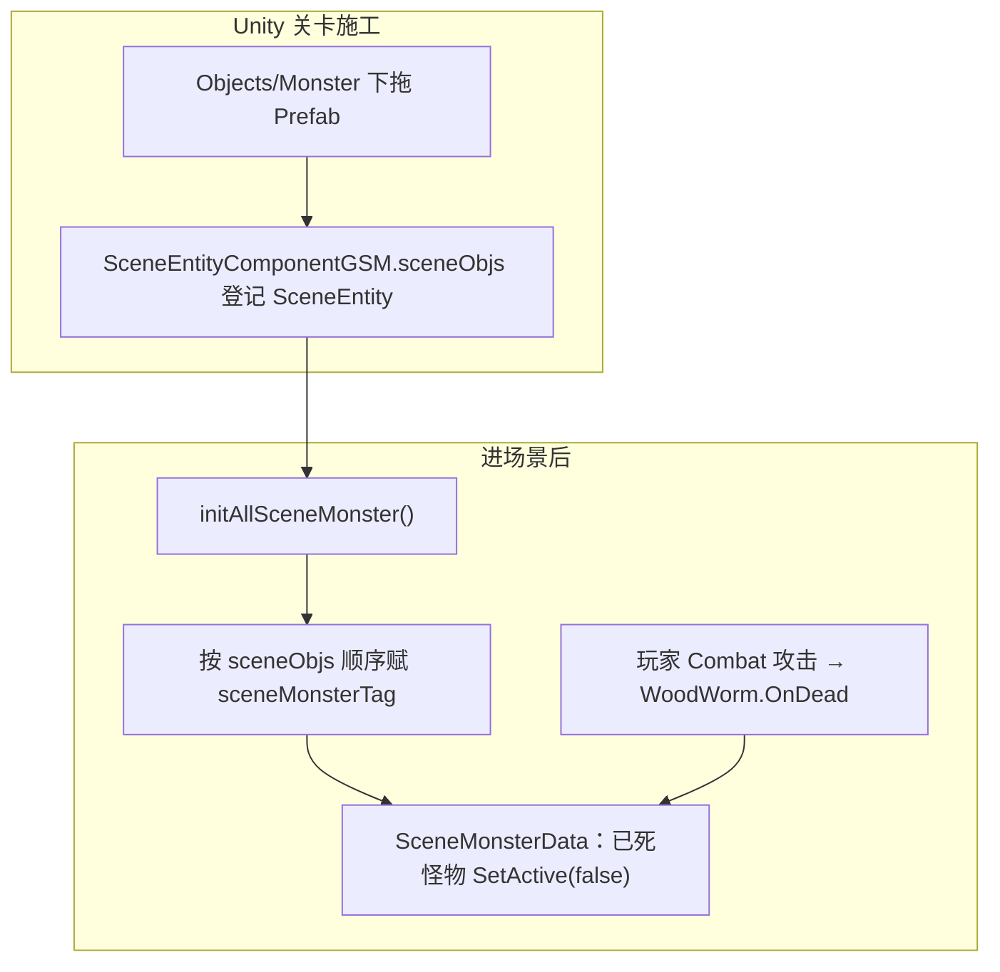

# Village_OutSide — 虫子与虫巢摆放 — 架构溯源与施工执行说明

**文档性质**：架构侦探产出（逻辑溯源 + Unity 关卡施工指引；**本阶段不改代码**）  
**依据**：
- `Assets/Doc/00_MASTER_PROMPT.md`【架构侦探】
- `Assets/Doc/02_SYSTEM_SPEC.md` §1（村庄 2.5D，Y 轴纵深）
- 埃吉尔任务：`Assets/Doc/执行文档/0608/Village_Aegir_Quest001_接取追踪_架构溯源与施工执行说明.md`（`Quest_001` → `targetMonster: WoodWorm`）
- 场景搭建通则：`Assets/Doc/技术文档/场景相关/搭建新场景手册.md`
- 参考样板场景：`VerdantCorridor.unity`、`ForestEastScene.unity`（已有 `WoodWorm` / `WoodWormRoot` 实例）

**目标场景**：`Assets/GameRes/Scenes/Village_OutSide.unity`  
**Unity 版本**：2020.3.48f1  

---

## 1. 结论（一句话）

**村外摆虫子 = 在 `Objects/Monster` 下拖入怪物 Prefab 并登记 `sceneObjs`；任务可计数的「虫子」用静态 `WoodWorm.prefab`（至少 10 只可击杀），「虫巢」用 `WoodWormRoot.prefab` 作场景装饰；当前场景里已有 3 只史莱姆占位，应替换或增补为蠕虫；虫巢默认不会刷虫（须剧情事件开 `canCreateWoodWorm`），首版靠静态虫子即可验收埃吉尔「杀 10 只」任务。**

---

## 2. 你要验收的现象

| 步骤 | 期望 |
|------|------|
| 进入 `Village_OutSide` | 村外地面可见 **蠕虫（WoodWorm）** 与 **虫巢（WoodWormRoot）** |
| 走近虫子 | 可进入战斗（玩家为 Combat 控制器，战斗 HUD 可用） |
| 击杀一只蠕虫 | 怪物播放死亡动画并隐藏；**成就**「击杀幼虫」进度 +1（现有逻辑） |
| 接取 `Quest_001` 后击杀 | 任务进度 +1（须任务阶段 4 程序就绪后验收） |
| 读档再进场景 | 已杀死的**静态虫子**仍保持死亡（`SceneMonsterData` 存档） |
| 虫巢 | 摆好后**可见、可被打**；**首版不要求**从巢穴持续刷出新虫 |

---

## 3. 怪物与任务的关系（生活类比）

埃吉尔说的是「村外虫子咬百合花」。游戏里：

- **玩家能砍的「虫子」** = Prefab **`WoodWorm`**（配置名 `MonsterConfig.name = WoodWorm`）。
- **「虫巢」** = Prefab **`WoodWormRoot`**（配置名 `WoodWormRoot`）——像「虫子的家」，摆着很有气氛，但**不等于**任务计数对象。
- **任务 `Quest_001`** 只认 **`WoodWorm`** 死亡；杀虫巢、虫卵 **不计入** 任务（除非日后改配置）。

---

## 4. 架构溯源：场景里的怪物怎么「活起来」

| 环节 | 类 / 资源 | 说明 |
|------|-----------|------|
| 摆放 | `Objects/Monster` 空物体下挂实例 | 与 `VerdantCorridor`、`ForestEastScene` 相同层级习惯 |
| 实体注册 | `SceneEntityComponentGSM` → `sceneObjs` | 怪物 Prefab 自带 `SceneEntity`；**必须**列入列表，否则 `initAllSceneMonster` 扫不到 |
| 死亡存档 | `BaseGameSceneManager.recordMonsterHasDead` | 按 `sceneMonsterTag` 记「这只怪已死」 |
| 任务计数 | `QuestManager.OnMonsterKilled`（阶段 4 待建） | 比对 `MonsterConfig.name == WoodWorm` |
| 战斗场景 | `GameSceneManagerConfig.isFightingScene = 1` | 本场景已挂 `WestRappRoad` 配置，**支持战斗** |

### 4.1 虫巢为什么「摆了也不刷虫」

`WoodWormRootLogic` 里刷怪开关 `canCreateWoodWorm` **默认 false**，且 **不能**在 Inspector 里勾选保存。工程里**唯一**批量打开处是翠绿走廊剧情 `WormRootBattleStory.BattleStoryStartOrEnd(true)`。

| 行为 | 条件 |
|------|------|
| 巢穴待机动画 | 实例可设 `defaultAwake = true`（Prefab 默认 `false`） |
| 每 5 秒刷一只 `WoodWorm_1` | 运行时 `canCreateWoodWorm == true`（**首版村外无此触发**） |
| 单巢最多同时存在 | `maxCount = 5`（Prefab 默认） |

**重要修改原因**：若策划希望「只有虫巢、虫子从巢里爬出来」，需**单独立项**（简易刷怪 Trigger 或改 `WoodWormRootLogic` 支持 `autoSpawn` 序列化字段）。**本执行文档首版不依赖虫巢刷怪。**

---

## 5. 静态阅读：`Village_OutSide` 现状（2026-06-08）

| 项 | 状态 | 说明 |
|----|------|------|
| 场景文件 | ✅ | `Assets/GameRes/Scenes/Village_OutSide.unity` |
| 实体根 | ✅ | `Objects`（`SceneEntityComponentGSM.objRoot`） |
| 怪物父节点 | ✅ | `Objects/Monster`（已有，子物体 3 个） |
| 当前怪物 | ⚠️ **3× `Slime`** | 与埃吉尔「虫子」任务 **不符**，建议删除或移出 |
| `sceneObjs` | ✅ 已登记 3 只 Slime 的 `SceneEntity` | 换 Prefab 后须**更新列表** |
| 场景管理器 | ⚠️ `WestRappRoadSceneMgr` | 西境之路脚本残留；`isFightingScene=1` 对战斗有利，但 `SetNowPlace` 写的是 `WestRappRoad` |
| `SceneName` 常量 | ❌ 无 `Village_OutSide` | 暂无进村门链；验收可 **Editor 直开场景 Play** 或临时 `LoadScene` |
| 进村入口 | ❌ 全工程无 `NextSceneName=Village_OutSide` | 与村内换场 **不阻塞** 本关卡施工 |

---

## 6. 用哪些 Prefab（铁律：拖预制体，不要只拖美术图）

| 用途 | Prefab 路径 | `MonsterConfig.name` | 任务计数 |
|------|-------------|----------------------|----------|
| **可击杀的虫子** | `Assets/GameRes/Prefabs/Entity/Monster/WoodWorm.prefab` | `WoodWorm` | ✅ `Quest_001` |
| 虫巢（装饰 / 二期刷怪） | `Assets/GameRes/Prefabs/Entity/Monster/WoodWormRoot.prefab` | `WoodWormRoot` | ❌ |
| 虫卵（可选，一般不摆） | `Assets/GameRes/Prefabs/Entity/Monster/WoodWormEgg.prefab` | `WoodWormEgg` | ❌ |
| ~~史莱姆（当前占位）~~ | `Slime.prefab` | `Slime` | ❌ 与任务无关 |

> **WoodWorm vs WoodWorm_1**：巢穴运行时刷的是 `WoodWorm_1.prefab`，但配置表 `name` 仍为蠕虫系；**静态摆放请用 `WoodWorm.prefab`**（与 `ForestEastScene` 一致）。

---

## 7. 推荐摆放方案（埃吉尔任务 ×10）

### 7.1 数量建议

| 类型 | 建议数量 | 原因 |
|------|----------|------|
| `WoodWorm`（静态） | **10～12 只** | 任务要杀 10 只；多 2 只缓冲掉战/漏杀 |
| `WoodWormRoot`（虫巢） | **2～3 个** | 对白「村子外很多虫子」的气氛；与百合花丛附近摆 |
| `Slime` | **0**（删除既有 3 只） | 避免玩家误杀史莱姆却不涨任务 |

### 7.2 位置原则（2.5D 村庄）

| 原则 | 说明 |
|------|------|
| 贴地 | `WoodWorm` 的 `groundType` 与场景地面一致（Slime 实例用过 `0`/`2`，蠕虫参考 `ForestEastScene` 用 **`18` 层** 的实例） |
| Z = 0 | 村庄交互体 Z 宜为 0，与玩家一致 |
| 纵深 Y | 虫子摆在玩家能走到的 Y 带内，不要卡在 `MapLimit` 外 |
| 百合花叙事 | 在埃吉尔屋门可走向的「村外草地/花丛」一侧集中摆点，具体坐标由策划在 Scene 视图拖 |

### 7.3 参考样板

打开 **`VerdantCorridor.unity`** → `Monster` 节点：对照 `WoodWorm (N)` 与 `WoodWormRoot (N)` 的**相对地面高度、左右间距**，再复制摆法到 `Village_OutSide`（不必抄坐标，抄**间距与层次**即可）。

---

## 8. Unity 施工步骤（推荐顺序）

### 8.1 打开场景

1. Project → `Assets/GameRes/Scenes/Village_OutSide.unity`  
2. Hierarchy 确认：`Objects` → **`Monster`**

### 8.2 清理史莱姆占位

1. 在 `Monster` 下选中 **`Slime` / `Slime (1)` / `Slime (2)`**（当前 3 实例）。  
2. **Delete**（或移到场景外 `_Deprecated` 空物体，勿留活跃 Slime）。  
3. 选中 `SceneManager` → `Entity` → **`SceneEntityComponentGSM`** → **Scene Objs**：删除与 Slime 相关的失效项（空槽 `{fileID: 0}` 可保留或清理）。

### 8.3 摆放静态蠕虫（核心）

1. Project 拖 **`WoodWorm.prefab`** 到 `Objects/Monster` 下，**重复 10～12 次**（或 Ctrl+D 复制首个调好的实例）。  
2. 在 Scene 视图把每只虫子放到村外可行走地面；命名建议：`WoodWorm_01` … `WoodWorm_12`（便于验收）。  
3. 选中一只虫子根物体，Inspector 核对：  
   - 含 **`SceneEntity`**、**`WoodWormLogic`**（Entity 逻辑）  
   - **`groundType`** 与脚下地块匹配（不对则虫子会飘/陷地）  
   - **Layer**：参考现有战斗场景，常用 **16 或 18**（与 Slime 实例一致即可）

### 8.4 摆放虫巢（装饰）

1. 拖 **`WoodWormRoot.prefab`** 到 `Monster` 下 **2～3 次**。  
2. 摆在花丛/草地边缘，略远离村子中心路径，避免堵路。  
3. （可选）实例 Inspector → `WoodWormRootLogic`：  
   - **`defaultAwake`**：可勾 `true` 让巢穴处于唤醒待机（**仍不刷虫**）  
   - **`maxCount` / `timeDistance`**：保持默认即可（刷怪未开时不生效）

### 8.5 【关键】登记 `sceneObjs`

对**每一只**新拖入的 `WoodWorm` 与 `WoodWormRoot`：

1. 选中 `SceneManager` → **`Entity`**（`SceneEntityComponentGSM`）。  
2. **Scene Objs** → **Add**。  
3. 拖入该怪物**根物体**上的 **`SceneEntity`** 组件。  
4. 共登记 **10～12（虫）+ 2～3（巢）** 条。

> **不登记的后果**：怪物看得见但 `initAllSceneMonster` 不赋 tag、死亡不存档、行为可能异常。

### 8.6 保存

**Ctrl+S** 保存 `Village_OutSide.unity`。

---

## 9. 替代方案

| 方案 | 做法 | 优点 | 缺点 |
|------|------|------|------|
| **A. 静态虫 + 装饰巢**（✅ 首版推荐） | §8 全流程 | 零代码；立刻可杀满 10 只 | 巢不刷虫；杀完需靠读档/日后刷新逻辑 |
| **B. 少虫 + 巢穴刷怪** | 摆 2～3 巢 + 程序开 `canCreateWoodWorm` | 更有「虫潮」感 | 须改代码或挂剧情 Trigger；`WoodWormRootBattleMgr` 与村外未接线 |
| **C. 复制 VerdantCorridor 整段 Monster 子树** | 从走廊场景复制 `Monster` 下多条 Prefab 实例 | 摆位成熟 | 坐标需整体平移到村外；可能带入走廊专属剧情引用 |
| **D. 每日刷新 10 只** | `Quest_001.repeatable` + 刷新逻辑 | 对齐对白「每天」 | **非本任务**；需阶段 6 与日更程序 |

---

## 10. 验收清单

**环境**：Unity 打开 `Village_OutSide.unity` → Play（或从 `InitScene` 经临时换场进入，若已接门）。

| # | 操作 | 通过标准 |
|---|------|----------|
| M1 | 查看 `Objects/Monster` | 无活跃 `Slime`；有 `WoodWorm` ×10+、`WoodWormRoot` ×2～3 |
| M2 | 检查 `sceneObjs` | 每只虫/巢的 `SceneEntity` 均已登记 |
| M3 | Play 走近蠕虫 | 可普攻；Combat 动画正常 |
| M4 | 击杀 1 只 `WoodWorm` | 死亡动画 → 尸体隐藏；Console 无 NRE |
| M5 | 重进场景 | 同一只虫仍死亡（存档 tag 生效） |
| M6 | 虫巢 | 可见；首版**不要求**自动刷虫 |
| M7 | （任务阶段 4 后）接 `Quest_001` 连杀 10 只 | 进度 `10/10` |

### 10.1 故障排查

| 现象 | 原因 | 处理 |
|------|------|------|
| 虫子不出现 / 一进场景就消失 | 存档里已标记死亡 | 新档测试，或清 `SceneMonsterSafeData_*` 键 |
| 能打但无死亡 | 未登记 `sceneObjs` | §8.5 |
| 虫子浮空/陷地 | `groundType` 与地块不符 | 对照 `ForestEastScene` 同层实例 |
| 巢穴从不刷虫 | 预期行为 | 走方案 B 单独立项 |
| 杀虫不涨任务 | 任务阶段 4 未做 | 先验收战斗与摆放；接 Quest 文档 |

---

## 11. 改动范围

| 类型 | 路径 | 改动 |
|------|------|------|
| **必改** | `Assets/GameRes/Scenes/Village_OutSide.unity` | `Monster` 子树：Slime → WoodWorm + WoodWormRoot；更新 `sceneObjs` |
| **不改** | `WoodWorm.prefab` / `WoodWormRoot.prefab` | 用现有实体，首版不改 Prefab |
| **不改** | `QuestConfig.json` | 已在 Quest 文档改 `targetMonster: WoodWorm` |
| **可选后续** | `SceneName.cs`、进村门 `SceneChangeDoor` | 玩家如何从村内走到 `Village_OutSide` |
| **可选后续** | 专用 `Village_OutSideSceneManager` | 替换 `WestRappRoadSceneMgr` 残留 |

---

## 12. 待决问题

| # | 问题 | 影响 |
|---|------|------|
| O1 | 玩家从村内如何进入 `Village_OutSide`（哪扇门 / 哪个场景名） | 实机跑图路径 |
| O2 | 杀光后是否每日刷新虫子 | `Quest_001.repeatable` + 刷新逻辑 |
| O3 | 虫巢是否要在村外**自动刷虫** | 决定是否做方案 B |
| O4 | 是否替换 `WestRappRoadSceneMgr` 为村外专用管理器 | 地点名 / 退出场景回收逻辑 |

---

## 13. 相关文档

| 主题 | 路径 |
|------|------|
| 埃吉尔接任务 | `Assets/Doc/执行文档/0608/Village_Aegir_Quest001_接取追踪_架构溯源与施工执行说明.md` |
| 怪物配置 | `Assets/GameRes/Config/MonsterConfig/MonsterConfig.json` |
| 虫巢刷怪逻辑 | `Assets/Scripts/Game/GameRuntime/Entities/Monster/WoodWormRoot/WoodWormRootLogic.cs` |
| 走廊虫战剧情 | `Assets/Scripts/Game/GameRuntime/Entities/SceneEntities/StoryTrigger/WormRootBattleStory.cs` |
| 场景搭建手册 | `Assets/Doc/技术文档/场景相关/搭建新场景手册.md` |

---

## 14. 文档修订

| 日期 | 说明 |
|------|------|
| 2026-06-08 | 初版：Village_OutSide 虫子/虫巢摆放；静态 WoodWorm + 装饰 WoodWormRoot；替换 Slime 占位 |

**文档路径**：`Assets/Doc/执行文档/0608/Village_OutSide_虫子虫巢摆放_架构溯源与施工执行说明.md`
