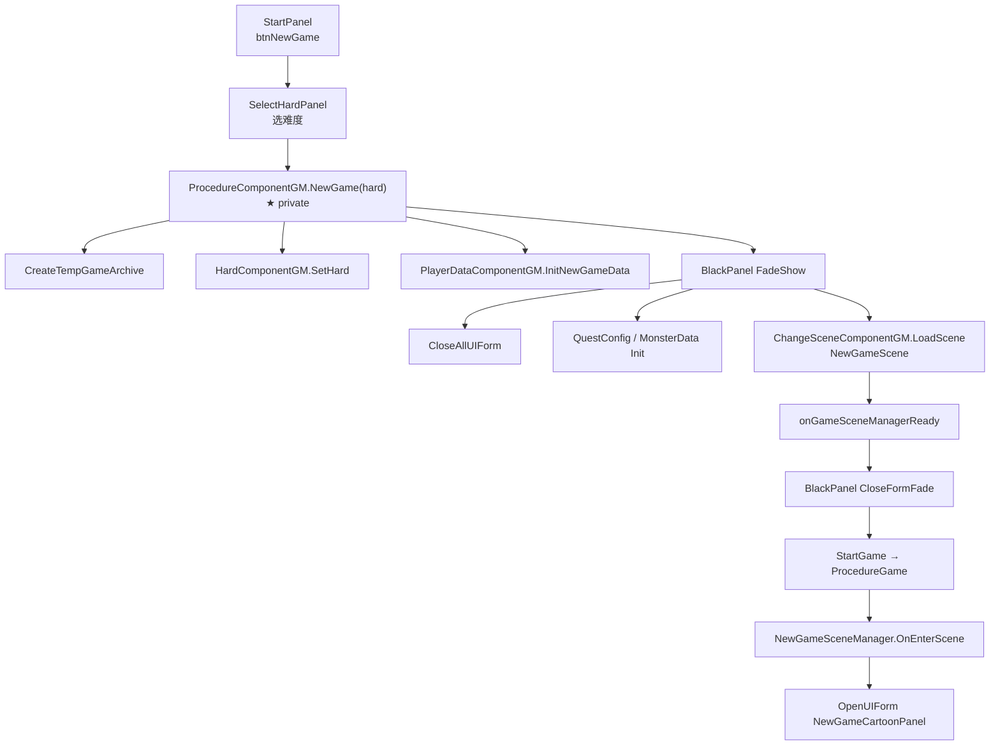
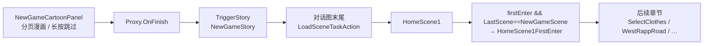
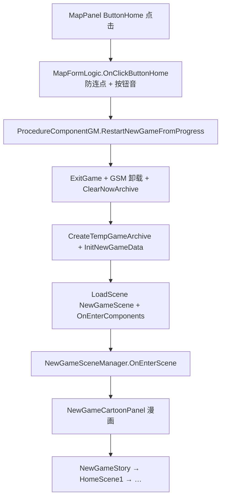

# MapPanel — ButtonHome「从序章重开新游戏」— 架构溯源与执行说明

**文档性质**：架构侦探产出（逻辑溯源 + 施工指引，**本文档阶段不改代码**）  
**依据**：
- `Assets/Doc/00_MASTER_PROMPT.md`【架构侦探】模式
- `Assets/Doc/技术文档/演出相关/NewGameCartoonPanel漫画开场策划案.md`
- `Assets/Doc/技术文档/场景相关/场景切换.md`
- `Assets/Doc/执行文档/0512/场景切换与对话触发跳转_架构溯源报告.md`
- `Assets/Doc/技术文档/演出相关/MapPanel精灵城入口与黑幕对话_开发文档.md`（同面板其它按钮的既有实现范式）

**需求摘要**：玩家在 **`MapPanel`** 点击 **`ButtonHome`** 后，**不经过主菜单**，直接 **重开新游戏**（从序章/漫画段重新开始）；验收标准为 **进入 `NewGameCartoonPanel` 漫画界面**，后续链路与主菜单「新游戏」一致。  
**Unity 版本**：2020.3.48f1  

---

## 1. 结论（一句话）

**`ButtonHome` 目前挂在 `places` 子树下，被 `MapFormLogic` 当成普通地点按钮，点击只会弹「未开放」；要实现「重开新游戏」，不能走 `LoadSceneComponentGSM` 单纯换场，必须复用 `ProcedureComponentGM.NewGame` 同级的「清档 + 初始化数据 + 黑幕关 UI + 加载 `NewGameScene`」进程，并在局内补上 `LoadGame` / `ReturnToMainMenu` 已有的 `ExitGame`、场景 GSM 卸载与 `OnEnterComponents` 收尾；入口侧在 `MapFormLogic` 将 `ButtonHome` 从地点字典剥离并单独绑点击，调用进程层新暴露的公共 API。**

---

## 2. 现象与现状

| 项 | 事实 |
|----|------|
| 预制体 | `Assets/GameRes/Prefabs/UI/MapPanel.prefab` 存在 **`ButtonHome`** |
| 层级 | **`ButtonHome` 的父节点 = `places`**（与 `ButtonJingLingVillage` 等同层） |
| 脚本绑定 | `MapFormLogic` **无** `[SerializeField] ButtonHome`，**无** 独立 `onClick` |
| 当前点击行为 | `OnInit` 中 `places.GetComponentsInChildren<Button>()` 会把 **`ButtonHome` 收进 `placesButtonDic`** → `OnSelectOnePlace("ButtonHome")` → `switch` **无匹配** → **`GameManager.ShowUnOpenTipsPanel()`** |
| 与策划语义 | 「Home」按钮语义是 **回序章/重开**，不是地图「地点」；不应走 `PlayerMapData.GetUnlockPlaces()` 解锁逻辑 |

---

## 3. 标准「新游戏」全链路溯源

### 3.1 主菜单入口（当前唯一合法重开路径）



**代码落点**：

| 步骤 | 文件 | 方法 / 要点 |
|------|------|-------------|
| 选难度 | `StartFormLogic.cs` | `OnClickNewGame` → `SelectHardPanel` |
| 难度回调 | `ProcedureComponentGM.cs` | `OpenMainMenu` 内 `SelectHardFormProxy.onSelect` → **`NewGame(hard)`** |
| 新游戏核心 | `ProcedureComponentGM.cs` | **`private void NewGame(EGameHard hard)`**（约 124～168 行） |
| 漫画入口 | `NewGameSceneManager.cs` | `OnEnterScene` → `NewGameCartoonPanel` |
| 漫画结束 | `NewGameSceneManager.cs` | `onFinishEvent` → `TriggerStory("NewGameStory")` + `龙宫内BGM.ogg` |

### 3.2 漫画之后的既有流程（验收「和之前一样」的参照）



| 环节 | 说明 | 资源 / 常量 |
|------|------|-------------|
| 漫画 UI | `NewGameCartoonFormLogic` 打开即 `HideRow`，播完或长按跳过 → 黑幕关面板 → `OnFinish` | `NewGameCartoonPanel.prefab` |
| 序章对话 | NodeCanvas 对话图 | `Assets/GameRes/Prefabs/Dialogue/NewGameStory.prefab` |
| 首次进家 | 存档 `HomeScene1Data.firstEnter` + `LastSceneName == NewGameScene` | `HomeScene1Manager.OnEnterScene` |
| 换场进家 | 对话图内 **`LoadSceneTaskAction`**，`SceneName = HomeScene1` | 预制体静态阅读已确认 |

**重要**：漫画 → 剧情 → 进 `HomeScene1` 的衔接 **全部在 `NewGameScene` 场景管理器 + 对话资源内**，**不依赖** 从哪打开 `NewGameScene`（主菜单 or 地图重开）。只要进程层正确加载 **`NewGameScene`** 且 **存档为全新临时档**，后续表现应与主菜单新游戏一致。

### 3.3 `InitNewGameData` 做了什么

`PlayerDataComponentGM.InitNewGameData()`（约 56～74 行）：

- 写入 **默认换装**（皇冠、连衣裙等 `ClothesName.*`）
- `PlayerMapData.SetNowPlace(PlaceName.Home)`

**未**在此方法内重置的内容：依赖 `CreateTempGameArchive()` 新建的 **`MasterGameData`** 默认值（各 `*SceneData.firstEnter`、`WestRappRoadData` 等均为初始 false/0）。

---

## 4. 局内重开 vs 主菜单新游戏：必须补的差异

主菜单开局时 **`ProcedureComponentGM.start == false`**，`NewGame` **不** 调用 `ExitGame()`。  
玩家在 **地图 / 任意玩法场景** 点 `ButtonHome` 时 **`start == true`、`IsPlaying == true`**，必须先 **结束当前局**，否则旧 GSM、实体、存档引用会残留。

### 4.1 应对照的两条既有「局内大跳转」路径

| 路径 | 何时用 | 局内 teardown | 存档 | 目标场景 |
|------|--------|---------------|------|----------|
| **`LoadGame(guid)`** | 读档 | `ExitGame()` + `sceneMgr.OnExitScene/OnShutDown` + `CloseAllUI` + **`OnEnterComponents()`** | `LoadArchive` | 存档内场景 |
| **`ReturnToMainMenu()`** | 回主菜单 | 同上 + **`ClearNowArchive()`** | 清空 | `StartScene` |
| **`NewGame(hard)`** | 主菜单新游戏 | **无** `ExitGame` | **`CreateTempGameArchive`** + `InitNewGameData` | **`NewGameScene`** |

**ButtonHome 重开 = `NewGame` 的数据重置 + `LoadGame` 的局内 teardown（当已在局中时）**。

### 4.2 为什么不能只调 `LoadSceneComponentGSM.LoadScene(NewGameScene)`

`MapFormLogic` 精灵村入口已用 `LoadSceneComponentGSM`（见 `OnSelectJingLingVillage`），该 API **仅负责**：

- 黑幕 → `OnExitScene/OnShutDown` → `ChangeSceneComponentGM.LoadScene`

**不会**：

- `CreateTempGameArchive` / `ClearNowArchive`
- `InitNewGameData`
- `CloseAllUIForm`（关 Menu、Map、Fighting 等全局 UI 栈）
- `ExitGame` / `OnEnterComponents`（GM 组件生命周期）
- `StopBGM`（读档路径有，`NewGame` 无，重开建议补上）

若只换场到 `NewGameScene`：**漫画能打开**，但 **旧存档进度、任务、地图解锁、场景实体状态仍会污染**，与「新游戏」验收不符。

---

## 5. 推荐迁移方案（施工员首选）

### 5.1 进程层：暴露「局内重开新游戏」公共 API

**文件**：`Assets/Scripts/Game/GameMgr/Component/ProcedureComponentGM.cs`

**建议新增**（命名可微调，语义须一致）：

```csharp
/// <summary>
/// 局内（如 MapPanel ButtonHome）重开新游戏：清档 → 初始化 → 加载 NewGameScene → 漫画开场。
/// 难度沿用当前 HardComponentGM.Hard，不再弹 SelectHardPanel。
/// </summary>
public void RestartNewGameFromProgress()
```

**推荐实现骨架**（伪代码，施工时按现有 `NewGame` / `LoadGame` 逐行对齐）：

```
RestartNewGameFromProgress():
  onStartLoadingSceneEvent?.Invoke()
  StopBGM()

  Open BlackPanel(FadeShow, onShowEnd):
    if (start) ExitGame()
    sceneMgr?.OnExitScene(); sceneMgr?.OnShutDown()
    CloseAllUIForm(blackForm)
    ClearNowArchive()              // 局内必有活跃档；主菜单 NewGame 可不调
    CreateTempGameArchive()
    // 难度：沿用 GetGMComponent<HardComponentGM>().Hard，不 SetHard
    InitNewGameData()
    QuestConfigMgr.Init(); MonsterDataMgr.Init()

    subscribe once onGameSceneManagerReady:
      blackForm.CloseFormFade:
        StartGame()
        onCompleteLoadingSceneEvent?.Invoke()

    ChangeSceneComponentGM.LoadScene(NewGameScene)
    GameManager.OnEnterComponents()   // 对齐 LoadGame / ReturnToMainMenu
```

**替代方案（不推荐为首版）**：

| 方案 | 说明 | 缺点 |
|------|------|------|
| A. 把 `NewGame` 改 `public` 且 Map 直接调 | 改动小 | 局内仍缺 `ExitGame/ClearNowArchive/OnEnterComponents`，易漏 |
| B. Map 内手写一整段黑幕 + 换场 | 与进程层重复 | 违反 MASTER_PROMPT「拒绝临时修补」 |
| C. 先 `ReturnToMainMenu` 再自动点新游戏 | 会闪主菜单、需伪造 UI 事件 | 体验差、脆弱 |

** refactor 建议（可选、同 PR 或后续）**：将 `NewGame(EGameHard)` 与 `RestartNewGameFromProgress()` 共用的「黑幕内重置 + Load NewGameScene」抽为 **`private void BeginNewGameSession(EGameHard? hardOverride = null)`**，避免双份 `onGameSceneManagerReady` 订阅逻辑漂移。

### 5.2 UI 层：`MapFormLogic` 绑定 `ButtonHome`

**文件**：`Assets/Scripts/Game/GameRuntime/UI/FormLogic/Map/MapFormLogic.cs`

| 任务 | 说明 |
|------|------|
| 常量 | `private const string HomeButtonName = "ButtonHome";` |
| 剥离地点字典 | `BingAllBtnClickEvent` / 构建 `placesButtonDic` 时 **跳过** `ButtonHome`（避免进 `ShowUnOpenTipsPanel`） |
| 单独绑事件 | `OnInit` 中 `transform.Find` 或 `[SerializeField] Button buttonHome` → `onClick.AddListener(OnClickButtonHome)` |
| 点击逻辑 | `UIUtils.PlayBtnAudio` → 防连点标记 → **`ProcedureComponentGM.RestartNewGameFromProgress()`** |
| 防连点 | 复用或新增 `homeRestartInProgress`，与 `jingLingVillageBlackTransitionInProgress` 同类；`OnOpen` 复位 |

**不必**在 Map 层再关 `MapPanel`：`RestartNewGame` 路径里 **`CloseAllUIForm`** 会统一关栈（含 MapPanel）。

### 5.3 预制体

**文件**：`MapPanel.prefab`

- **可不改结构**：`ButtonHome` 仍可留在 `places` 下，只要脚本 **排除** 即可。
- **可选优化**：将 `ButtonHome` 移到 `places` 外，避免误被其它「遍历 places 子物体」逻辑影响（非必须）。

---

## 6. 调用链（目标态）



---

## 7. 验收标准

### 7.1 主验收（策划 / QA）

| # | 操作 | 期望 |
|---|------|------|
| AC-1 | 任意进度打开地图，点 **ButtonHome** | **不出现** `UnOpenTipsPanel` |
| AC-2 | 黑幕过渡后 | 屏幕出现 **`NewGameCartoonPanel`** 漫画分页（可长按跳过） |
| AC-3 | 漫画自然结束或跳过 | 进入 **`NewGameStory`** 对话，BGM 为 **`龙宫内BGM.ogg`** |
| AC-4 | 对话走完 | 换场至 **`HomeScene1`**，首次进入对话 **`HomeScene1FirstEnter`** 正常 |
| AC-5 | 重开后 | 地图解锁、任务、金币、章节进度均为 **新档初始状态**（与主菜单新游戏一致） |
| AC-6 | 连点 ButtonHome | **不** 重复触发多次换场 / 双开漫画 |

### 7.2 程序自检 Log（可选）

施工时可临时加（验收后删或 `#if UNITY_EDITOR`）：

- `[MapHomeRestart] click`
- `[MapHomeRestart] RestartNewGameFromProgress begin/end`
- 确认 `onGameSceneManagerReady` 后 `NowSceneName == NewGameScene`

### 7.3 回归

| 项 | 期望 |
|----|------|
| `ButtonJingLingVillage` | 仍换场 `Village_KenMuNi1`，行为不变 |
| 其它未开放地点 | 仍 `ShowUnOpenTipsPanel` |
| 主菜单 **新游戏 → 选难度** | 行为不变 |
| **读档 / 回主菜单** | 不受本次 API 影响 |

---

## 8. 风险与待确认项

| # | 问题 | 建议默认 | 记录位置 |
|---|------|----------|----------|
| Q1 | 重开是否 **二次确认**（「进度将丢失」）？ | 首版 **无确认**，与需求「直接开始」一致；若策划要弹窗，用现有 Confirm 类 UI，**在 `OnClickButtonHome` 内包一层** | 可写 `OPEN_QUESTIONS.md` |
| Q2 | 难度是否重新选择？ | **沿用当前 `HardComponentGM.Hard`**，不打开 `SelectHardPanel` | 本文 §5.1 |
| Q3 | 已 **手动存档** 的 GUID 是否删除？ | **不删磁盘存档**，仅 **`ClearNowArchive` + 新临时档**；与「新游戏未保存前」一致 | — |
| Q4 | `onGameSceneManagerReady +=` 重复订阅 | 与现有 `NewGame`/`LoadGame` 相同模式；若重开多次出现异常，应改为 **先 `-=` 再 `+=` 或 once 包装** | 技术债，可选同 PR 修 |
| Q5 | 对话进行中能否点 Home？ | 地图打开时玩家已 `PauseGameHandle`；若仍担心，可在 `RestartNewGameFromProgress` 开头判断 `StoryComponentGSM.HasRunningStory` 并 return | 待策划 |

---

## 9. 施工清单（给【施工员】）

| 序号 | 文件 | 改动 |
|------|------|------|
| 1 | `ProcedureComponentGM.cs` | 新增 **`RestartNewGameFromProgress()`**（及可选抽取 `BeginNewGameSession`） |
| 2 | `MapFormLogic.cs` | 排除 `ButtonHome` 出地点字典；绑 `OnClickButtonHome`；防连点 |
| 3 | `MapPanel.prefab` | **可选**：Inspector 拖 `buttonHome` 引用（若用 SerializeField） |
| 4 | — | **不改** `NewGameSceneManager` / `NewGameCartoonFormLogic`（漫画入口已完备） |

**预计改动量**：约 2 个 C# 文件，+60～100 行（含注释），0～1 预制体序列化。

---

## 10. 关键文件索引

| 类型 | 路径 |
|------|------|
| 地图逻辑 | `Assets/Scripts/Game/GameRuntime/UI/FormLogic/Map/MapFormLogic.cs` |
| 游戏进程 | `Assets/Scripts/Game/GameMgr/Component/ProcedureComponentGM.cs` |
| 新游戏场景 | `Assets/Scripts/Game/GameRuntime/GameSceneManager/Scene/NewGame/NewGameSceneManager.cs` |
| 漫画 UI | `Assets/Scripts/Game/GameRuntime/UI/FormLogic/Cartoon/NewGameCartoonFormLogic.cs` |
| 漫画策划案 | `Assets/Doc/技术文档/演出相关/NewGameCartoonPanel漫画开场策划案.md` |
| 地图预制体 | `Assets/GameRes/Prefabs/UI/MapPanel.prefab` |
| 序章对话 | `Assets/GameRes/Prefabs/Dialogue/NewGameStory.prefab` |
| 场景名常量 | `Assets/Scripts/Game/Static/Name/Res/SceneName.cs` → `NewGameScene` |

---

## 11. 版本记录

| 版本 | 日期 | 说明 |
|------|------|------|
| 0.1 | 2026-06-15 | 架构侦探首版：新游戏全链路溯源、ButtonHome 现状、`ProcedureComponentGM` 迁移方案与验收项 |
