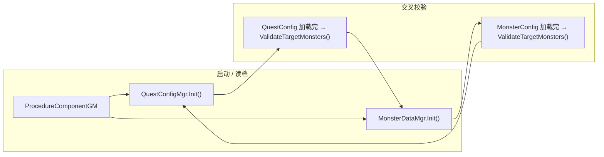

# MonsterDataMgr — Quest 命名空间缺失 CS0234 — 架构溯源与修复执行说明

**文档性质**：架构侦探产出（报错溯源 + 修复施工指引）  
**调查日期**：2026-07-05  
**依据**：
- `Assets/Doc/00_MASTER_PROMPT.md`【架构侦探】
- 击杀任务总纲：`Assets/Doc/执行文档/0606/经典MMO击杀任务_任务配置文件_架构溯源与执行说明.md`
- 怪物死亡上报：`Assets/Doc/执行文档/0608/Quest_怪物死亡事件与任务监听_架构溯源与施工执行说明.md`

**甲方报错（截图）**：
```
Assets/Scripts/Game/GameMgr/Component/Archive/ArchiveDataClass/Monster/MonsterDataMgr.cs(3,55):
error CS0234: The type or namespace name 'Quest' does not exist in the namespace
'Game.GameMgr.Component.Archive.ArchiveDataClass' (are you missing an assembly reference?)
```

**Unity 版本**：2020.3.48f1  

---

## ① 结论（一句话）

**你本地能编过、甲方编不过，最可能是「怪物配置脚本已更新、任务模块整包没同步」——`MonsterDataMgr` 在第 3 行引用了任务命名空间，但甲方工程里缺少 `ArchiveDataClass/Quest/` 下的脚本（或连带缺少任务配置表脚本/JSON），编译器就找不到 `Quest` 这个命名空间。优先让甲方补齐完整任务模块交付清单；若短期不需要任务功能，可临时回滚 `MonsterDataMgr` 里那一行引用。**

---

## ② 玩家在做什么 / 会遇到什么现象

| 现象 | 原因（生活类比） |
|------|------------------|
| Unity 一打开就**红字编译失败**，无法进 Play | 像菜谱里写了「见附录 B」，但附录 B 整本没寄过来 |
| Console 只报 **`Quest` 命名空间不存在**，指向 `MonsterDataMgr.cs` 第 3 行 | 怪物表管理器已改成「加载完怪物表后顺便校验任务目标怪物」，但**任务模块文件不在甲方磁盘上** |
| 你本地**同一分支/同一包**却正常 | 你这边有完整 `Quest/` 文件夹；甲方可能是**增量拷贝、漏文件夹、或 Git 合并不完整** |
| Hot Reload 显示 inactive | **与本次报错无关**；根因是 C# 编译期命名空间缺失，不是热重载插件 |

**生活类比**：仓库管理员（怪物表）现在要在入库时核对「订单上的虫子名字是否在库存里」（任务校验），但订单系统（Quest 模块）整个部门在甲方那边还没挂牌——所以连门都进不了（项目无法编译）。

---

## ③ 架构溯源：报错落在哪一行、为什么

### 3.1 报错落点（静态阅读 · 开发者本地工程）

`MonsterDataMgr.cs` 第 3 行：

```csharp
using Game.GameMgr.Component.Archive.ArchiveDataClass.Quest;
```

第 37 行在怪物配置表异步加载完成后调用：

```csharp
QuestConfigMgr.getInstance().ValidateTargetMonsters();
```

| 行号 | 作用 | 引入阶段 |
|------|------|----------|
| L3 | 引用任务命名空间 | 击杀任务 **阶段 1～4** 联调时加入 |
| L37 | 怪物表就绪后，校验 `QuestConfig.json` 里 `targetMonster` 是否在 `MonsterConfig.name` 中存在 | 同上 |
| L41-42 | `IsTableLoaded` 属性，供 `QuestConfigMgr` 判断怪物表是否已加载 | 同上 |

### 3.2 `Quest` 命名空间由哪些脚本构成（开发者本地 · 完整清单）

路径：`Assets/Scripts/Game/GameMgr/Component/Archive/ArchiveDataClass/Quest/`

| 文件 | 类型 | 依赖 |
|------|------|------|
| `QuestState.cs` | 枚举 `QuestState` | 无外部依赖（最简） |
| `QuestConfigMgr.cs` | 静态配置加载 + `ValidateTargetMonsters()` | `QuestDataTableRow`、`QuestConfig.json`、`MonsterDataMgr` |
| `QuestManager.cs` | 运行时接取/进度/击杀上报 | `QuestConfigMgr`、`PlayerQuestData` |
| `PlayerQuestData.cs` | 任务存档 | `BaseArchiveData`、`QuestState` |
| `PlayerGoldData.cs` | 金币存档（发奖用） | `BaseArchiveData` |

**关联但不在 `Quest/` 文件夹内的依赖**：

| 路径 | 作用 |
|------|------|
| `Assets/Scripts/Game/DataTable/QuestConfig/QuestDataTableRow.cs` | 任务 JSON 行结构；`QuestConfigMgr` 必引 |
| `Assets/GameRes/Config/QuestConfig/QuestConfig.json` | 策划任务配置（运行时加载，不参与 CS0234，但缺了任务功能跑不起来） |

**同样引用 `Quest` 命名空间、甲方若只补 `MonsterDataMgr` 仍会连环报错的其他脚本**：

| 路径 | 用途 |
|------|------|
| `ProcedureComponentGM.cs` | 启动流程里 `QuestConfigMgr.Init()` |
| `BaseMonster.cs` | 死亡时 `QuestManager.OnMonsterKilled` |
| `QuestAcceptAction.cs` / `QuestTurnInAction.cs` | NodeCanvas 接任务/交付 |
| `AegirQuestStoryTrigger.cs` | 埃吉尔任务演出触发 |

> **重要**：CS0234 报在 `MonsterDataMgr` 是因为它是编译顺序里**较早暴露**的引用点；根因是 **`Quest` 命名空间下零个可编译类型**，不是 `MonsterDataMgr` 本身写错。

### 3.3 调用链（怪物表 ↔ 任务校验）



**设计意图**：任务表与怪物表**谁先加载不确定**，所以在两边 `Init` 回调末尾各调用一次 `ValidateTargetMonsters()`；怪物表未就绪时静默跳过，避免误报。

**重要修改原因（0606/0608 文档裁定）**：`targetMonster` 必须对齐 `MonsterConfig.name`（大小写一致），启动时 Warning 便于策划排错，而不是等到玩家杀怪才发现对不上。

### 3.4 已排除的原因（架构侦探 · 只读）

| 假设 | 结论 |
|------|------|
| **Assembly Definition 引用缺失** | `GameMgr` 下无 `.asmdef`，全进默认 `Assembly-CSharp`，**不是**程序集隔离问题 |
| **`#if UNITY_EDITOR` 条件编译** | `Quest/` 下 5 个脚本**无**条件编译宏 |
| **Hot Reload 插件** | 编译期错误，与 Hot Reload 是否启用**无关** |
| **`MonsterDataMgr` 命名空间写错** | 本地同路径可编译，命名空间字符串与 `Quest/*.cs` 一致 |

---

## ④ 根因判定（按概率排序）

### 4.1 【最高概率】任务模块整包未同步到甲方

**特征**：
- 甲方 Project 窗口里 **`ArchiveDataClass` 下没有 `Quest` 文件夹**，或文件夹为空
- 甲方有「新版」`MonsterDataMgr.cs`（含 L3 `using …Quest` 与 L37 校验调用）
- 开发者本地同一完整工程编译通过

**常见触发场景**：
- 手动拷贝 `Scripts` 时漏子目录
- Git 合并时只合了 `MonsterDataMgr.cs`，未合 `Quest/` 新增目录
- 打包/发版清单未包含 0606～0608 任务批次文件

### 4.2 【次高概率】只缺 `.meta` 或只缺部分 Quest 脚本

Unity 依赖 `.meta` 维护 GUID。若只拷 `.cs` 不拷 `.meta`，偶发导入异常；但若 **`Quest` 文件夹完全不存在**，必现 CS0234。

若 **`QuestDataTableRow.cs` 缺失** 而 `Quest/` 存在：`QuestConfigMgr` 会编译失败，但 `QuestState.cs` 仍应使 `Quest` 命名空间**存在**——此时错误通常会变成「找不到 `QuestConfigMgr` 类型」而非 CS0234。**因此甲方截图形态更指向 4.1（整包缺失）**。

### 4.3 【低概率】甲方工程路径/大小写不一致（跨平台）

在 **macOS / Linux** 上若文件夹被误命名为 `quest` 而非 `Quest`，可能引发异常；Windows 甲乙双方通常不敏感。若甲方用 Mac 打包，建议在 Project 窗口核对文件夹名与命名空间大小写一致。

---

## ⑤ 修复方案

### 方案 A — 完整同步任务模块（推荐 · 与开发者本地对齐）

**适用**：甲方需要埃吉尔任务、击杀计数、发奖等已交付功能。

#### A.1 必须拷贝的脚本（含 `.meta`，缺一不可）

```
Assets/Scripts/Game/GameMgr/Component/Archive/ArchiveDataClass/Quest/
├── Quest.meta
├── QuestState.cs + QuestState.cs.meta
├── QuestConfigMgr.cs + QuestConfigMgr.cs.meta
├── QuestManager.cs + QuestManager.cs.meta
├── PlayerQuestData.cs + PlayerQuestData.cs.meta
└── PlayerGoldData.cs + PlayerGoldData.cs.meta

Assets/Scripts/Game/DataTable/QuestConfig/
├── QuestDataTableRow.cs + QuestDataTableRow.cs.meta
```

#### A.2 必须拷贝的配置与运行时挂钩（功能验收用）

```
Assets/GameRes/Config/QuestConfig/
├── QuestConfig.json + QuestConfig.json.meta
```

若甲方工程**尚未合入 0608 批次**，还需一并确认以下脚本与 Prefab/对话图是否存在（否则编译能过、任务仍跑不通）：

```
Assets/Scripts/Game/GameRuntime/Entities/Monster/BaseMonster.cs        （含 OnMonsterKilled 上报）
Assets/Scripts/Game/GameMgr/Component/ProcedureComponentGM.cs          （含 QuestConfigMgr.Init）
Assets/Scripts/Game/GameRuntime/NodeCanvas/.../QuestAcceptAction.cs
Assets/Scripts/Game/GameRuntime/NodeCanvas/.../QuestTurnInAction.cs
Assets/Scripts/Game/GameRuntime/Entities/SceneEntities/Village_House/AegirQuestStoryTrigger.cs
```

#### A.3 甲方操作步骤

1. 关闭 Unity Editor（避免导入半成品冲突）。
2. 从**开发者完整工程**按 A.1、A.2 路径覆盖/copy 到甲方工程**相同相对路径**。
3. 重新打开 Unity，等待 Script Compilation 完成。
4. 执行 **§⑥ 验收清单**。

#### A.4 交付侧改进（给发包人）

- 发版说明中单独列出 **「0606～0608 击杀任务批次文件清单」**，不要只写「更新了 MonsterDataMgr」。
- 若用 Git：合并 PR 时检查 `ArchiveDataClass/Quest/` 是否整目录进 diff。
- 建议附带本执行文档路径，方便甲方自检。

---

### 方案 B — 临时回滚 `MonsterDataMgr`（仅当甲方短期不需要任务）

**适用**：甲方先要**恢复可编译、可进 Play**，任务功能下一阶段再合。

**修改文件**：仅 `MonsterDataMgr.cs`

1. **删除**第 3 行：
   ```csharp
   using Game.GameMgr.Component.Archive.ArchiveDataClass.Quest;
   ```
2. **删除** `Init()` 回调内第 36～37 行注释与调用：
   ```csharp
   // 怪物表就绪后补校验任务 targetMonster（任务表可能先于或后于怪物表加载）
   QuestConfigMgr.getInstance().ValidateTargetMonsters();
   ```
3. **保留** `IsTableLoaded` 属性无妨（不引用 Quest）；若追求最小 diff 也可删，但无编译影响。

**副作用**：
- 怪物表与任务表交叉校验不再执行（策划填错 `targetMonster` 时少一条启动 Warning）。
- 若甲方仍保留 `ProcedureComponentGM` / `BaseMonster` 等对 `Quest` 的引用，**仍会报其他 CS0234/CS0246**——方案 B 只解 `MonsterDataMgr` 这一处，**不能代替方案 A**。

**替代方案说明**：若希望「无 Quest 模块时也能编译、有时又能校验」，可用 `#if` + Scripting Define Symbol 包裹 L3/L37——属于**新增条件编译分支**，与 0606「最小增量」精神不完全一致，**不推荐作为甲方首选**，仅作长期多分支工程备选。

---

### 方案 C — 架构解耦（后续优化 · 非本次紧急修复）

**问题**：`MonsterDataMgr` ↔ `QuestConfigMgr` 存在**双向引用**（同程序集内合法，但增加「只更一半就编不过」的耦合感）。

**方向**（不在本次甲方 hotfix 范围，记录供后续施工员评估）：
- 将 `ValidateTargetMonsters()` 挪到 `ProcedureComponentGM` 或独立 `QuestBootstrapValidator`，在**两表都加载完成的单一回调**里执行；
- `MonsterDataMgr.Init` 只负责怪物表，不再 `using Quest`。

**好处**：未来可单独升级怪物模块而不强制携带 Quest 引用。  
**成本**：需改启动链路与 0606 文档描述，**本次不实施**。

---

## ⑥ 验收清单

### 6.1 编译期（必过）

| # | 检查项 | 期望 |
|---|--------|------|
| 1 | Unity Console | **0** 个 CS0234 / CS0246 与 `Quest` 相关错误 |
| 2 | Project 窗口 | 存在 `ArchiveDataClass/Quest`，内含 **5** 个 `.cs` |
| 3 | Project 窗口 | 存在 `DataTable/QuestConfig/QuestDataTableRow.cs` |
| 4 | Enter Play Mode | 可正常进入（无编译阻断） |

### 6.2 运行时（方案 A 完整合入后建议测）

| # | 操作 | Console 期望 |
|---|------|----------------|
| 1 | 冷启动进 InitScene | `[QuestConfig] Loaded N quest(s).`（N≥1） |
| 2 | 同上 | **无** `[QuestConfig] … targetMonster … 未在 MonsterConfig.name 中找到`（若 Quest_001 已配置 `WoodWorm`） |
| 3 | 埃吉尔接 Quest_001 → 村外杀 WoodWorm | `[Quest] Progress Quest_001: 1/10 (InProgress)` 等（详见 0608 文档 §2） |

### 6.3 甲方 30 秒自检（无需懂代码）

1. 在 Project 搜索框输入 **`QuestConfigMgr`** → 应能搜到 `.cs` 文件。  
2. 搜 **`QuestConfig.json`** → 应存在于 `GameRes/Config/QuestConfig/`。  
3. 若搜不到上述任一项 → **按方案 A 补文件**，不要只改 `MonsterDataMgr`。

---

## ⑦ 给程序员的补充清单

| 项 | 内容 |
|----|------|
| **报错文件** | `Assets/Scripts/Game/GameMgr/Component/Archive/ArchiveDataClass/Monster/MonsterDataMgr.cs` |
| **报错行** | `(3,55)` → `using …ArchiveDataClass.Quest` |
| **命名空间** | `Game.GameMgr.Component.Archive.ArchiveDataClass.Quest` |
| **核心类型** | `QuestConfigMgr.getInstance().ValidateTargetMonsters()` |
| **程序集** | 默认 `Assembly-CSharp`（无 asmdef 隔离） |
| **关联文档** | `0606` 阶段 1 配置、`0608` 阶段 4 死亡上报 |
| **推荐修复** | 方案 A 整包同步；紧急可方案 B 仅回滚 MonsterDataMgr（需确认无其他 Quest 引用） |

---

## ⑧ 变更记录

| 日期 | 说明 |
|------|------|
| 2026-07-05 | 初版：针对甲方 CS0234 截图完成架构溯源与 A/B/C 修复方案 |

---

## ⑨ OPEN_QUESTIONS（需发包方确认）

1. 甲方当前工程是 **Git 拉取**、**UnityPackage 导入** 还是 **手动拷贝 Scripts**？——决定漏文件的具体环节。  
2. 甲方是否需要 **0608 埃吉尔任务全链路**，还是仅需 **编译通过**？——决定方案 A 还是 B。  
3. 是否存在 **多分支**（甲方在 `main`，开发在 `feature/quest`）？——建议统一合并点并附文件清单 PR 描述。

> 以上问题确认前，**优先按方案 A 补全 `Quest/` + `QuestDataTableRow` + `QuestConfig.json`**，与开发者本地对齐，风险最低。
