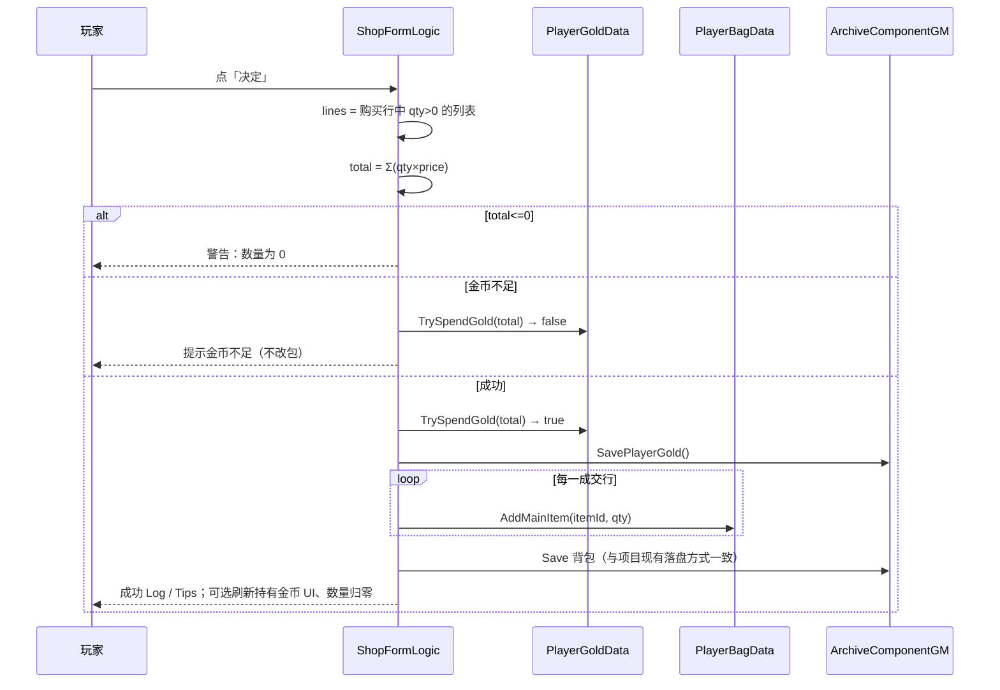

# Shop · 货币金币对接（购买扣款闭环）— 架构溯源与施工执行说明

**文档版本**：v1（2026-07-13）  
**文档性质**：【架构侦探】逻辑溯源 + 施工指引（**本阶段文档不改代码**；施工员按本文最小化改）  
**触发**：商店 UI（列表 / 数量 / Total2 /「决定」）已齐，但点「决定」仍是 **假购买 Log**；现有金币存档只有 **加币**（任务发奖），**没有扣款 API**。准备与商店购买对接：**点确认购买必须真实扣除金币**，并写入存档。

**依据**：
- `Assets/Doc/00_MASTER_PROMPT.md`【架构侦探】
- `Assets/Doc/执行文档/0629/商店系统_策划拆解_执行说明.md`（§5.1 货币 · §9 **阶段五**）
- `Assets/Doc/执行文档/0704/Shop_Editor烘焙双列表_MainItemDatabase一键刷行_施工执行说明.md`（行单价 Bake）
- `Assets/Doc/执行文档/0706/Shop_Total2双Tab全行合计与出售数量输入_架构溯源与施工执行说明.md`（全行合计公式）
- 关联场景：`Assets/GameRes/Scenes/Village_Shop.unity`
- 关联脚本：见 §⑩

**Unity 版本**：2020.3.48f1  

---

## ① 结论（一句话）

**货币唯一真相源是存档 `PlayerGoldData.gold`（任务已在用）；商店点「决定」时，按当前购买 Tab 的全行合计 `Σ(qty×买价)` 调用新建的 `TrySpendGold` 扣款并 `SavePlayerGold`，成功后再 `AddMainItem` 入包；金币不足则拒绝整单、不改背包。本阶段先做购买闭环；出售加币可同批或紧随其后。**

**生活类比**：以前收银台只「口头报数不刷卡」；现在要接上真正的钱包——钱够才交货，不够就整单取消。

---

## ①.1 范围冻结

| 项 | 约定 |
|----|------|
| **本任务必做** | 购买 Tab + 点「决定」→ **真实扣金币** + **道具入包** + 存档落盘 |
| **扣款公式** | 与 Total2 一致：`BuyTotal = Σ (QuantityForTotal × ShopBarRowView.Price)`（仅购买行，qty>0） |
| **货币 API** | 在 `PlayerGoldData` 补 `TrySpendGold`；经 `QuestManager`（或等价 Archive 入口）读/写/存，**禁止** UI 直接改 `gold` 字段 |
| **失败策略** | 金币不足 → **整单失败**（不扣款、不入包）；提示方式见 §⑧ Q1 |
| **本阶段可选** | 商店界面常驻显示持有金币；出售 Tab 真实加币出包 |
| **本阶段不做** | 限购库存、按 NPC 分店、改 MainItemDatabase 价表结构、假购买 Log 文案永久保留 |
| **禁止** | 在 `Update` 里轮询扣款；在 Shop UI 另造第二套「本地金币」变量 |

---

## ② 玩家会遇到什么（施工前后对照）

| # | 操作 | 施工前（现状） | 施工后（目标） |
|---|------|----------------|----------------|
| 1 | 买药水，数量 > 0，点「决定」 | Console：`[ShopDebug] 成功购买生命球，扣除金币 n`；**钱不变、包不变** | 金币 −n；背包对应道具 +n；存档可读回 |
| 2 | 多行同时填数量再点「决定」 | 仍只认 **HpBall** 一行假 Log | **全行合计**一次扣款；各行分别入包 |
| 3 | 金币不够 | 仍打成功假 Log | **不成交**；有警告 / Tips；Total2 数字可不变 |
| 4 | 数量全 0 点「决定」 | 警告「数量为 0」 | 保持拒绝；不碰存档 |
| 5 | 交付任务拿奖后再进店买 | 任务 `AddGold` 有效；店里花不掉 | 任务加的钱 **可在店里花掉**（同一存档键） |

---

## ③ 架构溯源：货币金币系统（现状）

### 3.1 存档模型

| 项 | 内容 |
|----|------|
| **类** | `PlayerGoldData : BaseArchiveData` |
| **路径** | `Assets/Scripts/Game/GameMgr/Component/Archive/ArchiveDataClass/Quest/PlayerGoldData.cs` |
| **存档键** | `MasterGameData` → `"PlayerGold"`（`int`，默认 0） |
| **字段** | `public int gold` |
| **设计备注** | 注释写明「方案 A：独立于道具背包」；与 `PlayerQuestData` 同命名空间，避免 Quest 跨命名空间引用失败 |

```
PlayerGoldData
  ParseInternal  ← masterData.GetValue("PlayerGold", 0)
  SerializeInternal → masterData.SetValue("PlayerGold", gold)
  AddGold(amount)   ← 仅 amount > 0 时 gold += amount
  ❌ 无 TrySpendGold / SpendGold / CanAfford
```

### 3.2 谁在读写金币（全工程扫描）

| 调用方 | 做什么 | 是否落盘 |
|--------|--------|----------|
| `QuestManager.GrantQuestRewards` | `reward.type == "Gold"` → `AddGold` + `SavePlayerGold` | ✅ |
| `QuestManager.GetPlayerGoldData` | 场景有 GSM → `sceneMgr.GetArchiveData<PlayerGoldData>`；否则 `ArchiveComponentGM.GetData` | 读 |
| `QuestManager.SavePlayerGold` | `ArchiveComponentGM.SaveSpcData<PlayerGoldData>()` | ✅ |
| **商店 / Menu UI** | **无引用** | — |

**结论**：金币已是正式存档子系统，但 **消费侧为零**——商店对接就是补「花钱」这一半。

### 3.3 读档路径（与任务一致，商店必须复用）

```
商店确认购买
  → 取 PlayerGoldData（优先 GameSceneManager.GetArchiveData，与 QuestManager 同路径）
  → TrySpendGold(BuyTotal)
  → SavePlayerGold()
  → 再改 PlayerBagData（入包）并按现有背包存档习惯落盘
```

**替代方案说明**（为何不另造 `ShopWallet`）：

| 方案 | 做法 | 取舍 |
|------|------|------|
| **A（定稿）** | 扩展 `PlayerGoldData` + 走 `QuestManager` 已有 Get/Save | 与任务发奖同一真相源；读档一致 |
| B | 新建 `CurrencyManager` / `ShopTradeService` 包一层 | 解耦更好，但本工程尚无其它货币类型；过度设计 |
| C | UI 直接 `gold -= n` 不经存档 API | 易丢档、与任务不同步；**禁止** |

### 3.4 与「游戏币 / 金币」文案

工程内任务 Log 用 `Gold` /「游戏币」；商店假 Log 用「金币」。**数值同一字段**，UI 文案可统一为「游戏币」或「G」，不另开第二货币。

---

## ④ 架构溯源：商店购买侧（现状）

### 4.1 已就绪（可直接喂给交易）

| 能力 | 位置 | 说明 |
|------|------|------|
| 行身份 + 单价 | `ShopBarRowView.ItemId` / `.Price` | Editor Bake 写入 `bakedItemId` / `bakedPrice` |
| 每行数量 | `ShopBuyRowQuantityInput.QuantityForTotal` | 空串按 0 |
| 购买合计 | `ShopFormLogic.GetCurrentBuyTotal()` | Σ 全购买行 |
| 出售合计 | `ShopFormLogic.GetCurrentSellTotal()` | 本任务可不结算 |
| 决定按钮 | `BtnConfirm` → `OnConfirmClick` | 已接线 |

### 4.2 仍停留在「阶段四假购买」

`ShopFormLogic.OnConfirmClick` 当前逻辑（摘要）：

1. **只找** `HpBall` 行；
2. 取其 `QuantityForTotal` 与 `Price`；
3. `total > 0` 时调用 `ShopDebugLogger.LogHpBallPurchaseSuccess(total)`；
4. **不**碰 `PlayerGoldData` / `PlayerBagData`。

`ShopDebugLogger` 注释已写明：阶段五接入真实扣款后可保留 Log 或改 Tips。

### 4.3 与 Total2 文档的衔接缺口

`0706` 文档已约定：Total2 = 全行合计；并写明「决定按钮升级另开阶段五」。  
**现状脱节**：玩家看见的 Total2 可能是多行之和，点「决定」却仍只对 HpBall 打假 Log。  
本任务必须让 **确认结算口径 = Total2 购买合计**。

### 4.4 背包侧（购买入包已有 API）

| API | 路径 | 备注 |
|-----|------|------|
| `AddMainItem(EMainItemName, count)` | `PlayerBagData` | 堆叠上限 `MaxStackPerItem = 10`；超限会被 `Math.Min` 钳制 |
| `TryRemoveMainItem` | 同上 | 出售用；本任务可选 |
| `OnDataChange` | 静态事件 | UI 可订阅刷新 |

**注意**：`AddMainItem` 在已有数量上累加后钳制到 10——若玩家已有 9 个、再买 3，实际只到 10。  
整单策略见 §⑧ Q2（建议首版：**先校验「每一行购买后不超过堆叠」再扣款**；做不到则至少保证「先扣款后入包」时记录 OPEN_QUESTIONS）。

---

## ⑤ 目标交易链路（定稿）

### 5.1 购买成功路径



### 5.2 `TrySpendGold` 契约（施工员必须遵守）

```csharp
/// <summary>
/// 尝试扣除游戏币。amount ≤ 0 返回 false；
/// gold < amount 返回 false 且不修改；
/// 成功则 gold -= amount 并返回 true。
/// 调用方负责 SavePlayerGold。
/// </summary>
public bool TrySpendGold(int amount)
```

**替代方案**：`bool SpendGold` 不足时抛异常 / 静默钳到 0——**禁止**（商店需要明确失败分支）。

### 5.3 读档入口约定

商店 UI 不要自己 `new PlayerGoldData`。推荐二选一（施工时定一种，写进代码注释）：

| 优先级 | 入口 | 说明 |
|--------|------|------|
| **推荐** | `QuestManager.GetPlayerGoldData()` + `SavePlayerGold()` | 与任务发奖完全同路 |
| 备选 | `GameSceneManager.GetArchiveData<PlayerGoldData>()` + `ArchiveComponentGM.SaveSpcData` | 与上等价，但商店脚本需额外拿 GSM |

> `Village_Shop` 若仍是无 SceneManager 的沙盒，读档可能走 `ArchiveComponentGM` 分支——与 `QuestManager.GetPlayerGoldData` 的 fallback **一致**，验收时须从 **InitScene 正规进游戏** 再测（见 `0713/Village_Shop_ESC呼出菜单_…`）。

### 5.4 出售（本任务边界）

| 项 | 建议 |
|----|------|
| **同批做** | 出售 Tab：`total = GetCurrentSellTotal()` → 校验背包持有 ≥ 卖出数量 → `TryRemoveMainItem` → `AddGold` → Save |
| **若工期紧** | 本 PR **只做购买扣款**；出售仍只刷 Total2，点决定时若在出售 Tab 则 Log「出售结算未接入」或直接 return |

用户本轮明确：**点击购买都要扣除金币** → **购买闭环为 P0**；出售为 P1。

---

## ⑥ 施工清单（最小化改动）

### 6.1 改哪些文件

| # | 文件 | 改动 |
|---|------|------|
| 1 | `PlayerGoldData.cs` | 新增 `TrySpendGold`；可选 `CanAfford` |
| 2 | `ShopFormLogic.cs` | 重写 `OnConfirmClick`：按 Tab / 全行结算；接金币与背包 |
| 3 | `ShopDebugLogger.cs` | 扩展成功/失败 Log（全道具，不再写死「生命球」）；或改 Tips |
| 4 | （可选）`QuestManager.cs` | 若希望统一门面，可加 `TrySpendPlayerGold(int)` 包装 Get+Try+Save |
| 5 | （可选）商店 Prefab / 场景 | 持有金币显示节点（若 §⑧ Q3 要做） |

**不改**：Bake 工具、MainItemDatabase、Total2 图片数字组件（合计逻辑已够用）。

### 6.2 `OnConfirmClick` 伪代码（给施工员）

```
OnConfirmClick:
  if (!_isBuyTabActive)
    → 出售未接入则 return（或走出售分支）
  收集 buy 行：qty = QuantityForTotal；跳过 qty<=0
  total = Σ qty * Price
  if total <= 0 → LogZeroQuantity；return

  goldData = QuestManager.GetPlayerGoldData()  // 或等价
  if (!goldData.TrySpendGold(total))
    → Log/Tips「金币不足」；return

  SavePlayerGold()
  foreach line: bag.AddMainItem(itemId, qty)
  SaveBag()  // 使用项目既有保存背包方式
  成功 Log；可选 Reset 数量 + RefreshTotal2 + 刷新持有金币 UI
```

**重要修改原因**：必须先扣款成功再入包，避免「白嫖道具」；若扣款成功但入包中途失败（极少），记入 OPEN_QUESTIONS，首版可接受「钱已扣、道具部分入包」或整单预校验后一次提交。

### 6.3 注释要求（项目规则）

- `TrySpendGold`：写清失败条件与「调用方负责 Save」。
- `OnConfirmClick`：写明为何合计与 Total2 同公式、为何整单失败。
- 复杂逻辑旁注明替代方案（见 §3.3 方案表）。

---

## ⑦ 验收现象清单

| ID | 前置 | 操作 | 期望 |
|----|------|------|------|
| G1 | 正规进游戏，金币 ≥ 单价 | 买 1 个 HpBall，点决定 | `gold` −买价；背包 HpBall +1；Console 成功 |
| G2 | 金币充足 | HpBall×2 + MpBall×1（价按 Bake） | 扣 `2×Hp价 + 1×Mp价`；两道具都入包 |
| G3 | 金币 = 0 或 < Total2 | 填数量后点决定 | **不扣款、不入包**；有不足提示 |
| G4 | 全行数量 0 | 点决定 | 警告；存档不变 |
| G5 | 先完成发 Gold 的任务 | 再进店买 | 任务加的钱可被扣掉 |
| G6 | 存档 / 读档 | 买完后保存再读 | 金币与背包与买后一致 |
| G7 | （若做出售） | 出售素材 | 包减、金币加 |
| G8 | Total2 显示 | 多行填数 | 点决定扣款数 = Total2 数字 |

**沙盒注意**：仅直接 Play `Village_Shop` 可能无完整 Archive——验收以 InitScene → 换场为准。

---

## ⑧ 待确认（写入 OPEN_QUESTIONS 若无答复）

| ID | 问题 | 建议默认 |
|----|------|----------|
| Q1 | 金币不足用 Console / TipsForm / 两者？ | 先 `[ShopDebug]` Warning + 有则 `TipsFormLogic.AddTipsInfo` |
| Q2 | 堆叠将超 10：整单失败 vs 买到上限？ | **整单失败**（预校验每行 `持有+qty ≤ 10`） |
| Q3 | 商店 UI 是否常驻显示持有金币？ | 本阶段可不做；做则绑只读数字，扣款后刷新 |
| Q4 | 成功后数量是否清零？ | **是**（调用现有 `ResetToDefault` + `RefreshTotal2`） |
| Q5 | 出售是否同 PR？ | 购买 P0；出售可同 PR 若改动小 |
| Q6 | 假购买「成功购买生命球」文案 | 改为「购买成功，扣除金币 {total}」或列道具明细 |

> 按 Master Prompt：无结论时写入 `Assets/Doc/OPEN_QUESTIONS.md`，**不要擅自改核心方向**。

---

## ⑨ 与旧阶段文档关系

| 文档 | 关系 |
|------|------|
| `0629` §9 阶段四 | 假购买 Log → **被本任务取代**（阶段五） |
| `0629` §9 阶段五 | **本文即施工展开** |
| `0706` Total2 | 合计公式 **直接复用**；决定按钮与之对齐 |
| `0704` Bake | 单价来源不变；交易只读 `ShopBarRowView` |

---

## ⑩ 给程序看的入口索引

| 主题 | 路径 |
|------|------|
| 金币存档 | `Assets/Scripts/Game/GameMgr/Component/Archive/ArchiveDataClass/Quest/PlayerGoldData.cs` |
| 金币读写门面 | `QuestManager.GetPlayerGoldData` / `SavePlayerGold` / `GrantQuestRewards` |
| 背包加减 | `PlayerBagData.AddMainItem` / `TryRemoveMainItem` |
| 商店确认 | `ShopFormLogic.OnConfirmClick` |
| 合计 | `ShopFormLogic.GetCurrentBuyTotal` / `GetCurrentSellTotal` |
| 假购买 Log | `ShopDebugLogger` |
| 行数据 | `ShopBarRowView` |
| 任务奖励配置 | `QuestDataTableRow` / `QuestConfig` 中 `type: Gold` |
| 商店场景 | `Assets/GameRes/Scenes/Village_Shop.unity` |

---

## ⑪ 施工员提交说明模板（改完后填）

- **改了哪些文件**：…
- **实现了什么**：购买确认真实 `TrySpendGold` + 入包 + 存档；合计与 Total2 一致。
- **如何验证**：按 §⑦ G1～G6（必要时 G7～G8）。

---

## ⑫ 文档变更记录

| 日期 | 说明 |
|------|------|
| 2026-07-13 | 初稿：架构侦探扫描货币与商店假购买链路；定稿购买扣款闭环施工说明，对接阶段五 |
