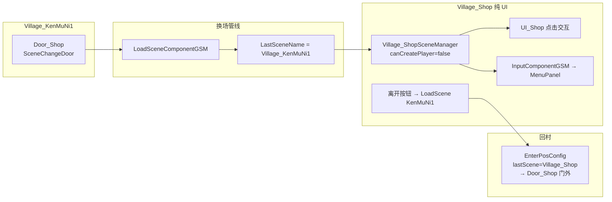

# Village_KenMuNi1 · Door_Shop → Village_Shop（纯 UI 独立场景）— 架构溯源与施工执行说明

**文档性质**：架构侦探产出（逻辑溯源 + Unity / 代码施工指引；**本阶段不改代码**）  
**依据**：
- `Assets/Doc/00_MASTER_PROMPT.md`【架构侦探】
- 前序：`0713/Village_Shop_ESC呼出菜单_架构溯源与施工执行说明.md`（**Q1 已拍板：正式入口 = 独立场景 `Village_Shop`**）
- 换场通则：`0518/SceneChangeDoor场景切换_架构溯源与执行说明.md`、`技术文档/场景相关/场景切换.md`
- 纯 UI 场景范例：`SelectClothesSceneManager` + `ChangeClothesScene.asset`（`canCreatePlayer: 0`）
- 室内管理器范例：`Village_House4SceneManager` / `Village_HomeScene2SceneManager`
- 搭建手册：`技术文档/场景相关/搭建新场景手册.md`（`canCreatePlayer = false`）

**产品口径（已确认）**：
- **正式入口**：独立场景 **`Village_Shop`**（不是叠在 HomeScene4 上的面板）
- **场景性质**：**纯 UI**——不显示玩家、不可行走，只做点击交互（买卖 UI）
- **进店方式**：`Village_KenMuNi1` 的 **`Door_Shop`** 交互换场

**Unity 版本**：2020.3.48f1  

---

## 1. 结论（一句话）

**把门改成指向 `Village_Shop`，给商店场景挂上「无玩家」的场景管理器（`canCreatePlayer=false`），再补回村落点与离店按钮；从 InitScene 进村里按 E 进店即可验收。ESC 菜单会随场景管理器一起带上，不必另写 ESC。**

生活类比：村里门口是「进商场的闸机」；商场里面是「只有柜台、没有你可以走路的走廊」——所以商场不生成玩家，只留柜台 UI；离开时按「离店」再回村里闸机旁。

---

## 2. 你要验收的现象

| 步骤 | 期望 |
|------|------|
| InitScene → 进 `Village_KenMuNi1` → 走到 **Door_Shop** | 出现交互提示（与 House4 / House_NPC2 同类：按 **E** 或点击） |
| 交互进门 | 黑幕换场 → **`Village_Shop`** |
| 进店后 | **看不见玩家**、不能走路；**`UI_Shop` 可见可点**（买卖 Tab / 数量 / 合计等） |
| 进店后按 **ESC** | 可开 **MenuPanel**（由 GSM 的 `InputComponentGSM` 提供） |
| 点商店「离开 / 关闭」类按钮（施工补） | 回 **`Village_KenMuNi1`**，落在 **Door_Shop 门外** |
| Console | 无空场景名、无 `SceneChangeDoor已进入` 狂刷、无 `GetGameSceneManager` 空引用 |

---

## 3. 架构选型（为何这样接）

| 项 | 决定 | 原因 |
|----|------|------|
| 入口形态 | **独立场景 `Village_Shop`** | 产品已确认；与换装场景同类「整场换 UI」 |
| 玩家 | **`canCreatePlayer = false`** | 纯 UI、不走路；对齐 `ChangeClothesScene.asset` / `DialogDebug.asset` |
| Map / 出生点 | **商店侧可不做 Map 行走层** | 无玩家落点需求；回村落点配在 **村里** `EnterPosConfig` |
| ESC 菜单 | **依赖 `BaseGameSceneManager` 默认模块** | 见 ESC 前序文档；无玩家时靠换场结束事件 `AllowResponse` 解锁即可 |
| 离店 | **商店 UI 按钮 `LoadScene(Village_KenMuNi1)`** | 无「走路出门」；对齐换装 `SelectClothesFormLogic.Exit` |

**明确拒绝**：
- 在 `ShopFormLogic.Update` 里自己听 ESC / 自己 LoadScene 绕开 GSM  
- 商店场景 `canCreatePlayer=true` 再把玩家藏起来（多余且易踩动画/镜头）  
- 继续让 `Door_Shop` 指向 `Village_HomeScene4`（当前错误目标）

---

## 4. 现状快照（静态阅读 2026-07-13）

### 4.1 户外侧 `Village_KenMuNi1` · `Door_Shop`

| 项 | 当前值 | 目标 | 阻塞？ |
|----|--------|------|--------|
| 物体 | `Stairs.prefab` 实例，名 **`Door_Shop`**，挂在 `objRoot` 下 | 保持 | — |
| 约略坐标 | `(-29.04, 2.11, 0)`，scale 较大 | 美术自调 | 否 |
| **`SceneChangeDoor.NextSceneName`** | ❌ **`Village_HomeScene4`** | ✅ **`Village_Shop`** | **是** |
| `SpriteRenderer` | 实例里 **Enabled=0**（与部分 Stairs 门一致，靠 Trigger+E） | 保持或按美术 | 否 |
| **`SceneEntityComponentGSM.sceneObjs`** | ❌ 序列化列表 **未含** `Door_Shop` | ✅ 登记后 `OnInit` 才会订阅读交互 | **是** |
| `EnterPosConfig` 回程 | 仅有 House4 / HomeScene2 / ForestEast / OutSide | 增 **`Village_Shop` → Door_Shop 门外 Transform** | **是**（否则离店落点错） |

> **为何必须进 `sceneObjs`**：`SceneChangeDoor.OnInit` 只在实体被 `SceneEntityComponentGSM` 遍历初始化时订阅点击；列表漏掉则「门口站着没反应」。Editor 里选中 `SceneEntityComponentGSM` 触发 `OnValidate`（会从 `objRoot` 子树重扫 `SceneEntity`）或手动把 `Door_Shop` 拖进列表均可。

### 4.2 商店侧 `Village_Shop`

| 项 | 当前 | 目标 |
|----|------|------|
| 场景内容 | `Main Camera` + `EventSystem` + `UI_Shop` | 保留 UI；**新增 SceneManager** |
| `SceneManager` / `*SceneManager` | ❌ 无 | ✅ `Village_ShopSceneManager` |
| `GameSceneManagerConfig` | ❌ 无 | ✅ 新建 `Village_Shop.asset`，**无玩家** |
| `SceneName.Village_Shop` | ❌ 未登记 | ✅ 补常量 |
| 离店按钮 | ❌ `ShopFormLogic` 无回村 | ✅ 离开按钮 → `LoadScene(Village_KenMuNi1)` |
| AB / Build Settings | 作测试场可能未进正式加载链 | ✅ 按 README 纳入 |

---

## 5. 运行时链路（验收对照）



| 方向 | 配置点 | 落点谁说了算 |
|------|--------|--------------|
| 村里 → 商店 | `Door_Shop.NextSceneName = Village_Shop` | 商店 **不生成玩家**，无 EnterPos |
| 商店 → 村里 | UI 离开 → `LoadScene(Village_KenMuNi1)` | **村里** `EnterPosConfig`：`lastScene = Village_Shop` |

门上的 `bornPos` **运行时不读**（与 SceneChangeDoor 通则一致）。

---

## 6. 施工任务拆分

### 6.1 总表

| 编号 | 任务 | 类型 | 优先级 |
|------|------|------|--------|
| **VS-IN-1** | `SceneName.cs` 增加 `Village_Shop` | 代码 | P0 |
| **VS-IN-2** | 新建 `Village_ShopSceneManager` + Config 资产并挂场景 | 代码+Unity | P0 |
| **VS-IN-3** | `Door_Shop`：`NextSceneName=Village_Shop` + 登记 `sceneObjs` | Unity | P0 |
| **VS-IN-4** | `Village_KenMuNi1.EnterPosConfig` 增加从商店回村落点 | Unity | P0 |
| **VS-IN-5** | 商店「离开」按钮 → `LoadScene(Village_KenMuNi1)` | 代码+UI | P0 |
| **VS-IN-6** | 场景进 AB / Build Settings；InitScene 全链路验收 | 资源+验收 | P0 |
| **VS-IN-7** | （建议）商店打开时与 ESC 菜单互斥或约定语义 | 代码 | P1 |
| **VS-IN-8** | （可选）商店侧 `MapControl` 缺 Map 的 Warning 消噪 | Unity | P2 |

---

### 6.2 VS-IN-1 · `SceneName`

**文件**：`Assets/Scripts/Game/Static/Name/Res/SceneName.cs`

在村庄常量区增加：

```csharp
/// <summary>
/// 肯姆尼村商店（纯 UI 场景，<c>Assets/GameRes/Scenes/Village_Shop.unity</c>）；
/// 由村里 Door_Shop 进入；不生成玩家。
/// </summary>
public const string Village_Shop = "Village_Shop";
```

---

### 6.3 VS-IN-2 · 商店场景管理器（核心）

#### 6.3.1 新建脚本

**推荐路径**：`Assets/Scripts/Game/GameRuntime/GameSceneManager/Scene/Village_Shop/Village_ShopSceneManager.cs`  
**命名空间**：与目录一致 `Game.GameRuntime.GameSceneManager.Scene.Village_Shop`

**行为最小集**（对齐 House 室内写法，但 **不做行走 / 不做玩家相关扩展**）：

| 方法 | 内容 |
|------|------|
| `OnInit` | `base.OnInit()`；`nowSceneName = SceneName.Village_Shop`；可选 `SetNowPlace(PlaceName.KenMuNi)`（存档地点仍显示肯姆尼） |
| `OnEnterScene` | `base.OnEnterScene()`；再写一次 `SetNowPlace`；打验收 Log：`[VillageShopDebug] lastScene=...` |
| `GetCurSceneTerrainType` | `IndoorType`（虽无玩家脚步，保持室内语义一致） |
| `initAllSceneMonster` | 空实现 |
| `OnInitAddModules` | **默认即可**（不要抄 SelectClothes 加换装模块） |

**替代方案**：复用 `SelectClothesSceneManager` 只改名 —— **拒绝**（会带进换装模块与进场剧情）。

**示例骨架（施工员按此实现，注释保留）**：

```csharp
// 纯 UI 商店：无玩家、无走路；ESC 菜单靠基类默认挂载的 InputComponentGSM。
public class Village_ShopSceneManager : BaseGameSceneManager
{
    public override void OnInit()
    {
        base.OnInit();
        nowSceneName = SceneName.Village_Shop;
        // 存档「当前地点」仍显示肯姆尼；商店不单独占 PlaceName。
        GetModule<PlayerHandlerComponentGSM>().SetNowPlace(PlaceName.KenMuNi);
    }

    public override void OnEnterScene()
    {
        base.OnEnterScene();
        GetModule<PlayerHandlerComponentGSM>().SetNowPlace(PlaceName.KenMuNi);
        // 验收：确认从 Door_Shop 进来时 LastSceneName 为 Village_KenMuNi1
        var last = GameManager.GetGMComponent<ChangeSceneComponentGM>().LastSceneName;
        Debug.Log($"[VillageShopDebug] enter Village_Shop lastScene={last}");
    }

    public override TerrainType GetCurSceneTerrainType() => TerrainType.IndoorType;
    public override void initAllSceneMonster() { }
}
```

#### 6.3.2 新建 Config 资产

**路径建议**：`Assets/GameRes/Config/SceneManagerConfig/Village_Shop.asset`  
菜单：`Assets/Create/Config/GameSceneManagerConfig`

| 字段 | 推荐值 | 说明 |
|------|--------|------|
| `canMove` | **0** | 无行走 |
| `canCreatePlayer` | **0** | ★ 纯 UI，不生成玩家 |
| `isPlayingScene` | **1** | 仍属局内 |
| `isFightingScene` | **0** | 不开战斗 HUD |
| `canRaycast` | **0** | 点击走 UI EventSystem，不靠场景射线 |
| `canSave` | **1** 或 **0** | 见 OPEN Q-A；默认建议 **1**（菜单保存可用） |

对齐参考：`ChangeClothesScene.asset`（无玩家、局内 UI）。

#### 6.3.3 场景 Hierarchy 挂载

打开 `Assets/GameRes/Scenes/Village_Shop.unity`：

1. 根下新建空物体，命名 **`SceneManager`**（与其它关卡一致）。  
2. Add Component → **`Village_ShopSceneManager`**。  
3. 将 **`Village_Shop.asset`** 赋给基类 `config`。  
4. **保留**现有 `UI_Shop` / `EventSystem` / `Main Camera`（第一阶段继续场景内 Canvas，不强制 Prefab 化）。  
5. **不要**为「走路」去复制整份 Map 树；缺 Map 时 `MapControlComponentGSM` 可能打 Warning —— 可接受（VS-IN-8 再消噪）。

#### 6.3.4 无玩家时 ESC 是否还能开？

| 机制 | 有玩家 | 无玩家（本场景） |
|------|--------|------------------|
| `InputComponentGSM` 订阅 ESC | ✅ 随 GSM | ✅ 同左 |
| 加载结束 `AllowResponse` | ✅ | ✅ **够用** |
| `PlayerLogic.LoadingSceneEndHandle` 再 `SetAllowOpenMenu(true)` | ✅ | ❌ 不会跑 —— **不依赖它** |

结论：纯 UI 场景只要换场走完整加载结束事件，ESC 仍可开菜单。`MenuFormLogic` 关菜单时已对 `GetPlayerEntity()==null` 做了保护。

---

### 6.4 VS-IN-3 · 配置 `Door_Shop`

打开 `Village_KenMuNi1.unity`，选中 **`Door_Shop`**：

| 字段 | 操作 |
|------|------|
| `Scene Change Door` → **Next Scene Name** | 改为 **`Village_Shop`**（勿留 `Village_HomeScene4`） |
| `Trigger When Move In` | 与 House_NPC2 一致即可（通常 **false** = 按 E / 点击） |
| `Show Loading UI` | 默认 **false**（黑幕换场） |
| 组件 **Enabled** | 必须勾选（禁用则 `OnInit` 不订阅） |

然后保证实体初始化：

1. 选中挂有 **`SceneEntityComponentGSM`** 的物体（村里 SceneManager 子模块）。  
2. 确认 **`sceneObjs` 含 Door_Shop**（可依赖 `OnValidate` 从 `objRoot` 重扫，或手动拖入）。  
3. 保存场景。

---

### 6.5 VS-IN-4 · 回村落点

在 **`Village_KenMuNi1` → SceneManager → Enter Pos Config** 增加一项：

| 字段 | 值 |
|------|-----|
| `last Scene` | **`Village_Shop`** |
| `pos` | 新建空物体，例如 `EnterFrom_Shop`，放在 **Door_Shop 门外**（建议略偏门外可站立处） |
| `Date Pass` | 一般 `(0,0,0)` |

**不要**指望门上的 `bornPos` 自动落点。

---

### 6.6 VS-IN-5 · 商店离开按钮

`ShopFormLogic` 当前无回村逻辑。施工最小方案：

1. 在 `UI_Shop` 上确认或新增 **离开 / 关闭** 按钮（节点名建议 `BtnExit` / `BtnClose`，与美术对齐）。  
2. 点击回调：

```csharp
// 离开纯 UI 商店：回到上一村；LastSceneName 将变为 Village_Shop，供村里 EnterPosConfig 匹配。
GameManager.GetGameSceneManager()
    .GetModule<LoadSceneComponentGSM>()
    .LoadScene(SceneName.Village_KenMuNi1);
```

**对齐范例**：`SelectClothesFormLogic.Exit` 内 `LoadScene(...)`。  
**替代方案**：仅用 ESC 菜单「返回」关菜单但不离店 —— **不能代替离店**；必须有明确「离开商店」入口。

> 第一阶段可暂不 Prefab 化 `ShopPanel`；场景内 `MonoBehaviour` 按钮即可。日后走 `OpenUIForm` 时再迁到 `BaseUIFormLogic`。

---

### 6.7 VS-IN-6 · 资源与验收

1. 按根目录 `README.md` 将 `Village_Shop.unity`（及依赖）纳入 Resource Editor / AB。  
2. `Game Framework/Scenes in Build Settings/All Scenes`（或等价）确保可加载。  
3. **必须**从 **InitScene** 启动，进村后再进店（禁止单独 Play `Village_Shop` 验收本链路）。

#### 验收表

| ID | 操作 | 通过标准 |
|----|------|----------|
| V1 | 村里 Door_Shop 交互 | 换场进 `Village_Shop`；Log 有 `[VillageShopDebug]` |
| V2 | 进店画面 | 无玩家精灵；`UI_Shop` 可点 |
| V3 | ESC | MenuPanel 可开可关 |
| V4 | 离开按钮 | 回 `Village_KenMuNi1`，站在 Door_Shop 附近 |
| V5 | 往返 2 次 | 无卡死、无重复「已进入」警告刷屏 |
| V6 | Console | 无 `未配置下一场景名`、无加载失败 |

---

### 6.8 VS-IN-7 / VS-IN-8（次优先）

| 编号 | 内容 |
|------|------|
| VS-IN-7 | 商店 UI 打开期间是否 `SetAllowOpenMenu(false)`：若 ESC 与点选冲突再补；默认可先允许 ESC 开菜单 |
| VS-IN-8 | 为消 `MapControlComponentGSM` 的 map 空引用 Warning：挂空 Map 占位，或接受 Warning（不挡玩法） |

---

## 7. 与 ESC 前序文档的关系

| 前序条目 | 本任务更新 |
|----------|------------|
| Q1 独立场景 vs HomeScene4 | **已确认：独立 `Village_Shop`** |
| 配置里曾写 `canCreatePlayer=true` | **本任务纠正为 `false`（纯 UI）** |
| VS-ESC-1～3 | 由本任务 **VS-IN-*** 具体落地 |
| 菜单五项验收 | 进店后仍按 ESC 文档 M-1～M-6 验收 |

---

## 8. OPEN QUESTIONS（剩余）

| ID | 问题 | 建议默认 |
|----|------|----------|
| Q-A | 商店内菜单是否允许 **保存 / 读取**？ | Config `canSave=1`，且 `canShowSaveGame/LoadGame` 保持基类默认 true；若策划禁存，再在 `Village_ShopSceneManager.OnInit` 设 `canShowSaveGame=false` |
| Q-B | 离开商店按钮文案 / 节点最终名 | 施工前与 UI 定 `BtnExit` |
| Q-C | `Door_Shop` 与 `Village_HomeScene4` 是否仍保留另一扇门？ | 本门只进 `Village_Shop`；HomeScene4 用原有门，勿混用 |

---

## 9. 给程序看的锚点

| 主题 | 路径 |
|------|------|
| 门脚本 | `Assets/Scripts/Game/GameRuntime/Entities/SceneEntities/CommonEntity/SceneChangeDoor.cs` |
| 门预制体 | `Assets/Prefabs/Stairs.prefab`（guid `bf2a028c…`） |
| 村里门实例 | `Village_KenMuNi1.unity` → `Door_Shop`（PrefabInstance `1457861539`） |
| 实体登记 | `SceneEntityComponentGSM.sceneObjs` |
| 无玩家 Config 范例 | `Assets/GameRes/Config/SceneManagerConfig/ChangeClothesScene.asset` |
| 换装离场范例 | `SelectClothesFormLogic.Exit` |
| 室内管理器范例 | `Village_House4SceneManager.cs` |
| ESC 模块 | `InputComponentGSM.cs` |
| 商店 UI | `ShopFormLogic.cs`、`Village_Shop.unity` / `UI_Shop` |
| ESC 前序 | `0713/Village_Shop_ESC呼出菜单_架构溯源与施工执行说明.md` |

---

## 10. 改动文件预期清单（施工完成后对照）

| 文件 | 动作 |
|------|------|
| `SceneName.cs` | 增 `Village_Shop` |
| `Village_ShopSceneManager.cs`（新） | 纯 UI GSM |
| `Village_Shop.asset`（新） | `canCreatePlayer=0` 等 |
| `Village_Shop.unity` | 挂 SceneManager + config |
| `Village_KenMuNi1.unity` | Door_Shop 目标场景、sceneObjs、EnterPosConfig |
| `ShopFormLogic.cs`（+ 场景按钮） | 离开回村 |
| AB / Build 配置 | 按 README |

---

## 11. 版本记录

| 版本 | 日期 | 说明 |
|------|------|------|
| 0.1 | 2026-07-13 | 首版：Door_Shop→独立纯 UI `Village_Shop`；无玩家 GSM；回村落点与离店按钮；纠正门当前误指 HomeScene4、未进 sceneObjs |

**文档路径**：`Assets/Doc/执行文档/0713/Village_KenMuNi1_Door_Shop换场Village_Shop纯UI_架构溯源与施工执行说明.md`
