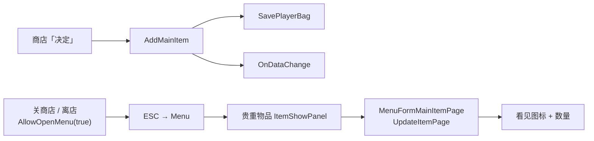
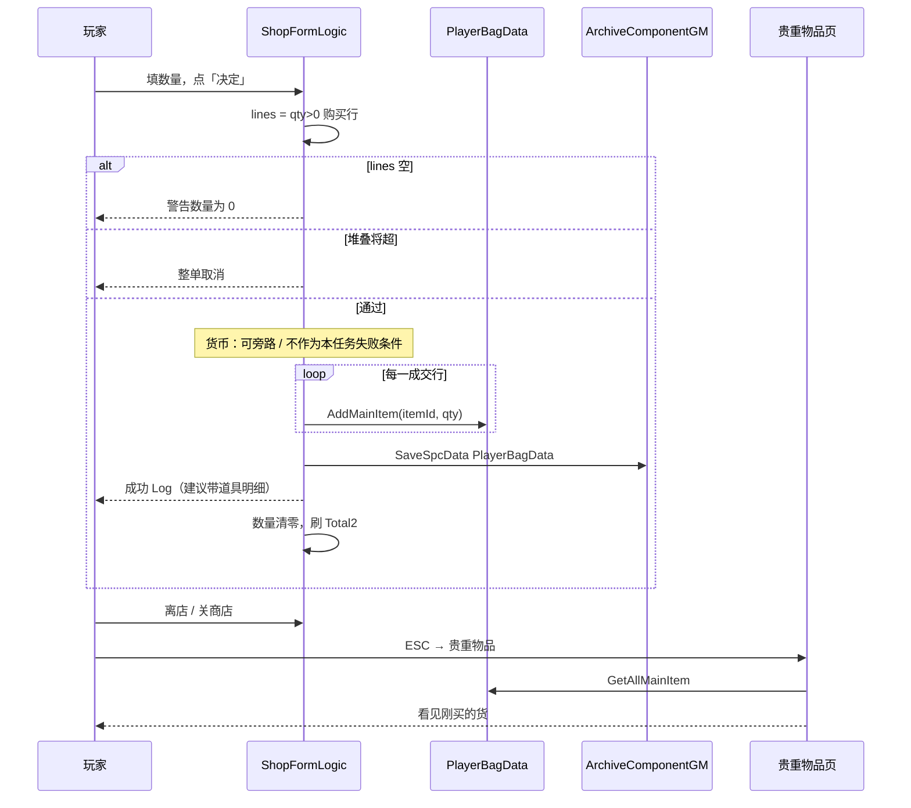

# 商店 × 背包联合（购买入包可见）— 架构溯源与施工执行说明

**文档版本**：v1（2026-07-13）  
**文档性质**：【架构侦探】逻辑溯源 + 施工指引（**本阶段先写文档，不改代码**；施工员按本文最小化改）  
**调查日期**：2026-07-13  
**触发**：商店 UI / MainItemDatabase / 背包展示已各自成型；下一步把**商店购买**与**背包账本**串成一条可验收链路。本轮**明确不验收货币**——只要求：点「决定」买到的货，在贵重物品页能看见对应数量。

**依据**：
- `Assets/Doc/00_MASTER_PROMPT.md`【架构侦探】
- `Assets/Doc/执行文档/0629/商店系统_策划拆解_执行说明.md`（阶段五「入包」意图）
- `Assets/Doc/执行文档/0713/Shop_货币金币对接_购买扣款闭环_架构溯源与施工执行说明.md`（已有扣款代码；**本任务不扩、不验金币**）
- `Assets/Doc/执行文档/0713/背包系统对接MainItemDatabase_新道具可查看_架构溯源与施工执行说明.md`（背包可见 / Icon 风险）
- `Assets/Doc/执行文档/0713/Village_Shop_ESC呼出菜单_架构溯源与施工执行说明.md`（进店 / ESC / 贵重物品入口）
- `Assets/Doc/执行文档/0704/Shop_Editor烘焙双列表_MainItemDatabase一键刷行_施工执行说明.md`（购买行列来源）

**Unity 版本**：2020.3.48f1  

---

## ① 结论（一句话）

**把「决定」定成：按购买 Tab 上 qty>0 的行，整单 `AddMainItem` 写入 `PlayerBagData` 并落盘；离开商店后打开贵重物品，必须能看到刚买的道具与数量。本阶段不改货币玩法、不验收金币加减；若现有扣款逻辑因「没钱」挡住入包，施工时加一个可关的旁路（或验收前用测试手段保证有钱），保证联合验收不被钱包卡死。**

**生活类比**：先保证「柜台交货进仓库、打开仓库能看见货」；刷不刷卡、卡里有没有钱，这轮先不查。

---

## ①.1 范围冻结

| 项 | 约定 |
|----|------|
| **本任务必做** | 购买 Tab +「决定」→ **真实入包**（`AddMainItem`）+ **背包存档落盘** + 贵重物品页**可见** |
| **入包口径** | 与 Total2 同扫行规则：仅 `QuantityForTotal > 0` 的购买行；多行一次成交、分别入包 |
| **验收标准（唯一）** | 买完后打开背包（贵重物品），对应道具图标/数量与购买一致（见 §⑦） |
| **货币** | **本阶段不设计、不验收**；不新增货币 UI、不改价表、不测「不足提示是否完美」 |
| **本阶段不做** | 出售 Tab 出包；药水使用效果；限购库存；按 NPC 分店；改 Bake / Database 结构 |
| **禁止** | 商店 UI 本地再造一套「假背包」；在 `Update` 里轮询刷背包；为联合验收重写整个商店 |

### 与相邻文档的边界

| 文档 | 本任务怎么对待 |
|------|----------------|
| `0713/Shop_货币金币对接_…` | 工程里可能**已有** `TrySpendPlayerGold`；本任务**不删该能力**，但验收**不看**金币变化。若「没钱」导致买不进 → 见 §4.3 旁路 |
| `0713/背包…新道具可查看_…` | 贵重物品「看得见」是前置；Icon 空格早退等问题按该文修，本任务负责**商店写入** |

---

## ② 玩家会遇到什么（施工前后对照）

| # | 操作 | 期望（本任务） | 明确不看 |
|---|------|----------------|----------|
| 1 | 购买页填「小生命药」数量 2，点「决定」 | Console 有成功/入包日志；数量可清零 | 金币是否减少 |
| 2 | 离店或关商店 → ESC → 贵重物品 | **小生命药 ×2**（或累加后的总数）出现在格子里 | — |
| 3 | 一次填多行（如生命之珠 1 + 鱼 1）再点「决定」 | 两件都进包 | — |
| 4 | 数量全 0 点「决定」 | 拒绝；包不变 | — |
| 5 | 持有已 10，再买会使某行超堆叠 | 整单失败、包不变（与现有预校验一致） | — |
| 6 | 出售 Tab 点「决定」 | 可继续打「出售未接入」；本任务不验出售 | — |

---

## ③ 架构溯源（现状快照 · 2026-07-13）

### 3.1 商店侧：决定按钮已经会入包

`ShopFormLogic.OnConfirmClick` 当前链路（侦探读码）：

```
购买 Tab？
  → CollectBuyLinesWithQuantity（qty>0）
  → total = Σ(qty×单价)          ← 本任务不验 total 对金币的影响
  → ResolvePlayerBagData()
  → TryValidateBuyStackLimits     ← 保留（防超堆叠脏数据）
  → TrySpendPlayerGold(total)     ← ★ 货币门；本任务验收要能旁路/不卡死
  → for each line: AddMainItem
  → SavePlayerBag()
  → 数量清零 + RefreshTotal2
```

| API | 路径 | 本任务态度 |
|-----|------|------------|
| `AddMainItem` | `PlayerBagData` | **主路径 · 必跑** |
| `SaveSpcData<PlayerBagData>` | `ArchiveComponentGM` | **必跑**（买完读档一致） |
| `TrySpendPlayerGold` | `QuestManager` | **存在即可**；验收不看结果；可临时旁路 |
| `OnDataChange` | `PlayerBagData` 静态事件 | 入包后会触发；贵重物品需**再打开**才刷列表 |

### 3.2 背包侧：展示入口



**关键约束（已落地）**：

- 商店 `OnOpen` → `AllowOpenMenu(false)`：**店开着时 ESC 开不出菜单**。  
- 因此验收路径必须是：**先关店/离店 → 再开贵重物品**，不能指望「店内直接叠背包」。

### 3.3 数据同源

| 层 | 真相源 |
|----|--------|
| 货架行是什么 | Bake 自 `MainItemDatabase`（Icon/Name/Price） |
| 入包键 | `EMainItemName` → `itemId.ToString()` |
| 格上图标/详情 | 入包时 `MainItemDefProvider.GetDef` 抄入 `MenuFormMainItemInfo` |

商店与背包**不需要**第二套货名表；联合的关键只是：**同一 itemId 写进 bag 字典**。

### 3.4 现状缺口（相对本任务验收）

| # | 缺口 | 影响 | 优先级 |
|---|------|------|--------|
| G1 | 金币为 0 时 `TrySpendPlayerGold` 失败 → **整单不入包** | 联合验收被货币卡死 | P0（旁路或验收前补钱） |
| G2 | 成功 Log 只写「扣除金币 n」，**不列道具清单** | Console 难对账「进了哪几件」 | P1 |
| G3 | 店内禁菜单；若验收员不知要先离店 | 误判「没刷进背包」 | 文档约束即可 |
| G4 | Icon 空导致格子空白 | 账本有货但看不见 | 跟背包文档 BAG-1/2，本任务回归 |

**结论**：数据写入路径大体已有；本任务施工重心是 **「别被金币挡住」+「验收路径写死」+（可选）入包明细 Log**，而不是重做商店。

---

## ④ 目标链路（定稿 · 本阶段）

### 4.1 购买成功（只关心入包）



### 4.2 整单策略（与现网一致，保留）

| 情况 | 行为 |
|------|------|
| 全部数量 0 | 不入包 |
| 任一行 held+qty > 10 | **整单失败**（先于写入） |
| 多行一次决定 | 全部写入或全部不写（堆叠预检通过后） |

### 4.3 货币旁路策略（本任务专用 · 施工必选一种）

> 用户要求：**先不用考虑货币**。下列三选一，施工时定一种并在代码注释写明「联合验收旁路，货币闭环仍见金币文档」。

| 方案 | 做法 | 取舍 |
|------|------|------|
| **A · 开关旁路（推荐）** | `ShopFormLogic` 增加 `[SerializeField] bool bypassGoldCheckForBagJoint`（本阶段开发默认 **true**）为 true 时**跳过** `TrySpendPlayerGold`，直接入包 | 验收不被卡；正式验货币前改 false |
| **B · 验收前补钱** | 不改扣款；测试面板 / 任务先 `AddGold` 足够金额再买 | 零代码；但验收步骤依赖货币子系统 |
| **C · 扣款失败也入包** | `TrySpend` 失败仍 `AddMainItem` | **禁止**（永久白嫖，污染正式逻辑） |

**定稿建议：方案 A**；合并进主流程前把开关关掉，货币验收交给原金币文档。

---

## ⑤ 施工清单（最小化改动）

### 5.1 改哪些文件

| # | 文件 | 改动 | 优先级 |
|---|------|------|--------|
| 1 | `ShopFormLogic.cs` | 按 §4.3 加货币旁路；保证旁路开启时仍跑堆叠预检 → `AddMainItem` → `SavePlayerBag` → 清数量 | P0 |
| 2 | `ShopDebugLogger.cs` | 新增/扩展成功 Log：列出每行 `itemId × qty`（可仍附带 total 数字，但文案以入包为准） | P1 |
| 3 | （按需）`MenuFormMainItemBtn` / `PlayerBagData` | 若背包文档的空 Icon / `DefinitionsRebuilt` 未修，本任务回归时一并修 | P0 若看不见 |

**不改**：Bake 工具、`MainItemDatabase` 价字段、出售结算、`PlayerGoldData` API 本身（旁路在商店侧跳过调用即可）。

### 5.2 建议施工顺序

1. **SB-0** · 确认正规进店路径：InitScene → 村 → `Village_Shop`（有 `GameSceneManager` + Archive）  
2. **SB-1** · 落地货币旁路（方案 A）  
3. **SB-2** · 入包明细 Log  
4. **SB-3** · 按 §⑦ 联合验收  
5. **SB-4** · 若格子空白 → 回修背包文档 BAG-1/2  

### 5.3 重要修改原因

- **为何不拆掉已有扣款代码**：货币文档已施工；拆掉会双线冲突。旁路开关比删代码更安全。  
- **为何验收必须先离店**：商店已 `AllowOpenMenu(false)`，店内无法开贵重物品——这是架构互斥，不是 Bug。  
- **替代方案**：店内再开一个「迷你背包预览」——超出本阶段范围，禁止。

---

## ⑥ 给程序的伪代码（旁路后核心）

```csharp
// OnConfirmClick · 本阶段关注点（伪代码）
if (!isBuyTab) { LogSellNotImplemented(); return; }

var lines = CollectBuyLinesWithQuantity();
if (lines.Count == 0) { LogZeroQuantityWarning(); return; }

var bag = ResolvePlayerBagData();
if (bag == null) { LogArchiveUnavailable(...); return; }
if (!TryValidateBuyStackLimits(bag, lines)) return;

// 货币：旁路开启则跳过；关闭则走原 TrySpendPlayerGold（失败则 return）
if (!bypassGoldCheckForBagJoint)
{
    if (!QuestManager.getInstance().TrySpendPlayerGold(CalcTotal(lines)))
    {
        LogInsufficientGold(...);
        return;
    }
}

foreach (var line in lines)
    bag.AddMainItem(line.ItemId, line.Quantity);

SavePlayerBag();
LogPurchaseIntoBag(lines); // 明细：SmallHpPotion x2, Fish x1 ...
ResetAllBuyQuantityInputs();
RefreshTotal2();
```

---

## ⑦ 验收清单（本任务唯一标准）

> **必须** InitScene 正规进游戏再进店。沙盒直开无 Archive → 入包失败，不算程序逻辑错。

| ID | 步骤 | 期望 |
|----|------|------|
| SB-V1 | 旁路开启（或已有足够金币） | 不会因「金币不足」卡死 |
| SB-V2 | 购买「小生命药」数量 **2**，点「决定」 | Console：`[ShopDebug]` 含入包成功及 `SmallHpPotion`×2（或等价明细） |
| SB-V3 | 离店 / 关商店 → ESC → **贵重物品** | 格中有小生命药，数量 **≥2**（若原先已有则累加） |
| SB-V4 | 再买「鱼」×1，重复 V2～V3 | 鱼出现；小生命药数量不丢 |
| SB-V5 | 多行同时：生命之珠×1 + 小体力药×1，点「决定」 | 两件都在背包 |
| SB-V6 | 数量 0 点「决定」 | 无入包；背包与点之前一致 |
| SB-V7 | 某道具已持有 10，再买 1 | 整单失败；该道具仍为 10 |
| SB-V8 | （本任务**不失败**）看金币 | 旁路开启时金币可变可不变；**不作为 Pass/Fail** |
| SB-V9 | 存档 → 读档 → 再开贵重物品 | 购买结果仍在 |

**失败判定**：

- Console 显示入包成功，但贵重物品完全没有该道具 → 查 `ResolvePlayerBagData` 是否写到另一份 Archive、或 Icon 空格早退。  
- 一直「金币不足」且未开旁路 → 先完成 SB-1，再测。

---

## ⑧ OPEN_QUESTIONS

| # | 问题 | 建议默认 |
|---|------|----------|
| Q1 | 旁路开关默认 true 还是 false？ | **本阶段开发包默认 true**；提测货币前改 false 并回归金币文档 |
| Q2 | 成功后是否在店内弹 Tips「已放入背包」？ | **否**（本阶段 Console + 离店验背包即可） |
| Q3 | 购买后是否自动关店并打开贵重物品？ | **否**；玩家自行离店再开菜单 |
| Q4 | 出售是否同批？ | **否**；本任务只做购买入包 |

---

## ⑨ 文件锚点（速查）

| 主题 | 路径 |
|------|------|
| 商店决定 | `Assets/Scripts/Game/GameRuntime/UI/FormLogic/Shop/ShopFormLogic.cs` |
| 商店 Log | `Assets/Scripts/Game/GameRuntime/UI/FormLogic/Shop/ShopDebugLogger.cs` |
| 背包账本 | `Assets/Scripts/Game/GameMgr/Component/Archive/ArchiveDataClass/Player/PlayerBagData.cs` |
| 贵重物品 | `Assets/Scripts/Game/GameRuntime/UI/FormLogic/ItemShowPanel/ItemShowFormLogic.cs` |
| 列表刷新 | `Assets/Scripts/Game/GameRuntime/UI/FormLogic/Menu/MenuFormProxy.cs` |
| 道具定义 | `Assets/GameRes/Config/MainItem/MainItemDatabase.asset` |
| 金币门面（旁路对象） | `QuestManager.TrySpendPlayerGold` |

---

## ⑩ 提交说明模板（施工完成后填）

- **改了哪些文件**：…  
- **实现了什么**：商店「决定」→ 背包真实入包；货币旁路保证联合验收；成功 Log 带道具明细。  
- **如何验证**：§⑦ SB-V1～V7、V9。  
- **未做 / 不验**：金币扣减表现、出售、用药效果。  
- **回退货币验收时**：将 `bypassGoldCheckForBagJoint = false`，按 `Shop_货币金币对接_…` 再测。

---

## ⑪ 与阶段路线的关系

| 阶段 | 内容 | 状态 |
|------|------|------|
| 商店 UI / Bake / Total2 | 列表与合计 | ✅ |
| 货币扣款 API | `TrySpendGold` 等 | ✅ 代码可能已有；**本任务不验** |
| 背包 Database 可见 | Icon / 详情 | ✅ / 按背包文档补洞 |
| **商店 × 背包联合** | **买完贵重物品能看见** | **← 本文** |
| 出售出包 + 加币 | 阶段六 | 后续 |
| 关闭旁路 + 货币正式验收 | 跟金币文档 | 后续 |

---

**侦探签字栏**：本阶段只产出本文档，不改代码。施工员按 §⑤ 最小化修改；验收严格以 §⑦「背包可见」为准，金币变化不作为本任务 Pass/Fail。
