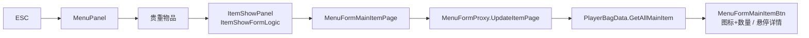
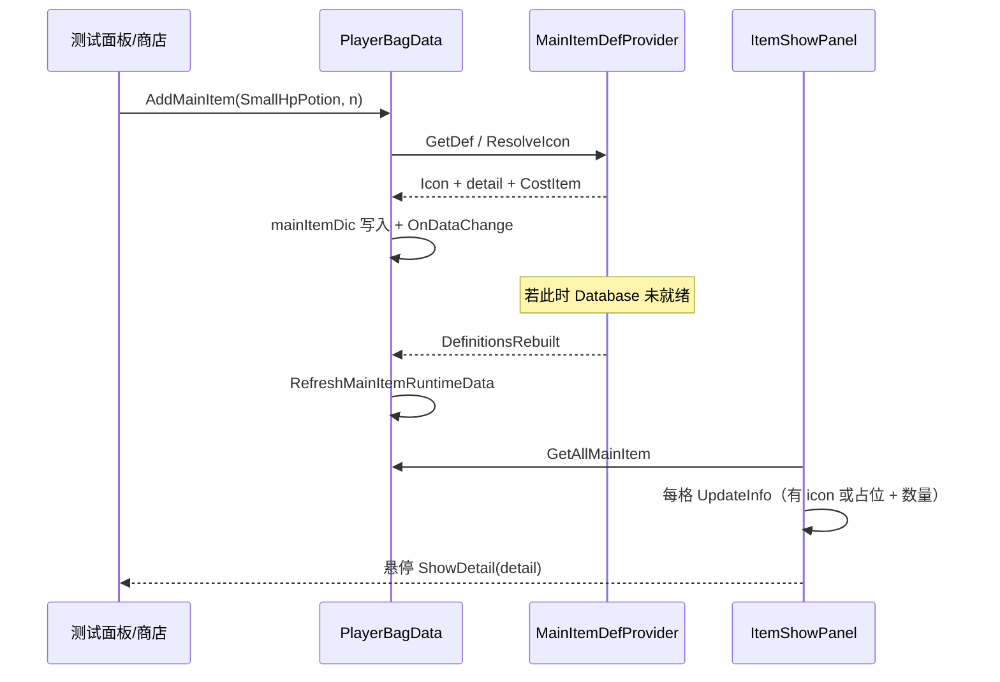

# 背包 · 对接 MainItemDatabase（新道具可查看）— 架构溯源与施工执行说明

**文档版本**：v1（2026-07-13）  
**文档性质**：【架构侦探】逻辑溯源 + 施工指引（**本阶段先写文档，不改代码**；施工员按本文最小化改）  
**调查日期**：2026-07-13  
**触发**：商店侧已用 `MainItemDatabase` 驱动货单；六件新消耗品（小/大生命药、小/大体力药、碗装液体、鱼）已入库。下一步要让**背包（贵重物品页）也能正确显示这些道具**——图标、数量、悬停详情，且与 Database 同一真相源。

**依据**：
- `Assets/Doc/00_MASTER_PROMPT.md`【架构侦探】
- `Assets/Doc/执行文档/0704/MainItem_道具固有属性表_架构溯源与施工执行说明.md`（Database 唯一源 · IA-3 背包改读）
- `Assets/Doc/执行文档/0704/MainItem_商店六道具ID补全_架构溯源与施工执行说明.md`（六新 ID）
- `Assets/Doc/执行文档/0704/Shop_货单瘦身_MainItemDatabase驱动Shop_Bar刷新_架构溯源与施工执行说明.md`
- `Assets/Doc/执行文档/0713/Shop_货币金币对接_购买扣款闭环_架构溯源与施工执行说明.md`（购买入包 API 衔接）
- `Assets/Doc/执行文档/0713/Village_Shop_ESC呼出菜单_架构溯源与施工执行说明.md`（菜单 / 贵重物品入口）

**Unity 版本**：2020.3.48f1  

---

## ① 结论（一句话）

**数据层已基本接通：`PlayerBagData` 入包 / 读档已走 `MainItemDefProvider.GetDef` ← `MainItemDatabase.asset`；本阶段要补的是「看得见」闭环——保证六件新道具入包后在贵重物品格显示图标与数量、悬停能读到 Database 详情，并堵住「Icon 为空整格消失 / 异步加载后不重刷」两个真实风险；药水使用效果与商店真购买另任务，本阶段只验收「包里能看见」。**

**生活类比**：总档案柜（Database）和仓库账本（背包存档）已经对上号了；现在要保证**打开仓库门时，新货架上的药瓶照片贴对、标签能看**，而不是账本有货、货架却空着。

---

## ①.1 范围冻结

| 项 | 约定 |
|----|------|
| **本任务必做** | 六新道具（及既有道具）入包后，在 **Menu → 贵重物品（ItemShowPanel）** 可见：图标、数量、悬停详情 |
| **唯一数据源** | `MainItemDatabase.asset` → `MainItemDefProvider`；**禁止**再从 `MainItemConfig.json` 读运行时展示 |
| **入包入口（验收用）** | 优先 `AA_TestPanel`「一键添加全部主道具」/ 按 enum 下标添加；商店真购买见 0713 金币文档（可并行，**不阻塞本任务验收**） |
| **本阶段可选** | 详情框展示 `displayName` 标题；`DefinitionsRebuilt` 后自动重刷背包 Icon |
| **本阶段不做** | 六新药使用回血/回体效果；`ItemSmallHpPotion` 等 BagPack 点击类；改商店 Bake；改 Database 价表结构 |
| **禁止** | 在背包 UI 另造第二套道具名字/图标字典；在 `Update` 轮询刷新背包 |

---

## ② 玩家会遇到什么（施工前后对照）

| # | 操作 | 施工前（现状风险） | 施工后（目标） |
|---|------|--------------------|----------------|
| 1 | 测试面板加满全部主道具 → ESC → 贵重物品 | 旧 9 件一般可见；六新件若 Icon 解析失败会**整格空白**（像没进包） | 15 种各有格：图标 + 数量 |
| 2 | 鼠标悬停新道具格 | 详情可能是「（待策划补全文案）」或空 | 至少能弹出 Database 的 `detail`（占位文案可接受） |
| 3 | 点击新药水格 | 无 `ItemXxx` 类 → **静默无反应** | **本阶段允许**；勿当成 Bug（见 §⑧ Q1） |
| 4 | Database 异步晚于入包 | `AddMainItem` 时 `def==null` → icon 空 → 打开背包看不见 | 图集/Database 就绪后重刷 Icon，再开页可见 |
| 5 | 商店买到新药再开背包 | 若购买仍假 Log，包内无货 | 本任务用测试面板验收；真购买闭环跟 0713 金币文档 |

---

## ③ 架构溯源：两套系统怎么叠在一起

### 3.1 道具固有属性（「这是什么货」）

| 组件 | 路径 | 职责 |
|------|------|------|
| **总表 Asset** | `Assets/GameRes/Config/MainItem/MainItemDatabase.asset` | 15 条 Entry：Icon / displayName / itemType / 买卖价 / detail* |
| **Entry** | `MainItemDefEntry.cs` | Inspector 可编辑的单行 |
| **只读视图** | `MainItemDef.cs` | 运行时不可改 |
| **统一入口** | `MainItemDefProvider.cs` | `EnsureLoaded` / `GetDef` / `ResolveIcon` / 商店候选列表 |
| **ID 枚举** | `EMainItemName.cs` | 存档字典键 = `itemId.ToString()` |

**当前 Database 快照（侦探实测 · 2026-07-13）**：15 条齐全；六新道具 `itemType=CostItem`，Icon 已拖 Sprite，`displayName` 为中文；详情多为「（待策划补全文案）」——**不影响「能看见」**。

| itemId（enum 下标） | displayName | itemType | buyPrice |
|---------------------|-------------|----------|----------|
| SmallHpPotion (9) | 小生命药 | CostItem | 20 |
| SmallMpPotion (10) | 小体力药 | CostItem | 20 |
| LargeHpPotion (11) | 大生命药 | CostItem | 50 |
| LargeMpPotion (12) | 大体力药 | CostItem | 50 |
| BowlLiquid (13) | 碗装液体 | CostItem | 500 |
| Fish (14) | 鱼 | CostItem | 500 |

### 3.2 背包运行时（「玩家有几件」）

| 组件 | 路径 | 职责 |
|------|------|------|
| **存档账本** | `PlayerBagData.cs` | `mainItemDic`（键=enum 名）、`quickItem[6]`、堆叠上限 10 |
| **格数据** | `MenuFormMainItemInfo` | index / name / icon / detail* / num / itemType |
| **加减 API** | `AddMainItem` / `TryRemoveMainItem` / `GetAllMainItem` | 入包时从 Provider 抄 Icon、detail、itemType |
| **读档同步** | `RefreshMainItemRuntimeData` | 用 Database **覆盖** 存档里的 icon/detail/itemType（icon/detail 不进 ES3） |

```
存档只持久化：name（string）、num、index、itemType、detail_en/jp …
展示用 icon / detail(中文) ：[ES3NonSerializable] → 每次 Parse 后从 MainItemDefProvider 重刷
```

### 3.3 背包 UI（「玩家怎么打开看」）



| 环节 | 脚本 | 说明 |
|------|------|------|
| 打开 | `ItemShowFormLogic.initData` → `MenuFormMainItemPage.OnOpen` | 正规路径：菜单「贵重物品」 |
| 刷列表 | `MenuFormProxy.UpdateItemPage` | 取 Archive 里的 `PlayerBagData`，回调 `onUpdateMainItem` |
| 单格 | `MenuFormMainItemBtn.UpdateInfo` | 设 `imgIcon` + `num`；点击走 `ItemBase.OnClick` |
| 悬停 | `MenuFormMainItemBtnMask` → `ShowDetail` | 按语言取 `detail` / `detail_en` / `detail_jp` |

**重要**：背包格**不显示** `displayName` 文本标题——只靠图标辨认；名称写在悬停详情文案里（若策划写了）。商店列表才有 Name 行。

### 3.4 使用效果链（本阶段边界外，但侦探须标清）

| 层 | 现状 | 对新六道具 |
|----|------|------------|
| `ItemBase.GetItemType` | 反射 `Game.GameRuntime.BagPack.Item{name}` | **无对应类 → 点击无事发生** |
| 已有类 | `ItemHpBall` / `ItemMpBall` / `ItemMap` | 仅旧三件 |
| `ItemEffectDataMgr.UseItem` | switch 仅 HpBall / MpBall | 新药未接 |

→ **「可查看」≠「可使用」**；本任务验收到「看见」即可。

### 3.5 数据层对接状态（相对 0704 IA-3）

| 0704 阶段 | 状态（2026-07-13） |
|-----------|-------------------|
| IA-0～IA-2 Database + Provider | ✅ 已落地 |
| IA-3 `PlayerBagData` 改读 Provider | ✅ `Init` / `AddMainItem` / `RefreshMainItemRuntimeData` 已用 Provider；JSON 已停 |
| 商店 Bake / 货单瘦身 | ✅ 另线完成 |
| **背包 UI「新道具可见」验收闭环** | ⚠️ **本任务**（见 §④） |

---

## ④ 缺口分析（为何还要写本施工单）

### 4.1 已通：入包数据路径

```
AddMainItem("SmallHpPotion", n)
  → MainItemDefProvider.GetDef(...)
  → MenuFormMainItemInfo { icon, detail*, itemType=CostItem, num }
  → mainItemDic["SmallHpPotion"]
  → OnDataChange（消耗品进 quickItem）
```

测试面板 `foreach (EMainItemName)` 会覆盖全部 15 个 enum，**含六新件**——数据侧可直接验收。

### 4.2 风险 A · Icon 为空则整格「消失」（P0）

```45:48:Assets/Scripts/Game/GameRuntime/UI/FormLogic/Menu/MainItemPage/MenuFormMainItemBtn.cs
            if (!item.icon)
            {
                imgIcon.gameObject.SetActive(false);
                return;
            }
```

`UpdateInfo` 在 `icon == null` 时**直接 return**：不绑定 `item`、不写数量。玩家侧现象 = **格子空的，像没进包**。  
Database 虽已拖 Icon，但若异步未就绪 / 读档瞬间 Provider 空，仍会踩坑。

**定稿修复方向（施工员二选一，优先 A）**：

| 方案 | 做法 | 取舍 |
|------|------|------|
| **A（推荐）** | `icon==null` 时仍绑定 `item`、显示数量；图标槽可隐藏或放占位图；`UpdateInfo` 末尾用 `MainItemDefProvider.ResolveIcon` 再试一次 | 最小改动，对玩家最友好 |
| B | 仅在 Provider `DefinitionsRebuilt` 后 `RefreshMainItemRuntimeData` + `UpdateItemPage` | 治本异步，但打开瞬间仍可能闪空 |

**本任务建议：A + B 同做**（改动都很小）。

### 4.3 风险 B · 异步加载完成后背包不重刷（P0）

`MainItemDefProvider` 已有 `DefinitionsRebuilt` 事件，注释写明「供 PlayerBagData 重刷 Icon」，但**当前无订阅方**。

**定稿**：

1. `PlayerBagData`（或 `MenuFormProxy.OnInit`）订阅 `DefinitionsRebuilt`  
2. 回调内：`RefreshMainItemRuntimeData()` + `OnDataChange?.Invoke(this)`（或只调 Proxy `UpdateItemPage`）  
3. `OnDestroy` / 关菜单时注意：Provider 是静态事件，订阅方需防重复 +=  

### 4.4 风险 C · `GuessItemType` 过窄（P1）

`def==null` 时仅 HpBall/MpBall 猜为消耗品，其余猜 **TaskItem**。六新药若在 Provider 未就绪时入包，会进「任务类」逻辑（快捷栏行为异常）。  
**缓解**：入包前 `EnsureLoaded`；异步完成后用 `RefreshMainItemRuntimeData` 纠正 `itemType`（已有逻辑，配合风险 B）。

### 4.5 非本任务缺口（记录，勿扩 scope）

| 缺口 | 归属 |
|------|------|
| 商店点「决定」真扣款 + `AddMainItem` | `0713/Shop_货币金币对接_…` |
| 新药点击使用回血/回体 | 另开「药水效果」任务 |
| 详情框显示中文名标题 | 可选增强；现 UI 无 Name 字段 |
| `MainItemName` 字符串常量类未含新 ID | 旧兼容；运行时以 enum / Database 为准，可不改 |

---

## ⑤ 目标链路（定稿）

### 5.1 「看得见」成功路径



### 5.2 职责边界

```
MainItemDatabase.asset     ← 固有：图、名、价、类型、详情
MainItemDefProvider        ← 只读查询 + Icon 解析
PlayerBagData             ← 持有数量 / 格序 / 快捷栏；展示字段从 Provider 抄
ItemShowPanel / MainItemPage ← 只渲染 MenuFormMainItemInfo，不查第二张表
```

---

## ⑥ 施工清单（最小化改动）

### 6.1 改哪些文件

| # | 文件 | 改动 | 优先级 |
|---|------|------|--------|
| 1 | `MenuFormMainItemBtn.cs` | `UpdateInfo`：无 icon 也绑定 item + 数量；可选再调 `ResolveIcon` | P0 |
| 2 | `PlayerBagData.cs` 或 `MenuFormProxy.cs` | 订阅 `DefinitionsRebuilt` → `RefreshMainItemRuntimeData` + 通知 UI | P0 |
| 3 | （可选）`MenuFormMainItemInfo` + `ShowDetail` | 增加 `displayName`，详情顶部显示中文名 | P2 |
| 4 | （可选）`MenuFormMainItemBtn.cs` 点击 | `GetItemType==null` 时 Debug.Log 一次「无可使用脚本」避免误以为坏了 | P2 |

**不改**：`MainItemDatabase.asset` 结构、商店 Bake、`ItemEffectDataMgr` 用药数值、`EMainItemName`（已含六新 ID）。

### 6.2 策划 / 资源检查（施工前 5 分钟）

打开 `MainItemDatabase.asset`，确认六新道具：

- [ ] `icon` 槽非空（已拖则无需改 PNG 文件名）
- [ ] `displayName` 正确
- [ ] `itemType = CostItem`
- [ ] `detail` 可为占位，但不要整段空到悬停完全无字（建议至少保留现有占位句）

### 6.3 建议施工顺序

1. **BAG-0** · 资源自检（§6.2）  
2. **BAG-1** · 修 `UpdateInfo` 空 Icon 早退  
3. **BAG-2** · 接 `DefinitionsRebuilt` 重刷  
4. **BAG-3** · 按 §⑦ 验收清单打勾  
5. **BAG-4**（可选）· displayName 进详情标题  

### 6.4 重要修改原因（给施工员）

- **为何不重写背包**：数据入口已在 Provider；重写目录违反 Master Prompt「不要一次重写」。  
- **为何不先做药水效果**：查看与使用解耦；效果缺数值与策划表，扩 scope 会拖住商店闭环。  
- **替代方案**：若坚持「无 icon 不显示」旧逻辑，则必须保证 `EnsureLoaded` 同步成功且入包只在 Database 就绪后——比改 UI 早退更脆，**不推荐**。

---

## ⑦ 验收清单

> 必须从 **InitScene** 正规进游戏（有 `GameSceneManager` + Archive），再开测试面板；勿只 Play 空场景。

| ID | 步骤 | 期望 |
|----|------|------|
| BAG-V1 | 打开 Database，核六新道具 Icon / 名 / CostItem | 与 §3.1 表一致 |
| BAG-V2 | 测试面板「一键添加全部主道具」 | Console 无 Provider 空引用；日志含 SmallHpPotion…Fish |
| BAG-V3 | ESC → 贵重物品 | **至少能看到六新道具图标与数量**（与旧道具同页网格） |
| BAG-V4 | 悬停「小生命药」格 | 弹出详情（占位文案可接受） |
| BAG-V5 | 存档 → 读档 → 再开贵重物品 | 六新件仍在；Icon 经 `RefreshMainItemRuntimeData` 仍正确 |
| BAG-V6 | （可选）仅添加 `SmallHpPotion` ×3 | 只有该格有货；数量显示 3；堆叠上限仍 10 |
| BAG-V7 | （对照）点击 `HpBall` | 仍可按旧逻辑使用；新药点击无效果 **不算失败** |

**失败判定**：

- 账本有货（测试日志已加）但贵重物品格完全空白 → 优先查风险 A/B。  
- `GetDef` 恒 null → 查 `MainItemDatabase.asset` 是否进资源包 / `ResComponentGM` 路径是否与 `MainItemDefProvider.MainItemDatabaseAssetPath` 一致。

---

## ⑧ OPEN_QUESTIONS（发现设计不清时只记此处，勿擅自改方向）

| # | 问题 | 建议默认 |
|---|------|----------|
| Q1 | 新消耗品点击无 `ItemXxx` 类，是否要在本任务补空壳？ | **否**；本任务只查看。空壳留给效果任务 |
| Q2 | 详情是否必须显示中文名？ | **否**；现 UI 无 Name。若策划要求，做可选 BAG-4 |
| Q3 | 消耗品进快捷栏后战斗 HUD 是否要能用新药？ | **本阶段否**；快捷栏有图标即可，使用仍走 `ItemEffectDataMgr` 旧 switch |
| Q4 | 商店购买与背包验收是否绑死？ | **不绑死**；用测试面板验收查看；购买闭环跟金币文档 |

---

## ⑨ 给程序的文件锚点（速查）

| 主题 | 路径 |
|------|------|
| 总表 | `Assets/GameRes/Config/MainItem/MainItemDatabase.asset` |
| Provider | `Assets/Scripts/Game/DataTable/MainItem/MainItemDefProvider.cs` |
| 背包存档 | `Assets/Scripts/Game/GameMgr/Component/Archive/ArchiveDataClass/Player/PlayerBagData.cs` |
| 格数据 | `Assets/Scripts/Game/GameRuntime/UI/FormLogic/Menu/MenuFormMainItemInfo.cs` |
| 列表页 | `Assets/Scripts/Game/GameRuntime/UI/FormLogic/Menu/MainItemPage/MenuFormMainItemPage.cs` |
| 单格 UI | `Assets/Scripts/Game/GameRuntime/UI/FormLogic/Menu/MainItemPage/MenuFormMainItemBtn.cs` |
| 菜单代理 | `Assets/Scripts/Game/GameRuntime/UI/FormLogic/Menu/MenuFormProxy.cs` |
| 贵重物品面板 | `Assets/Scripts/Game/GameRuntime/UI/FormLogic/ItemShowPanel/ItemShowFormLogic.cs` |
| 枚举 | `Assets/Scripts/Game/Static/Enum/Goods/EMainItemName.cs` |
| 测试加货 | `Assets/Scripts/Game/GameRuntime/UI/FormLogic/AA_TestPanel/AA_TestPanel.cs` |
| 点击使用（边界外） | `Assets/Scripts/Game/GameRuntime/BagPack/ItemBase.cs`、`ItemEffectDataMgr.cs` |

---

## ⑩ 提交说明模板（施工完成后填）

- **改了哪些文件**：…  
- **实现了什么**：堵住空 Icon 早退；Database 异步就绪后重刷背包展示；六新道具贵重物品页可查看。  
- **如何验证**：按 §⑦ BAG-V1～V5。  
- **未做**：药水使用数值、商店扣款入包（见对应文档）。

---

## ⑪ 与相邻文档的关系

| 文档 | 关系 |
|------|------|
| `0704/MainItem_道具固有属性表_…` | 数据源奠基；本文是其「背包可见」验收续篇 |
| `0704/MainItem_商店六道具ID补全_…` | ID / 命名已落地；本文消费这些 ID |
| `0713/Shop_货币金币对接_…` | 上游入包正式途径；可并行，不阻塞 BAG-V |
| `0713/Village_Shop_ESC呼出菜单_…` | 保证能正规打开 Menu / 贵重物品 |

---

**侦探签字栏**：本阶段只产出本文档，不改代码。施工员按 §⑥ 最小化修改后，用 §⑦ 验收；若 Database 资源或菜单入口环境有问题，按 Master Prompt 记入 OPEN_QUESTIONS，勿临时硬编码第二套道具表。
)
