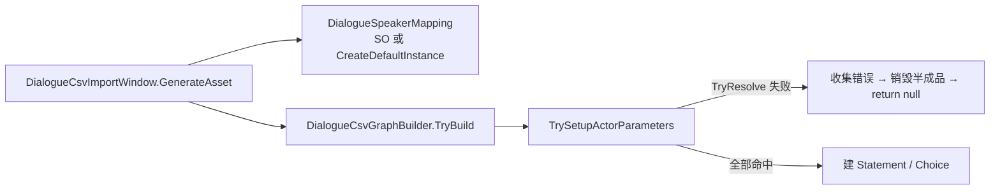

# CSV 导入 — Speaker「2」「3」映射缺失 — 架构溯源报告

**文档性质**：架构侦探产出（只读溯源 + 最小施工建议；**本阶段不改代码**）  
**日期**：2026-08-20  
**依据**：
- `Assets/Doc/00_MASTER_PROMPT.md`【架构侦探】
- 提示词：`Assets/Doc/提示词/0820/CSV导入_Speaker2与3映射缺失_架构侦探提示词.md`
- 先例施工：`Assets/Doc/执行文档/6月/0601/CSV导入工具_Speaker映射扩展_施工执行说明.md`
- 先例溯源：`Assets/Doc/执行文档/6月/0608/CSV导入工具_埃吉尔Speaker映射缺失_架构溯源与执行说明.md`
- 台本：`Assets/Doc/执行文档/6月/0601/Village_HomeScene23_屋内NPC对白台本_执行说明.md` §1.2
- 现场 CSV：`Assets/Dialog/Village_NPC23椅子孩子第一天对话.csv`

**Unity 版本**：2020.3.48f1  

---

## ① 结论一句话

**导入报错不是 CSV 坏了，而是 Speaker 映射表里没有「2」「3」这两行；仿 0608 埃吉尔先例，在内置默认 + `DialogueSpeakerMapping_Default.asset` 各补 `2→NPC2`、`3→NPC3`，再 Import 即可。**

---

## ② 原因（生活类比）

CSV 里的 Speaker 像快递单上的昵称（写了「2」「3」），映射表是姓名对照册。册子里只有「雅→雅尔」「埃吉尔→埃吉尔」等，没有「2」「3」，导入器宁可整批拒收，也不生成带「红色未定义 Actor」的坏图——这是**有意安全中止**，不是解析崩了。

台本语义（0601 §1.2 + 现网 Prefab）已经钉死：

| CSV Speaker | 是谁 | 图内 Actor 名（推荐） |
|-------------|------|----------------------|
| `2` | 屋里孩子 | **`NPC2`** |
| `3` | 屋里妈妈 | **`NPC3`** |
| `雅` | 玩家 | `雅尔`（已有，不报错） |

现网证据：`Village_NpcChairChild.prefab` 的 `actorParameters` 已有 **`NPC2`**；`HomeScene1Npc3.prefab` 已有 **`NPC3`**。故选方案 A（`NPC2`/`NPC3`），不选恒等 `2`/`3`，也不先改 CSV 成中文。

---

## ③ 用户需要做什么（检查清单）

> 本期侦探**不施工**。拍板后交给施工员；你自己急着导入可先按下面做。

### 必改两处（与 0608 一致，两处都要改）

| # | 文件 | 操作 |
|---|------|------|
| 1 | `Assets/Editor/Tool/Dialogue/DialogueSpeakerMapping.cs` | `CreateDefaultInstance()` 追加两行：`2→NPC2`、`3→NPC3` |
| 2 | `Assets/Editor/Tool/Dialogue/DialogueSpeakerMapping_Default.asset` | Entries 同步追加同样两行 |

代码追加示例（施工员照抄）：

```csharp
// HomeScene23 椅子孩子台本：CSV 用数字简称「2」「3」，图内 Actor 与现网 Prefab 一致为 NPC2 / NPC3
new Entry { csvSpeaker = "2", actorParameterName = "NPC2" },
new Entry { csvSpeaker = "3", actorParameterName = "NPC3" },
```

### 验收（施工后）

1. **Tools → Dialogue → Import CSV**，选 `Assets/Dialog/Village_NPC23椅子孩子第一天对话.csv`
2. Console **无** `Speaker「2」` / `Speaker「3」` 未在映射表中找到
3. 能生成 DialogueTree `.asset`；图内 `actorParameters` 含 **NPC2、NPC3、雅尔**
4. 回归：村内雅古 / 晚宴 / 埃吉尔 CSV 仍能导入（旧映射未丢）

### 注意

- 窗口 **不拖** Speaker 映射时走 `CreateDefaultInstance()` 内存副本；**只改 `.asset` 不改代码**时，必须在 Import 窗口把 SO 拖进去，否则仍报错。
- **默认不改 CSV**（Speaker 继续写 `2`/`3`）。
- 本期不做立绘、不挂 `QuestAcceptAction`；空 FaceType 会 Warning 并用 Normal，不阻塞导入。

---

## ④ 给程序看的补充

### 4.1 报错调用链



| 步骤 | 位置 | 行为 |
|------|------|------|
| 取映射 | `DialogueCsvImportWindow` ≈ L167 | 窗口 ObjectField 为空 → `CreateDefaultInstance()` |
| 解析 | `DialogueSpeakerMapping.TryResolve` | Trim 后与 `csvSpeaker` **完全相等**（区分大小写） |
| 校验 | `DialogueCsvGraphBuilder.TrySetupActorParameters` ≈ L300–312 | 未命中 → 收集 `Speaker「{speaker}」（ID {id}）未在映射表中找到，导入已中止。`；有错误则 **整批中止** |
| 结论 | — | **安全中止**，不是 CSV 列解析失败 |

### 4.2 现场 CSV 对拍（`Village_NPC23椅子孩子第一天对话.csv`）

| ID | Speaker | 台词摘要 | 映射现状 |
|----|---------|----------|----------|
| 1 | `2` | 妈妈，有外人！ | ❌ 缺 |
| 2 | `3` | 是谁呀？ | ❌ 缺 |
| 3 | `2` | 是怪人！她还长角！！ | ❌ 缺 |
| 4 | `3` | 不能这么说话！… | ❌ 缺 |
| 5 | `3` | 不好意思有什么事吗？ | ❌ 缺 |
| 6 | `雅` | 啊啊。。。。我只是随便转转。。。。 | ✅ → 雅尔 |
| 7 | `3` | 欢迎做客,有件事我想请你帮忙， | ❌ 缺 |
| 8 | `雅` | 嗯? | ✅ → 雅尔 |
| 9 | `3` | 虽然冒昧但看你的样子… | ❌ 缺 |
| 10 | `3` | …收集点藤蔓果吗，五个就好。 | ❌ 缺 |
| 11 | `3` | 我会给你报酬的。 | ❌ 缺 |

与 Console 预扫一致：`3` 报在 ID 2、4、5、7、9、10、11；`2` 报在 ID 1、3；`雅` 不报。

> 台本比 0601 §1.2 多了采藤蔓果请托（摘果子任务线），但不改变 Speaker 映射问题。

### 4.3 现网映射完整表（缺项）

**内置默认**（`CreateDefaultInstance`）与 **`DialogueSpeakerMapping_Default.asset`** 现网均为 **7 条且一致**：

| CSV Speaker | 图内 Actor | 状态 |
|-------------|------------|------|
| `雅` | `雅尔` | ✅ |
| `古` | `古莎` | ✅ |
| `艾米` | `艾米` | ✅ |
| `艾莉` | `艾莉` | ✅ |
| `村` | `村长` | ✅ |
| `埃吉尔` | `埃吉尔` | ✅ |
| `—` | `旁白` | ✅ |
| **`2`** | **`NPC2`** | ❌ **本次** |
| **`3`** | **`NPC3`** | ❌ **本次** |

窗口未拖 SO 时走内置默认；拖 Default.asset 时走 SO。补映射须 **两处同步**，避免「拖 / 不拖」分叉（对齐 0608）。

### 4.4 Actor 名裁定（A/B/C/D）

| 方案 | `2` → | `3` → | 裁定 |
|------|--------|--------|------|
| **A** | `NPC2` | `NPC3` | **✅ 推荐** |
| B | `孩子` | `妈妈` | 不选：现网 Prefab 无此 Actor 名 |
| C | `2` | `3` | 不选：能导入但图内名难看，难绑立绘 |
| D | 改 CSV 成中文再映射 | — | 不选：开发者明确要「加 Speaker」，非改策划表 |

**推荐理由**：

1. 0601 台本说话人就叫 NPC2 / NPC3。  
2. 现网 `Village_NpcChairChild` / `HomeScene1Npc3` 图内 `_keyName` 已是 **NPC2 / NPC3**。  
3. 与场景 `Entity/Npc2`、`Entity/Npc3` 命名一致，后续 Bind Prefab 少踩坑。

### 4.5 FaceType / 立绘影响

| 项 | 现状 |
|----|------|
| CSV FaceType | 多数空；雅行有 `Awkward` / `Surprised` |
| `DialogueFaceTypeCsvDefaults` | 无 NPC2/NPC3 专支；未知名走通用 Warning + **Normal** |
| `DialogueRoleName` | 无 NPC2/NPC3 枚举 → 立绘本期可不显示，**字幕可播** |
| 施工建议 | **可不改** FaceType 默认表（与村长/埃吉尔早期同：Warning 不阻塞）；若要少刷 Warning，可仿埃吉尔加 `NPC2`/`NPC3` → Normal |

### 4.6 最小施工清单（只建议）

| 文件 | 操作 | 必做？ |
|------|------|--------|
| `DialogueSpeakerMapping.cs` | `CreateDefaultInstance` +2 行；注释说明数字简称→NPC2/3 | **必做** |
| `DialogueSpeakerMapping_Default.asset` | 同步 +2 行 | **必做** |
| `DialogueCsvImportWindow.cs` HelpBox | 内置默认摘要补上 `2→NPC2、3→NPC3` | 建议 |
| `DialogueFaceTypeCsvDefaults.cs` | 可选：NPC2/NPC3 → Normal + Warning | 可选 |
| 技术文档映射表 | 实施后同步 | 建议 |
| CSV | **不改** | — |
| `Assets/Scripts/Game/**` | **禁止** | — |

**禁止扩 scope**：任务接取节点、新立绘图集、把数字 Speaker 改成「解析 bug」叙事。

### 4.7 开放问题（已记入 OPEN_QUESTIONS）

见 `Assets/Doc/OPEN_QUESTIONS.md` →「CSV Speaker 2/3 映射 · 2026-08-20」。

| ID | 问题 | 施工默认 |
|----|------|----------|
| Q1 | Actor 最终叫 `NPC2`/`NPC3` 还是中文「孩子/妈妈」？ | **NPC2 / NPC3**（本报告推荐 A） |
| Q2 | 立绘图集本期是否占位？ | **否**；导入与字幕不阻塞 |
| Q3 | 是否允许策划继续用数字 Speaker，还是规范成简称？ | **本期允许**保留 `2`/`3`；新台本建议写 `NPC2`/`NPC3` 并做恒等映射（另议） |

---

## 5. 相关文档索引

| 主题 | 路径 |
|------|------|
| 本提示词 | `Assets/Doc/提示词/0820/CSV导入_Speaker2与3映射缺失_架构侦探提示词.md` |
| 0601 Speaker 扩展 | `Assets/Doc/执行文档/6月/0601/CSV导入工具_Speaker映射扩展_施工执行说明.md` |
| 0608 埃吉尔映射 | `Assets/Doc/执行文档/6月/0608/CSV导入工具_埃吉尔Speaker映射缺失_架构溯源与执行说明.md` |
| 屋内台本 | `Assets/Doc/执行文档/6月/0601/Village_HomeScene23_屋内NPC对白台本_执行说明.md` |
| 映射类 / SO | `Assets/Editor/Tool/Dialogue/DialogueSpeakerMapping.cs`、`…_Default.asset` |

---

## 6. 文档修订

| 日期 | 说明 |
|------|------|
| 2026-08-20 | 初版：对拍 CSV 与现网映射；裁定 `2→NPC2`、`3→NPC3`；最小施工与验收清单 |

**文档路径**：`Assets/Doc/执行文档/0820/CSV导入_Speaker2与3映射缺失_架构溯源报告.md`
