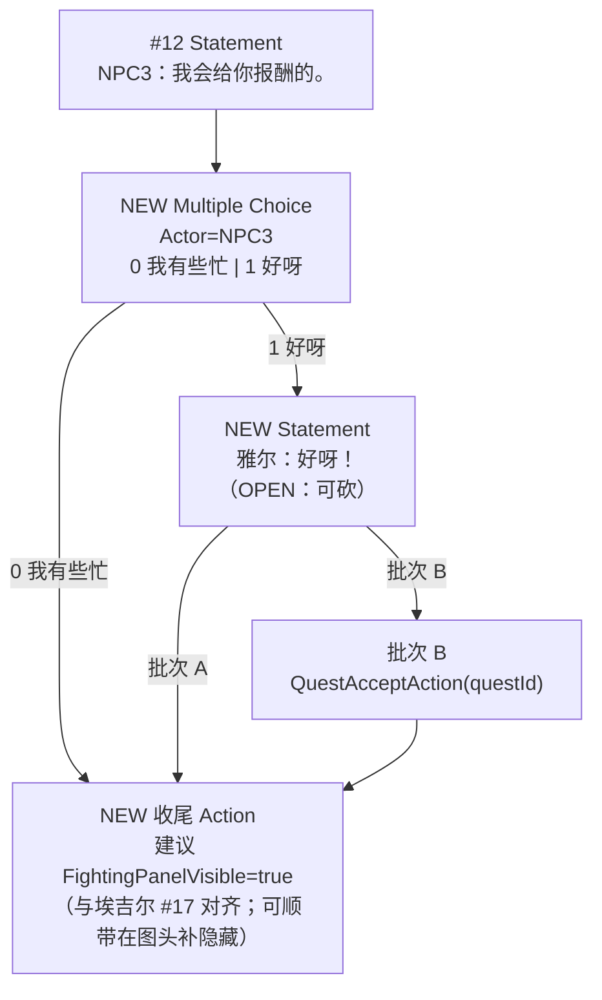

# Village_QuestOffer_NPC23 — 对话末接任务双选项 — 架构溯源报告

**文档性质**：架构侦探产出（只读溯源 + 分批施工建议；**本阶段不改代码 / Prefab**）  
**日期**：2026-08-20  
**依据**：
- `Assets/Doc/00_MASTER_PROMPT.md`【架构侦探】
- 提示词：`Assets/Doc/提示词/0820/Village_QuestOffer_NPC23_对话末接任务选项_架构侦探提示词.md`
- 埃吉尔双选项：`Assets/Doc/执行文档/6月/0608/Village_Aegir_QuestOffer_对话末尾双选项_架构溯源与施工执行说明.md`
- 埃吉尔接取：`Assets/Doc/执行文档/6月/0608/Village_Aegir_Quest001_接取追踪_架构溯源与施工执行说明.md`
- Speaker 2/3：`Assets/Doc/执行文档/0820/CSV导入_Speaker2与3映射缺失_架构溯源报告.md`
- 目标 Prefab：`Assets/GameRes/Prefabs/Dialogue/Village_QuestOffer_NPC23.prefab`
- 样板 Prefab：`Assets/GameRes/Prefabs/Dialogue/Village_Aegir_QuestOffer.prefab`
- CSV：`Assets/Dialog/Village_NPC23椅子孩子第一天对话.csv`

**Unity 版本**：2020.3.48f1  

---

## ① 结论一句话

**`Village_QuestOffer_NPC23` 对白 1～11 已在图里，但末尾还没有 MultipleChoice / QuestAccept；仿埃吉尔：在「我会给你报酬的。」之后手插双选项「我有些忙 | 好呀」，先做批次 A（只弹出选项），接任务 `QuestAccept` + 新 questId（采藤蔓果）放到批次 B——现网没有采集任务运行时，不能把「选项做不了」和「采集未做」绑死。**

---

## ② 原因（生活类比）

对白是剧本；选项是剧本**末页印的菜单**（「我有些忙 / 好呀」）；任务表是厨房订单本。  
菜单由对话图的 **Multiple Choice** 节点弹出（全局对话框克隆按钮），**不是**任务表刷出来的。  
点「好呀」之后，图上再挂「接取任务」Action，才把订单写进本子——那是另一页（批次 B）。

---

## ③ 用户需要做什么（检查清单）

### 先做：批次 A（只双选项，本期推荐）

打开 `Village_QuestOffer_NPC23.prefab` → Dialogue Tree Controller → **Edit Graph**：

| 步骤 | 操作 |
|------|------|
| 1 | 找到末句 Statement：**NPC3「我会给你报酬的。」**（现网节点 **#12**） |
| 2 | 在其后 **Add Node → Multiple Choice**；Actor 选 **NPC3**（妈妈请托） |
| 3 | Add Choice ×2，文案顺序：下标 **0 =「我有些忙」**，**1 =「好呀」**（对齐埃吉尔：拒在前、接在后） |
| 4 | 断开「#12 无出边直接结束」；改为 **#12 → Multiple Choice** |
| 5 | 出口 0「我有些忙」→ 收尾叶子（建议补一个 **FightingPanelVisible=true** 或空 Action 叶子；见 §4.3） |
| 6 | 出口 1「好呀」→（建议）新建 Statement 雅尔「好呀！」→ 同一收尾叶子；**批次 A 不挂 QuestAccept** |
| 7 | Graph Save → Prefab Apply |

**不要**：新建「选项 Prefab」；不要改 `Village_Aegir_QuestOffer`；不要改 CSV（手改 Graph 即可）。

### 后做：批次 B（接任务，须先拍板 questId）

| 步骤 | 操作 |
|------|------|
| 1 | `QuestConfig.json` 新增一行（建议名 **`Quest_002`**，OPEN 待确认） |
| 2 | 在「好呀！」句之后挂 **接取任务** `QuestAcceptAction`，`questId` 填新 ID |
| 3 | 再接到收尾叶子 |

### 再后：批次 C（采果进度 / 交付）

另立项：现网只有 `KillMonster` + `OnMonsterKilled`；**没有** `CollectItem` / 拾取计数。物品 `TenWangFruit`（藤蔓果）已在 `MainItemConfig`，但任务系统未接。

### 场景挂接（可与 A 同批或稍后）

`Village_HomeScene23` 里 **`NpcChair`** 当前 `StoryPrefabName = Village_Aegir_QuestOffer`（挂错成埃吉尔对白）。应改为 **`Village_QuestOffer_NPC23`**（OPEN Q3 确认后改）。

### 验收（批次 A）

| # | 操作 | 通过 |
|---|------|------|
| A1 | DialogDebug 或进屋点椅子 NPC 播完末句 | 弹出两按钮：**我有些忙**、**好呀** |
| A2 | 点「我有些忙」 | 对话结束；Console **无** `[Quest] Accept` |
| A3 | 重开，点「好呀」 | （若有复读句）雅尔说「好呀！」→ 结束；批次 A 仍无 Accept |
| A4 | 埃吉尔线回归 | `Village_Aegir_QuestOffer` 文案仍是「我还有事 / 我会努力的」 |

---

## ④ 给程序看的补充

### 4.1 埃吉尔样板（现网对拍）

| 项 | `Village_Aegir_QuestOffer` |
|----|------------------------------|
| 末请托句 | Statement #14：埃吉尔「…清理掉 10 个虫子」 |
| Multiple Choice | #16；Actor=埃吉尔；**我还有事 \| 我会努力的** |
| 拒（index 0） | → #17 `FightingPanelVisible(true)` 收尾 |
| 接（index 1） | → #15 雅尔「我会努力的！」→ #18 `QuestAcceptAction(Quest_001)` → #17 |
| 前奏 | FightingPanel 隐藏 + 立绘淡入 + UI Alpha |
| 选项来源 | **手改 Graph**（CSV Choice 可选；Accept **无法** CSV 导入） |

调用链（可复用）：

```
NPC 按 E → TriggerStory(Offer Prefab)
  → …对白…
  → MultipleChoice
  → 拒：收尾 END（不 Accept）
  → 接：雅尔复读句 → QuestAcceptAction(questId) → 收尾
  → QuestManager.AcceptQuest → QuestConfig 校验 → 存档
```

### 4.2 NPC23 现状检查表（对拍 Prefab 序列化）

| 检查项 | 有/无 | 锚点 |
|--------|-------|------|
| Hierarchy：Yaer / NPC2 / NPC3 | ✅ | Prefab 子物体已有 |
| Graph actorParameters：雅尔 / NPC2 / NPC3 | ✅ 有名字 | `derivedData`；**未见 `_actorObject` 绑定序号**——施工时在 NodeCanvas 确认 Actor 已绑到 Hierarchy |
| 前奏立绘淡入 | ✅ | #0 `CanvasGroupAlpha` → `GoOutStoryYaerPainting` |
| 前奏 UI Alpha | ✅ | #1 `NormalDialogueUIAlphaAnimationTaskAction` |
| 前奏藏战斗面板 | ❌ | 无 `FightingPanelVisible`；埃吉尔有 |
| CSV 对白 1～11 | ✅ | #2～#12 线性；末句 #12「我会给你报酬的。」 |
| MultipleChoice | ❌ | 全图无此类型 |
| 「我有些忙」「好呀」 | ❌ | — |
| QuestAcceptAction | ❌ | — |
| 收尾 FightingPanel / 结束 Action | ❌ | #12 无出边，播完即 Success 结束 |

**结论**：对白与 Actor 名已齐；**只需在 #12 后插 MC + 分支/收尾**，不必重导 CSV。施工前在 Editor 确认 Actor 已 Bind 到 Yaer/NPC2/NPC3 物体。

### 4.3 推荐 Graph 拓扑（批次 A → B）



| 按钮 | 文案（已定） | 出边 |
|------|--------------|------|
| index 0 | **我有些忙** | → 收尾；**不** Accept |
| index 1 | **好呀** | → 雅尔「好呀！」→（A 直接收尾 / B 再挂 Accept）→ 收尾 |

**为何建议雅尔复读「好呀！」**：埃吉尔样板有「我会努力的！」复读，情绪完整后再签收；NPC23 CSV **没有**这句，故手补一句，记 OPEN Q1——若嫌啰嗦可批次 A 直接「好呀」→ END。

**CSV**：默认**不动**。若以后要表驱动选项，可加 `Type=Choice` + Extra=`我有些忙|好呀`，但仍须手补 QuestAccept。

**收尾节点**：Multiple Choice 至少要有出边；拒分支需接到叶子。NPC23 现无战斗面板显隐——建议仿埃吉尔补「开始隐藏 + 结束显示」，或拒/接都接到同一空 Action / FightingPanel 叶子，避免「无连接」报错。

### 4.4 埃吉尔 vs NPC23 对照

| 维度 | 埃吉尔（现网） | NPC23（现状 → 目标） |
|------|----------------|----------------------|
| Prefab | `Village_Aegir_QuestOffer` | `Village_QuestOffer_NPC23` |
| 请托角色 | 埃吉尔 | NPC3（妈妈）；NPC2 开场 |
| 末句后 MC | ✅ | ❌ → 补 |
| 拒 / 接文案 | 我还有事 / 我会努力的 | **我有些忙 / 好呀** |
| 接受后雅尔句 | 我会努力的！ | 建议「好呀！」（OPEN） |
| QuestAccept | `Quest_001` | 批次 B；新 questId |
| 任务内容 | 杀 WoodWorm ×10 | 台本：藤蔓果 ×5（`TenWangFruit`） |
| QuestConfig 行 | ✅ 仅 001 | ❌ 无采集行 |
| 进度运行时 | `OnMonsterKilled` | ❌ 无 CollectItem |
| 场景挂点 | HomeScene2 埃吉尔 | HomeScene23 **`NpcChair` 现误挂 Aegir Offer** |

### 4.5 与任务系统对接（分批）

| 批次 | 交付 | 验收 | 依赖 |
|------|------|------|------|
| **A 选项** | Graph：#12→MC；拒 END；接可「好呀！」+END | 弹出正确文案；拒无 Accept | 无 |
| **B 接取** | `QuestConfig` 新行 + `QuestAcceptAction` | Console `[Quest] Accept Quest_xxx` | A + 拍板 questId |
| **C 采集** | 拾取 `TenWangFruit` 计数 + 交付对白 | 进度 0→5；回 NPC 交 | B + 新 objectiveType 施工 |

**现网钉死**：

- `QuestConfig.json` **只有** `Quest_001`（KillMonster / WoodWorm / 10 / Gold 60）。  
- `QuestManager.OnMonsterKilled` **只认** `objectiveType == KillMonster`。  
- 全工程 **无** `CollectItem` / `OnItemCollected` 任务入口。  
- `TenWangFruit` 已在主物品表（商店可卖），**不等于**任务进度已接。  
- 批次 B 若只 Accept：任务会进存档 `InProgress`，但**杀怪/捡果都不会涨进度**——仅占位可测「选项接上了」；真正采果属批次 C。

**questId**：推荐候选 **`Quest_002`**（勿擅自写入配置，记 OPEN Q2）。  
**勿**把 `Quest_001` 挂到「好呀」上（会误接杀虫任务）。

### 4.6 场景侧（后续）

| 物体 | 当前 `StoryPrefabName` | 建议 |
|------|------------------------|------|
| `Village_HomeScene23` / **`NpcChair`** | `Village_Aegir_QuestOffer` | 改为 **`Village_QuestOffer_NPC23`**（确认后） |
| `Npc1` | `HomeScene1Npc1` | 无关本期 |

0601 台本建议资源名曾为 `Village_HomeScene23_Npc2_3_First`；现网已用 **`Village_QuestOffer_NPC23`**，以 Prefab 实名为准。

### 4.7 开放问题（已记入 OPEN_QUESTIONS）

| ID | 问题 | 施工默认 |
|----|------|----------|
| Q1 | 接受后雅尔是否要说「好呀！」？ | **建议要**（对齐埃吉尔复读）；可砍 |
| Q2 | questId / CollectItem 何时做？ | 批次 A 不做 Accept；B 建议 `Quest_002` + 可先仅 Accept 占位；C 另立项 |
| Q3 | 场景哪个 NPC 挂本 Prefab？ | **`NpcChair`**（现误挂埃吉尔 Offer，应改名） |

---

## 5. 相关文档索引

| 主题 | 路径 |
|------|------|
| 本提示词 | `Assets/Doc/提示词/0820/Village_QuestOffer_NPC23_对话末接任务选项_架构侦探提示词.md` |
| 埃吉尔双选项 / 接取 | `Assets/Doc/执行文档/6月/0608/…` |
| Speaker 2/3 | `Assets/Doc/执行文档/0820/CSV导入_Speaker2与3映射缺失_架构溯源报告.md` |
| 屋内台本 | `Assets/Doc/执行文档/6月/0601/Village_HomeScene23_屋内NPC对白台本_执行说明.md` |

---

## 6. 文档修订

| 日期 | 说明 |
|------|------|
| 2026-08-20 | 初版：对拍 NPC23 / 埃吉尔 Graph；批次 A/B/C；文案「我有些忙/好呀」；NpcChair 误挂说明 |

**文档路径**：`Assets/Doc/执行文档/0820/Village_QuestOffer_NPC23_对话末接任务选项_架构溯源报告.md`
