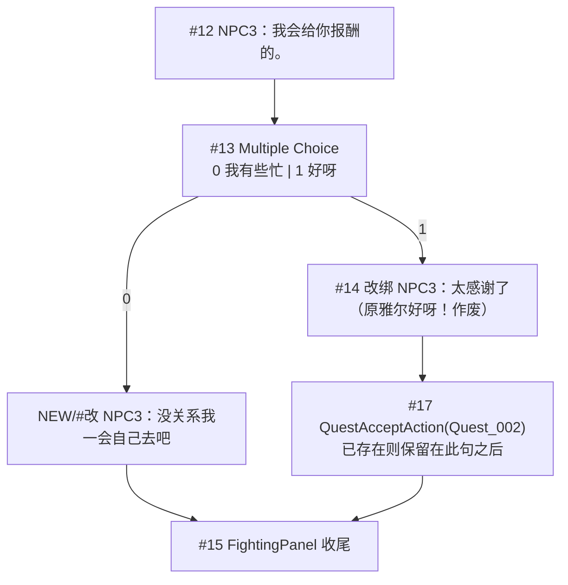

# Village_QuestOffer_NPC23 — 选项后 NPC 结尾对白 — 架构溯源报告（补丁）

**文档性质**：架构侦探产出（只读补丁报告；**本阶段不改资产**）  
**日期**：2026-08-20  
**性质**：对 `0820/Village_QuestOffer_NPC23_对话末接任务选项_架构溯源报告.md` **§4.3 结尾拓扑的产品补丁**（不是重做任务卡）  
**依据**：
- `Assets/Doc/00_MASTER_PROMPT.md`【架构侦探】
- 提示词：`Assets/Doc/提示词/0820/Village_QuestOffer_NPC23_选项后NPC结尾对白_架构侦探提示词.md`
- 旧选项报告：`Assets/Doc/执行文档/0820/Village_QuestOffer_NPC23_对话末接任务选项_架构溯源报告.md`
- Prefab：`Assets/GameRes/Prefabs/Dialogue/Village_QuestOffer_NPC23.prefab`

**产品已拍板**：

| 玩家选项 | 随后说话人 | 随后台词 | 再往后 |
|----------|------------|----------|--------|
| 我有些忙 | **NPC3**（妈妈） | **没关系我一会自己去吧** | 收尾 END，**不** Accept |
| 好呀 | **NPC3** | **太感谢了** | 再收尾；`QuestAccept` 只允许在本句**之后** |

**作废**：旧报告「接受后雅尔复读『好呀！』」；拒分支「点完选项直接 END」。  

**Unity 版本**：2020.3.48f1  

---

## ① 结论一句话

**选项后各补一句 NPC3 台词：拒→「没关系我一会自己去吧」、接→「太感谢了」；现网仍是拒直接收尾、接走雅尔「好呀！」再 Accept——把雅尔句改成妈妈道谢，并拒分支插入放手句；旧雅尔复读方案作废。**

---

## ② 原因（生活类比）

点菜单之后店员还要回一句（「那我自己去」/「太感谢了」），不能点完按钮就关灯。  
说话的是请托的**妈妈（NPC3）**，不是孩子、也不是雅尔复读自己的选项字。  
机制与埃吉尔相同（Choice 出边 → Statement），只换说话人和文案。

---

## ③ 用户需要做什么（检查清单）

打开 `Village_QuestOffer_NPC23.prefab` → Edit Graph：

| 步骤 | 操作 |
|------|------|
| 1 | 保留 `#13` Multiple Choice（文案保持 **我有些忙 / 好呀**，是否加句号见 OPEN） |
| 2 | **拒（出口 0）**：新建 Statement，Actor=**NPC3**，台词 **「没关系我一会自己去吧」**；把现 `#13→#15` 改为 `#13 → 新句 → #15` |
| 3 | **接（出口 1）**：把现 `#14` 雅尔「好呀！」**改成** NPC3「太感谢了」（或删 `#14` 新建同位置节点）；**不要**再挂雅尔复读 |
| 4 | 现网已有 `#14 → #17 QuestAcceptAction(Quest_002) → #15`：Accept **留在「太感谢了」之后**，不要挪到 MC 与道谢句之间 |
| 5 | Graph Save → Prefab Apply |

**不要**：改埃吉尔 Prefab；改任务 JSON；把道谢绑到 NPC2；本补丁不做采集交付。

**验收**：

| # | 操作 | 通过 |
|---|------|------|
| P1 | 点「我有些忙」 | 必播 **「没关系我一会自己去吧」** → 结束；Console **无** `[Quest] Accept` |
| P2 | 点「好呀」 | 必播 **「太感谢了」**（**不是**雅尔「好呀！」） |
| P3 | （若保留 Accept）P2 之后 | 才可出现 `[Quest] Accept Quest_002` |
| P4 | 埃吉尔线 | 文案与节点不变 |

---

## ④ 给程序看的补充

### 4.1 与旧报告差异（作废点）

| 项 | 旧 §4.3（选项报告） | 本期（产品） | 状态 |
|----|---------------------|--------------|------|
| 拒出边 | MC → 直接收尾 | MC → **NPC3「没关系我一会自己去吧」** → 收尾 | **改** |
| 接出边 | MC → **雅尔「好呀！」** → 收尾 | MC → **NPC3「太感谢了」** → 收尾 | **改** |
| OPEN Q1 雅尔复读 | 建议要 | **作废** | 见 OPEN 更新 |
| Accept 位置 | 雅尔复读句之后 | **「太感谢了」之后**（语义不变：谢完再签收） | 保持「句后 Accept」 |

### 4.2 现网 Graph 对拍（2026-08-20）

| 检查项 | 结果 |
|--------|------|
| MultipleChoice | ✅ `#13`，Actor=**NPC3** |
| 按钮文案 | **我有些忙 \| 好呀**（**无**句号；流程图有「。」→ OPEN） |
| 末请托句 | ✅ `#12` NPC3「我会给你报酬的。」→ `#13` |
| 拒出边 | `#13 → #15` FightingPanel 收尾（**缺**放手句） |
| 接出边 | `#13 → #14` 雅尔「好呀！」→ `#17` `QuestAcceptAction(Quest_002)` → `#15` |
| 目标两句 NPC 台词 | ❌ 均无 |

现网拓扑：

```
#12 报酬句 → #13 MC
#13 出口0 我有些忙 → #15 收尾          ← 缺放手句
#13 出口1 好呀 → #14 雅尔「好呀！」→ #17 Accept(Quest_002) → #15
                  ↑ 应改为 NPC3「太感谢了」
```

### 4.3 目标拓扑（定稿）



| 节点 | Actor | 台词 | FaceType 建议 |
|------|-------|------|----------------|
| 拒后 Statement | **NPC3** | 没关系我一会自己去吧 | 与妈妈请托句一致：**12**（图内请托句同为 12）；无立绘时字幕仍可播 |
| 接后 Statement | **NPC3** | 太感谢了 | 同上 12；是否加「！」见 OPEN |

**Accept 纪律**：只允许在「太感谢了」**播完之后**；拒分支**禁止**经 Accept。  
现网 `#17` 已挂 `Quest_002`——本补丁施工时**改说话人/文案即可**，勿把 Accept 拆掉或前移（除非另开任务卡批明确要求暂摘 Accept）。提示词施工员续跑写「本批若报告未要求则先不挂 Accept」——**现网已挂则保留位置，只换 `#14` 内容**。

**CSV**：默认可不改；若要同步台本，建议在 Choice 后各加 Dialogue 行，**不强制**，以手改 Graph 为准。

**收尾**：现网已有 `#15` / 图头 `#16` FightingPanel，本补丁**不必再补**收尾叶子。

### 4.4 现网 vs 目标对照（缺什么）

| 分支 | 现网 | 目标 | 施工动作 |
|------|------|------|----------|
| 拒 | MC → `#15` | MC → NPC3「没关系我一会自己去吧」→ `#15` | **新建** Statement + 改连线 |
| 接 | MC → 雅尔「好呀！」→ Accept → `#15` | MC → NPC3「太感谢了」→ Accept → `#15` | **改** `#14` 的 Actor+文案（或删建） |
| 雅尔复读 | 有 `#14` | 无 | **删除语义** |

### 4.5 开放问题

已追加 OPEN「NPC23 选项后 NPC 结尾对白 · 2026-08-20」，并更新旧 Q1 为作废。

| ID | 问题 | 施工默认 |
|----|------|----------|
| Q1 | 按钮要不要句号「我有些忙。」「好呀。」？ | **保持现网无句号**（除非策划改口） |
| Q2 | FaceType？ | **12**（与图内 NPC3 请托句一致） |
| Q3 | 「太感谢了」要不要感叹号？ | **按产品表无感叹号**；要加另议 |

---

## 5. 相关文档

| 主题 | 路径 |
|------|------|
| 本提示词 | `Assets/Doc/提示词/0820/Village_QuestOffer_NPC23_选项后NPC结尾对白_架构侦探提示词.md` |
| 旧选项报告（§4.3 部分作废） | `Assets/Doc/执行文档/0820/Village_QuestOffer_NPC23_对话末接任务选项_架构溯源报告.md` |
| 任务卡接取 | `Assets/Doc/执行文档/0820/Quest_NPC23_提交藤蔓果任务卡_架构溯源报告.md` |

---

## 6. 文档修订

| 日期 | 说明 |
|------|------|
| 2026-08-20 | 初版补丁：作废雅尔复读；拒/接各补 NPC3 一句；对拍现网已有 MC+Accept |

**文档路径**：`Assets/Doc/执行文档/0820/Village_QuestOffer_NPC23_选项后NPC结尾对白_架构溯源报告.md`
