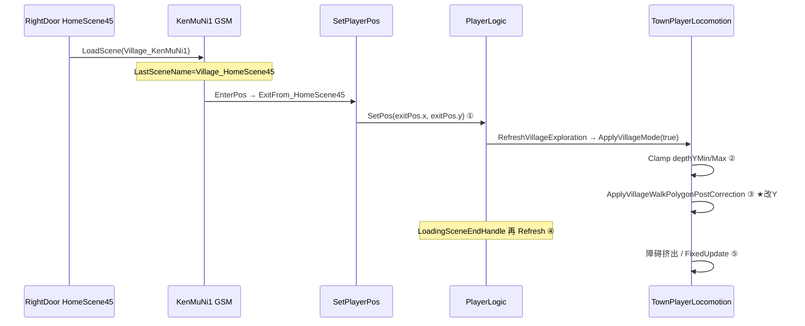

# Village_HomeScene45 — ExitFrom_HomeScene45 出村落点 Y 轴不准 — 架构溯源报告

**文档版本**：v1.0（2026-08-22 晚）  
**文档性质**：【架构侦探】只读溯源 + 施工指引  
**Unity**：2020.3.48f1 / C#  
**主查场景**：`Assets/GameRes/Scenes/Village_KenMuNi1.unity`  
**对照**：`Village_HomeScene1.unity`（1 号屋已验证）  
**用户反馈**：拖 `ExitFrom_HomeScene45` 的 **Y**，Play 后玩家纵深 **不跟随 / 对不上** Gizmo（Gizmo 在树屋楼梯平台，落点 Y 另处）  
**前序**：`0822/回村门口落点`（EnterPos 已绑 ExitFrom）；`0822/进屋闪回村 v3`（室内 R0，与本期无关）

关联提示词：`Assets/Doc/提示词/0822/Village_HomeScene45_ExitFrom落点Y轴_架构侦探提示词.md`

---

## ① 结论一句话（主因 **H2 + H6**）

**EnterPos 已正确绑定 `ExitFrom_HomeScene45`，`SetPlayerPos` 会读到该点坐标；但进村后 `TownPlayerLocomotion.ApplyVillageWalkPolygonPostCorrection()` 把玩家 **吸进 `VillageWalkArea` 多边形**，**覆盖 Y（纵深）**。用户把 ExitFrom 摆在树屋楼梯的「视觉高度」（y≈5～7），该 Y **不在 Walk 多边形内** → 校正后落点固定在平台条带（y≈**2.0～3.1**），故 **拖 Gizmo Y 看似无效**。另：现网 ExitFrom **x=7.67** 距 `House_Npc45`（x≈-4.4）**约 12 单位**，即使 Y 对了也会落在错户门口。施工：把 ExitFrom 挪到 **x≈-4.30**、Y 落在 **WalkArea 合法纵深带**（建议 **(-4.30, 2.90, 0)**）。**

---

## ② 为何拖 ExitFrom.Y 无效

### 2.1 村里 Y = 纵深，不是楼梯「抬高」

`Village_KenMuNi1` 为 **Village2_5D**：`Transform.position.y` 表示 **前后纵深**（DNF 式），不是侧视「上楼梯的高度」。  
`House_Npc45` 门 y=**5.67** 是 **Sprite 排序 / 美术分层**；玩家可站立的 **Walk 纵深** 在同 X 处约为 **2.0～3.1**（树屋平台条带）或主街 **≈-7.8**。

生活类比：ExitFrom 是「深度标尺上的刻度」；`VillageWalkArea` 是 **铁轨**——刻度画在铁轨外，人会被吸回轨上。

### 2.2 落点全链路（侦探对拍）



| 步骤 | 代码锚点 | 玩家坐标 |
|------|----------|----------|
| ① SetPos 后 | `BaseGameSceneManager.SetPlayerPos` → `playerLogic.SetPos` | **= ExitFrom (x,y)** |
| ② depth Clamp | `TownPlayerLocomotion.ApplyVillageMode` L434 | y 夹在 `depthYMin/Max`（默认 ±20，通常不卡） |
| ③ **WalkArea 校正** | `ApplyVillageWalkPolygonPostCorrection` L997–1037 | **y 被改到多边形内最近点** ★ |
| ④ 黑幕结束 | `PlayerLogic.LoadingSceneEndHandle` → 再 `RefreshVillageExploration` | 可能再跑 ③ |
| ⑤ 首帧物理 | `PostPhysicsResyncDepthCoroutine` / 障碍挤出 | 小幅再调 |

**关键代码**（校正会改 `_playerRootRb2D.position.y`）：

```997:1033:e:\Yaer\yaer\Yaer\Assets\Scripts\Game\GameRuntime\Entities\Player\Components\TownPlayerLocomotion.cs
        private void ApplyVillageWalkPolygonPostCorrection()
        {
            // ...
            Vector2 p = _playerRootRb2D.position;
            Vector2 corrected = ClampWorldPointToPolygonInterior(poly, p, walkPolygonInsetEpsilon);
            if ((corrected - p).sqrMagnitude <= 1e-10f)
            {
                return;
            }

            _villageWorldY = corrected.y;
            _playerRootRb2D.position = corrected;
            // ...
            PlayerLogic.transform.position = new Vector3(corrected.x, corrected.y, _frozenWorldZ);
```

### 2.3 Play 坐标三步对比表（机制推断 + 待施工员实测填空）

| 阶段 | 预期（ExitFrom=用户试拖 y≈7.41, x≈-4.3） | 预期（方案 A y=2.90） |
|------|-------------------------------------------|------------------------|
| ① `SetPos` 后 | **(-4.30, 7.41)** 与 Gizmo 一致 | **(-4.30, 2.90)** |
| ③ WalkArea 校正后 | **y → ≈2.0～3.1**（Δy≈**4～5**） | **≈( -4.30, 2.90 )**（Δy **<0.15**） |
| ④ 黑幕结束后 | 同③或微调 | 同③ |
| 用户体感 | 「拖 Y 没用」 | 「拖 Y 沿 Walk 带跟随」 |

> 施工员验收前可在 `SetPlayerPos` 返回前 + `ApplyVillageWalkPolygonPostCorrection` 末各打一行 `Debug.Log`（验完删）。

---

## ③ 用户验收清单

| # | 操作 | 通过 |
|---|------|------|
| 1 | 45 屋内 **RightDoor** 出村 | 落在 **`House_Npc45` 门外**（x≈-4.3），非 x≈7 主街 |
| 2 | 玩家 (x,y) vs `ExitFrom_HomeScene45` | **Δy < 0.15**（Exit 须在 WalkArea 内） |
| 3 | 在 Scene 中沿 **Gizmos 绿框 WalkArea** 拖 ExitFrom Y | Play 落点 **跟随** |
| 4 | 再按 E 进屋 | 不闪回（见 v3 报告）、不卡门 |
| 5 | 对比出 **1 号屋** | 体感一致（门外可站、纵深合理） |

### Console 过滤（可选）

`[VillageHomeScene45Debug]` · `进入场景` · `TownPlayerLocomotion`（若有临时日志）

---

## ④ 给程序看的补充

### 4.1 EnterPos / lastScene（H1 排除）

| 检查项 | 现网 YAML（2026-08-22 晚） | 结论 |
|--------|---------------------------|------|
| `KenMuNi1.EnterPosConfig` `Village_HomeScene45` → pos | **`5601461774444444002`** | ✅ |
| 指向节点 | **`ExitFrom_HomeScene45`** | ✅ 非 LeftBorn |
| `LastSceneName` 出屋时 | **`Village_HomeScene45`**（GSM `nowSceneName`） | ✅ 命中 EnterPos |
| `archiveStart` 绕过 EnterPos | 仅 **读档首帧**；正常出屋 **false** | ⚠️ 读档测法另验 H8 |

**H1 裁定**：**排除**。不是 EnterPos 未绑，是 **绑了也会被 WalkArea 改 Y**。

### 4.2 样板对拍 HomeScene1（为何 1 号屋「拖 Y 有效」）

| 节点 | 世界坐标 (x, y) | 与 VillageWalkArea |
|------|-----------------|-------------------|
| `House_Npc1` | **(45.41, 1.9)** | 门 Sprite 纵深 |
| **`ExitFrom_HomeScene1`** | **(45.5, -6.1)** | ✅ **主街 Walk 底边内**（y≈-7.8 一带） |
| 门 → Exit **Δx / Δy** | **+0.09 / -8.0** | 门外偏「前」一步 |
| Play 出 1 号屋后 | ≈ ExitFrom | 校正量 **≈0** → 拖 Y **跟手** |

### 4.3 HomeScene45 / Npc45 区（本期）

| 节点 | 世界坐标 (x, y) | 与 WalkArea |
|------|-----------------|-------------|
| **`House_Npc45`** | **(-4.39, 5.67)** | 门 Sprite；**非** Walk 纵深 |
| **`ExitFrom_HomeScene45`（现网磁盘）** | **(7.67, -6.47)** ❌ | 在主街 x 带内，但 **离 Npc45 错 12 单位** |
| 用户试拖（反馈） | **≈(-4.3, 7.41)** | ❌ **多边形外**（高于平台条带） |
| 按 1 号屋 Δy 推算 | **(-4.30, -2.33)** | ⚠️ 在 x=-4.3 处可能仍 **略低于** 平台条带 → 微校正到 **~2.9** |
| **`VillageWalkArea` 根** | **(0, -5.91)** | PolygonCollider2D |
| **x≈-4.3 合法纵深 Y（推断）** | **≈ 2.0 ～ 3.1**（树屋平台条带） | 主街地板 **≈ -7.8** 在更右 x |
| `VillageDepthY_Min/Max` | 场景 **未放置** | Prefab 默认 **±20**，非主因 |

**WalkArea 多边形（节选，树屋舌状区）** — local 相对 `VillageWalkArea`，世界 y = local_y **- 5.91**：

| local (x, y) | 世界 (x, y) |
|--------------|-------------|
| (-2.32, 8.89) | (-2.32, **2.98**) |
| (-6.24, 8.96) | (-6.24, **3.05**) |
| (-8.51, 8.18) | (-8.51, **2.27**) |
| 底边 (66.08, -1.92) | (66.08, **-7.83**) |

在 **x=-4.3**：合法纵深主要在 **y≈2.0～3.1**；**y=7.41 或 5.67（门）均在多边形外** → 必被 ③ 校正。

### 4.4 假说裁定

| ID | 假说 | 裁定 |
|----|------|------|
| H1 | EnterPos 未绑 | ❌ **排除** |
| **H2** | **WalkArea 覆盖 Y** | ✅ **主因** |
| H3 | depthYMin/Max Clamp | ❌ 次要（默认 ±20） |
| H4 | 室内 Z 残留 | ❌ `SetPos` 保留 Z，村探索通常 z=0 |
| H5 | LoadingSceneEnd 二次校正 | ⚠️ 会再跑 `ApplyVillageMode`，但根因仍是 H2 |
| **H6** | **美术楼梯高度 ≠ 纵深 Y** | ✅ **用户操作误解**，与 H2 叠加 |
| H7 | DepthZone 挤出 | ⚠️ 树屋区有 `DepthZone&Colliders`；WalkArea 先改 XY 后再障碍挤出 |
| H8 | archiveStart | ⚠️ 仅读档首场景；正常出屋不走存档坐标 |

### 4.5 方案对比

| 方案 | 做法 | 裁定 |
|------|------|------|
| **A（推荐）** | `ExitFrom` → **(-4.30, 2.90, 0)**（x 对齐 Npc45，**y 在 Walk 平台条带内**） | ✅ **本期必做** |
| A′ | 用 v1 坐标 **(-4.30, -2.33)** | 可接受；x=-4.3 处可能被微校正 **+0.5** 到 ~2.9 |
| B | 扩展 `VillageWalkArea` 覆盖 y=5～7「楼梯视觉区」 | 仅当产品坚持站楼梯立面时 |
| C | 树屋独立 DepthZone + 子 Walk 多边形 | 美术要多层纵深时 |
| D | C# 跳过首帧 WalkArea 校正 | ❌ 回归面大，不优先 |
| E | 只改 Y 不改 X（现网 x=7.67） | ❌ **落错户** |

### 4.6 施工步骤（方案 A）

**文件**：`Assets/GameRes/Scenes/Village_KenMuNi1.unity` **only**

1. 确认 **SceneManager** `EnterPosConfig`：`Village_HomeScene45` → pos 仍绑 **`ExitFrom_HomeScene45`**（勿动）。  
2. 选中 **`Map/ExitFrom_HomeScene45`**：  
   - **x → -4.30**（对齐 `House_Npc45.x + 0.09`）  
   - **y → 2.90**（贴 `VillageWalkArea` 在 x≈-4.3 的 **绿框平台条带**内；Scene 视图 Gizmos 校验）  
   - **z → 0**  
3. **不要**把 y 拖到 5～7（门/楼梯 Sprite 高度）——该 Y **不在 Walk 多边形内**。  
4. Play：RightDoor 出村 → 验 §3；临时日志对比 ① SetPos vs ③ 校正后 y。  
5. 若需站主街地面（y≈-7.8）而非树屋平台：须 **方案 B** 扩 polygon 或改 x 到主街通道（与 Npc45 门外产品需求冲突，**默认不做**）。  
6. **不改** `TownPlayerLocomotion.cs`（除非 A 验收后仍差 >0.15 再议 D）。

### 4.7 严禁

- 未查 WalkArea 就断定 EnterPos 坏了  
- 把 **室内** `EnterFrom_Village` 与 **村侧** `ExitFrom_HomeScene45` 混谈  
- 用 **屏幕竖直高度** 理解村里 Transform.Y  
- 长期关闭 WalkArea 校正

### 4.8 开放问题

见 `OPEN_QUESTIONS.md` §「ExitFrom_HomeScene45 落点纵深 · 2026-08-22」。

---

## 修订记录

| 日期 | 说明 |
|------|------|
| 2026-08-22 | v1.0：H2 WalkArea 覆盖 Y + H6 纵深语义；方案 A (-4.30, 2.90) |
