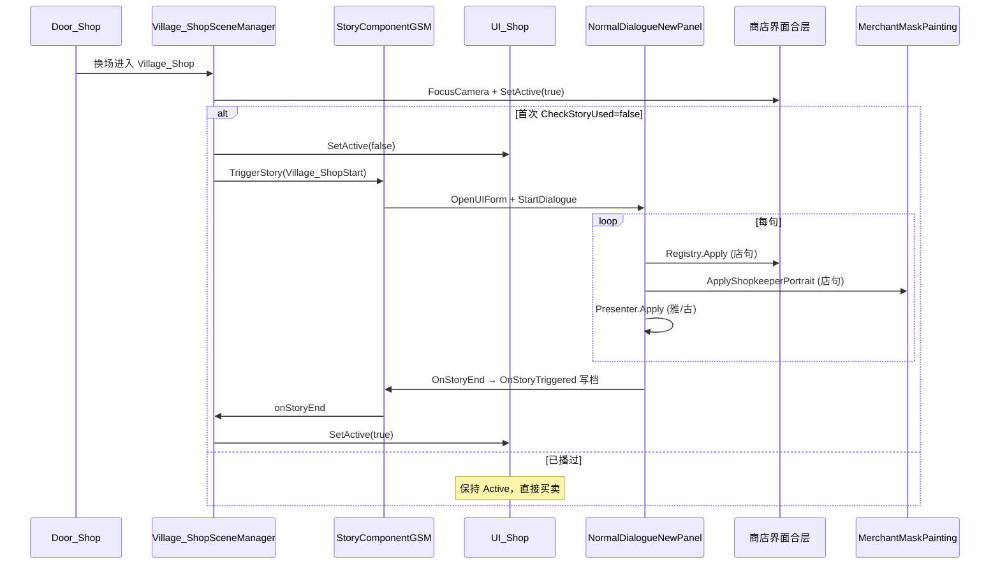

# Village_Shop — 首次进店播 Village_ShopStart · 三角色小表情/立绘联调 — 架构溯源报告

**文档版本**：v1.0（2026-08-27）  
**文档性质**：【架构侦探】只读溯源 + 施工指引（**本阶段未改场景 / Prefab / 代码 / CSV**）  
**Unity**：2020.3.48f1  
**场景**：`Assets/GameRes/Scenes/Village_Shop.unity`  
**对话 Prefab**：`Assets/GameRes/Prefabs/Dialogue/Village_ShopStart.prefab`  
**台本 CSV**：`Assets/Dialog/Village_商店首次对话.csv`  
**生成图**：`Assets/GameRes/DialogueTrees/Generated/Village_商店首次对话.asset`（已 Bind 进 Prefab）  

关联提示词：`Assets/Doc/提示词/0827/Village_Shop_首次进店Village_ShopStart联调_架构侦探提示词.md`  
0827 子报告：`Village_ShopStart_新建Merchant` · `BodyFace CSV` · `MerchantMaskPainting UI`  
策划参考：`0629/商店系统_策划拆解_执行说明.md` §4  

---

## ① 结论一句话

**三角色四轨（雅/古 Mask+大立绘、店 Mask+合层）子系统已基本就绪；总装唯一硬缺口是 `Village_ShopSceneManager` 内尚无 `TriggerStory("Village_ShopStart")` + 首次进店 `UI_Shop` 藏显 + `StoryTriggerCountData` 只播一次。推荐方案 T1：在 GSM `OnEnterScene` 对齐 `Village_KenMuNiStart` 兜底模式——`CheckStoryUsed` 为 false 时藏 `UI_Shop` → `TriggerStory` → `onStoryEnd` 再显 UI；本期 MVP 不做 0629 黑屏转场。**

---

## ② 原因（通俗）

### 2.1 四轨对照 · 子系统 vs 总装

| 角色 | CSV Speaker | 大立绘（屏幕） | 小表情（Mask） | 现网子系统 |
|------|-------------|----------------|----------------|------------|
| **雅尔** | `雅` | Prefab `GoOutStoryYaerPainting` 淡入 | `DialogueMaskAvatarPresenter` → GoOut | ✅ 已接 |
| **古莎** | `古` | Prefab `GushaPainting` 淡入 | Presenter → Gusha | ✅ 已接 |
| **商人** | `店` | 场景 `商店界面合层` Toggle | `MerchantMaskPainting` | ✅ 已接（双调 Registry + Presenter） |

0827 分轮施工（Merchant Actor、Body/Face CSV、MerchantMask UI）**已完成**；但 **没有任何运行时代码** 在进店时 `TriggerStory("Village_ShopStart")`，因此新档从 `Door_Shop` 进来只会看到 **合层 + 全亮 `UI_Shop`**，不会自动播对白。

### 2.2 0629 理想态 vs 本期 MVP

| 项 | 0629 §4 策划 | 本期 MVP（侦探拍板） | 差距 |
|----|--------------|----------------------|------|
| 只播一次 | `StoryTriggerCountData` | **必须** · 键名 **`Village_ShopStart`** | 待施工 |
| 触发时机 | 打开商店 UI **之前** | **`OnEnterScene`** 进门即 Trigger | 一致 |
| 对白中 | **隐藏** 买卖 UI | **整棵 `UI_Shop` SetActive(false)** | 待施工 |
| 对白结束 | **黑屏** → 再出 UI | **直接显 `UI_Shop`**（无黑屏） | P2 补 0629 |
| 构图 | 左雅/古 + 右老板娘 | Prefab Painting + 场景合层 | 摆位已有，Trigger 后验收 |

生活类比：演员、服装、小头像窗都准备好了，但 **没有导演喊「开拍」**——还缺 GSM 里那一行 Trigger。

### 2.3 店句双轨（验收必记）

```
UseShopkeeperPortrait == true
  → ShopkeeperFaceRegistry.Apply(ShopBody, ShopFace)     // 场景合层
  → DialogueMaskAvatarPresenter.ApplyShopkeeperPortrait   // Mask
  → OnGetNewStatement(None, …)                            // 历史记录
```

**禁止**改回 `DialogueFaceType` 或去掉 `UseShopkeeperPortrait`。

---

## ③ 用户验收清单

| # | 操作 | 通过 |
|---|------|------|
| 1 | **新档** Init → 村 → `Door_Shop` 进店 | 自动播首次对白（施工后） |
| 2 | 对白中 | **`UI_Shop` 不可见/不可点**（按 MVP 整棵隐藏） |
| 3 | **雅句**（如 ID1 `Surprised`） | Mask 小表情 = CSV；Prefab 大立绘可见 |
| 4 | **古句**（如 ID9 `ForcedSmile`） | 同上 |
| 5 | **店句**（ID2 `Face1`；**ID34 `Face2`+`Red`**） | 合层 Body/Face **与** Mask **一致** |
| 6 | 对白结束 | 出现 **`UI_Shop` 买卖**；ESC 菜单可用 |
| 7 | **同档第二次** `Door_Shop` 进店 | **不播** 对白，直接 UI |
| 8 | 存档 → 读档 → 再进店 | 仍不播 |
| 9 | Console | 无 Missing Actor / Registry 未注册 / `[MerchantMask]` Face 找不到 |

**预览环境**

| 环境 | 能测什么 |
|------|----------|
| **DialogDebug** | 雅/古 Mask + 大立绘；**店句合层不可靠**（无 Registry） |
| **`Village_Shop` Play + Trigger** | **三角色全链路**（正式验收场景） |

**摆位**（Trigger 后若构图不对再调）

| 要调什么 | 改哪里 |
|----------|--------|
| 老板娘大立绘 | `Village_Shop.unity` → `商店界面合层` / ` MerchantPainting` |
| 雅/古大立绘 | `Village_ShopStart.prefab` → Painting **RectTransform** |
| 三角色小表情 | `NormalDialogueNewPanel.prefab` → Mask 内各 Painting 实例 |

---

## ④ 给程序

### A. 现网缺口表（磁盘 · 2026-08-27）

| # | 项 | 现网 | 阻塞首次进店？ |
|---|-----|------|----------------|
| 1 | **`TriggerStory("Village_ShopStart")` 调用点** | ❌ **全工程无运行时引用** | **✅ 硬阻塞** |
| 2 | **`StoryTriggerCountData` 键名** | ❌ 未使用；建议 **`Village_ShopStart`**（与 Prefab 名一致） | **✅**（二进宫） |
| 3 | **`Merchant` Actor 已绑** | ✅ Prefab 含 `Merchant` GO + `_name=老板娘`；图内 `actorParameters` 老板娘 → `_actorObject:3` | ❌ |
| 4 | **`MerchantMaskPainting` 在 Panel** | ✅ `NormalDialogueNewPanel` 已嵌实例；Presenter `merchantMaskPainting` 已拖引用 | ❌ |
| 5 | **`ShopkeeperFaceRegistry` 场景注册** | ✅ `商店界面合层` 挂 `ShopkeeperFaceController` + DebugInput | ❌（仅 `Village_Shop` Play） |
| 6 | **Prefab 图与 CSV 同步** | ✅ 图内 ~47 句 SayEx；店句 `UseShopkeeperPortrait=true`；ID34 对应节点 `ShopBody=Blush(Red)` + `ShopFace=Face2` | ❌ |
| 7 | **对白中 `UI_Shop` 可见性** | ⚠️ 场景默认 **`UI_Shop` Active=true**；无藏 UI 逻辑 | **⚠️ 体验阻塞**（买卖与对白叠屏） |
| 8 | **对白结束 → 显 UI / 写存档** | ⚠️ `OnStoryEnd` 会 **`OnStoryTriggered` 写档**；**无显 UI 钩子** | **⚠️ 体验阻塞** |

**结论**：子系统 **7/8 就绪**；总装差 **Trigger + UI 藏显** 两处 GSM 改动。

---

### B. 触发链路设计（T1～T4 拍板）

#### B.1 方案对比

| 方案 | 触发点 | 裁定 |
|------|--------|------|
| **T1 · GSM `OnEnterScene`（推荐）** | `Village_ShopSceneManager`：`CheckStoryUsed` → 藏 UI → `TriggerStory` | **✅ 本期** |
| T2 · `ShopFormLogic` Awake | UI 打开前判断 | ❌ 逻辑散；Awake 已跑时藏不住首帧 |
| T3 · `SimpleStoryTrigger` | 场景碰撞 | ❌ 商店无玩家 |
| T4 · DialogDebug 手动拖 Prefab | 仅测 | ✅ 开发验收用，非正式链 |

#### B.2 推荐调用栈（T1 · MVP）

```
Door_Shop.NextSceneName = Village_Shop
  → 换场黑幕
  → Village_ShopSceneManager.OnInit
       CloseFightingPanelIfOpen()
  → OnEnterScene（黑幕淡出后）
       SetAllowOpenMenu(true)
       LockShopCameraPipeline()
       FocusMainCameraOnShopComposite()   // 合层 SetActive(true)
       TryTriggerShopStartStoryOnce()     // ★ 待施工
            if CheckStoryUsed("Village_ShopStart") → return（二进宫直接买卖）
            UI_Shop.SetActive(false)        // ★ 待施工
            StoryComponentGSM.onStoryEnd += ShowShopUiAfterStartStory
            TriggerStory("Village_ShopStart")
                 → Load Prefab DialoguePath.GetPath("Village_ShopStart")
                 → OpenUIForm NormalDialogueNewPanel
                 → StartDialogue(prefab)
  → 对白播放（NodeCanvas 图：关 FightingPanel → 雅/古淡入 → 对话框淡入 → 47 句）
  → NormalDialogueFormNewLogic.OnDialogueEnd
       → StoryComponentGSM.OnStoryEnd
            → StoryTriggerCountData.OnStoryTriggered("Village_ShopStart")  // 自动 +1
            → onStoryEnd 回调 → UI_Shop.SetActive(true)                   // ★ 待施工
```

**路径常量**：`DialoguePath.GetPath("Village_ShopStart")` → `Assets/GameRes/Prefabs/Dialogue/Village_ShopStart.prefab`

#### B.3 对齐样板 `Village_KenMuNiStart` 可复用模式

| KenMuNi 模式 | 商店是否复用 |
|--------------|--------------|
| `ShouldPlayXxxStory()` = `!CheckStoryUsed(name)` | **✅ 原样** |
| `TryTriggerXxxStoryOnce()` in `OnEnterScene` 兜底 | **✅ 原样** |
| `HasRunningStory` 防双开 | **✅ 原样** |
| `TryDeferBlackFadeForCover` 黑幕阶段 Trigger | **❌ 本期不做** — 商店需 **合层可见** 作老板娘大立绘，与进村「全黑再分层亮」不同 |
| `onStoryTriggered` 延迟关黑幕 | **❌** |

#### B.4 第二次进店

```
OnEnterScene
  → CheckStoryUsed("Village_ShopStart") == true
  → 不 Trigger；UI_Shop 保持 Active=true（默认）
  → 直接买卖
```

`OnStoryTriggered` 在 **首次对白正常结束** 时由 `StoryComponentGSM.OnStoryEnd` 自动调用，**施工员勿重复写档**。

---

### C. 三角色表现 · 逐轨验收表（CSV 抽样）

| ID | Speaker | FaceType | BodyType | 大立绘期望 | Mask 小表情期望 | Prefab 图节点 |
|----|---------|----------|----------|------------|-----------------|---------------|
| **1** | 雅 | `Surprised` | — | GoOut 淡入后可见 | GoOut · `Armor_NoHeadWear_Surprised` | SayEx 雅尔 · FaceType=5 |
| **9** | 古 | `ForcedSmile` | — | Gusha 淡入 | Gusha · `ForcedSmile` | SayEx 古莎 · FaceType=25 |
| **2** | 店 | `Face1` | — | 合层 Normal+Face1 | MerchantMask 同态 | 店句 · UseShopkeeperPortrait |
| **34** | 店 | `Face2` | **`Red`** | 合层 **Red**+Face2 | Mask **Red**+Face2 | ShopBody=Blush(1) · ShopFace=Face2(1) |

**首句竞态**

| 轨 | 风险 | 现网 |
|----|------|------|
| 雅/古 Mask | `GoOutStoryYaerPainting.Start` → `SetDefaultPainting` 可能与首句 CSV 竞态 | 图 node2 `PrepareMaskAvatarOnFadeIn` **为空/false**；Presenter 每句 `Apply` 应覆盖；若首句脸错 → 查 GoOut Start |
| 店 Mask | `MerchantMaskPainting` **无 Start Reset** | ✅ 安全 |
| 店合层 | `ShopkeeperFaceController.Start` → `ResetDefault()` | ⚠️ 进场或 Trigger 前可能闪 Normal+Face1；首句 Apply 应覆盖；Acceptable |

---

### D. 对白 Prefab 与前奏节点

**Hierarchy（现网）**

```
Village_ShopStart（DialogueTreeController + Blackboard）
├── BG                         ← Image · 默认 Active=0
├── Yaer                       ← DialogueActorEx · 雅尔
│     └── GoOutStoryYaerPainting
├── Gusha                      ← DialogueActorEx · 古莎
│     └── GushaPainting
└── Merchant                   ← DialogueActorEx · 老板娘 · 无 Painting 子节点 ✅
```

**NodeCanvas 前奏链（图内已 Bind）**

```
0 FightingPanelVisibleAction（隐藏血条 HUD）
  → 1 雅/古 CanvasGroup 淡入 1s（GoOutStoryYaerPainting + GushaPainting）
  → 2 NormalDialogueUIAlphaAnimation（对话框淡入）
  → 3…49 StatementNodeEx（47 对白句，末句无后继 → 自然结束）
```

| 问题 | 裁定 |
|------|------|
| Merchant/合层淡入节点？ | **不需要** — 合层场景常驻；店句靠 Toggle |
| `BG` 与相机/合层？ | BG 默认关；商店靠 **场景合层** 作背景，非 Prefab BG |
| 对白结束 Action 显 UI？ | **现网无** — 建议 **GSM `onStoryEnd`** 显 UI，不改图（最小 diff） |
| 0629 黑屏 Action？ | **现网无** — MVP 跳过；P2 可在 `onStoryEnd` 前插 `BlackFadeComponent` |

**Blackboard 变量**：`GoOutStoryYaerPainting`、`GushaPainting` — **无老板娘**（正确）。

---

### E. UI 藏显与 0629 差距

| 阶段 | `UI_Shop` | `商店界面合层` | 对话 Panel |
|------|-----------|----------------|------------|
| 换场进店（黑幕中） | Active=true（默认） | GSM 对焦前可能未显 | 无 |
| **首次对白（MVP 目标）** | **Hidden** | **Visible** | TriggerStory 打开 |
| **对白结束（MVP）** | **Visible** | Visible | CloseForm |
| **再次进店** | Visible | Visible | 无 |

**0629 完整态（P2）**：对白结束 → **BlackFade** → 再显 `UI_Shop`（`BlackFadeComponent` 工程已有）。

**ESC 菜单**：GSM `OnEnterScene` 已 `SetAllowOpenMenu(true)`；MVP **不禁 ESC**（与现网商店一致）；若策划要求对白中禁菜单 → P2 在 Trigger 时 `SetAllowOpenMenu(false)`，`onStoryEnd` 恢复。

---

### F. 最小施工清单（施工员 · 侦探不执行）

| # | 模块 | 动作 | 必须？ |
|---|------|------|--------|
| 1 | **`Village_ShopSceneManager.cs`** | 常量 `ShopStartStoryName = "Village_ShopStart"`；`TryTriggerShopStartStoryOnce()`；`OnEnterScene` 末尾调用 | ✅ |
| 2 | 同上 | 首次：`GameObject.Find("UI_Shop")?.SetActive(false)` **在 Trigger 前** | ✅ |
| 3 | 同上 | 订阅 `StoryComponentGSM.onStoryEnd`（一次性）→ `UI_Shop.SetActive(true)` | ✅ |
| 4 | 同上 | `CheckStoryUsed` / `HasRunningStory` 防双开（抄 KenMuNi） | ✅ |
| 5 | **复核** | Prefab Merchant 绑定、Panel MerchantMaskPainting、场景 Registry | ✅ 现网已通过 |
| 6 | **冒烟** | 新档 / 二进宫 / 读档 三条路径 | ✅ |
| 7 | **可选 P2** | 0629 黑屏、`TryDeferBlackFade`、对白禁 ESC | ❌ 本期 |

**排除**：改 CSV 台本；店句改 `DialogueFaceType`；与 `0601` 点头/点胸特殊交互混 Trigger；DialogDebug 替代正式 Trigger。

---

### G. 验收清单（程序自测 · Console 过滤词）

| # | 检查 | 过滤/期望 |
|---|------|-----------|
| 1 | Trigger 启动 | `[VillageShopDebug]` 或自定义 `[ShopStart]` TriggerStory 成功 |
| 2 | 店句双轨 | 无 `[DialogueTMPUGUI] 店句但 ShopkeeperFaceController 未注册` |
| 3 | Mask | 无 `[MaskAvatar] 店句但 MerchantMaskPainting 未绑定` |
| 4 | Actor | 无 NodeCanvas Missing Actor / 字幕名为空（老板娘） |
| 5 | 二进宫 | 无重复 Trigger；`CheckStoryUsed` 为 true |

---

### H. 开放问题

| # | 问题 | 侦探倾向 |
|---|------|----------|
| 1 | 本期做 0629 **黑屏后再出 UI**？ | **MVP 不做**；P2 |
| 2 | 触发点在 **OnEnterScene** 还是 UI Awake？ | **`OnEnterScene`（T1）** |
| 3 | 对白中禁 ESC？ | **MVP 不禁** |
| 4 | Prefab 名 `Village_ShopStart` vs 生成图 `Village_商店首次对话.asset` | **Trigger 用 Prefab 名**；图已 Bind 进 Prefab，无需统一 asset 文件名 |
| 5 | DialogDebug 验三角色？ | **部分**：雅/古全；**店句必须 `Village_Shop` Play** |

---

### I. 与 0827 子报告衔接表

| 子报告 | 状态 | 本联调依赖 |
|--------|------|------------|
| `Village_ShopStart_新建Merchant` | ✅ Merchant + Actor 绑 | 字幕名「老板娘」 |
| `BodyFace CSV` | ✅ 图内 ShopBody/ShopFace | ID34 Red 验收 |
| `MerchantMaskPainting UI` | ✅ Presenter + TMP 双调 | 店句 Mask |
| **本报告（总装 Trigger）** | ❌ 待施工 | 进门开拍 + UI 藏显 + 只播一次 |

---

### J. 时序图（MVP）



---

### K. 相关文件速查

| 用途 | 路径 |
|------|------|
| 待改 GSM | `Assets/Scripts/.../Village_Shop/Village_ShopSceneManager.cs` |
| 样板 GSM | `Assets/Scripts/.../Village_KenMuNi/Village_KenMuNiSceneManager.cs` |
| 剧情组件 | `Assets/Scripts/.../StoryComponentGSM.cs` |
| 存档键 | `Assets/Scripts/.../StoryTriggerCountData.cs` |
| 对话 Prefab | `Assets/GameRes/Prefabs/Dialogue/Village_ShopStart.prefab` |
| 场景 | `Assets/GameRes/Scenes/Village_Shop.unity` |
| 进村门 | `Village_KenMuNi1.unity` · `Door_Shop` → `Village_Shop` |
| 店句入口 | `DialogueTMPUGUI.cs` L225–249 |
| Mask | `DialogueMaskAvatarPresenter.cs` · `MerchantMaskPainting.cs` |
| 合层 | `ShopkeeperFaceController.cs` on `商店界面合层` |

---

**报告结束 · 拍板 T1 + MVP 藏显 UI 后交施工员执行**
