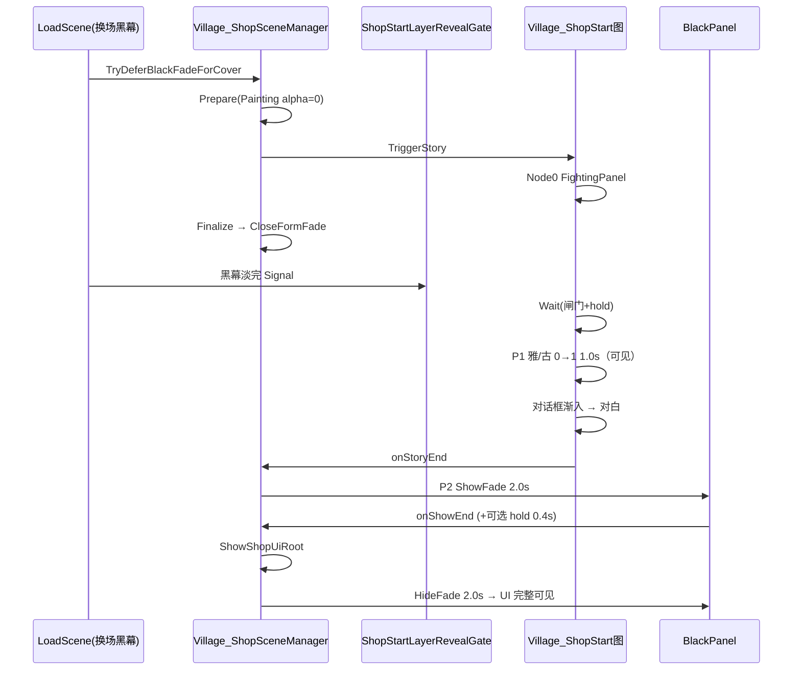

# Village_Shop — 首次进店第三波演出 — 架构溯源报告

**文档版本**：v1.0（2026-08-27 · 第二波 R1/R2 施工后 · 策划/验收 polish）  
**文档性质**：【架构侦探】只读根因分析 + 最小修复清单（**本阶段未改代码/场景/Prefab**）  
**Unity**：2020.3.48f1  
**场景**：`Assets/GameRes/Scenes/Village_Shop.unity`  
**对话 Prefab**：`Assets/GameRes/Prefabs/Dialogue/Village_ShopStart.prefab`  
**前置报告**：`0827/Village_Shop_首次进店第二波遗留_架构溯源报告.md`（v1.0）

关联提示词：`Assets/Doc/提示词/0827/Village_Shop_首次进店第三波演出_架构侦探提示词.md`

---

## ① 结论一句话

**P1 根因：图内已有 1.0s `CanvasGroupAlphaActionTask`，但 DeferCover 黑幕内即 `TriggerStory`，淡入与换场 `CloseFormFade` 并行——1s 立绘 tween 在黑幕下跑完，亮屏时 alpha 已是 1，肉眼等同瞬现；且 Shop GSM **缺 KenMuNi 式 Prepare（Painting alpha=0）与 Wait 闸门节点**，Prefab 还把两 Painting **序列化 override 为 alpha=1**。**P2 根因：`ShowBlackFormArgs` 无自定义时长，结束黑幕走全局 `BlackPanel` `showTime=1` / `hideTime=1.35`，无法单独放慢；推荐方案 A——扩展 Args + Shop 结束专用 `showDuration=2.0s` / `hideDuration=2.0s`（可选全黑 hold 0.4s），禁止改全局 Prefab 默认值。**

---

## ② 原因（时序 + KenMuNi 对照 + BlackMask 机制）

### 总览：本轮 vs 已修项

| 项 | 状态 | 本轮 |
|----|------|------|
| R1 DeferCover（不闪店） | ✅ 已施工 | **回归项** |
| R2 表情三轨 | ✅ 已施工 | **回归项** |
| F3 Mask 竞态 | ✅ 已修 | **勿动** |
| **P1 雅/古开头淡入** | ❌ 图有 Action、肉眼无效 | **P0** |
| **P2 结束黑幕放慢** | ❌ 全局 1s/1.35s | **P0/P1** |

---

### P1 · 雅/古开头大立绘淡入

#### B1 · 磁盘核对

**`Village_ShopStart` 图节点链路（已核实 JSON）**：

```
Node0  FightingPanelVisibleActionTask（隐藏血条 HUD）
  ↓
Node1  ActionList：CanvasGroupAlpha ×2（并行）
         GoOutStoryYaerPainting  0→1  Duration=1.0s  EndActionOnAnimationEnd=true
         GushaPainting           0→1  Duration=1.0s  EndActionOnAnimationEnd=true
  ↓
Node2  NormalDialogueUIAlphaAnimationTaskAction（对话框 UI alpha 渐入）
  ↓
Node3+ SayEx 首句对白 …
```

**KenMuNi 对照（`Village_KenMuNiStart.prefab`）**：

| 项 | KenMuNi | Shop |
|----|---------|------|
| Node1 | **`WaitVillageStartBgRevealActionTask`**（BG 亮屏后 hold **0.5s**） | **无 Wait** |
| 立绘淡入 Duration | **0.5s** | **1.0s** |
| GSM Prepare | **`PrepareVillageStartLayeredReveal`**（Painting alpha=0） | **无** |
| 闸门 | **`VillageStartLayerRevealGate`** + 黑幕淡完 Signal | **无** |
| BB 绑定 | `GoOutStoryYaerPainting` / `GushaPainting` **已绑** | **已绑**（`_value:1` / `_value:2`） |

**CanvasGroup 初始 alpha（Prefab 序列化）**：

| 实例 | 母体默认 | Shop Prefab override |
|------|----------|----------------------|
| `GoOutStoryYaerPainting` | `m_Alpha: 1` | **override → 1** |
| `GushaPainting` | `m_Alpha: 1` | **override → 1** |

`CanvasGroupAlphaActionTask` 执行时会 `cg.alpha = startA`（默认 0），**理论上**可覆盖初值 1；但若 Action 未跑到 / BB 空 / 时序已亮屏，override 1 会直接全显。

**0629 构图**：左侧两女主（Prefab 大立绘）+ 右侧老板娘（场景合层，**始终可见**）—— P1 **仅雅/古需淡入**，合层不需 alpha 动画。

#### B2 · DeferCover 后时序（根因）

现网 `Village_ShopSceneManager`（第二波已施工）：

```124:207:Assets/Scripts/Game/GameRuntime/GameSceneManager/Scene/Village_Shop/Village_ShopSceneManager.cs
        public override bool TryDeferBlackFadeForCover(Action closeBlackAndNotify)
        {
            // …
            FocusMainCameraOnShopComposite();
            storyGsm.onStoryTriggered += OnShopStartStoryTriggeredForCover;
            bool started = storyGsm.TriggerStory(ShopStartStoryName);  // ← 树立即开跑 Node0→Node1
            // …
        }
        // onStoryTriggered → Wait 0.15s → FinalizeShopStartCoverAndCloseBlack → close() → CloseFormFade
```

**帧级推断时序**：

| 时刻 | 事件 | 用户可见 |
|------|------|----------|
| T0 | 全黑 · `TriggerStory` · 图 Node0→**Node1 淡入开始** | 黑幕 |
| T0～T1.0 | Node1：`DOFade(0→1, 1.0s)` **在黑幕下跑完** | 黑幕 |
| T~0.15 | `onStoryTriggered` + hold → **`CloseFormFade` 开始**（hide ~1.35s） | 黑幕渐透店背景 |
| T~1.0 | 立绘 alpha **已为 1** | 背景渐亮中，立绘已全显 |
| T~1.5 | 换场黑幕淡出结束 | **立绘瞬现感**（无可见 0→1） |

**根因裁定（多选）**：

| # | 原因 | 置信度 |
|---|------|--------|
| **1** | **时序**：淡入在黑幕下完成，亮屏时已 alpha=1 | **✅ 主因** |
| **2** | **缺 Prepare**：未在 `CloseFormFade` 前强制 Painting=0 | **✅ 辅因** |
| **3** | **缺 Wait/Gate**：无 KenMuNi「BG 亮后再淡入」节点 | **✅ 必补** |
| 4 | Prefab 初值 alpha=1 | 辅因（Action 正常时会覆写） |
| 5 | BB 空 / Action 未跑 | 低（BB 已绑；若失败 Console 有 `[CanvasGroupAlpha] 未找到`） |

Node1 设 `EndActionOnAnimationEnd=true` → 图 **阻塞到淡入结束** 才进 Node2 对话框渐入——顺序正确，但 **阻塞发生在黑幕期**，用户仍看不到淡入过程。

#### B3 · 修复方案

| 方案 | 内容 | 推荐 |
|------|------|------|
| **最小组合（推荐 P0）** | ① GSM 增 **`PrepareShopStartLayeredReveal`**（抄 KenMuNi 白名单：仅 `DialogueSceneContainer` 下两 Painting + 对话框 alpha=0）；② **`ShopStartLayerRevealGate`**（或复用 `VillageStartLayerRevealGate`）Reset/Signal；③ **`FinalizeShopStartCoverAndCloseBlack` 内 Prepare → close()**；④ 黑幕 `HideFade` 完成回调 **Signal 闸门**；⑤ Prefab 图 **插入 Wait 节点**（Node0 与现 Node1 之间） | **✅** |
| 初值 | Prefab override **`m_Alpha: 0`**（双保险） | P1 |
| 图调参 | Duration 保持 **1.0s**（0629 演出感；KenMuNi 0.5s 偏快）或策划指定 **1.5s** | 可选 |
| 仅 Prepare 不加 Wait | 仍可能在黑幕下跑完 tween | **❌ 不足** |
| 仅改 Duration 加长 | 黑幕下更久，亮屏仍可能已 1 | **❌ 不足** |

**目标时序（0629 + KenMuNi 简化版）**：

```
全黑 DeferCover Trigger + Prepare(Painting alpha=0)
  → 图 Node0 FightingPanel
  → Wait（闸门：换场黑幕已淡出 + 可选 hold 0.3～0.5s）
  → 雅/古 CanvasGroup 0→1（1.0s，用户可见）
  → 对话框 alpha 渐入
  → 首句对白
（右侧老板娘合层：DeferCover 内已对焦，随店背景一起可见，不参与 P1 淡入）
```

---

### P2 · 结束黑幕放慢

#### C1 · 现网链路

```273:297:Assets/Scripts/Game/GameRuntime/GameSceneManager/Scene/Village_Shop/Village_ShopSceneManager.cs
        private void OnShopStartStoryEnd()
        {
            UnsubscribeShopStartStoryEnd();
            ShowShopBlackFade(blackForm =>
            {
                ShowShopUiRoot();
                blackForm.CloseFormFade(() => Debug.Log("[ShopStart] onStoryEnd，黑幕淡出后显示 UI_Shop"));
            });
        }
```

**分段耗时**：

| 段 | 调用 | 时长来源 | 现网约 |
|----|------|----------|--------|
| 结束 **淡入**（ShowFade） | `BlackFormLogic.OnOpen` → `BlackFadeComponent.ShowFade` | `BlackMask.showTime` | **~1.0s** |
| 全黑回调 | `onShowEnd` → `ShowShopUiRoot()` | 即时 | 0 |
| 结束 **淡出**（HideFade） | `CloseFormFade` → `CloseFormHideFade` | `BlackMask.hideTime` | **~1.35s** |
| **合计** | 对白结束 → UI 完全可见 | | **~2.35s** |

**BlackMask 机制**：

```100:141:Assets/Scripts/Game/GameRuntime/UI/Control/BlackMask.cs
        public void ShowFade(Action endCallBack = null)
        {
            animator.speed = 1 / showTime;   // clip 长 1s × speed → 实际 showTime 秒
            animator.SetTrigger("Show");
        }
        public void HideFade(Action endCallBack = null)
        {
            animator.speed = 1 / hideTime;
            animator.SetTrigger("Hide");
        }
```

`BlackPanel.prefab` 序列化：`showTime: 1`，`hideTime: 1.35`。

**API 缺口**：`ShowBlackFormArgs` 仅有 `showType` / `hideType` / 回调，**无** `showDuration` / `hideDuration` 字段 → 结束黑幕与换场黑幕 **共用同一 BlackMask 实例默认值**。

#### C2 · 范围隔离

| 场景 | 是否放慢 | 做法 |
|------|----------|------|
| **Shop 首次对白结束**（`OnShopStartStoryEnd`） | **✅ 是** | Args 传专用时长 |
| 换场 `LoadScene` 黑幕 | **❌ 否** | 不改 Prefab 默认 |
| Shop 其它 `ShowShopBlackFade` | 当前仅结束路径 | 与 P2 同参即可 |

**否决方案 D**：改全局 `BlackPanel.prefab` 的 `showTime`/`hideTime` —— 会拖慢 **所有** 进村/换场。

#### C3 · 修复方案与建议秒数

| 方案 | 说明 | 推荐 |
|------|------|------|
| **A · 扩展 `ShowBlackFormArgs`** | 增 `float? showDuration` / `hideDuration`；`BlackFormLogic.OnOpen` / `CloseFormFade` 前临时写入 `BlackMask`（用后恢复默认） | **✅ P0** |
| B · GSM 常量 + Open 后 `GetComponent<BlackMask>()` | 不动 Args，略 hack，易漏恢复 | 备选 |
| C · 单独 BlackPanel 变体 Prefab | 维护两份 | 不推荐 |
| C' · ShowFade 回调内 **Delay hold** 再显 UI | 只拉长全黑停留，不改曲线 | 可与 A 叠加 |

**建议值（Shop 结束专用）**：

| 参数 | 建议 | 说明 |
|------|------|------|
| `showDuration`（淡入盖黑） | **2.0s** | 明显慢于换场 1.0s |
| `hideDuration`（淡出露 UI） | **2.0s** | 明显慢于当前 1.35s |
| 全黑 **hold**（可选） | **0.4s** | `onShowEnd` 内 `ShowShopUiRoot` 前 `await`；增强「盖住再揭」体感 |
| 体感合计 | **~4.4s**（含 hold） | 相对换场 ~2.35s **可感知变慢** |

需在 `BlackMask` 增 **公开设速 API**（如 `SetFadeDurations(float show, float hide)`）或在 `BlackFadeComponent` 包一层，避免直接改 SerializeField。

---

### 目标时序图（修完后）



---

## ③ 验收复测清单

| # | 操作 | 通过标准 |
|---|------|----------|
| 1 | 新档 `Door_Shop` 首次进店 | **R1 回归**：全程不闪店；换场黑幕淡出后 **连续 ≥0.8s** 看见雅/古 **alpha 上升**（非瞬现） |
| 2 | 同上 | **P1**：对话框渐入 **晚于** 立绘淡入；右侧老板娘合层 **始终在场** |
| 3 | 播完 `Village_ShopStart` | **P2**：结束黑幕 **明显慢于** 进村换场（建议体感 ≥4s 含 hold） |
| 4 | 同上 | `UI_Shop` 在结束黑幕 **完全淡出后** 完整出现 |
| 5 | 二进宫 | 无对白；换场黑幕 **速度未变**（仍 ~1s / ~1.35s） |
| 6 | ID5 / ID34 店句 | **R2 回归**：合层/Mask 表情仍正常 |

**Console 过滤**：`[CanvasGroupAlpha]` · `[ShopStart]` · `[ShopStart][Prepare]` · `[VillageStart]`（若复用 Gate）· 黑幕 Animator 相关 Warning

---

## ④ 给程序

### A. 最小修复清单（P0 → P1）

| 优先级 | 项 | 类型 | 文件/模块 | 动作（一句话） |
|--------|-----|------|-----------|----------------|
| **P0** | **P1** | **代码** | `Village_ShopSceneManager.cs` | 增 **`PrepareShopStartLayeredReveal`**（白名单：两 Painting + `dialogueUICanvasGroup` alpha=0）；`FinalizeShopStartCoverAndCloseBlack` 内 **Prepare 后** 再 `close()` |
| **P0** | **P1** | **代码** | 新建 `ShopStartLayerRevealGate.cs` 或复用 `VillageStartLayerRevealGate` | DeferCover 前 **Reset**；`CloseFormFade` 完成 **Signal**（对齐 KenMuNi `onEndLoadingSceneEvent` 钩子） |
| **P0** | **P1** | **NodeCanvas 图** | `Village_ShopStart.prefab` | Node0 后 **插入 `WaitVillageStartBgRevealActionTask`**（hold **0.3～0.5s**）；原立绘淡入/对话框节点顺延 |
| **P1** | **P1** | **Prefab** | `Village_ShopStart.prefab` | 两 Painting CanvasGroup override **`m_Alpha: 0`**（双保险） |
| **P0** | **P2** | **代码** | `ShowBlackFormArgs.cs` | 增可选 **`showDuration` / `hideDuration`**（`float?`） |
| **P0** | **P2** | **代码** | `BlackMask.cs` + `BlackFormLogic.cs` | 设速 API + Open/Close 时应用 Args 时长，**用后恢复 Prefab 默认** |
| **P0** | **P2** | **代码** | `Village_ShopSceneManager.cs` | `OnShopStartStoryEnd` 传 **show=2.0 / hide=2.0**；可选 **hold 0.4s** 再 `ShowShopUiRoot` |
| **P1** | **P2** | **验收** | — | 秒表确认结束段 **明显慢于** 换场；二进宫换场 **不变** |

**禁止 scope**：改全局 `BlackPanel.prefab` 默认 show/hide；为 P1 新建重复 CanvasGroup Action（图内已有）；动 CSV / F3 Mask / R2 表情链。

---

### B. KenMuNi 可抄清单（Shop 子集）

| KenMuNi | Shop 对应 |
|---------|-----------|
| `PrepareVillageStartLayeredReveal` | `PrepareShopStartLayeredReveal`（**无 BG 节点**；不碰 Mask） |
| `VillageStartLayerRevealGate` | `ShopStartLayerRevealGate` 或复用 |
| `WaitVillageStartBgRevealActionTask` | 同 Task 挂 Shop 图（Gate 名一致即可） |
| `FinalizeVillageStartCoverAndCloseBlack` | `FinalizeShopStartCoverAndCloseBlack` + Prepare |

---

### C. 开放问题

| # | 问题 | 侦探倾向 |
|---|------|----------|
| 1 | P1 淡入 Duration：1.0s / 0.5s / 1.5s？ | **沿用 1.0s**；要更戏剧可改图内 Duration **1.5s**（施工后 Play 试） |
| 2 | Wait hold：0.3s 还是 0.5s？ | **0.4s** 折中（KenMuNi 用 0.5s） |
| 3 | P2 是否要全黑 hold？ | **建议要** 0.4s，仅影响结束段 |
| 4 | Gate 复用 KenMuNi 类名 vs 新建 Shop？ | **新建 `ShopStartLayerRevealGate`** 更清晰，避免村/店串闸 |

---

### D. 施工员入口

侦探拍板后使用提示词文件 §「施工员续跑」块，严格 **P0 P1 → P0 P2 → P1**，修一条验一条，回填回归表。

---

**报告结束 · 待【施工员】按 P0 清单施工**
