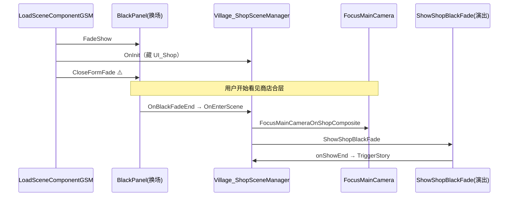
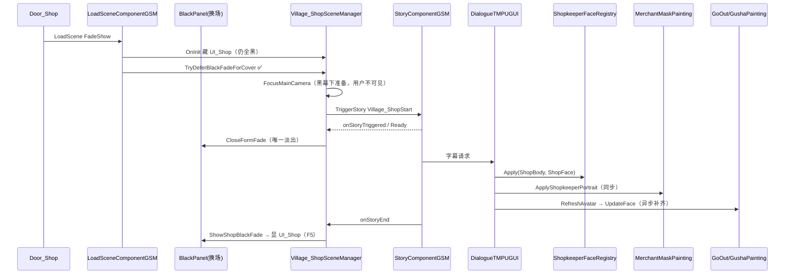

# Village_Shop — 首次进店第二波遗留 — 架构溯源报告

**文档版本**：v1.0（2026-08-27 · 第一波修复后 · 验收员第二轮 R1/R2）  
**文档性质**：【架构侦探】只读根因分析 + 最小修复清单（**本阶段未改代码/场景/Prefab**）  
**Unity**：2020.3.48f1  
**场景**：`Assets/GameRes/Scenes/Village_Shop.unity`  
**对话 Prefab**：`Assets/GameRes/Prefabs/Dialogue/Village_ShopStart.prefab`  
**前置报告**：`0827/Village_Shop_首次进店验收失败_架构溯源报告.md`（v1.0 · F1～F5）

关联提示词：`Assets/Doc/提示词/0827/Village_Shop_首次进店第二波遗留_架构侦探提示词.md`

---

## ① 结论一句话

**R1 根因：`Village_ShopSceneManager` 未覆写 `TryDeferBlackFadeForCover`，换场黑幕在 `OnEnterScene` 前已淡出，合层被 `FocusMainCameraOnShopComposite` 露出后再叠 `ShowShopBlackFade`，必然「先闪店再黑」——方案 D（仅 OnEnterScene 二次 FadeShow）不能作为终解，须对齐 KenMuNi 的 DeferCover（方案 A）。R2 最大根因（店轨）：Mask 与合层虽同源 `ShopBody/ShopFace`，但合层 `ShopkeeperFaceController` 在 `Start` 用 `ResetDefault()` 固定 Normal+Face1，且 `RegisterFaceNode` 依赖 `Transform.Find` 缓存 **默认 inactive 的 Face2～5 / Red 身**，Awake 时极可能未入字典，导致 **Face2+ / Red 身 Apply 静默失败**；验收若停在 ID2（Face1=默认）会误判「大立绘不变」。雅/古轨为 **Prefab 大立绘与 Mask 双实例 + `RefreshAvatar` 异步**，首句仍可能被 `SetDefaultPainting` 锁 Smile（P1）。**

---

## ② 原因（R1 时序 + R2 分轨）

### 总览：第一波已修 vs 本轮

| 验收项 | 第一波 | 第二轮 |
|--------|--------|--------|
| F2 藏商店 UI | ✅ 已修（`OnInit` + 序列化 `shopUiRoot`） | **不查** |
| F3 商人 Mask 黑块 | ✅ 已修（`_shopkeeperMaskActive`） | **不查**（截图小头像已出现） |
| F5 结束黑幕 → UI | ✅ 已修（`OnShopStartStoryEnd` + `ShowShopBlackFade`） | **回归项** |
| **R1 开场黑屏** | 部分（有二次黑幕但仍闪店） | **P0** |
| **R2 大立绘表情** | 部分 | **P0** |

---

### R1 · 开场黑屏时序

#### 现网 vs 期望

| 时刻 | 现网（磁盘） | 0629 / 验收期望 |
|------|--------------|-----------------|
| T0 | `Door_Shop` → `LoadScene` 打开 BlackPanel FadeShow | 同左 |
| T1 | 场景加载 → `OnInit`（可藏 `UI_Shop`） | 同左 |
| T2 | **`CloseFormFade`（换场黑幕淡出）** | **仍保持全黑** |
| T3 | `OnBlackFadeEnd` → `OnEnterScene` | 黑幕内完成 Trigger 准备 |
| T4 | **`FocusMainCameraOnShopComposite`（合层 Active + 相机对准）→ 商店画面可见** | 用户 **不应** 在此刻看见合层 |
| T5 | `TryTriggerShopStartStoryOnce` → **`ShowShopBlackFade`（第二次 FadeShow）** | 不需要第二次演出黑幕 |
| T6 | TriggerStory → `CloseFormFade` → 对白 | 换场黑幕淡出后 **直接** 进对白 |

#### 现网时序图



#### 与 KenMuNi diff

| 项 | `Village_KenMuNiSceneManager` | `Village_ShopSceneManager` |
|----|------------------------------|----------------------------|
| `TryDeferBlackFadeForCover` | ✅ 覆写：全黑时 Trigger，Ready 后 `CloseFormFade` | ❌ **未覆写**（走默认 hold 0.3s 后淡出） |
| 首次 Trigger 时机 | 黑幕阶段（`LoadSceneComponentGSM` L74–78） | **`OnEnterScene` 末**（换场已淡出后） |
| 二次演出黑幕 | 无（分层亮屏） | **`ShowShopBlackFade` 开场**（仍晚于 T4 闪店） |
| 超时兜底 | `VillageStartCoverTimeoutSeconds = 3f` | 无 |

`LoadSceneComponentGSM` 钩子：

```72:78:Assets/Scripts/Game/GameRuntime/GameSceneManager/Component/LoadSceneComponentGSM.cs
                                // 村开场等旁路：仍全黑时先挂对话遮罩，Ready 后再 CloseFormFade（见 0804 禁止露景漏缝）。
                                if (manager is BaseGameSceneManager deferGsm
                                    && deferGsm.TryDeferBlackFadeForCover(CloseBlackAndNotify))
                                {
                                    return;
                                }
```

#### 方案裁定

| 方案 | 裁定 |
|------|------|
| **A · DeferCover** | **✅ 推荐 P0**：首次进店覆写 `TryDeferBlackFadeForCover`；黑幕内藏 UI、对准合层/相机、TriggerStory；Ready 后 **一次** `CloseFormFade` |
| B · 推迟 `FocusMainCamera` 到演出 `onShowEnd` | 可辅助，但 **不能** 单独解决 T2 换场已淡出 |
| C · 改 `LoadSceneComponentGSM` hold | 影响面大，非首选 |
| **D · 仅加快 OnEnterScene 二次 FadeShow** | **❌ 否决**：验收要求「一进去就黑」，闪店发生在 T4，二次黑幕无法消除 |

#### DeferCover 施工要点（Shop 简化版）

1. **何时 TriggerStory**：`TryDeferBlackFadeForCover` 内，换场黑幕仍全黑时（对齐 KenMuNi L169）。  
2. **何时 CloseFormFade**：`onStoryTriggered` + 极短 hold（参考 KenMuNi `VillageStartBgReadyHoldSeconds`），或首句字幕就绪；然后调用 `closeBlackAndNotify`。  
3. **是否仍要开场 `ShowShopBlackFade`**：**否**（DeferCover 已保证全黑进场；保留 F5 结束黑幕即可）。  
4. **超时兜底**：建议 **3s**（与 KenMuNi 同量级），超时仍 `CloseFormFade`，避免永久卡黑。  
5. **二进宫**：`ShouldPlayShopStartStory()==false` 时 `TryDeferBlackFadeForCover` 返回 false，走默认换场淡出。  
6. **`OnEnterScene`**：`TryTriggerShopStartStoryOnce` 改为 **仅兜底**（KenMuNi 同构）；DeferCover 成功则静默跳过。

---

### R2 · 大立绘表情不同步

#### 三轨对照（技术锚点）

| 角色 | CSV Speaker | 大立绘载体 | 驱动入口 | Mask 载体 | 截图/磁盘推断 |
|------|-------------|------------|----------|-----------|---------------|
| 雅 | `雅` | Prefab `GoOutStoryYaerPainting` | `DialogueActorEx.RefreshAvatar` → `UpdateFace(ResolveGoOutFaceKey)` | Panel Mask GoOut | 待 Play；Start 可能先 Smile |
| 古 | `古` | Prefab `GushaPainting` | 同上 → `UpdateFace(faceType.ToString())` | Panel Mask Gusha | 待 Play |
| 店 | `店` | 场景 `商店界面合层` → ` MerchantPainting/Body/Face` | `ShopkeeperFaceRegistry.Apply` | `MerchantMaskPainting.Apply` | **Mask 已有脸；合层疑 Face2+ / Red 未切** |

**0629 屏上布局**：雅/古 = Prefab Canvas 大立绘（图内 alpha 淡入）；店 = **场景合层**右侧老板娘 —— 验收期望与此一致，**不是**全走合层。

#### C3 · Play 对照表（磁盘推断 · 待 Play 填「实际」列）

| ID | Speaker | CSV 脸/身 | Mask 推断 | 大立绘推断 | 根因一句话 |
|----|---------|-----------|-----------|------------|------------|
| 1 | 雅 | `Surprised` | Presenter 同步 `Armor_NoHeadWear_Surprised` | Prefab 可能仍 **Smile**（`SetDefaultPainting` + 异步 `RefreshAvatar`） | 0804 首句竞态 · 大立绘轨 |
| 9 | 古 | `ForcedSmile` | Presenter `ForcedSmile` | Prefab 待 `RefreshAvatar` 回调 | 异步 + 图内无换脸 Action |
| 2 | 店 | `Face1` | ✅ 有商人小脸 | 合层 **默认 Normal+Face1** | **非 Bug**：与 `ResetDefault` 相同，肉眼「不变」 |
| 5 | 店 | `Face2` | 应切 Face2 | 合层 **疑仍 Face1** | **`Find` 未缓存 inactive Face2** 或 Console 有 `[ShopkeeperFace] SetFace` Warning |
| 34 | 店 | `Face2` + `Red` | 应 Red+Face2 | 合层 **疑 Normal+Face1** | **Red 身默认 inactive**，`SetBody(Blush)` 可能失败 |

#### R2-店 · 场景合层（截图主问题）

**调用链（店句 · 同源同参）**：

```226:249:Assets/Scripts/Game/GameRuntime/NodeCanvas/NodeCanvasExtend/DialogueTMPUGUI.cs
            if (info.UseShopkeeperPortrait)
            {
                var shopFaceController = ShopkeeperFaceRegistry.Instance;
                if (shopFaceController != null)
                {
                    shopFaceController.Apply(info.ShopBody, info.ShopFace);
                }
                // …
                maskPresenter.ApplyShopkeeperPortrait(info.ShopBody, info.ShopFace);
                OnGetNewStatement?.Invoke(DialogueRoleName.None, DialogueFaceType.None, text);
            }
```

Mask 已正常 → **`Apply` 必被调用**；问题在 **合层实例侧 Toggle 是否生效**，而非 CSV / SayEx 分支未进。

**场景 Hierarchy（已核实）**：

```
商店界面合层  ← ShopkeeperFaceController + ShopkeeperFaceDebugInput
├── 背景          （SpriteRenderer · 静态底图）
└──  MerchantPainting   （注意名前导空格）
      ├── Body    Normal(Active) / Red(Inactive) / YinXian(Inactive)
      └── Face    Face1(Active) / Face2～5(Inactive)
```

**优先根因（按置信度）**：

1. **`Transform.Find` + inactive 子节点**（P0 疑犯）  
   `ShopkeeperFaceController.RegisterFaceNode` / `RegisterBodyNode` 使用 `_faceRoot.Find("Face2")` 等。Unity 约定 **Find 不返回 inactive 子物体**；场景默认仅 Face1、Normal Active → Awake 缓存时 **Face2～5、Red 很可能未入 `_faceNodes` / `_bodyNodes`** → `SetFace(Face2)` / `SetBody(Blush)` 打 Warning 并失败 → 合层永远 Face1。  
   `MerchantMaskPainting` 逻辑同构，但 Awake 时机在对白开 Panel 后；**验收截图若在 ID2**，Mask 「出现脸」≠ 「ID5 已切 Face2」。

2. **ID2 = Face1 误判**（高概率）  
   `Start()` → `ResetDefault()` 与 CSV ID2 同为 Normal+Face1；Mask 从黑窗变为有脸，合层无变化 → 验收员描述「小头像变、大立绘不变」。

3. **`Start` → `ResetDefault()` 覆盖句内 Apply**（低概率）  
   `Start` 仅执行一次，且早于对白；**正常不会**覆盖 ID5 的 Apply。仅当合层 Awake 被推迟到首句同帧且 Script Order 异常时需 Play 证伪。

4. **Registry 未注册**（低概率）  
   合层 `m_IsActive: 1`，Awake 应已 `Register`；若 null 会有 `[DialogueTMPUGUI] 店句但 ShopkeeperFaceController 未注册` + Mask 也应缺参 —— 与截图矛盾。

5. **看错层**（低概率）  
   Prefab 内 `Merchant` Actor 仅绑定 `DialogueActorEx`（`_roleName: 0`），**店句走 `UseShopkeeperPortrait`，不驱动 Prefab 立绘**；右侧大脸应来自合层 Sprite，非 Prefab Canvas。

**验句**：务必在 **ID5（Face2）**、**ID34（Red+Face2）** 看合层 Body/Face 与 Console `[ShopkeeperFace] SetBody/SetFace`；**勿仅用 ID2**。

#### R2-雅/古 · Prefab 大立绘

**Prefab 结构（`Village_ShopStart`）**：

- `Yaer`（`_roleName: 1`）→ 子 `GoOutStoryYaerPainting`  
- `Gusha`（`_roleName: 6`）→ 子 `GushaPainting`  
- `Merchant`（`_roleName: 0`）→ **无** Painting 子节点（店靠合层）  
- 图内 Action：**仅** `GoOutStoryYaerPainting` / `GushaPainting` 的 **CanvasGroup alpha 淡入**，**无**按句换脸 Action  

**驱动链**：

```
SayEx → DialogueTMPUGUI
  雅/古：actor.RefreshAvatar(FaceType)  [异步 DialogueAvatarLoader]
    → OnRefreshAvatarEvent
    → GoOut: UpdateFace(ResolveGoOutFaceKey)  /  Gusha: UpdateFace(faceType.ToString())
  Mask：OnGetNewStatement → Presenter.Apply → UpdateFace（同步）
```

**`GoOutStoryYaerPainting` 首句风险**：

```23:38:Assets/Scripts/Game/GameRuntime/UI/FormLogic/Story/Painting/GoOutStoryYaerPainting.cs
        protected override void SetDefaultPainting()
        {
            bool hasSceneActor = FindDialogueActorEx() != null;
            SyncHeadwearFromArchive();
            if (!hasSceneActor) { return; }
            UpdateFace("Armor_NoHeadWear_Smile");  // 场景大立绘强制默认 Smile
        }
```

Prefab 内 Yaer 有 `DialogueActorEx` → `hasSceneActor=true` → Start 先 **Smile**；ID1 需 `RefreshAvatar(Surprised)` 异步回调才改脸。Mask 已走 Presenter 同步 Surprised → **双轨不同步**  until  atlas 加载完成；若 atlas/键缺失则 **大立绘永久 Smile**（P1）。

**与 Mask 关系**：二者为 **不同 GameObject 实例**（Prefab 内 Painting vs `NormalDialogueNewPanel` Mask 嵌套）—— 一轨变一轨不变属 **架构预期错误**，须分别修。

---

## ③ 验收员复测清单

| # | 操作 | 通过标准 |
|---|------|----------|
| 1 | 新档 → `Door_Shop` 进店 | **R1**：全程 **不见** 商店合层/背景 **闪帧**；首帧即黑或黑幕内直接进对白 |
| 2 | 对白 **ID5** 或 **ID34** 店句 | **R2-店**：合层 Body/Face **与 Mask 一致**；Console 有 `[ShopkeeperFace] SetFace=Face2`（及 ID34 的 `SetBody=Blush`），**无**「未找到子 GO」Warning |
| 3 | 对白 **ID1** 雅 / **ID9** 古 | **R2-雅/古**：Prefab 大立绘与 Mask **同表情**（Surprised / ForcedSmile） |
| 4 | 对白结束 | **F5 回归**：黑幕 → `UI_Shop` 正常出现 |
| 5 | 二进宫（同档再进） | 不播对白；换场淡出正常；**不**永久卡黑 |

**Console 过滤**：`[ShopStart]` · `[ShopkeeperFace]` · `[MerchantMask]` · `[MaskAvatar]` · `[SceneLoad]` · `[VillageShopDebug]`

---

## ④ 给程序

### A. 最小修复清单（P0 → P1 · 仅 R1/R2）

| 优先级 | 项 | 类型 | 文件/模块 | 动作（一句话） |
|--------|-----|------|-----------|----------------|
| **P0** | **R1** | **代码** | `Village_ShopSceneManager.cs` | 覆写 **`TryDeferBlackFadeForCover`**：首次进店黑幕内藏 UI、锁相机/合层、TriggerStory；Ready 后 **`CloseFormFade` 一次**；**删除**进场 `ShowShopBlackFade`；`OnEnterScene.TryTrigger` 改兜底 |
| **P0** | **R1** | **代码** | 同上 | 增加 **3s 超时** 强制 `CloseFormFade`（参考 KenMuNi）；二进宫 `return false` |
| **P0** | **R2-店** | **代码** | `ShopkeeperFaceController.cs` | **`RegisterFaceNode/RegisterBodyNode` 改为遍历 `GetChild(i)` 按名注册**，不依赖 `Find` 找 inactive 子节点；Play 验证 ID5/ID34 |
| **P0** | **R2-店** | **代码**（备选） | `ShopkeeperFaceController.cs` | 移除 **`Start` 内 `ResetDefault()`**（仅保留 Editor 校正），避免与首句 Apply 任何同帧竞态；默认态改由场景/Prefab 序列化保证 |
| **P1** | **R2-店** | **代码** | `MerchantMaskPainting.cs` | 同步改为 **GetChild 注册**（与合层同构，防御性） |
| **P1** | **R2-雅/古** | **代码** | `GoOutStoryYaerPainting.cs` | ID1 首句：若 `RefreshAvatar` 仍慢于 Presenter，在 **`RegisterRefreshAvatarEvent` 后立即用当前句 FaceType 刷一次**；或首句跳过 `SetDefaultPainting` 的 Smile 强制 |
| **P1** | **R2-雅/古** | **验收** | — | Play 填 C3 表；Console 查 `[MaskAvatar] Yaer → GoOut face=` 与 Prefab `UpdateFace` 键 |
| — | **F3/F2/F5** | — | — | **禁止回归**；DeferCover 仍须在 `OnInit` 藏 `UI_Shop` |

**禁止 scope**：为 R2 再改 Mask F3 竞态；未分轨改 `DialogueFaceType` / CSV；用方案 D 当 R1 终解。

---

### B. 目标时序（R1+R2 修完后）



---

### C. 开放问题

| # | 问题 | 侦探倾向 |
|---|------|----------|
| 1 | Shop DeferCover 是否必须复制 KenMuNi 分层 Gate？ | **否**；Shop 无「只见 BG」空拍，**Trigger + 短 hold + CloseFormFade** 即可 |
| 2 | R2 若 Play 后仅店有问题，雅/古是否标 P1？ | **是**；截图主诉为合层；雅/古待 ID1/ID9 实机 |
| 3 | ` MerchantPainting` 名前导空格是否影响 Find？ | **`Find("Body")` 递归按子节点名**，不受影响；优先修 inactive 缓存 |
| 4 | CSV `BodyType` 列 Red 是否已 Import 进 SayEx？ | `DialogueCsvGraphBuilder` 支持；若 ID34 仍 Normal，查 Prefab 是否重 Import |

---

### D. 施工员入口

侦探拍板后使用提示词文件 §「施工员续跑」块，严格 **P0 R1 → P0 R2-店 → P1 R2-雅/古**，修一条验一条，回填 C3 表。

---

**报告结束 · 待【施工员】按 P0 清单施工**
