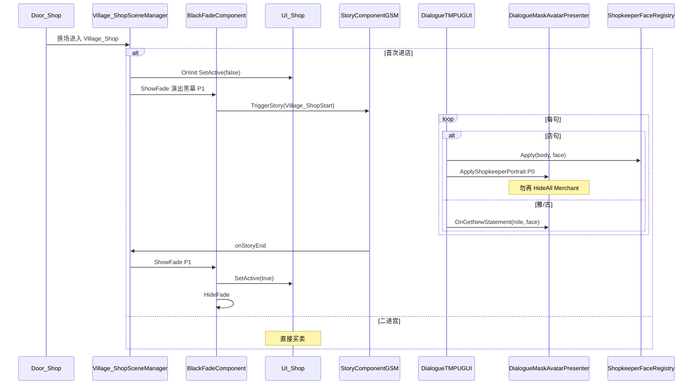

# Village_Shop — 首次进店验收失败 — 架构溯源报告

**文档版本**：v1.0（2026-08-27 · 验收员五项反馈）  
**文档性质**：【架构侦探】只读根因分析 + 最小修复清单（**本阶段未改代码/场景/Prefab**）  
**Unity**：2020.3.48f1  
**场景**：`Assets/GameRes/Scenes/Village_Shop.unity`  
**对话 Prefab**：`Assets/GameRes/Prefabs/Dialogue/Village_ShopStart.prefab`  
**前置报告**：`0827/Village_Shop_首次进店Village_ShopStart联调_架构溯源报告.md`（v1.0 MVP 无黑屏）  

关联提示词：`Assets/Doc/提示词/0827/Village_Shop_首次进店验收失败_架构侦探提示词.md`  

---

## ① 结论一句话

**Trigger 已成功（截图 ID2 店句能播）；五项里 1 项为 MVP 与 0629 差距（F1/F5 黑幕，验收升格为 P1），1 项为确定性代码 Bug（F3 店句 Mask 黑块 = `ApplyShopkeeperPortrait` 后 `OnGetNewStatement(None)` 立刻 `HideAll`），F2 藏 UI 代码已有但需核时序/误判，F4 部分为「ID2=Face1 与合层默认相同」的观感而非全链失效。最大 P0：修 Mask 事件竞态。**

---

## ② 原因（逐条 F1～F5）

### 总览裁定

| # | 反馈 | 性质 | 根因摘要 |
|---|------|------|----------|
| **F1** | 无黑屏渐入渐出 | **MVP 差距 + 0629 升格** | 联调报告 MVP 明确不做；进店换场黑幕在 `OnEnterScene` 前已结束，对白无 `BlackFade` |
| **F2** | 商店 UI 未藏 | **待核 / 可能误判** | GSM 已 `UI_Shop.SetActive(false)`；或藏得晚闪一帧；或验收把对话 Panel 存读档当成「商店 UI」 |
| **F3** | 商人 Mask 黑块 | **✅ 真 Bug（P0）** | 店句先 `ApplyShopkeeperPortrait` 亮 Merchant，同帧 `OnGetNewStatement(None)` → Presenter `HideAll` 再关掉 |
| **F4** | 大立绘表情不变 | **部分真问题 + 部分预期** | 截图在 **ID2 店 Face1** = 合层默认 Normal+Face1，**看不出变化**；雅/古大立绘靠 `RefreshAvatar`，Mask 靠 Presenter（店句 Mask 被 F3 盖掉） |
| **F5** | 结束无黑幕恢复 UI | **MVP 差距 + 0629 升格** | `OnShopStartStoryEnd` 仅 `SetActive(true)`，无 `BlackFadeComponent` |

---

### F1 · 进店无黑屏渐入

**两层黑幕不要混：**

| 层 | 来源 | 现网 |
|----|------|------|
| **换场黑幕** | `LoadSceneComponentGSM` 进村→店 | ✅ 有；**淡出结束才** `OnEnterScene` |
| **0629 演出黑幕** | 对白前/后 `BlackFadeComponent` | ❌ **未接**（MVP 排除） |

`Village_ShopStart` 图内仅有：`FightingPanel 隐藏` → 雅/古淡入 → `NormalDialogueUIAlphaAnimation` 对话框 alpha 渐入 —— **无** `BlackFade` Action 节点。

**KenMuNi 可复用**：`TryDeferBlackFadeForCover` + 分层亮屏 —— **不适合**商店（须全程看见 `商店界面合层` 老板娘大立绘）。

**修复方向（P1）**：GSM 首次进店在 Trigger **前/后** 调全局 `BlackFadeComponent.ShowFade/HideFade`；或 Prefab 图末追加 Action —— **与 F5 共用同一组件**。

---

### F2 · 对白未藏商店 UI

**现网代码（已施工）**：

```133:142:Assets/Scripts/Game/GameRuntime/GameSceneManager/Scene/Village_Shop/Village_ShopSceneManager.cs
            var shopUi = FindShopUiRoot();
            if (shopUi != null)
            {
                shopUi.SetActive(false);
            }
            else
            {
                Debug.LogWarning("[ShopStart] 未找到 UI_Shop，对白期间无法隐藏买卖 UI。", this);
            }
```

| 排查点 | 磁盘结论 |
|--------|----------|
| `Find("UI_Shop")` | 场景根 **`UI_Shop` Active=true**（`Bar` 在其下）—— 名称匹配 |
| `ShopFormLogic` 反开 | **无** `SetActive(true)` 根节点逻辑 |
| 藏 UI 时机 | **`OnEnterScene` 末**（换场黑幕**已淡出**）→ 可能 **先见一帧 UI 再藏** |
| 验收误判 | 对话 Panel 上 **Save/Load/History** 按钮 ≠ `UI_Shop` Bar |

**若对白全程仍见 Bar**：Console 应有 `[ShopStart] 未找到 UI_Shop` 或无 `[ShopStart] OnEnterScene TriggerStory` —— 需验收员贴 Log 证伪。

**修复建议（P1）**：

1. **首次进店判定后，在 `OnInit`（仍全黑）就 `SetActive(false)`**，`OnEnterScene` 再 Trigger —— 消除 F2 闪帧  
2. GSM **序列化引用** `UI_Shop`（`[SerializeField]`），避免 `Find` 脆弱  
3. 验收规范：只认 **`UI_Shop/Bar`** 买卖区，不含 NormalDialogueNewPanel 工具钮  

---

### F3 · 商人小头像黑块（P0 真 Bug）

**调用顺序（店句 · 截图 ID2）**：

```226:249:Assets/Scripts/Game/GameRuntime/NodeCanvas/NodeCanvasExtend/DialogueTMPUGUI.cs
            if (info.UseShopkeeperPortrait)
            {
                // … Registry.Apply …
                maskPresenter.ApplyShopkeeperPortrait(info.ShopBody, info.ShopFace);  // ① 亮 Merchant
                OnGetNewStatement?.Invoke(DialogueRoleName.None, DialogueFaceType.None, text); // ②
            }
```

Presenter 订阅 ②：

```74:80:Assets/Scripts/Game/GameRuntime/UI/FormLogic/Story/DialogueMaskAvatarPresenter.cs
        public void Apply(DialogueRoleName role, DialogueFaceType faceType)
        {
            HideAllPaintings();   // ② 把 ① 刚亮的 Merchant 关掉
            if (role == DialogueRoleName.None)
            {
                return;           // Mask 窗全黑
            }
```

**同帧竞态**：① 显示 → ② `HideAll` → 整句 Mask **黑块**。与 Prefab/Sprite 无关时仍复现。

**磁盘侧 MerchantMask 本身 OK**：

| 项 | 状态 |
|----|------|
| `useMaskAvatar` | **1** |
| `merchantMaskPainting` 引用 | **已拖** |
| 实例默认 Active | **false**（正确） |
| 母体 `MerchantMaskPainting` | Body/Face + Image + Sprite ✅ |

**最小修复（P0 · 代码）** — 二选一：

| 方案 | 做法 | 推荐 |
|------|------|------|
| **A** | Presenter 增 `_shopkeeperMaskActive`：`ApplyShopkeeperPortrait` 置 true；`Apply(None)` 若 true **跳过 HideAll**；`Apply(雅/古…)` 置 false 再 HideAll | **✅ 最小 diff** |
| B | 店句 **删除** `OnGetNewStatement` _invoke_；历史记录改单独入口 | 需动 FormLogic 订阅 |

**勿**改 SR `MerchantPainting` 修 Mask。

---

### F4 · 大立绘表情不随 CSV 变

**分角色表（截图停在 ID2 时）**

| ID | Speaker | CSV | 大立绘载体 | 期望变化 | 现网推断 |
|----|---------|-----|------------|----------|----------|
| **1** | 雅 | `Surprised` | Prefab `GoOutStoryYaerPainting` + Mask | 惊讶 | `RefreshAvatar`→`UpdateFace(Armor_NoHeadWear_Surprised)`；**Start 可能先 Smile**（0804 竞态，GoOut 有 Mask/场景分流） |
| **9** | 古 | `ForcedSmile` | Prefab `GushaPainting` + Mask | 尬笑 | `RefreshAvatar`→`UpdateFace("ForcedSmile")` |
| **2** | 店 | `Face1` | 场景合层 Toggle | Face1 | **默认已是 Normal+Face1**（`ResetDefault`）→ **看起来不变** ⚠️ |
| **34** | 店 | `Face2`+`Red` | 合层+Mask | 脸红+Face2 | Registry 应切；Mask 被 **F3** 盖掉 |

**三轨技术锚点**

```
雅/古大立绘（Prefab 内）
  DialogueActorEx.RefreshAvatar
  → OnRefreshAvatarEvent
  → GoOut/GushaPainting.UpdateFace(键)

雅/古 Mask
  OnGetNewStatement(Yaer/Gusha, faceType)
  → Presenter.Apply → UpdateFace

店合层
  ShopkeeperFaceRegistry.Apply(body, face)   // 与 Mask 独立，F3 不影响

店 Mask
  ApplyShopkeeperPortrait → 被 F3 误 HideAll
```

**屏上「三角色」来源**：Prefab 雅/古 Painting（Canvas 淡入）+ 场景 `商店界面合层` 老板娘 —— **不是**全来自合层。

**F4 裁定**：修 **F3** 后店 Mask 应随句变；合层请用 **ID5 店 Face2** 或 **ID34 Red+Face2** 验收，**勿只用 ID2 Face1** 判「不变」。

---

### F5 · 结束后无黑幕恢复 UI

现网：

```164:174:Assets/Scripts/Game/GameRuntime/GameSceneManager/Scene/Village_Shop/Village_ShopSceneManager.cs
        private void OnShopStartStoryEnd()
        {
            UnsubscribeShopStartStoryEnd();
            var shopUi = FindShopUiRoot();
            if (shopUi != null)
            {
                shopUi.SetActive(true);   // 直接显，无 BlackFade
            }
            Debug.Log("[ShopStart] onStoryEnd，显示 UI_Shop");
        }
```

0629 §4：**对白结束 → BlackFade → 再出完整商店 UI**。

**修复（P1 · 代码）**：`OnShopStartStoryEnd` 内串 `BlackFadeComponent.ShowFade` → `UI_Shop.SetActive(true)` → `HideFade`（与 F1 **同一组件**，避免双实现）。

存档：`StoryComponentGSM.OnStoryEnd` 已 `OnStoryTriggered("Village_ShopStart")`，**勿重复写档**。

---

## ③ 用户 / 验收员复测清单

| # | 操作 | 通过标准 |
|---|------|----------|
| 1 | 新档 → `Door_Shop` 进店 | Console 有 `[ShopStart] OnEnterScene TriggerStory Village_ShopStart` |
| 2 | **F2** | 对白中 **不见 `UI_Shop/Bar`**（存读档钮不算） |
| 3 | **F3** | 店句 ID2：Mask **见商人脸**，非黑块 |
| 4 | **F4** | ID1 雅 Surprised / ID9 古 ForcedSmile / **ID5 或 ID34 店** 脸或身有变化 |
| 5 | **F5** | 对白结束：**黑幕过渡** → 再出买卖 UI |
| 6 | **F1** | 首次进店有 **演出黑幕**（非仅换场黑幕）或策划书面接受等价 |
| 7 | 二进宫 | 不播对白，直接 UI |

**Console 过滤词**：`[ShopStart]` · `[MaskAvatar]` · `[MerchantMask]` · `[ShopkeeperFace]` · `未找到 UI_Shop`

---

## ④ 给程序

### A. 复现与日志（侦探磁盘推断 · 待 Play 证伪）

| 项 | 推断 |
|----|------|
| `TriggerStory` | **✅ 成功**（截图有 ID2 字幕） |
| `UI_Shop` 藏/显 | 代码会 Log `[ShopStart]`；**无 Log 则查编译/分支** |
| 店句 Registry | 无 Warning 则已 Apply；**Face1 与默认相同肉眼难辨** |
| Mask | **应有 Apply 后立即 Hide**（F3）；Warning「未绑定」则另查 Prefab |

---

### B. 最小修复清单（P0 → P1 → P2）

| 优先级 | 反馈 | 类型 | 文件/模块 | 动作（一句话） |
|--------|------|------|-----------|----------------|
| **P0** | **F3** | **代码** | `DialogueMaskAvatarPresenter.cs` | 店句 Mask 竞态：`ApplyShopkeeperPortrait` 后 `Apply(None)` **不得 HideAll Merchant**（`_shopkeeperMaskActive` 或等价） |
| **P0** | **F3** | **代码**（备选） | `DialogueTMPUGUI.cs` | 店句分支 **去掉** `OnGetNewStatement(None)`，并保证历史记录仍写入 |
| **P1** | **F1+F5** | **代码** | `Village_ShopSceneManager.cs` | 首次进店 + 对白结束串 **`BlackFadeComponent`**（0629 升格） |
| **P1** | **F2** | **代码** | `Village_ShopSceneManager.cs` | 首次判定后 **`OnInit` 提前藏** `UI_Shop`；**序列化引用** 替代 `Find` |
| **P1** | **F4** | **验收** | — | 用 **ID5/ID34** 验店句变脸；修 F3 后再验 Mask |
| **P2** | **F4** | **代码** | `GoOutStoryYaerPainting` | 首句 Surprised 仍被 Smile 盖则按 0804 报告补（与 F3 独立） |
| **P2** | **F2** | **Prefab** | 合层/场景 | 若仍见「像 UI」的条，查是否 **合层 组7 精灵** 而非 `UI_Shop` |
| **P2** | — | **NodeCanvas** | `Village_ShopStart` | 可选：图末加 BlackFade Action（若 GSM 串不方便） |

**禁止 scope**：改 CSV；店句改 `DialogueFaceType`；SR 版 `MerchantPainting` 塞 Mask。

---

### C. 目标时序（修完后）



---

### D. 与 0827 子报告衔接

| 子报告 | 验收失败关联 |
|--------|--------------|
| 联调 v1.0 | Trigger **已做**；MVP 无黑幕 → **F1/F5 验收不通过** |
| MerchantMask UI | Prefab 接线 **OK**；**F3 代码竞态** 导致黑块 |
| Body/Face CSV | 图与 CSV **一致**；ID2 默认脸 **观感** |
| Merchant Actor | **已绑**；字幕「欢迎啊…」正常 |

---

### E. 开放问题

| # | 问题 | 侦探倾向 |
|---|------|----------|
| 1 | 0629 黑幕 **本期必做**？ | **验收已要求 → 升格 P1** |
| 2 | F2 截图 save/load 算不算商店 UI？ | **不算**；只认 `UI_Shop/Bar` |
| 3 | 对白期间禁 ESC？ | **MVP 不禁**；P2 可选 |
| 4 | ID2 Face1 验合层「不变」？ | **改用 ID5+ / ID34** 验 Toggle |

---

**报告结束 · 施工员按 P0→P1 修一条验一条**
