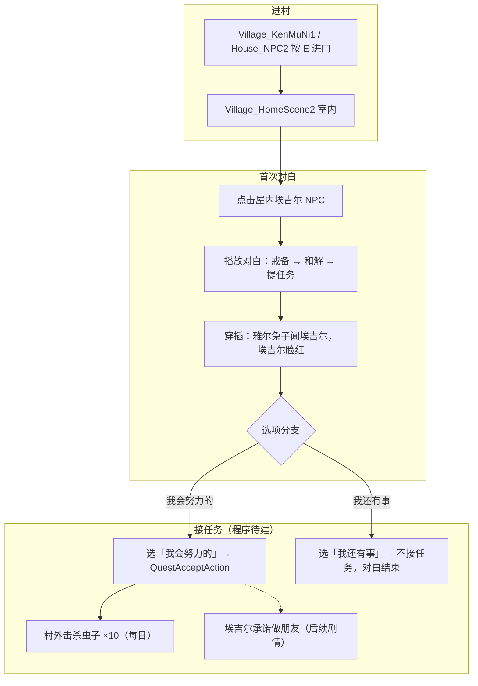

# Village_HomeScene2 — 埃吉尔接任务对白台本 — 架构溯源与执行说明

**文档性质**：架构侦探产出（只读分析 + 分阶段施工指引，**本阶段不改代码**）  
**依据**：
- `Assets/Doc/00_MASTER_PROMPT.md`【架构侦探】
- `Assets/Doc/02_SYSTEM_SPEC.md` §2（NodeCanvas 驱动剧情）
- 策划长图（雅 × 埃吉尔 · 屋内首次见面 + 接「清理虫子」任务）
- 换场前置：`Assets/Doc/执行文档/0606/Village_HomeScene2_House_NPC2进村换场_施工执行说明.md`
- 击杀任务体系：`Assets/Doc/执行文档/0606/经典MMO击杀任务_任务配置文件_架构溯源与执行说明.md`
- 对话管线：`Assets/Doc/执行文档/0525/CSV转NodeCanvas对话树_架构溯源与执行说明.md`
- NPC 配置样板：`Assets/Doc/执行文档/0601/Village_HomeScene23_NPC对话配置_执行说明.md`

**目标场景**：`Assets/GameRes/Scenes/Village_HomeScene2.unity`（肯姆尼第二户民居室内，由 `House_NPC2` 进入）  
**Unity 版本**：2020.3.48f1  

---

## 1. 结论（一句话）

**策划图是一段「埃吉尔屋内首次见面 → 选项分支 → 接取每日清理 10 只虫子」的复合演出：对白走 `SimpleStoryTrigger` + CSV 导入 + `Dialogue/*.prefab`；接任务走击杀任务体系阶段 2 的 `QuestAcceptAction`（待建）；当前工程仅有 `QuestConfigMgr` 阶段 1、无「埃吉尔」Actor/立绘、无「虫子」怪物名，首版应拆成「先播对白验收 → 再接任务链路」两批交付。**

---

## 2. 玩家全流程（策划意图）



| 玩家看到的现象 | 对应系统 |
|----------------|----------|
| 自己闯进埃吉尔家，对方一开始很凶 | NodeCanvas 对白 + 立绘表情 |
| 中间兔子跑过来蹭埃吉尔，她脸红还装生气 | 对白内 **演出节点**（旁白/Action，见 §4.3） |
| 埃吉尔说村外虫子咬坏了百合花，要每天清 10 只 | 对白末句 + `QuestConfig.json` 条目 |
| 底部两个选项：「我还有事」「我会努力的」 | `MultipleChoiceNode` 分支 |
| 选「我会努力的」后任务进追踪（远期左侧 UI） | `QuestAcceptAction` + `QuestManager`（阶段 2～3，**当前未实现**） |

---

## 3. 静态阅读：工程现状与缺口

### 3.1 场景侧 `Village_HomeScene2`

| 项目 | 当前状态 | 与本任务关系 |
|------|----------|--------------|
| 场景文件 | `Village_HomeScene2.unity` 存在 | 对白发生地 |
| 场景管理器 | 已有 `Village_HomeScene2SceneManager` | 换场文档已交付，可进屋 |
| `Entity/Npc1` | 挂 `SimpleStoryTrigger`，`StoryPrefabName = HomeScene1Npc1`（龙宫模板残留） | **须改名/改触发名 → 埃吉尔** |
| 「埃吉尔」场景物体名 | 仍为通用 `Npc1` | 施工时建议重命名 `NpcAegir` |
| 村内第二户进门 | `House_NPC2` → `Village_HomeScene2` | 玩家如何到达屋内 |

### 3.2 对话运行时链路（已成熟，可直接复用）

```
玩家点击 NPC（SimpleStoryTrigger）
  → StoryComponentGSM.TriggerStory("Village_HomeScene2_Aegir_QuestOffer")
  → 加载 Assets/GameRes/Prefabs/Dialogue/Village_HomeScene2_Aegir_QuestOffer.prefab
  → DialogueTreeController 播放 NodeCanvas 图
  → DialogueTMPUGUI 显示字幕 / 立绘
```

**路径铁律**：prefab 必须在 `GameRes/Prefabs/Dialogue/` **根目录**，文件名与 `StoryPrefabName` **完全一致**（不含 `.prefab`）。

### 3.3 任务系统（仅阶段 1 就绪）

| 能力 | 状态 | 说明 |
|------|------|------|
| `QuestConfig.json` 加载 | ✅ `QuestConfigMgr.Init()` | 仅有样例 `Quest_001`（史莱姆 ×5） |
| `QuestAcceptAction` | ❌ 未实现 | 见击杀任务文档 §5.2 |
| `QuestManager` / 运行时追踪 | ❌ 未实现 | 见击杀任务文档 §6 |
| 怪物死亡上报任务 | ❌ 未实现 | 见击杀任务文档 §7 |

### 3.4 角色与怪物配置缺口

| 缺口 | 详情 | 首版建议 |
|------|------|----------|
| **埃吉尔 Actor** | `DialogueRoleName` 枚举无此项；无 `Avatar_Aegir` 图集 | 先 **字幕 + 占位立绘** 或仅雅尔侧立绘；埃吉尔用 `Normal` 占位 |
| **Speaker 映射** | 默认映射无 `埃吉尔` | 导入前补 `埃吉尔 → 埃吉尔`（或 `埃 → 埃吉尔`） |
| **虫子怪物** | `MonsterConfig.json` 无 `Bug` / `虫子`；最接近为 `WoodWorm`（蠕虫） | **须策划裁定**绑定名；见 §8 待决问题 Q1 |
| **每日重置** | `QuestConfig.repeatable` 字段存在，**无每日刷新逻辑** | 首版可先 `repeatable: true` 语义占位，日更逻辑单独立项 |

---

## 4. 策划图文字提取（对白台本 · CSV 九列格式）

**触发**：玩家进入 `Village_HomeScene2`，**首次**与埃吉尔交互。  
**CSV 源稿**：`Assets/Dialog/Village_HomeScene2_Aegir_QuestOffer.csv`（可直接 `Tools → Dialogue → Import CSV`）  
**Speaker 映射**：`雅 → 雅尔`；`埃吉尔 → 埃吉尔`；`— → 旁白`（导入前补映射，旁白仅字幕）。

| ID  | Type     | Speaker | Text                                       | English | Next    | Extra       | FaceType  | Voice |
| --- | -------- | ------- | ------------------------------------------ | ------- | ------- | ----------- | --------- | ----- |
| 1   | Dialogue | 雅       | 啊，是你呀。                                     |         | 2       |             | Smile     |       |
| 2   | Dialogue | 埃吉尔     | 唔。。。。。。你干嘛自己就进来了。                          |         | 3       |             | Unhappy   |       |
| 3   | Dialogue | 雅       | 我只是想看看。。。。。                                |         | 4       |             | Daze      |       |
| 4   | Dialogue | 埃吉尔     | 随便跑到别人家，可恶的龙。                              |         | 5       |             | Angry     |       |
| 5   | Dialogue | 雅       | 别这么说我，我只是想和你交朋友，为什么对我这个态度啊。                |         | 6       |             | Unhappy   |       |
| 6   | Dialogue | 埃吉尔     | 你们外族总是杀戮，你提着剑就闯进来想来你也是一类家伙吧！               |         | 7       |             | Angry     |       |
| 7   | Dialogue | —       | 雅尔的兔子跑过来闻闻埃吉尔。                             |         | 8       |             |           |       |
| 8   | Dialogue | 埃吉尔     | 唔。。。。。。                                    |         | 9       |             | Unhappy   |       |
| 9   | Dialogue | —       | 埃吉尔红着脸强装愤怒不时的撇向兔子。                         |         | 10      |             |           |       |
| 10  | Dialogue | 雅       | 。。。。。。                                     |         | 11      |             | Daze      |       |
| 11  | Dialogue | 埃吉尔     | 我也知道有些东西可恶至极确实该死，如果你只是杀了坏家伙那我还可以宽恕你！       |         | 12      |             | Angry     |       |
| 12  | Dialogue | 雅       | 我只打死过怪物喔。                                  |         | 13      |             | Smile     |       |
| 13  | Dialogue | 埃吉尔     | 真的吗，那，你要帮我忙，帮了我我就和你做朋友。                    |         | 14      |             | Smile     |       |
| 14  | Dialogue | 雅       | 什么事。                                       |         | 15      |             | Surprised |       |
| 15  | Dialogue | 埃吉尔     | 最近村子外有很多虫子，虫子咬坏了我很多百合花，太可恶了，你帮我每天清理掉10个虫子。 |         | 16      |             | Angry     |       |
| 16  | Choice   | 埃吉尔     |                                            |         | END\|17 | 我还有事\|我会努力的 |           |       |
| 17  | Dialogue | 雅       | 我会努力的！                                     |         |         |             | Smile     |       |

> **FaceType 规则**：对白行填 `DialogueFaceType` 枚举英文名；旁白行（Speaker `—`）留空；Choice 行忽略。雅尔**勿用 `Normal`**。  
> **选项分支**：ID 16 `Extra` 与 `Next` 用 `|` 分隔——「我还有事」→ `END`；「我会努力的」→ ID 17 → 结束。ID 17 后须在 Graph 手动挂 `QuestAcceptAction(Quest_002)`（程序待建）。  
> **兔子演出**：ID 7、9 为策划图红框旁白，首版纯字幕；二期可改场景精灵 Action（见 §4.1 替代方案）。

---

## 5. 任务配置草案（接在「我会努力的」分支）

### 5.1 策划字段对照

| 策划原文 | 配置字段建议 |
|----------|--------------|
| 清理 10 个虫子 | `targetCount: 10` |
| 村子外的虫子 | `objectiveText: 击杀虫子 10 只`；`targetMonster` 待定（§8 Q1） |
| 每天 | `repeatable: true` + **日更重置逻辑待程序单独立项** |
| 帮了我我就和你做朋友 | **不进 QuestConfig**；完成后另开对话 prefab 或存档旗标 |

### 5.2 建议 `QuestConfig.json` 新增行（草案）

```json
{
  "id": "2",
  "questId": "Quest_002",
  "title": "埃吉尔的百合花",
  "title_en": "Aegir's Lilies",
  "title_jp": "エギルのユリ",
  "objectiveText": "击杀虫子 10 只",
  "objectiveType": "KillMonster",
  "targetMonster": "待定_见Q1",
  "targetCount": "10",
  "rewards": [
    { "type": "Gold", "amount": "50" }
  ],
  "prerequisiteQuestIds": [],
  "autoAccept": "false",
  "repeatable": "true",
  "sortOrder": "2"
}
```

> **奖励金额**：策划图未写，上表 `50` 为占位，须策划确认。  
> **`targetMonster`**：在 Q1 裁定前 **不要** 写入 JSON，否则 `QuestConfigMgr.ValidateTargetMonsters` 启动 Warning。

### 5.3 与击杀任务六阶段的关系

| 阶段 | 本任务需要 | 当前状态 |
|------|------------|----------|
| 1 配置表 | 新增 `Quest_002` 行 | 可立即由策划填（待 Q1） |
| 2 NPC 接任务 | 选项「我会努力的」挂 `QuestAcceptAction` | **阻塞** |
| 3 运行时追踪 | 接取后 `InProgress` + `0/10` | **阻塞** |
| 4 死亡计数 | 村外杀虫子累加 | **阻塞**（且需虫子怪物实体） |
| 5 左侧 UI | 显示任务条 | **阻塞** |
| 6 完成发奖 | 杀满 10 + 好友剧情 | **阻塞** |

**施工顺序建议**：**批次 A** 仅对白 + 选项（拒绝分支可完整验收）；**批次 B** 在阶段 2 程序就绪后补 `QuestAcceptAction` 与配置行。

---

## 6. CSV 录入规范（九列，与工程现有表一致）

### 6.1 列定义

| 列 | 说明 |
|----|------|
| `ID` | 全表唯一整数，`Next` 引用此列 |
| `Type` | `Dialogue` 或 `Choice` |
| `Speaker` | `雅` / `埃吉尔` / `—`（旁白，无立绘） |
| `Text` | 对白或旁白正文（照抄策划图） |
| `English` | 英译，可空 |
| `Next` | 下一行 ID；`END` 表结束；Choice 行用 `17\|18` 多分支 |
| `Extra` | 仅 Choice：`选项A\|选项B`，与 `Next` 分支数一致 |
| `FaceType` | `DialogueFaceType` 枚举名；旁白/Choice 留空 |
| `Voice` | 语音文件名，可空 |

### 6.2 Speaker 映射（导入前必补）

| CSV Speaker | 图内 Actor 名 |
|-------------|---------------|
| `雅` | `雅尔` |
| `埃吉尔` | `埃吉尔` |
| `—` | `旁白`（导入器要求所有 Dialogue 行 Speaker 可解析；Prefab 中「旁白」Actor 可不绑立绘，仅出字幕） |

### 6.3 完整 CSV 已落盘

路径：**`Assets/Dialog/Village_HomeScene2_Aegir_QuestOffer.csv`**（内容与 §4 表一致，可直接导入）。

### 6.4 建议资源命名

| 资源 | 路径 / 名 |
|------|-----------|
| CSV 源稿 | `Assets/Dialog/Village_HomeScene2_Aegir_QuestOffer.csv` |
| 生成 `.asset` | `Assets/GameRes/DialogueTrees/Generated/`（导入工具默认） |
| 运行时 prefab | **`Assets/GameRes/Prefabs/Dialogue/Village_HomeScene2_Aegir_QuestOffer.prefab`** |
| `StoryPrefabName` | `Village_HomeScene2_Aegir_QuestOffer` |

---

## 7. 场景 NPC 配置（施工员清单）

### 7.1 改造 `Entity/Npc1` → 埃吉尔

1. 打开 `Village_HomeScene2.unity`。  
2. 选中 `SceneManager → … → Entity → Npc1`。  
3. 重命名为 **`NpcAegir`**（建议，非强制）。  
4. `SimpleStoryTrigger`：**Story Prefab Name** = `Village_HomeScene2_Aegir_QuestOffer`。  
5. 替换 Sprite / Animator 为埃吉尔外观（美术资源到位后）。  
6. 保留 `EntityControl`（`entityType=NPC`，`canTouchWithPlayer=true`）、`InteractiveComponent`、Body 触发碰撞（照 `Village_HomeScene23_NPC对话配置_执行说明.md` §4.3）。

### 7.2 首次 vs 重复交互（可选后续）

| 状态 | 行为 |
|------|------|
| 未接 / 未完成 `Quest_002` | 播放 §4 全文 + 选项 |
| 已接任务进行中 | 短对白「虫子清得怎样了？」（策划未供图，**待补**） |
| 已完成 | 好友态对白（策划未供图，**待补**） |

首版可 **仅做首次一条 prefab**；重复逻辑用存档旗标 + 触发器脚本分支（仿 `HomeScene1Xiaer`），或第二个 `StoryPrefabName`。

---

## 8. 待决问题（施工前须策划 / 程序裁定）

| ID | 问题 | 影响 | 建议 |
|----|------|------|------|
| **Q1** | 「虫子」对应哪个 `MonsterConfig.name`？ | `Quest_002.targetMonster`、村外刷怪 | 新建 `VillageBug`；或暂绑 `WoodWorm`（蠕虫）并改 `cnName` 显示 |
| **Q2** | 「每天清理 10 个」是 **每日重置** 还是 **累计 10 只一次性**？ | `repeatable` 与存档日更 | 若真·每日：需 `QuestManager` 扩展 `lastResetDay` |
| **Q3** | 埃吉尔立绘与 `DialogueRoleName` 何时入库？ | 埃吉尔侧 Face 显示 | 首版可仅雅尔有立绘 |
| **Q4** | 兔子演出要 **纯字幕** 还是 **场景精灵移动**？ | §4.2 实现成本 | 首版旁白；二期 Action |
| **Q5** | 任务奖励与「做朋友」是否绑定任务 **TurnedIn**？ | 阶段 6 与后续对话 | 完成任务后触发新 prefab `Village_HomeScene2_Aegir_Friend` |
| **Q6** | 玩家选「我还有事」后，同日再点是否 **重复全文**？ | 触发器与存档 | 建议仍播全文直至接取或加「已听过」短版 |

> 裁定前勿改 `QuestConfig.json` 的 `targetMonster` 实值；可记入项目 `Docs/OPEN_QUESTIONS.md`（若目录存在）。

---

## 9. 分阶段验收清单

### 9.1 批次 A — 仅对白（不依赖任务系统）

**前置**：`Village_HomeScene2` 换场可进（0606 文档 Q1～Q6 通过）。

| # | 操作 | 通过标准 |
|---|------|----------|
| A1 | `InitScene` 进游戏 → `House_NPC2` 进屋 | 能走到 `NpcAegir` 旁 |
| A2 | 点击埃吉尔 | 弹出对话 UI，序号 1～12 字幕顺序正确 |
| A3 | 兔子段落 | S1～S3 出现在 6～7 句之间（旁白或对白） |
| A4 | 选项 | 底部出现「我还有事」「我会努力的」 |
| A5 | 选「我还有事」 | 对白正常结束，**无** Console 报错 |
| A6 | 选「我会努力的」 | 首版仅结束对白；阶段 2 就绪后应出现 `[Quest] Accept Quest_002` |
| A7 | Console | **无** `加载资源失败: .../Dialogue/Village_HomeScene2_Aegir_QuestOffer.prefab` |

### 9.2 批次 B — 接任务 + 击杀（依赖击杀任务阶段 2～4）

| # | 操作 | 通过标准 |
|---|------|----------|
| B1 | 选「我会努力的」 | `QuestManager` 状态 `InProgress`，`0/10` |
| B2 | 村外击杀裁定怪物 | 计数涨至 10，`Complete` 或 Debug 日志 |
| B3 | 读档 | 进度保留 |
| B4 | （若 Q2=每日）跨游戏日 | 计数重置为 0，可再接 |

---

## 10. 制作步骤（策划 / 程序协作）

| 步骤 | 负责 | 动作 |
|------|------|------|
| 1 | 策划 | 确认 §8 Q1～Q6 |
| 2 | 策划 | 按 §6 填写 CSV，导出至 `Assets/Dialog/` |
| 3 | 程序/策划 | Tools → Dialogue → Import CSV；补 Speaker 映射 |
| 4 | 程序/策划 | 复制 `Village_KenMuNiStart.prefab` → 改名 → Bind Graph → 绑雅尔 Actor |
| 5 | 程序/策划 | DialogDebug 试播 → 调整 Face / 选项连线 |
| 6 | 程序 | 场景 `Npc1` 改 `StoryPrefabName`（§7.1） |
| 7 | 程序 | （批次 B）实现 `QuestAcceptAction`、写 `Quest_002`、村外虫子刷怪 |
| 8 | 策划 | Play 模式走 §9 验收 |

---

## 11. 逻辑溯源简图（给程序）

```
Village_HomeScene2.unity
  Entity/NpcAegir
    SimpleStoryTrigger.StoryPrefabName = Village_HomeScene2_Aegir_QuestOffer
      → StoryComponentGSM.TriggerStory
      → Prefabs/Dialogue/Village_HomeScene2_Aegir_QuestOffer.prefab
          → StatementNodeEx × N（雅尔 / 埃吉尔）
          → MultipleChoiceNode
              ├─「我还有事」→ FinishNode
              └─「我会努力的」→ QuestAcceptAction(questId=Quest_002) [待建] → FinishNode

QuestConfig.json (Quest_002) [待 Q1 填 targetMonster]
  → QuestConfigMgr（已有）
  → QuestManager.AcceptQuest [待建]
  → BaseMonster.OnDead → QuestManager.OnMonsterKilled [待建]
```

---

## 12. 相关文档索引

| 主题 | 文档 |
|------|------|
| 进屋换场 | `0606/Village_HomeScene2_House_NPC2进村换场_施工执行说明.md` |
| 击杀任务全链路 | `0606/经典MMO击杀任务_任务配置文件_架构溯源与执行说明.md` |
| CSV 导入 | `0525/CSV转NodeCanvas对话树_架构溯源与执行说明.md` |
| NPC 三件套 | `0601/Village_HomeScene23_NPC对话配置_执行说明.md` |
| 雅尔表情 | `0601/对话立绘表情与图片名称对照_执行说明.md` |
| Speaker 映射 | `0601/CSV导入工具_Speaker映射扩展_施工执行说明.md` |
| 对话试播 | `0525/DialogDebug对话测试场景_施工执行说明.md` |

---

## 13. 文档修订

| 日期 | 说明 |
|------|------|
| 2026-06-07 | 初版：架构侦探据策划长图提取埃吉尔首次见面 + 接任务对白；对齐 Village_HomeScene2 与击杀任务分阶段体系 |
| 2026-06-07 | §4 改为九列 CSV 表；落盘 `Assets/Dialog/Village_HomeScene2_Aegir_QuestOffer.csv` |

**文档路径**：`Assets/Doc/执行文档/0607/Village_HomeScene2_埃吉尔接任务对白台本_架构溯源与执行说明.md`
