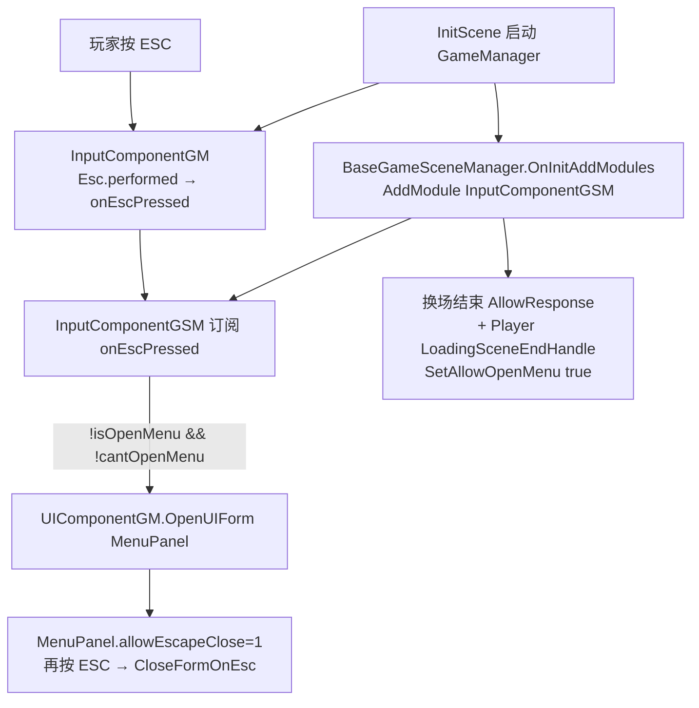

# Village_Shop — ESC 呼出菜单 — 架构溯源与施工执行说明

**文档性质**：架构侦探产出（逻辑溯源 + 接入关卡施工指引；**本阶段不改代码**）  
**依据**：
- `Assets/Doc/00_MASTER_PROMPT.md`【架构侦探】
- `Assets/Project_context.md`（GameMgr / GSM 分层）
- `Assets/Doc/技术文档/场景相关/搭建新场景手册.md`
- 室内场景范例：`0530/Village_House4场景管理器_施工执行说明.md`、`Village_HomeScene2SceneManager`
- 商店背景：`0629/商店系统_策划拆解_执行说明.md`、`0704`～`0713` 系列 Shop 施工文档

**目标**：理清「ESC 呼出菜单」在正规关卡里绑在谁身上、别的场景怎么跑通，对照 `Village_Shop` 缺什么；明确是否必须从 `InitScene` 启动；给出接入村庄关卡时的施工清单，保证菜单内功能（贵重物品 / 存读档 / 返回 / 退出旅途）可验收。  
**Unity 版本**：2020.3.48f1  

---

## 1. 结论（一句话）

**ESC 打开菜单不绑在玩家身上，而是绑在「场景管理器」的输入模块 `InputComponentGSM` 上；玩家只负责在换场结束后「允许打开」。`Village_Shop` 当前是只有 `UI_Shop` 的 UI 测试沙盒，没有场景管理器，直接 Play 永远出不了正规菜单。要让 ESC + 菜单五项功能正常，必须：① 把 `Village_Shop` 做成带 `SceneManager` 的正式玩法场景并接入村庄；② 从 `InitScene` 进游戏再换场进去。**

---

## 2. 你要验收的现象（接入后）

| 步骤 | 期望 |
|------|------|
| 从 **InitScene** 进游戏 → 换场到 `Village_Shop`（或经村里门进入） | 场景可走 / 可交互；Console 无 `GetGameSceneManager` 空引用 |
| 局内按 **ESC** | 打开 **MenuPanel**（贵重物品 / 保存 / 读取 / 返回 / 退出旅途） |
| 再按 **ESC** 或点「返回」 | 菜单关闭，场景恢复 |
| 菜单 → 保存 / 读取 | 能打开对应面板，不报错 |
| 菜单 → 贵重物品 | 能打开道具展示 |
| 菜单 → 退出旅途 | 二次确认后可回主菜单 |
| 商店 UI 打开时按 ESC（见 OPEN Q） | **不应**叠出菜单盖住商店（需另补互斥，见 §6.3） |

---

## 3. 架构溯源：ESC 菜单到底绑在谁身上？

### 3.1 三层分工（生活类比）

| 层级 | 脚本 | 干什么 | 类比 |
|------|------|--------|------|
| **全局按键总线** | `InputComponentGM`（挂在 `GameManager`，跨场景常驻） | 侦测 ESC，广播 `onEscPressed` | 大楼总电闸上的「门铃按钮」 |
| **场景级菜单开门人** | `InputComponentGSM`（由 `BaseGameSceneManager` 自动 `AddModule`） | 收到 ESC → 若允许则 `OpenUIForm(MenuPanel)` | **本层楼的门卫**（★真正「呼出菜单」的人） |
| **玩家** | `PlayerLogic` 等 | 换场结束时 `SetAllowOpenMenu(true)`；死亡 / 对话 / 限制区时关掉 | 住户告诉门卫「现在可以/不可以开门」 |

**结论答用户原问**：功能**原先绑定在场景管理器（GSM 输入模块）上**，不是玩家。玩家只是「开关许可」的协作者之一。

### 3.2 正规关卡调用链（与 Village_KenMuNi1 / House4 / HomeScene2 相同）

| 环节 | 代码锚点 | 说明 |
|------|----------|------|
| ESC 原始输入 | `InputComponentGM.OnInit` | 注释写明「Esc打开菜单」；实际打开不在 GM，只广播事件 |
| 订阅与打开 | `InputComponentGSM.OnInit` / `OnEscPressed` | `OpenUIForm(...MenuPanel..., EUIGroup.Top)` |
| 默认先锁住 | `InputComponentGSM.CantResponse` | `OnInit` 末尾默认 `cantOpenMenu=true`，防加载中误开 |
| 解锁时机 A | `onCompleteLoadingSceneEvent` / `LoadSceneComponentGSM.onEndLoadingSceneEvent` → `AllowResponse` | 加载完成允许 ESC / E |
| 解锁时机 B | `PlayerLogic.LoadingSceneEndHandle` → `SetAllowOpenMenu(true)` | 玩家侧再放行一次 |
| 菜单开/关状态 | `MenuFormProxy.onMenuActiveEvent` → `isOpenMenu` | 已开时 ESC 不再二次 Open，改由面板 `allowEscapeClose` 关 |
| 菜单关面板 | `MenuPanel.prefab` → `allowEscapeClose: 1` | 走 `BaseUIFormLogic.CloseFormOnEsc` |

### 3.3 玩家「参与」但不「拥有」的证据

| 位置 | 行为 | 含义 |
|------|------|------|
| `PlayerLogic.LoadingSceneEndHandle` | `SetAllowOpenMenu(true)` | 换场完允许开菜单 |
| `BasePlayerState`（死亡等） | `SetAllowOpenMenu(false)` | 特殊状态禁止 |
| `CanNotSomeActionArea` | 进出区域开关 `SetAllowOpenMenu` | 区域限制 |
| 对话 / 地图 / 设置等 Form | `AllowOpenMenu(false/true)` | UI 互斥 |

**没有**任何「玩家 Update 里直接监听 ESC 开 MenuPanel」的主路径。

### 3.4 菜单五项功能依赖什么（查漏补缺用）

| 菜单按钮 | 打开对象 | 硬依赖 |
|----------|----------|--------|
| 贵重物品 | `ItemShowPanel` | `UIComponentGM` + 存档道具数据 |
| 保存 | `SaveGamePanel` | 存档组件 + `GameSceneManager`（暂停场景对象） |
| 读取 | `LoadGamePanel` | 存档 + Procedure 读档流程 |
| 返回 | `CloseForm` | 菜单自身；关时通过 GSM 解暂停 |
| 退出旅途 | `SystemTipsPanel` → `MenuFormProxy.OnReturnMainMenu` | Procedure 回主菜单 |

`MenuFormLogic.OnOpen` 还会读：

- `sceneMgr.SetSceneObjIsPause / SetSceneObjAniIsPause`
- `sceneMgr.canShowSaveGame / canShowLoadGame / canShowItemForm`

→ **没有 `BaseGameSceneManager`，菜单即使用别的办法打开也会空引用或按钮状态异常。**

---

## 4. Village_Shop 现状（静态阅读 2026-07-13）

### 4.1 Hierarchy 实况

场景内主要只有：

- `Main Camera`
- `EventSystem`
- `UI_Shop`（及 Buy/Sell 列表、Total2、BtnConfirm 等）

**没有**：

| 正规关卡必备 | Village_Shop |
|--------------|--------------|
| 根物体 `SceneManager` + `*SceneManager : BaseGameSceneManager` | ❌ |
| `GameSceneManagerConfig` | ❌ |
| `Map` / 出生点 / 门 | ❌ |
| 玩家生成链 | ❌ |
| `InputComponentGSM`（随 GSM 自动挂） | ❌ |
| `SceneName.Village_Shop` 常量 | ❌（`SceneName.cs` 仅有 KenMuNi1 / House4 / HomeScene2 / OutSide 等） |

`ShopFormLogic` 当前是挂在场景里的普通 `MonoBehaviour`，**不是** `BaseUIFormLogic`，也**没有** `AllowOpenMenu(false)`。

### 4.2 直接 Open `Village_Shop` → Play 会怎样

| 现象 | 原因 |
|------|------|
| ESC 无菜单 | 无 GSM → 无 `InputComponentGSM` 订阅打开逻辑 |
| 即便硬塞菜单 Prefab | 无 `GameManager` / `UIComponentGM` / 存档 / Procedure，五项功能全废 |
| 商店 UI 可点 | 仅本地 Canvas + EventSystem，与局内管线无关 |

→ **Village_Shop 至今是「商店 UI 烘焙/验收沙盒」，不是可进关卡的玩法场景。**

---

## 5. 是否必须和 InitScene 一起启动？

### 5.1 结论

**是。验收 ESC 菜单与菜单内功能时，必须从 InitScene（或等价的整条 Procedure 冷启动）进入，再换场到 Village_Shop。**

不要单独 Open `Village_Shop` 再 Play 来验收本需求（与 `Village_HomeScene23_NPC对话配置` 文档口径一致）。

### 5.2 原因（为何「先安排进村庄」是对的）

| 能力 | 来自哪里 | 单独 Play 沙盒 |
|------|----------|----------------|
| ESC 广播 | `GameManager` → `InputComponentGM` | 无 |
| 打开 MenuPanel | `UIComponentGM` + AB/资源管线 | 无 |
| 场景输入模块 | 玩法场景的 `BaseGameSceneManager` | 无 |
| 存读档 / 退出旅途 | `ProcedureComponentGM` + 存档 | 无 |
| 换场后解锁 ESC | 加载完成事件 + 玩家 `LoadingSceneEndHandle` | 无 |

因此你说的「如果需要 InitScene，我就先把场景安排到村庄里」——**判断正确，建议立刻按室内关卡标准把 Village_Shop 接入村庄拓扑**，再从 InitScene 验收 ESC。

---

## 6. 接入策略与查漏补缺

### 6.1 推荐接入形态（与现有室内一致）

对齐 `Village_House4` / `Village_HomeScene2`：

1. **复制**最接近的室内场景（建议 `Village_HomeScene2` 或 `Village_House4`）为骨架，或在现有 `Village_Shop` 上**补齐** SceneManager / Map / Config（工作量更大，易漏）。
2. 新建 `Village_ShopSceneManager : BaseGameSceneManager`（室内最小集：`nowSceneName`、`SetNowPlace(KenMuNi)`、`TerrainType.IndoorType`、空 `initAllSceneMonster`）。
3. `SceneName.cs` 增加 `Village_Shop`。
4. 配置 `GameSceneManagerConfig`（`canCreatePlayer=true`，`isFightingScene=false` 等）。
5. 村里（如 `Village_KenMuNi1` 某门 / 老板娘屋）配置 `SceneChangeDoor` + 双侧 `EnterPosConfig`。
6. 场景纳入 Resource Editor / Build Settings（见根目录 README）。
7. **把现有 `UI_Shop` 保留在场景内**作第一阶段商店界面（或后续再 Prefab 化走 `OpenUIForm`——见 OPEN Q）。

`BaseGameSceneManager.OnInitAddModules` **已默认** `AddModule<InputComponentGSM>()` → **正规 GSM 场景装好后，ESC 呼出菜单「白送」，不必再写一套 ESC 逻辑。**

### 6.2 禁止的临时补丁

| 做法 | 为什么不行 |
|------|------------|
| 在 `ShopFormLogic.Update` 里 `GetKeyDown(Escape)` 自己开菜单 | 绕过 GSM / 暂停 / 互斥，与架构冲突 |
| 把开菜单写进玩家脚本 | 与现网所有关卡分叉，第三手项目禁止 |
| 沙盒场景硬塞一个孤立 `InputComponentGSM` 不挂 GSM | `SceneManager` 引用、加载事件、暂停全断 |

### 6.3 商店 UI 与 ESC 菜单互斥（接入后必查）

正规面板（对话、地图、设置、存读档）在 `OnOpen`/`OnClose` 会 `AllowOpenMenu(false/true)`。

| 现状 | 风险 |
|------|------|
| `ShopFormLogic` 无互斥 | 商店开着按 ESC → 可能弹出 MenuPanel 盖住商店 |
| `ShopFormLogic` 非 `BaseUIFormLogic` | 不能直接用基类 `AllowOpenMenu`；需在打开/关闭商店时手动调 GSM，或先 Prefab 化继承 FormLogic |

**施工阶段建议最小补丁**：商店显示时 `GetModule<InputComponentGSM>().SetAllowOpenMenu(false)`，关闭时还原 `true`（注意与对话等叠加时用计数或「谁关谁开」约定，避免误开）。

### 6.4 菜单功能验收清单（接入后）

| ID | 操作 | 通过标准 |
|----|------|----------|
| M-1 | InitScene → 进 `Village_Shop` → ESC | 出 MenuPanel |
| M-2 | 再 ESC / 返回 | 菜单关，玩家可继续操作 |
| M-3 | 保存 | SaveGamePanel 打开；可写档（按现网规则） |
| M-4 | 读取 | LoadGamePanel 打开；读档不崩 |
| M-5 | 贵重物品 | ItemShowPanel 打开 |
| M-6 | 退出旅途 | 确认后回主菜单 |
| M-7 | 商店打开时 ESC | **不**出菜单（互斥补齐后） |
| M-8 | 换场加载中狂按 ESC | 不误开（CantResponse） |

---

## 7. 施工任务拆分（给施工员，本阶段只文档）

> 顺序建议：**先场景入村（GSM）→ InitScene 验收 ESC → 再补商店互斥 → 最后门/落点 polish。**

| 编号 | 任务 | 类型 | 依赖 |
|------|------|------|------|
| **VS-ESC-0** | 产品确认：`Village_Shop` 是独立室内场景，还是 `HomeScene4` 内叠 UI？（见 OPEN Q1） | 策划 | — |
| **VS-ESC-1** | `SceneName.Village_Shop` + `Village_ShopSceneManager` + Config 资产 | 代码+资源 | VS-ESC-0 选「独立场景」 |
| **VS-ESC-2** | 场景挂 SceneManager / Map / 出生点；AB + Build Settings | Unity | VS-ESC-1 |
| **VS-ESC-3** | 村里门 ↔ `Village_Shop` 双向 `SceneChangeDoor` + `EnterPosConfig` | Unity | VS-ESC-2 |
| **VS-ESC-4** | InitScene → 进店 → 验收 M-1～M-6 | 验收 | VS-ESC-2 |
| **VS-ESC-5** | 商店打开/关闭 `SetAllowOpenMenu` 互斥；验收 M-7 | 代码 | VS-ESC-4 |
| **VS-ESC-6**（可选后续） | `UI_Shop` → `ShopPanel.prefab` + `BaseUIFormLogic`，走 `OpenUIForm` | 重构 | 商店正式交互完成后再做 |

**替代方案说明**：

- **方案 A（推荐）**：独立 `Village_Shop` 室内场景 + 默认 GSM → ESC 零额外逻辑。  
- **方案 B**：商店只做 UI，叠在 `Village_HomeScene23`；ESC 由 HomeScene4 的 GSM 提供；`Village_Shop.unity` 继续当 Bake 沙盒。此时「接入关卡」= 门进 HomeScene4 + 开商店 UI，而不是换场到 Village_Shop。  
- **方案 C**：沙盒里仿造 Init+GSM —— 工作量大且易脏，**拒绝**。

---

## 8. OPEN QUESTIONS（设计未定，勿擅自定方向）

| ID | 问题 | 影响 | 建议默认 |
|----|------|------|----------|
| Q1 | 正式关卡入口是 **独立场景 `Village_Shop`**，还是 **`Village_HomeScene23` + 商店 UI**？（0629 文档曾写目标场景 HomeScene4） | 决定 VS-ESC-1～3 做不做换场 | ✅ **已拍板（2026-07-13）**：独立场景 `Village_Shop`，且为**纯 UI / 不生成玩家**。落地见 `0713/Village_KenMuNi1_Door_Shop换场Village_Shop纯UI_架构溯源与施工执行说明.md` |
| Q2 | 商店打开时 ESC 语义：关商店 / 禁止菜单 / 先关商店再允许菜单？ | VS-ESC-5 实现 | 建议对齐对话：打开时禁菜单；商店自己的关闭键另定（或二次 ESC 关店） |
| Q3 | `UI_Shop` 何时 Prefab 化进 GF？ | 与 UI 组、AB 预加载 | 第一阶段可继续场景内 Canvas，先保 ESC+入村 |

> 若项目有统一的 `Docs/OPEN_QUESTIONS.md`，可将上表同步过去；当前仓库未见该文件，故先落在本执行文档。

---

## 9. 给程序看的锚点清单

| 主题 | 路径 |
|------|------|
| ESC 广播 | `Assets/Scripts/Game/GameMgr/Component/InputComponentGM.cs` |
| ESC 开菜单 | `Assets/Scripts/Game/GameRuntime/GameSceneManager/Component/InputComponentGSM.cs` |
| GSM 默认挂载 Input | `BaseGameSceneManager.OnInitAddModules` |
| 菜单逻辑 | `Assets/Scripts/Game/GameRuntime/UI/FormLogic/Menu/MenuFormLogic.cs` |
| 菜单 Prefab ESC 关 | `Assets/GameRes/Prefabs/UI/MenuPanel.prefab` → `allowEscapeClose: 1` |
| 玩家解锁菜单 | `PlayerLogic.LoadingSceneEndHandle` |
| 室内管理器范例 | `Village_House4SceneManager.cs` / `Village_HomeScene2SceneManager.cs` |
| 新场景手册 | `Assets/Doc/技术文档/场景相关/搭建新场景手册.md` |
| 商店沙盒场景 | `Assets/GameRes/Scenes/Village_Shop.unity` |
| 商店逻辑（无菜单互斥） | `Assets/Scripts/Game/GameRuntime/UI/FormLogic/Shop/ShopFormLogic.cs` |

---

## 10. 版本记录

| 版本 | 日期 | 说明 |
|------|------|------|
| 0.1 | 2026-07-13 | 首版：确认 ESC 绑 GSM 非玩家；Village_Shop 缺口；必须 InitScene；入村施工拆分与 OPEN Q |

**文档路径**：`Assets/Doc/执行文档/0713/Village_Shop_ESC呼出菜单_架构溯源与施工执行说明.md`
