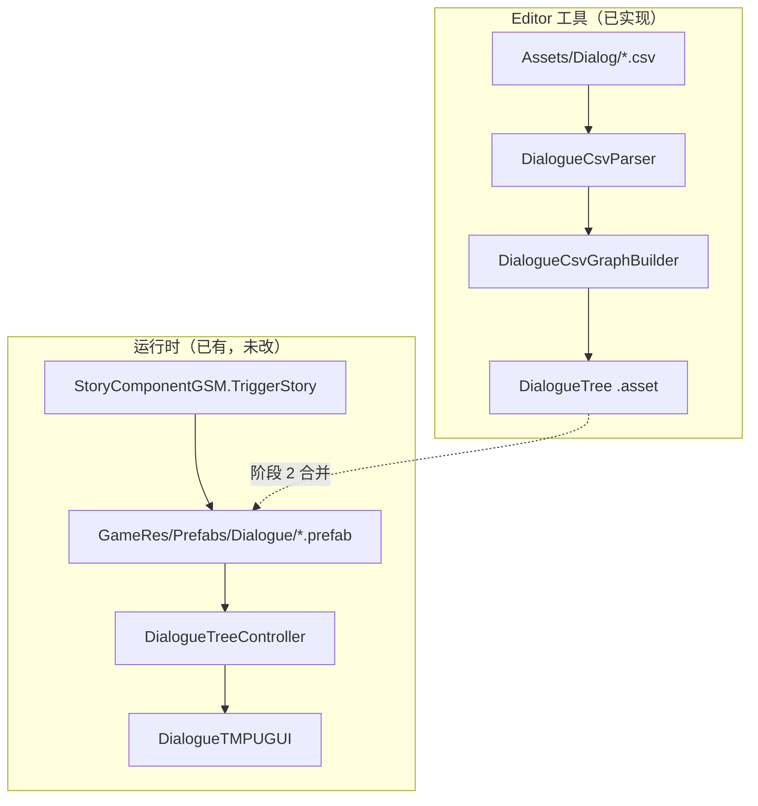

# CSV → NodeCanvas DialogueTree 导入工具 — 开发文档

> 文档日期：2026-05-25  
> 状态：**阶段 1 + 可选开场前奏** — Editor 菜单可导入 CSV 并生成 `DialogueTree` `.asset`（默认无前奏，与初版行为一致）；合并进 Prefab / 实机 `TriggerStory` 为阶段 2。  
> Unity 版本：2020.3.48f1  
> 架构溯源：`Assets/Doc/执行文档/0525/CSV转NodeCanvas对话树_架构溯源与执行说明.md`  
> 样例 CSV：`Assets/Dialog/村内第一段对话.csv`

---

## 一、背景与目标

### 1.1 背景

项目运行时对话走 **NodeCanvas DialogueTree**，内容挂在 `Assets/GameRes/Prefabs/Dialogue/{名}.prefab` 上，由 `StoryComponentGSM.TriggerStory(名)` 加载。策划在 Excel/CSV 中维护对白台本，若全部手点 NodeCanvas 节点与连线，成本高且易错。

工程中另有 `DialogueConfigExcelTool`（Excel → JSON），与 NodeCanvas **无直接关系**，不能替代本工具。

### 1.2 本工具目标（阶段 1）

| 目标 | 说明 |
|------|------|
| **减少手点** | 从 CSV 自动生成 `DialogueTree` 图：对白节点、选项分支、连线、Actor 参数表 |
| **符合项目规范** | 对白节点使用 **`StatementNodeEx`**（非原生 `StatementNode`），以支持立绘 / `DialogueFaceType` |
| **可校对** | 产物为独立 **`.asset`**，可在 NodeCanvas 编辑器中打开预览，再决定是否合并进 Prefab |
| **仅 Editor** | 不修改 `StoryComponentGSM`、`DialogueTMPUGUI` 等运行时逻辑 |

### 1.3 非目标

- 不自动**合并**进已有 Prefab（阶段 2）；可选前奏仅写入新生成 `.asset` 内的 ActionNode
- 不自动绑定 **DialogueActorEx / StoryFormPainting** 的 Object 引用
- 不扩展 CSV 的 `Face` / 三语 / 旁白 Action 列（留待阶段 3）

---

## 二、与运行时资产的关系



**一句话**：阶段 1 生成的是 **中间产物 `.asset`**；要进游戏仍须阶段 2 合并到 **`GameRes/Prefabs/Dialogue/{名}.prefab`**，命名与 `TriggerStory` 参数一致。

成品 Prefab 示例：`Village_KenMuNiStart.prefab` — 图内 Actor 名为 **「雅尔」「古莎」**，入口常为 **ActionNode**，而非第一句对白。

---

## 三、使用方式

### 3.1 打开导入窗口

菜单：**Tools → Dialogue → Import CSV**

### 3.2 窗口字段

| 字段 | 说明 |
|------|------|
| **CSV 文件** | 拖入 `TextAsset`（须为 `.csv`，UTF-8 编码） |
| **Speaker 映射** | 可选；拖入 `DialogueSpeakerMapping` 资产。未指定时使用内置默认（雅→雅尔、古→古莎、艾米→艾米、艾莉→艾莉、村→村长、埃吉尔→埃吉尔、—→旁白） |
| **输出目录** | 默认 `Assets/GameRes/DialogueTrees/Generated` |
| **开场前奏（可选）** | 折叠区；**默认全部不勾选** = 仅对白/选项（与初版阶段 1 一致） |
| 对话框 UI 淡入 | `NormalDialogueUIAlphaAnimationTaskAction`，0→1，0.7s |
| 开始时隐藏战斗面板 | `FightingPanelVisibleActionTask` Visible=false |
| 结束时恢复战斗面板 | Visible=true；须同时勾选「开始时隐藏」 |
| 立绘 CanvasGroup 淡入 | 须指定参考 Prefab（如 `Village_KenMuNiStart`），从 Blackboard 解析变量名写入 ActionList |

### 3.3 生成步骤

1. 选择 CSV（如 `Assets/Dialog/村内第一段对话.csv`）
2. （推荐）创建并指定 Speaker 映射资产：**Create → Yaer → Dialogue → Speaker Mapping**
3. 点击 **「生成 DialogueTree .asset」**
4. 在 Project 中打开生成的 `.asset`，用 NodeCanvas 图编辑器核对节点与连线
5. 整次导入支持 **Undo**（`Undo.RegisterCreatedObjectUndo`）

### 3.4 创建 Speaker 映射资产

```
Create → Yaer → Dialogue → Speaker Mapping
```

| CSV Speaker（策划简称） | Actor 参数名（图内） | 备注 |
|-------------------------|----------------------|------|
| 雅 | 雅尔 | 对应 `DialogueRoleName.Yaer` 立绘逻辑 |
| 古 | 古莎 | 对应 `DialogueRoleName.Gusha` |
| 艾米 | 艾米 | 与 `Village_LeaderGuShaAmyAliy` 等 Prefab Actor 名一致 |
| 艾莉 | 艾莉 | 同上 |
| 村 | 村长 | 台本单字简称 → 图内完整称呼（立绘待补） |
| 埃吉尔 | 埃吉尔 | 与 `Village_HomeScene2_Aegir_QuestOffer` 等 Prefab Actor 名一致（立绘待补） |
| — | 旁白 | Speaker 列填 em dash；仅字幕，不绑立绘 |

**未命中映射时导入中止并报错**，避免生成红色 `* 雅 *` 未定义 Actor 节点。

---

## 四、CSV 格式规范

### 4.1 表头（固定）

```csv
ID,Type,Speaker,Text,Next,Extra
```

### 4.2 列说明

| 列 | 类型 | 说明 |
|----|------|------|
| **ID** | int | 全表唯一，供 `Next` 引用 |
| **Type** | string | `Dialogue`（对白）或 `Choice`（分支选项） |
| **Speaker** | string | 策划简称；`Dialogue` 必填，`Choice` 可选（选项提问者） |
| **Text** | string | 对白正文；`Choice` 行可作节点注释（`comments`） |
| **Next** | string | 单 ID / `4\|5` 多分支 / `END` / 空（结束，不连出边） |
| **Extra** | string | 仅 `Choice`：`选项A\|选项B`，与 `Next` 分支数一致 |

### 4.3 样例（线性三句）

```csv
ID,Type,Speaker,Text,Next,Extra
1,Dialogue,雅,好漂亮的村子。,2,
2,Dialogue,古,雅儿一定是第一次来吧，一会带你逛一逛村子。,3,
3,Dialogue,雅,我挺好奇的。,,
```

### 4.4 解析规则

- 跳过表头；`ID` 非法行写 Log 并跳过
- **不使用** `string.Split(',')` 裸拆；支持引号包裹字段（RFC 4180 风格，`""` 转义引号）
- 编码：**UTF-8**
- 校验：ID 唯一；`Next` 引用 ID 存在（`END`/空除外）；`Choice` 的 `Extra` 与 `Next` 分支数量一致

---

## 五、代码结构与职责

源码目录：`Assets/Editor/Tool/Dialogue/`

| 文件 | 职责 |
|------|------|
| `DialogueRow.cs` | CSV 行数据结构 |
| `DialogueCsvParser.cs` | CSV 解析 + 结构校验 |
| `DialogueSpeakerMapping.cs` | 简称 → Actor 参数名（ScriptableObject） |
| `DialogueCsvGraphBuilder.cs` | 构建 `DialogueTree`：加节点、连线、Actor 表 |
| `DialogueCsvImportWindow.cs` | Editor 窗口与菜单入口 |

命名空间：`EditorC.Tool.Dialogue`（与 `EditorC.Tool.ExcelTool` 等 Editor 工具一致）。

---

## 六、建图算法（六步）

```
Step0  （可选）preludeOptions 非空时 DialoguePreludeBuilder 创建 Action 链
Step1  读取 CSV 文本 → List<DialogueRow>
Step2  校验 ID 唯一、Next 引用、Choice Extra/Next 数量
Step3  CreateInstance<DialogueTree>()，按 Speaker 去重写入 actorParameters
Step4  第一轮：每行 AddNode
       - Dialogue → StatementNodeEx（statement.text、FaceType=Normal）
       - Choice   → MultipleChoiceNode（availableChoices 来自 Extra）
Step5  第二轮：解析 Next 并 ConnectNodes
       - 单 ID → 默认出口
       - Choice 多 ID → sourceIndex 0..n-1
       - END/空 → 不连出边
Step5b （可选）前奏尾 → CSV 入口；各无出边叶子 → restore FightingPanel
Step6  primeNode = 前奏首 ActionNode（有前奏）或最小 ID 对白节点（无前奏）
       CreateAsset + SaveAssets + Undo
```

### 6.1 节点布局

- `flowDirection` 为 Vertical（DialogueTree 默认）
- 位置：`(200, 100 + rowIndex × 120)`

### 6.2 使用的 NodeCanvas API

```csharp
tree.AddNode<StatementNodeEx>(position);
tree.AddNode<MultipleChoiceNode>(position);
tree.ConnectNodes(source, target, sourceIndex: branchIndex);
tree.primeNode = entryNode;
```

内部 `AddNode` / `ConnectNodes` 已调用 `UndoUtility.RecordObject`。

### 6.3 私有字段写入（重要实现细节）

`DTNode.actorName` 的 **setter 为 private**；且 NodeCanvas 的 `Node` / `DTNode` **不是** `UnityEngine.Object`，**不能**使用 `SerializedObject(node)`。

因此 `DialogueCsvGraphBuilder` 通过 **反射** 写入：

| 目标 | 字段 |
|------|------|
| 说话人 | `DTNode._actorName`、`_actorParameterID` |
| 选项列表 | `MultipleChoiceNode.availableChoices` |

**替代方案**：若 ParadoxNotion 后续暴露公开 API，可去掉反射；当前以反射保证与序列化字段一致且编译通过。

### 6.4 节点类型选型

| CSV Type | NodeCanvas 类型 | 说明 |
|----------|-----------------|------|
| Dialogue | `StatementNodeEx` | 项目扩展，携带 `FaceType`；运行时 `DialogueTMPUGUI` 走 `SubtitlesRequestInfoEx` |
| Choice | `MultipleChoiceNode` | 编辑器显示名 **Multiple Choice**；非 `ChoiceNode` |

---

## 七、阶段划分与后续工作

| 阶段 | 范围 | 状态 |
|------|------|------|
| **1** | CSV → `.asset`；Dialogue + Choice + 连线 + Actor 映射 | ✅ 已实现 |
| **2** | 从模板 Prefab 克隆，合并图数据，保留 Action / Painting 引用；实机 `TriggerStory` | 待做 |
| **3** | CSV 增列 Face / text_en / text_jp；旁白 → ActionNode | 可选 |

阶段 2 验收要点：

- Prefab 路径：`Assets/GameRes/Prefabs/Dialogue/{Name}.prefab`
- 实机字幕、立绘、选项分支与 CSV 一致
- 对话结束 `StoryComponentGSM.OnStoryEnd` 正常

---

## 八、验证清单

### 8.1 Editor

- [ ] `Tools/Dialogue/Import CSV` 可打开，选择 `村内第一段对话.csv` 无报错
- [ ] **回归**：前奏全部不勾选 → 3 个 `StatementNodeEx`、无 `ActionNode`、`primeNode` 为 ID 1
- [ ] 仅勾选 UI 淡入 → 1 ActionNode + 3 Statement，`primeNode` 为 UI Action
- [ ] 立绘淡入未指定参考 Prefab → 导入失败，不写半成品 asset
- [ ] `actorParameters` 含「雅尔」「古莎」
- [ ] 各节点 `statement.text` 与 CSV 一致
- [ ] Ctrl+Z 可撤销整次导入

### 8.2 回归

- [ ] `StoryComponentGSM`、`DialogueTMPUGUI` 运行时逻辑未被本工具修改
- [ ] `DialogueConfigExcelTool` JSON 管线仍可用

---

## 九、关键代码索引

| 主题 | 路径 |
|------|------|
| 导入窗口 | `Assets/Editor/Tool/Dialogue/DialogueCsvImportWindow.cs` |
| 建图逻辑 | `Assets/Editor/Tool/Dialogue/DialogueCsvGraphBuilder.cs` |
| 前奏选项 DTO | `Assets/Editor/Tool/Dialogue/DialoguePreludeOptions.cs` |
| 前奏节点创建 | `Assets/Editor/Tool/Dialogue/DialoguePreludeBuilder.cs` |
| 立绘变量解析 | `Assets/Editor/Tool/Dialogue/DialoguePortraitReferenceResolver.cs` |
| Graph API | `Assets/ParadoxNotion/CanvasCore/Framework/Runtime/Graphs/Graph.cs` |
| 对白节点（项目） | `Assets/Scripts/Game/GameRuntime/NodeCanvas/NodeCanvasExtend/StatementNodeEx.cs` |
| 选项节点 | `Assets/ParadoxNotion/NodeCanvas/Modules/DialogueTrees/Nodes/MultipleChoiceNode.cs` |
| Actor 字段 | `Assets/ParadoxNotion/NodeCanvas/Modules/DialogueTrees/DTNode.cs` |
| 剧情加载 | `Assets/Scripts/Game/GameRuntime/GameSceneManager/Component/StoryComponentGSM.cs` |
| 字幕 UI | `Assets/Scripts/Game/GameRuntime/NodeCanvas/NodeCanvasExtend/DialogueTMPUGUI.cs` |
| 对话台本参考 | `Assets/Doc/技术文档/精灵村Village_KenMuNi_对话台本.md` |

---

## 十、常见问题

**Q：生成了 `.asset`，游戏里为什么播不了？**  
A：运行时加载的是 **Prefab**，不是裸 `.asset`。需阶段 2 合并进 `GameRes/Prefabs/Dialogue/` 并 `TriggerStory("同名")`。

**Q：Speaker 写了「雅」但节点显示红色未定义 Actor？**  
A：检查 `DialogueSpeakerMapping` 是否配置「雅 → 雅尔」，且 `actorParameters` 中已生成「雅尔」条目。

**Q：能否直接改 Prefab 里的 `_boundGraphSerialization` JSON？**  
A：不推荐。易破坏 GUID、难 Undo、难维护；应使用 Graph `AddNode` / `ConnectNodes` API（本工具已采用）。

**Q：Choice 的 `Text` 列有什么用？**  
A：写入 `MultipleChoiceNode.comments`，作编辑器注释；选项文案在 `Extra` 列。

---

**维护说明**：本工具仅 Editor 侧；新增角色时在 `DialogueSpeakerMapping` 中补充简称映射即可，无需改运行时代码。
