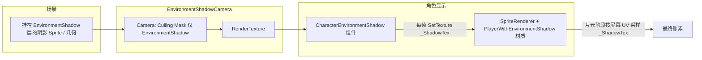

# EnvironmentShadowCamera 与 Layer「EnvironmentShadow」用法说明

本文说明项目中**环境阴影**相关的一条独立渲染链路：专用相机把指定 **Unity Layer** 上的物体画进 **RenderTexture**，再由角色材质在屏幕空间采样，实现「角色身上被环境遮挡变暗」的效果。名称上容易和 **Sorting Layer（2D 排序层）** 混淆，二者机制不同，文末有对照说明。

---

## 1. 整体数据流（从场景到角色）

要点：

1. **Layer「EnvironmentShadow」**（Unity 的 Layer，不是 Sorting Layer）决定**哪些物体**会进入专用相机的视野。
2. **EnvironmentShadowCamera** 上的 `Camera` 把这些物体渲染到 **`targetTexture`（RenderTexture）**。
3. **CharacterEnvironmentShadow** 把该 `RenderTexture` 赋给角色材质上的 **`_ShadowTex`**。
4. **Shader `Sprites/PlayerWithEnvironmentShadow`** 用与主相机一致的屏幕位置去采样 `_ShadowTex`，用其 **Alpha** 混合压暗角色 RGB（见 `_ShadowScale`）。

---

## 2. Layer「EnvironmentShadow」是什么、用在哪

### 2.1 定义位置

在 **`ProjectSettings/TagManager.asset`** 的 **layers** 列表中，名为 **`EnvironmentShadow`**。

按 Unity 默认从 0 计数用户层，当前工程中该名字对应 **Layer 索引 12**（若日后在编辑器里增删 Layer，索引可能变化，以 Inspector 里 Layer 下拉框旁的数字为准）。

### 2.2 用途

- 标记「**需要被环境阴影相机单独拍一张**」的物体（通常是铺在地图上的半透明/阴影贴图、或专门画的遮挡几何）。
- **只有 Culling Mask 勾选了该 Layer 的相机**才会渲染这些物体；主相机是否渲染同一批物体，取决于主相机自己的 **Culling Mask**（与专用相机相互独立）。

因此：**改 Sorting Layer / Sorting Order 不会改变「是否进入 EnvironmentShadowCamera」**，因为那是由 **GameObject 的 Layer（右上角 Layer）** 决定的。若你改的是 Sorting Layer 而物体仍挂在 Default 等 Layer 上，专用相机里根本拍不到，自然也不会影响 RT。

---

## 3. EnvironmentShadowCamera 预制体与脚本

### 3.1 资源路径

- 预制体：`Assets/Prefabs/SceneCommon/EnvironmentShadowCamera.prefab`
- 脚本：`Assets/Scripts/Game/GameRuntime/CameraTool/EnvironmentShadowCamera.cs`  
  命名空间：`Game.GameRuntime.Component`

### 3.2 预制体上典型配置（以 prefab 为准）

| 项 | 说明 |
|----|------|
| **Camera.cullingMask** | 仅包含 **EnvironmentShadow** 层（prefab 中 `m_Bits` 对应单层位掩码，与 Layer 12 一致）。 |
| **Camera.targetTexture** | 指向工程里的某张 **RenderTexture** 资源；RT 即角色材质采样的「阴影图」。 |
| **Clear Flags / Background** | 使用纯色清除，背景色为 **RGBA(1,1,1,0)** 一类配置，便于在 Shader 里用 **Alpha** 表示「有多少阴影权重」。 |
| **Orthographic** | 正交；**orthographicSize** 等需与主游戏视角匹配，否则 RT 与屏幕 UV 对不齐。 |
| **Depth** | 通常为负（如 `-1`），避免与主相机深度冲突；具体以场景需求为准。 |

### 3.3 `EnvironmentShadowCamera` 脚本行为摘要

- **`OnEnable`**：通过 Tag **`MainCamera`** 查找主相机；缓存本物体上的 `Camera` 为 `myCamera`（含 `targetTexture`）。
- **`Update`**：若主相机存在，则**每帧将本 Transform 位置设为与主相机相同**，使专用相机与主视角对齐，从而 RT 与主画面在空间上一致。
- **调试**：`OnEnable` 内会 `Debug.Log` 输出 `targetTexture.name`（发布前可考虑关闭或加宏）。

**替代方案说明**：若场景中有多台主相机或动态切换，可改为注入引用或事件驱动同步位置，避免依赖 `FindWithTag` 与每帧赋值；当前实现以「单主相机 + 简单跟随」为主。

---

## 4. 角色侧：`CharacterEnvironmentShadow` 与 Shader

### 4.1 组件

- 脚本：`Assets/Scripts/Game/GameRuntime/Entities/SceneEffects/CharacterEnvironmentShadow.cs`
- 逻辑：在 `Update` 里 `FindObjectOfType<EnvironmentShadowCamera>()`，取到后对当前物体上的 **`SpriteRenderer.material`** 执行  
  `SetTexture("_ShadowTex", shadowCamera.myCamera.targetTexture)`。

注意：访问 `material` 会生成**材质实例**，避免直接改到工程里的共享材质资源；但每帧 `SetTexture` 仍有开销，若性能敏感可改为仅在切换场景或 RT 变化时设置一次。

### 4.2 Shader：`Sprites/PlayerWithEnvironmentShadow`

- 路径：`Assets/Effect/Shader/PlayerWithEnvironmentShadow.shader`
- 核心：用顶点阶段算出的 **`ComputeScreenPos`** 得到屏幕插值坐标，在片元里  
  `tex2D(_ShadowTex, screenUV)`，用 **`shadowColor.a * _ShadowScale`** 把原图 RGB **lerp 向黑色**。

因此：**RT 上某像素 Alpha 越高，角色在该屏幕位置越暗**（具体还受 `_ShadowScale` 控制）。

---

## 5. 在场景中正确搭建的检查清单

1. **场景中存在** `EnvironmentShadowCamera` 预制实例（或等价配置），且 **启用**。
2. **主相机** GameObject 带 Tag **`MainCamera`**，否则跟随逻辑会反复重找。
3. **环境阴影贴图 / 几何** 的 GameObject **Layer 设为 `EnvironmentShadow`**，且位于专用相机能看到的范围内（与主相机对齐后应在视锥内）。
4. **专用相机的 `orthographicSize`、位置跟随、近远裁剪** 与主相机表现一致，否则屏幕 UV 采样会错位。
5. **角色**使用带 **`_ShadowTex`** 的材质（如 `PlayerWithEnvironmentShadow`），并挂 **`CharacterEnvironmentShadow`**（或自行等价设置 `_ShadowTex`）。
6. **RenderTexture** 分辨率与过滤模式满足美术需求；过大会增加带宽与填充率。

---

## 6. 常见问题：「改了 Sorting Layer 没用」

可能原因包括（可多项同时存在）：

| 原因 | 说明 |
|------|------|
| **混淆两种 Layer** | **Sorting Layer** 只影响同一相机批次内的 2D 绘制顺序；**EnvironmentShadow** 是 **GameObject 的 Layer（Physics/Rendering 掩码）**，决定被哪台相机的 **Culling Mask** 渲染。 |
| **改的是主相机里的排序** | 地面箱子与 `EnvironmentShadow` 下 Sprite 的先后，由**主相机**对各 Layer 的渲染及 **Sorting** 共同决定；而 **EnvironmentShadowCamera** 只负责把 EnvironmentShadow 层写入 RT，不参与你看到的「箱子与阴影贴图谁盖住谁」的 Sorting 逻辑，除非你改的是主相机下两者的相对顺序。 |
| **SortingGroup / 材质队列** | 父节点 `SortingGroup`、不同 `RenderQueue` 或透明混合顺序会覆盖直觉上的「只改子物体 Sorting Order」。 |

若要调节**地图上**「箱子」与「阴影贴图」的遮挡关系，应优先在 **主相机** 可见的前提下，调整二者的 **Sorting Layer / Order** 或 **Transform 前后关系（Z）**；若目标与 **RT 里** 的内容有关，再检查物体是否在 **EnvironmentShadow** 层并被专用相机正确拍摄。

---

## 7. 相关文件索引

| 类型 | 路径 |
|------|------|
| 预制体 | `Assets/Prefabs/SceneCommon/EnvironmentShadowCamera.prefab` |
| 环境相机脚本 | `Assets/Scripts/Game/GameRuntime/CameraTool/EnvironmentShadowCamera.cs` |
| 角色挂接脚本 | `Assets/Scripts/Game/GameRuntime/Entities/SceneEffects/CharacterEnvironmentShadow.cs` |
| 角色 Shader | `Assets/Effect/Shader/PlayerWithEnvironmentShadow.shader` |
| Layer 名称定义 | `ProjectSettings/TagManager.asset`（`EnvironmentShadow`） |

---

## 8. 维护建议

- 修改 **Layer 列表顺序** 后，务必重新核对 **EnvironmentShadowCamera 的 Culling Mask** 位是否仍对应「EnvironmentShadow」这一层。
- 新增场景时，从已有正确场景 **复制 EnvironmentShadowCamera 与 RT 引用关系**，减少漏配。
- 文档与引擎版本以 **Unity 内置 Camera / SpriteRenderer** 行为为准；若项目升级到 URP，需重新验证 RT 与 Built-in 下屏幕 UV 是否一致。
