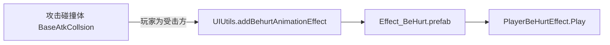

# 玩家受击特效说明

> **关于标题「晚上」**  
> - 若你指的是 **「玩家」** 受击时的 **画面特效**（火花/受击贴图等），请直接阅读下文。  
> - 当前工程 **没有** 按「夜晚 / 时段」单独切换受击特效预制体或脚本的逻辑；夜间场景下观感差异主要来自 **场景光照、后处理、Sorting** 等，与受击特效 **同一套** 资源。若产品需要「夜间专用受击特效」，见文末 **扩展思路**。  
> - 若标题为 **「完善」** 等输入误差，本文同样覆盖 **受击特效** 的配置与代码入口。

与 **`玩家受击系统.md`**（伤害、状态机、击退）互补：本文只讲 **受击「特效」** 的预制体、播放入口与脚本行为。

---

## 1. 特效在流程中的位置

受击 **数值与动画状态机** 在 `PlayerLogic.OnApplyStatusEffects` 等处处理；**碰撞产生受击时** 的 **画面特效** 常在 **`BaseAtkCollsion.OnTriggerEnter2D`** 里，通过 **`UIUtils.addBehurtAnimationEffect`** 在 **接触点** 播放。

---

## 2. 入口：`UIUtils.addBehurtAnimationEffect`

**文件**：`Assets/Scripts/Utils/UIUtils.cs`

| 枚举                           | 预制体路径                                                                     |
| ---------------------------- | ------------------------------------------------------------------------- |
| `AniEffectType.PlayerBeHurt` | `Assets/GameRes/Prefabs/Entity/Effect/Player/Battle/Effect_BeHurt.prefab` |
|                              |                                                                           |

**两种加载方式**：

1. **玩家预制体上已挂模板节点**  
   若 `BaseEntityLogic.beHurtEffectNode` 已在初始化时指向场景里的 **`Effect_BeHurt`** 子物体（见下节），则 **不再走异步加载**：每次受击 **Instantiate 该节点的一份拷贝**，在接触点播放动画，并把模板 **SetActive(false)**。

2. **未预挂节点**  
   通过 **`ResComponentGM.LoadAsset`** 异步加载上述 **Effect_BeHurt.prefab**，首次成功后 **缓存到 `entityLogic.beHurtEffectNode`**，之后逻辑与上一条相同。

**播放**：`playEffectNodeAni` 将特效 **世界坐标** 设为 `pos`（一般为碰撞接触点），取 **`PlayerBeHurtEffect`** 调用 **`Play(playCount)`**。

---

## 3. 玩家侧 `beHurtEffectNode` 的来源（可选预挂）

**文件**：`Assets/Scripts/Game/GameRuntime/Entities/Player/PlayerLogic.cs`（初始化玩家技能/特效节点时）

- 在玩家 **`skillInfo`** 子层级下查找名为 **`Effect_BeHurt`** 的节点；若存在，则赋给 **`beHurtEffectNode`**。  
- 这样运行时优先使用 **预制体里自带的模板**，减少首次受击的加载等待。

若预制体未配置该子节点，则完全依赖 **`UIUtils`** 按路径 **动态加载** `Effect_BeHurt.prefab`。

---

## 4. 碰撞里何时播「玩家受击」特效

**文件**：`Assets/Scripts/Game/GameRuntime/Entities/Effect/AtkCollsion/BaseAtkCollsion.cs`

- 当攻击类型为 **Enemy 打玩家** 等合法组合，且目标 **不是无敌**（`isProtect`、非编辑器无敌等）时，对 **玩家** 固定使用 **`AniEffectType.PlayerBeHurt`**，在 **`OnTriggerEnter2D`** 计算的 **接触点** 调用 **`UIUtils.addBehurtAnimationEffect(..., PlayerBeHurt, ...)`**。  
- 具体分支与注释以脚本为准（含中立生物、玩家攻击怪物时用 `PlayerNorAtk` 等，与本文「玩家挨打」无关）。

---

## 5. 特效组件：`PlayerBeHurtEffect`

**文件**：`Assets/Scripts/Game/GameRuntime/Entities/Effect/Player/BeHurt/PlayerBeHurtEffect.cs`  
**基类**：`AnimaEffectComponent`（`Assets/Scripts/Game/GameRuntime/Entities/Component/Effect/AnimaEffectComponent.cs`）

**行为摘要**：

- **`Find()`**：在子物体 **`Animation`** 上取 **`SpriteRenderer`**（`sr`），用于与基类排序等逻辑配合。
- **`Play(int times)`**：  
  - 对 **`Animator`** 触发 **`Trigger`**，并设置整数参数 **`Index`**。  
  - 代码中曾用 **`Random.Range(1, 4)`** 随机 **`Index`**，随后 **被写死为 `index = 1`**，即当前 **始终使用同一套受击表现分支**（若需多段随机受击贴图，可恢复随机或改为配置驱动）。

**基类**：`Play` 时 **`animator.speed = 1`**；`Awake` 里先将 **`animator.speed = 0`**，避免未播放前误播。动画结束可通过 **`AnimaEventTimes`** 等事件把 **`SpriteRenderer` 透明并 **`Destroy`** 实例（见基类）。

---

## 6. 美术与策划可调项（Inspector）

| 对象 | 说明 |
|------|------|
| **`Effect_BeHurt.prefab`** | 受击特效本体：Animator 状态、`Animation/ SpriteRenderer`、Sorting 等。 |
| **玩家预制体** | 若存在 **`skillInfo/Effect_BeHurt`**，可改模板节点而不改代码。 |
| **Animator 参数** | `Trigger`、`Index` 与控制器内状态对应，改动画需同步参数。 |

---

## 7. 与「夜晚」场景的关系（说明）

- **运行时**：未检索到根据「夜晚」**bool / 时间** 切换 **`AniEffectType`** 或 **不同 prefab 路径** 的代码。  
- **观感**：夜间地图通常仍用同一 **`Effect_BeHurt`**；若觉得「太亮/太暗」，优先调 **场景光、特效材质/颜色、Sorting**，或 **duplicate 预制体** 做夜间变体。

### 扩展思路（若要做夜间专用受击特效）

1. **复制预制体** 为 `Effect_BeHurt_Night.prefab`，在 **`UIUtils`** 的路径字典中按条件选择（需改代码）。  
2. 或在 **`PlayerBeHurtEffect.Play`** 内根据 **场景名 / 全局昼夜状态** 换 **`Sprite`/材质**。  
3. 保持 **`DamageData`** 与状态机逻辑不变，仅替换 **表现层**。

---

## 8. 相关文档与脚本索引

| 说明 | 路径 |
|------|------|
| 受击系统（伤害、动画、击退） | `Assets/Doc/Palyer/玩家受击系统.md` |
| 特效入口与路径字典 | `Assets/Scripts/Utils/UIUtils.cs` |
| 玩家受击特效逻辑 | `Assets/Scripts/Game/GameRuntime/Entities/Effect/Player/BeHurt/PlayerBeHurtEffect.cs` |
| 特效基类 | `Assets/Scripts/Game/GameRuntime/Entities/Component/Effect/AnimaEffectComponent.cs` |
| 碰撞触发特效 | `Assets/Scripts/Game/GameRuntime/Entities/Effect/AtkCollsion/BaseAtkCollsion.cs` |
| 预制体 | `Assets/GameRes/Prefabs/Entity/Effect/Player/Battle/Effect_BeHurt.prefab` |

---

*文档与当前仓库脚本一致；若 `UIUtils` 或 `PlayerBeHurtEffect` 有改动，请同步更新第 2、5 节。*
