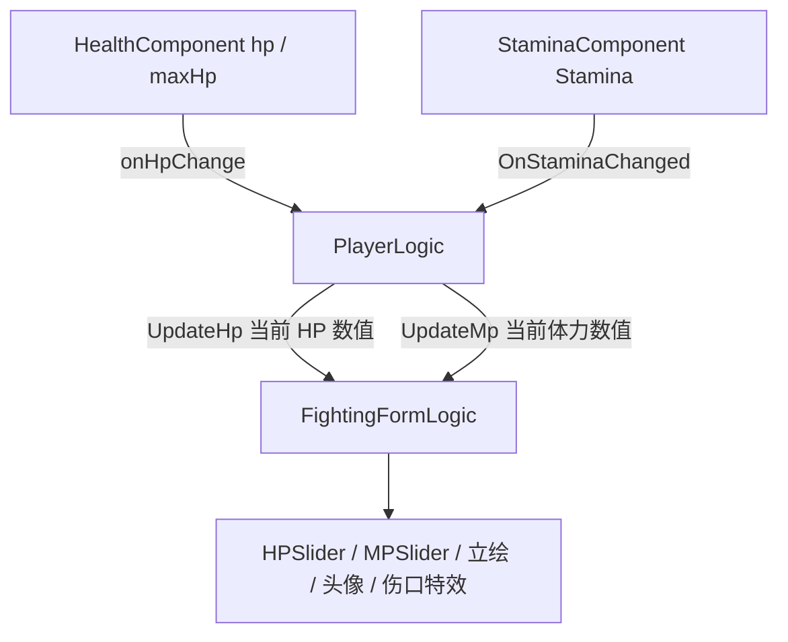

# 玩家血条功能（FightingPanel）

面向策划：说明**战斗场景左下角**玩家状态区（血条、体力条、头像、立绘与伤口表现）对应的界面预制体、节点路径、数值如何同步，以及与**设置项**的关系，便于验收与与 Boss 血条区分。

---

## 1. 功能概述

- 玩家在**战斗场景**（`Config.isFightingScene == true`）进入并初始化后，会由场景管理器自动打开 **战斗 HUD 面板**（`FightingPanel`）。
- 该面板不仅包含**血条**（`HPSlider`），还包含**体力条**（`MPSlider`）、**头像**、**立绘区**与**伤口特效**等；血条变化会联动**立绘状态**、**头像三档图**与**伤口布尔动画**（见第 5 节）。
- **Boss 血条**为另一套界面（如 `BossHpBarPanel` / `BossHpBarFormLogic`），与本文「玩家血条」无关，请勿混淆。

---

## 2. 预制体与层级

| 项目 | 路径 / 名称 |
|------|-------------|
| 面板预制体 | [`Assets/GameRes/Prefabs/UI/FightingPanel.prefab`](f:/Yaer/yaer/Yaer/Assets/GameRes/Prefabs/UI/FightingPanel.prefab) |
| 代码中路径键 | `UIPrefabPath.GetUIPrefabPath("FightingPanel")` → `Assets/GameRes/Prefabs/UI/FightingPanel.prefab` |
| 逻辑脚本 | 根节点挂载 **`FightingFormLogic`** |
| 血条（Slider） | 子路径 **`Info/ImageBG/HPSlider`** |
| 体力条（Slider） | 子路径 **`Info/ImageBG/MPSlider`** |
| 头像 | **`Info/ImageBG/ImageAvatar_ref`**（`Image`） |
| 立绘 | 子物体 **`Illustration`**（`FightingIllustration`） |
| 装备破损表现 | 子物体 **`Broken`**（`FightingBroken`） |

运行时实例名通常为 **`FightingPanel(Clone)`**（以 Unity 实际命名为准）。
![[Pasted image 20260406162455.png|307]]
血条的滑块有个handle

---

## 3. 何时打开 / 关闭

- **打开**：[`BaseGameSceneManager.OpenFightingPanel`](f:/Yaer/yaer/Yaer/Assets/Scripts/Game/GameRuntime/GameSceneManager/Base/BaseGameSceneManager.cs)  
  - 仅当 **`Config.isFightingScene`** 为真且面板尚未打开时，执行 `OpenUIForm(FightingPanel, EUIGroup.Bottom, ...)`。
- **关闭**：同场景中若 **`Config.isFightingScene`** 为假，且检测到战斗面板已打开，则 **`CloseUIForm(FightingPanel)`**。

因此：**非战斗场景不会出现本 HUD**；策划验收「血条是否显示」时，请先确认当前关卡是否标记为战斗场景。

---

## 4. 数据流：血量 / 体力如何刷新 UI

### 4.1 血量（HP）

1. 运行时血量来自玩家实体上的 **`HealthComponent`**（`hp`、`maxHp`）。
2. **`PlayerLogic`** 在初始化时订阅 **`healthComponent.onHpChange`**，在 **`OnHPChanged(float hp)`** 中：
   - 同步 **`playerCommonData.CurrentHP`**；
   - 驱动 Animator 血量档位（`SetAnimatorHP`，见第 5.3 节）；
   - 检测衣服破损阈值（`CheckClothesBroken`）；
   - 若 **`FightingPanel`** 已打开，取得 **`FightingFormLogic`** 并调用 **`UpdateHp(hp)`**。
3. **`FightingFormLogic.UpdateHp(float hp)`** 中：
   - 使用 **`hp / MaxHP`** 得到 **0～1 的比例**，赋给 **`HPSlider.value`**。  
   - **注意**：参数名为「血量」，实为**当前 HP 数值**；**不是**已经算好的百分比。`MaxHP` 在 **`OnOpen`** 时从 **`HealthComponent.maxHp`** 读取并缓存。

**历史说明**：`FightingFormLogic` 内曾直接订阅 `HealthComponent.onHpChange`，现已**注释**；改为全部由 **`PlayerLogic`** 统一转发，避免切场景后回调失效（见 `FightingFormLogic.OnOpen` 内注释）。

### 4.2 体力（MP / Stamina）

- **`PlayerLogic.OnStaminaChanged`** 同样取得 **`FightingFormLogic`**，调用 **`UpdateMp(stamina)`**。
- **`UpdateMp`** 使用 **`当前体力 / MaxStamina`** 刷新 **`MPSlider.value`**（`MaxStamina` 在面板打开时从 **`StaminaComponent`** 缓存）。

### 4.3 打开时的初值与首帧补偿

- **`OnOpen`**：用当前 **`HealthComponent.hp` / `StaminaComponent.Stamina`** 各调用一次 **`UpdateHp` / `UpdateMp`**，并应用设置里的 **`showBattleImage`、`showWound`**。
- **`OnUpdate` 首帧**：再次用 **`health.hp`** 调用 **`UpdateHp`**（`FirstRefresh` 标记），用于处理极端情况下打开瞬间数值与组件不同步的问题。

---

## 5. 血条变化联动表现（策划验收要点）

以下比例均为 **`当前 HP / MaxHP`**（与 `HPSlider.value` 一致，范围 0～1）。

### 5.1 立绘状态（`FightingIllustration`）

| 血量区间 | 衣服未破 | 衣服已破 |
|----------|----------|----------|
| \> 50% | 正常 | 破损 |
| 25%～50% | 破损 | 破损 |
| ≤ 25% | 若 **显示伤口** 开启：破损+伤；否则仅破损 | 同上 |

衣服破损由逻辑 **`PlayerLogic.CheckClothesBroken`** 在血量 **首次低于 50%** 时置位，并通知 **`FightingFormLogic.OnClothesBrokenChanged`**（播放破损动画与音效等）。

### 5.2 头像三档（`AvatarSprites`）

- **\> 50%**：第 1 张；
- **\> 25% 且 ≤ 50%**：第 2 张；
- **≤ 25%**：若 **「显示伤口」** 为真，用第 3 张（伤）；否则仍用第 2 张。

### 5.3 伤口特效动画（`WoundEffectAnimator`）

- 当 **`hpPercent < 0.25`** 时，布尔参数 **`Wound`** 为真，用于驱动伤口相关 Animator 状态。

### 5.4 与设置的关系（`SettingsConfigData`）

| 设置项 | 作用（与战斗 HUD 相关） |
|--------|-------------------------|
| **显示战斗立绘**（`showBattleImage`） | 与 **`ForestSceneData.homeDoorStoryComplete`** 等条件组合后，决定是否显示 **`Illustration`** 区域；从隐藏切回显示时，会按**当前滑条比例**重算立绘、伤口特效与头像。 |
| **显示伤口**（`showWound`） | 影响 **≤25%** 时立绘是否进入「带伤」状态，以及 **头像是否使用伤脸图**；变更时会用当前 **`HPSlider.value`** 刷新立绘与头像。 |

---

## 6. 与 Boss 血条的区别（避免混淆）

| 对比项 | 玩家（本文） | Boss（参考） |
|--------|--------------|--------------|
| 面板 | `FightingPanel` | 如 `BossHpBarPanel` 等 |
| 逻辑 | `FightingFormLogic` | `BossHpBarFormLogic` |
| 数据来源 | 玩家 `HealthComponent` / `StaminaComponent` | Boss 实体血量逻辑 |

---

## 7. 相关脚本索引

| 脚本 | 作用 |
|------|------|
| [`FightingFormLogic.cs`](f:/Yaer/yaer/Yaer/Assets/Scripts/Game/GameRuntime/UI/FormLogic/Fighting/FightingFormLogic.cs) | 血条/体力条、立绘、头像、伤口特效、设置回调 |
| [`PlayerLogic.cs`](f:/Yaer/yaer/Yaer/Assets/Scripts/Game/GameRuntime/Entities/Player/PlayerLogic.cs) | `OnHPChanged` / `OnStaminaChanged` → `UpdateHp` / `UpdateMp`；衣服破损与受击反馈入口 |
| [`BaseGameSceneManager.cs`](f:/Yaer/yaer/Yaer/Assets/Scripts/Game/GameRuntime/GameSceneManager/Base/BaseGameSceneManager.cs) | `OpenFightingPanel` 战斗场景开关面板 |

---

## 8. 数据流简图

---

## 9. 程序扩展注意（替代思路）

- **若将来改为 UI 直接订阅 `HealthComponent`**：需处理场景切换、实体重建后委托失效问题，可对比当前「集中在 `PlayerLogic` 转发」的方案；当前实现以**单一入口**换稳定性。
- **若 MaxHP 运行时变化**：需在变化时同步更新 `FightingFormLogic` 内缓存的 `MaxHP` 并刷新滑条，否则 `UpdateHp` 中比例会偏差（当前流程以开局缓存为主）。

---

## 10. 策划验收清单（建议）

1. 进入**战斗场景**后，左下角出现 **`FightingPanel`**，血条与体力条与当前数值一致。
2. 受伤后血条缩短；体力消耗后体力条变化；与设置中「显示伤口」「显示战斗立绘」组合时，立绘/头像/伤口表现符合第 5 节表格。
3. **非战斗场景**不常驻本面板（见第 3 节）。
4. Boss 战若另有 Boss 血条 UI，与玩家血条分属不同预制体，可同时存在且不互相替代。
