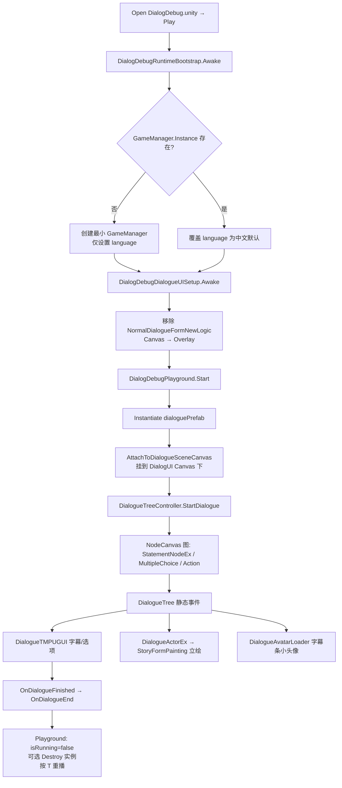

# DialogDebug 对话测试场景 — 技术说明

> 文档日期：2026-05-25  
> 状态：**已落地** — Open `DialogDebug.unity` → Play → Inspector 拖 prefab 即可测对白/立绘/选项。  
> 范围：解耦沙盒方案的全部技术实现；与 GF 正式剧情管线的对照、共享组件、已知限制与排错。  
> 关联：`Assets/Doc/执行文档/0525/DialogDebug对话测试场景_架构溯源与执行说明.md`（架构侦探）、`DialogDebug对话测试场景_施工执行说明.md`（施工交付）

---

## 一、背景与定位

### 1.1 要解决什么问题

CSV 导入 → Bind Graph → 重绑 Actor 之后，策划/程序需要**零门槛**验证对话 prefab 的表现（字幕、立绘、背景、Multiple Choice），而不必：

- 从 **InitScene** 启动整台 GF 管线；
- 走 `StoryComponentGSM.TriggerStory` + 换场 + AB 加载；
- 配置 `SceneName` / Resource Editor。

### 1.2 设计原则（一句话）

**DialogDebug 是与 GF 正式场景管线解耦的「对话沙盒」**：Open 场景 → Play → 拖 `GameRes/Prefabs/Dialogue/*.prefab` → 看表现。

生活类比：正式管线像「开机 → 登录 → 进主城 → 传送试玩」；沙盒像「单独试玩台，插卡带即播」。

### 1.3 非目标

- 不验证 GF 换场、存档面板、战斗 HUD 与 `StoryComponentGSM` 就绪状态；
- 含 `LoadSceneTaskAction`、`TriggerStory` 等 GF Action 的图在沙盒中可能异常（属预期）；
- 不替代正式 Build / AB 打包验证。

---

## 二、沙盒 vs 正式管线

| 维度 | 正式游戏（GF 管线） | DialogDebug 沙盒 |
|------|---------------------|------------------|
| 进场景 | InitScene → 换场 / Tools 菜单 | **Open `DialogDebug.unity` → Play** |
| 触发对话 | `StoryComponentGSM.TriggerStory(name)` | **`DialogDebugPlayground` 拖 prefab 引用** |
| 对话 UI 壳 | `UIComponentGM` 打开 `NormalDialogueNewPanel` | 场景内**常驻** `DialogueTMPUGUI`（从 UI prefab 拆出） |
| 对话内容实例化 | `NormalDialogueFormNewLogic.StartDialogue(go)` → `DialogueSceneContainer` | `DialogDebugPlayground` → 运行时创建/复用 `DialogueSceneContainer` |
| 资源加载 | `ResComponentGM` → GF `ResourceComponent` | Editor 下 `AssetDatabase` 直读（头像图集）；立绘/背景为 prefab 内嵌 UI |
| GameManager | 完整 `OnInit()` + 各 `*ComponentGM` | **最小单例**：仅 `language` |
| 场景管理器 | `BaseGameSceneManager` + `*ComponentGSM` | **无** |

**刻意共享**（与正式一致）：`DialogueTMPUGUI`、`StatementNodeEx`、`DialogueActorEx`、对话 prefab 资产、`StoryFormPainting` 立绘体系。  
**刻意不共享**：`StoryComponentGSM`、`NormalDialogueFormNewLogic`（GF Form 生命周期）、`UIComponentGM` 开 Form。

---

## 三、场景资产与 Hierarchy

| 项 | 路径 / 说明 |
|----|-------------|
| 场景 | `Assets/GameRes/Scenes/DialogDebug.unity` |
| 默认测试 prefab | `Assets/GameRes/Prefabs/Dialogue/Village_KenMuNiStar_Test.prefab` |
| UI 来源 | `Assets/GameRes/Prefabs/UI/NormalDialogueNewPanel.prefab`（去掉 GF Form 脚本） |
| 一次性搭建 | 菜单 **`Tools → Dialogue → Setup DialogDebug Scene`** |

### 3.1 推荐 Hierarchy

```
DialogDebug.unity
├── _Bootstrap
│   ├── DialogDebugRuntimeBootstrap      ← 最小 GameManager（language）
│   └── DialogDebugDialogueUISetup       ← 剥离 GF Form、Canvas Overlay
├── Main Camera
├── EventSystem
├── DialogUI
│   └── NormalDialogueUI                 ← 含 DialogueTMPUGUI、BlackMask 等
│       └── DialogueSceneContainer       ← 运行时由 Playground 创建/复用
├── DialogueInstanceRoot                 ← 历史占位；Playground 仍序列化引用，实际实例挂 Canvas 下
└── DialogDebugPlayground                ← dialoguePrefab / dialogueUI / playOnStart / replayKey(T)
```

### 3.2 UI 分层（渲染顺序）

同一 `Canvas`（Screen Space Overlay）内，**Sibling 越靠前越先画（在底层）**：

1. `DialogueSceneContainer` — 对话 prefab（**BG 背景图 + 人物立绘**）
2. `DialogueTMPUGUI` 字幕条、选项区 — 叠在立绘之上

与正式 `NormalDialogueNewPanel` 中 `DialogueSceneContainer` 为 Canvas **首个子节点** 的约定一致。

---

## 四、运行时链路



---

## 五、核心脚本说明

### 5.1 `DialogDebugPlayground`

**路径**：`Assets/Scripts/Game/GameRuntime/Story/DialogDebugPlayground.cs`

| 字段 | 类型 | 作用 |
|------|------|------|
| `dialoguePrefab` | `GameObject` | Inspector 拖入 `GameRes/Prefabs/Dialogue/*.prefab` |
| `dialogueContainer` | `Transform` | 序列化占位（`DialogueInstanceRoot`）；Canvas 找不到时的降级父节点 |
| `dialogueUI` | `DialogueTMPUGUI` | 场景内字幕 UI |
| `playOnStart` | `bool` | 进 Play 自动播一次 |
| `replayKey` | `KeyCode` | 默认 `T`，播完后重播 |
| `destroyPreviousOnReplay` | `bool` | 重播前销毁上一实例 |

**关键逻辑**：

- `PlayDialogue()`：`Instantiate` → `AttachToDialogueSceneCanvas()` → `StartDialogue()`。
- `AttachToDialogueSceneCanvas()`：在 `dialogueUI` 所在 Canvas 下 `GetOrCreateDialogueSceneContainer()`，全屏 Stretch 挂载实例；重置子 `CanvasGroup.alpha = 1`。
- **重要**：对话 prefab 根只有 `RectTransform`，**不含 Canvas**；若挂在无 Canvas 的 `DialogueInstanceRoot` 下，BG/立绘 UI **不会渲染**。

### 5.2 `DialogDebugRuntimeBootstrap`

**路径**：`Assets/Scripts/Game/GameRuntime/Story/DialogDebugRuntimeBootstrap.cs`

- `Awake`：若 `GameManager.Instance == null`，在 `_Bootstrap` 下创建带 `GameManager` 的空物体，设 `language = Chinese`。
- **不调用** `GameManager.OnInit()`，**不注册** `ResComponentGM` / `PlayerDataComponentGM` 等。
- **不使用** `DontDestroyOnLoad`，避免污染其它 Open Scene 测试。

### 5.3 `DialogDebugDialogueUISetup`

**路径**：`Assets/Scripts/Game/GameRuntime/Story/DialogDebugDialogueUISetup.cs`  
**执行顺序**：`DefaultExecutionOrder(-500)`，早于 Form `Awake`。

- 销毁场景中 `NormalDialogueFormNewLogic`、`ComponentSystemUI`（避免点击存读档找 `UIComponentGM`）。
- 将所有 `Canvas` 设为 `ScreenSpaceOverlay`，`sortingOrder ≥ 100`，不依赖 `UIComponentGM.UICamera`。

### 5.4 Editor：`DialogDebugSceneSetupMenu`

**路径**：`Assets/Editor/Tool/Dialogue/DialogDebugSceneSetupMenu.cs`  
**菜单**：`Tools → Dialogue → Setup DialogDebug Scene`

- 打开 `DialogDebug.unity`，清理旧 GF 遗留（`SceneManager`、`StoryTestTrigger`）。
- 搭建 `_Bootstrap`、`DialogUI`（从 `NormalDialogueNewPanel` 实例化并 Strip GF）、`DialogueInstanceRoot`、`DialogDebugPlayground`、`EventSystem`。
- 默认绑定 `Village_KenMuNiStar_Test.prefab`。

### 5.5 已废弃（保留文件，勿在新场景使用）

| 脚本 | 说明 |
|------|------|
| `DialogDebugSceneManager.cs` | `[Obsolete]` 旧 GF 场景管理器 |
| `DialogDebugStoryTester.cs` | `[Obsolete]` 字符串 + `StoryComponentGSM` |
| `DialogDebugSceneMenu.cs` | Enter 菜单已废弃，提示 Open Scene + Play |

---

## 六、与正式管线共享的组件

### 6.1 `DialogueTMPUGUI`

**路径**：`Assets/Scripts/Game/GameRuntime/NodeCanvas/NodeCanvasExtend/DialogueTMPUGUI.cs`

- `Awake` 订阅 `DialogueTree.OnSubtitlesRequest` / `OnMultipleChoiceRequest` / `OnDialogueFinished`。
- 读 `GameManager.Instance.language` 选中/英/日字幕。
- 通过 `DialogueActorEx.RefreshAvatar` → `DialogueAvatarLoader` 更新字幕条**小头像**。
- 沙盒中**未改核心逻辑**；依赖 Bootstrap 提供 `GameManager.language`。

### 6.2 `DialogueAvatarLoader`（沙盒 null 守卫）

**路径**：`Assets/Scripts/Game/GameRuntime/UI/FormLogic/Story/DialogueAvatarLoader.cs`

正式路径：`PlayerDataComponentGM`（雅尔装扮）→ `ResComponentGM.LoadAsset<SpriteAtlas>`。

沙盒回退（无 GF 组件时）：

| 情况 | 处理 |
|------|------|
| 无 `PlayerDataComponentGM` | 雅尔默认 `Dress + Crown` → `Avatar_Yaer_Dress_Crown.spriteatlas` |
| 无 `ResComponentGM` | Editor Play：`AssetDatabase.LoadAssetAtPath<SpriteAtlas>` |
| 图集仍找不到 | 回调 `null`，仅隐藏小头像，**字幕继续** |

### 6.3 `StoryFormPainting` 立绘体系

**基类**：`Assets/Scripts/Game/GameRuntime/UI/FormLogic/Story/Painting/StoryFormPainting.cs`

- 对话 prefab 内嵌**大立绘**（与字幕条小头像不同）。
- `Awake` 索引 `Faces` / `Clothes` 子节点；`Start` 注册 `DialogueActorEx.OnRefreshAvatarEvent`，按表情名切换显示。

**`GoOutStoryYaerPainting`**（`Village_KenMuNiStar_Test` 等出村线）：

- 无 `GameSceneManager` 时用默认 `Armor_NoHeadWear_Smile`，不访问存档。
- `Normal` 表情在 GoOut 立绘集无 `Armor_NoHeadWear_Normal` 键 → **回退 `Armor_NoHeadWear_Smile`**。

**`GuShaPainting`**：古莎专用；特殊表情切换 `clothes_normal` / `clothes_other`。

### 6.4 NodeCanvas Action 沙盒回退

**基类**：`NormalDialoguePanelTaskAction`  
**路径**：`Assets/Scripts/Game/GameRuntime/NodeCanvas/NodeCanvasNode/ActionTask/NormalDialoguePanel/NormalDialoguePanelTaskAction.cs`

- `OnInit`：无 `UIComponentGM` 或拿不到 `NormalDialogueNewPanel` 时 → `SandboxMode = true`，`FindObjectOfType<DialogueTMPUGUI>()`。
- 子类（黑幕淡入、UI Alpha 动画等）通过 `GetDialogueUICanvasGroup()` / `FindBlackFadeCanvasGroup()` 走沙盒分支。

---

## 七、对话 Prefab 结构（以 `Village_KenMuNiStar_Test` 为例）

```
Village_KenMuNiStar_Test          ← DialogueTreeController + Blackboard
├── BG                            ← Image，全屏背景
├── Yaer                          ← DialogueActorEx
│   └── GoOutStoryYaerPainting    ← 雅尔大立绘（CanvasGroup）
└── Gusha                         ← DialogueActorEx
    └── GushaPainting             ← 古莎大立绘（CanvasGroup）
```

- **背景**：prefab 内 `BG` 的 `Image`，非外部场景加载。
- **人物**：`StoryFormPainting` 子树 + NodeCanvas Actor 绑定。
- **字幕条头像**：`DialogueTMPUGUI.actorPortrait`，由 `DialogueAvatarLoader` 加载图集 Sprite。

---

## 八、验收与自测清单

1. **Tools → Dialogue → Setup DialogDebug Scene**（首次或 Hierarchy 乱时）。
2. Open `DialogDebug.unity` → **直接 Play**（不要从 InitScene）。
3. Inspector：`dialoguePrefab` = `Village_KenMuNiStar_Test`（Setup 会默认赋值）。
4. 预期：背景图、雅尔/古莎立绘、字幕三句、小头像（雅尔按 Dress+Crown 图集）。
5. 播完按 **T** 重播；更换 prefab 引用无需改代码。
6. Console **无** `NullReferenceException`、**无** `StoryComponentGSM 未就绪`。
7. Hierarchy：`DialogUI → … → DialogueSceneContainer → Village_KenMuNiStar_Test`。

---

## 九、已知问题与排错

| 现象 | 可能原因 | 处理 |
|------|----------|------|
| 字幕有，BG/立绘全无 | 实例未挂 Canvas 下 | 确认 `dialogueUI` 已绑定；看是否有 `[DialogDebugPlayground] 未找到 DialogUI Canvas`；重跑 Setup |
| `NullReferenceException` @ `DialogueAvatarLoader.GetAvatar` | 缺 GF 组件（旧版） | 已加 null 守卫；确认 `DialogueAvatarLoader.cs` 为最新 |
| 雅尔大立绘说话时消失 | 表情 `Normal` 无对应 Face 键 | 已回退 Smile；查 `GoOutStoryYaerPainting.ResolveGoOutFaceKey` |
| 小头像不显示 | 图集路径错误或 Editor 无 Asset | 查 `Assets/GameRes/Atlas/Avatar/`；Console `[DialogueAvatarLoader] 沙盒模式未找到图集` |
| 点击存读档报错 | GF Form 未剥离 | 重跑 Setup；确认 `DialogDebugDialogueUISetup` 在 `_Bootstrap` 上 |
| 图内 Action 换场失败 | 沙盒无 GF | **预期**；含换场/TriggerStory 的图回正式场景测 |
| 选项位置不对 | 沙盒用 `Camera.main` 算屏幕坐标 | 场景保留 Main Camera |

---

## 十、推荐工作流（策划 / 程序）

```
Tools/Dialogue/Import CSV
  → GameRes/DialogueTrees/Generated/*.asset
  → 在测试 Prefab 上 Bind Graph + 重绑 Actor
  → Open DialogDebug.unity
  → Inspector：dialoguePrefab ← 拖目标 prefab
  → Play（或 playOnStart）
  → 核对字幕、背景、立绘、Multiple Choice
  → 播完 T 重播 / 换 prefab 再测
```

---

## 十一、代码索引

| 主题 | 路径 |
|------|------|
| 沙盒播放入口 | `Assets/Scripts/Game/GameRuntime/Story/DialogDebugPlayground.cs` |
| 最小 GameManager | `Assets/Scripts/Game/GameRuntime/Story/DialogDebugRuntimeBootstrap.cs` |
| UI 剥离 / Canvas | `Assets/Scripts/Game/GameRuntime/Story/DialogDebugDialogueUISetup.cs` |
| 场景搭建菜单 | `Assets/Editor/Tool/Dialogue/DialogDebugSceneSetupMenu.cs` |
| 字幕 UI | `Assets/Scripts/Game/GameRuntime/NodeCanvas/NodeCanvasExtend/DialogueTMPUGUI.cs` |
| 小头像加载 | `Assets/Scripts/Game/GameRuntime/UI/FormLogic/Story/DialogueAvatarLoader.cs` |
| 大立绘基类 | `Assets/Scripts/Game/GameRuntime/UI/FormLogic/Story/Painting/StoryFormPainting.cs` |
| 正式 Form（对照） | `Assets/Scripts/Game/GameRuntime/UI/FormLogic/Story/NormalDialogueFormNewLogic.cs` |
| 正式触发（对照） | `Assets/Scripts/Game/GameRuntime/GameSceneManager/Component/StoryComponentGSM.cs` |
| Action 沙盒基类 | `Assets/Scripts/Game/GameRuntime/NodeCanvas/NodeCanvasNode/ActionTask/NormalDialoguePanel/NormalDialoguePanelTaskAction.cs` |
| 架构 / 施工文档 | `Assets/Doc/执行文档/0525/DialogDebug对话测试场景_*.md` |
| CSV 导入链 | `Assets/Doc/执行文档/0525/CSV转NodeCanvas对话树_架构溯源与执行说明.md` |

---

## 十二、修订记录

| 日期 | 说明 |
|------|------|
| 2026-05-25 | 初版：解耦沙盒方案技术说明；含 Canvas 挂载、AvatarLoader 回退、立绘 Normal 回退等验收修复项。 |

**文档路径**：`Assets/Doc/技术文档/演出相关/DialogDebug对话测试场景_技术说明.md`
