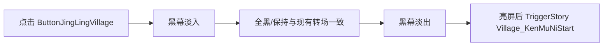

# MapPanel：精灵城（JingLingVillage）入口与黑幕对话 — 开发说明

> 文档日期：2026-04-27  
> 状态：**部分已落地** — 精灵城线已实现 **黑幕 → 亮屏后 `TriggerStory("Village_KenMuNiStart")`**；其它需求见 **§九**。  
> 范围：`MapPanel` 中 **「ButtonJingLingVillage」** 的点击表现；**「未开放区域」** 的通用能力需**保留**供后续章节使用。

---

## 一、背景与目标

### 1.1 背景

- 世界地图 `MapPanel` 上各地点按钮的点击逻辑由 **`MapFormLogic`** 集中处理。当前实现中，所有未单独分支的地点名会落入 `switch` 的 **`default`**，统一调用 **`GameManager.ShowUnOpenTipsPanel()`**，从而打开 **`UnOpenTipsPanel`**（「未开放」提示）。
- 精灵城（按钮名一般为 **`ButtonJingLingVillage`**，与 `PlaceName.JingLingVillage` 等数据命名对应）在初版线中需要进入**有内容的流程**，而不再是「整章未做」的占位提示；但**其它尚未制作完成的地区**在很长一段时间内仍需要沿用 **`UnOpenTipsPanel`** 的交互。

### 1.2 本阶段产品目标（初版）

1. 玩家点击 **`ButtonJingLingVillage`**：**不再**弹出 **`UnOpenTipsPanel`**。
2. 改为：**全屏黑幕淡入 → 全黑段（可与现有转场保持同一套时长体感）→ 黑幕淡出**，屏幕变亮后**拉起一段对话**（**对话预制体**，由项目既有 **`StoryComponentGSM.TriggerStory`** 或等价路径加载/播放）。

### 1.3 非目标（初版不强制，可留待二版）

- 是否**切换 Unity 场景**、是否**关闭地图 UI** 后再进剧情，由实现阶段与关卡策划共同决定；本文档**只要求**「黑幕节奏与全章其它转场统一」与「亮屏后进入对话」。

---

## 二、必须保留的通用能力：「未开放」接口

### 2.1 为什么必须保留

后续仍有大量「章节未实装」的地图点，需要继续用 **`UnOpenTipsPanel`** 做统一反馈，避免每个地点写一套临时逻辑。

### 2.2 建议约定（实现时遵守）

| 项目 | 说明 |
|------|------|
| **保留入口** | 维持 **`GameManager.ShowUnOpenTipsPanel()`** 为对外统一入口；其它「未开放」地点仍走 **`default`** 或**显式 `case`** 调该方法。 |
| **精灵城分支** | 在 **`MapFormLogic.OnSelectOnePlace`** 中增加**独立分支**（例如 `case "ButtonJingLingVillage":`），**不要**删除 `default` 里对 `ShowUnOpenTipsPanel` 的调用。 |
| **可扩展性** | 若未来需要「可配置表驱动」未开放/已开放，可将「地点名 → 行为」抽到数据或静态映射中；初版在脚本内分分支即可。 |

**替代方案说明**：若希望配置化，可新增「地图点行为」枚举或 ScriptableObject，由策划填「未开放 / 黑幕+剧情 / 直接传送」等；初版为降低改动面，**优先在 `MapFormLogic` 内增加独立 `case`**。

---

## 三、初版功能流程（玩家视角）

1. 玩家在 `MapPanel` 点击 **精灵城** 按钮。  
2. 播放**常规按钮反馈**（沿用现有 `UIUtils.PlayBtnAudio` 等，保持与其它地图点一致，除非策划另有要求）。  
3. **黑幕淡入**（全屏遮挡，与游戏内**已有**黑幕/转场使用**同一套 UI 与淡入时长**，避免体验割裂）。  
4. 可选：**全黑保持极短时间**（与 **`LoadSceneComponentGSM` / 各类 `BlackPanel` 转场**的「多停一帧/多停 0.3s」等策略对齐时，以**同组件或同 `BlackFade` 配置**为准，不单独造一套时间曲线）。  
5. **黑幕淡出**，屏幕恢复可见。  
6. **激活（播放）目标对话预制体** — 技术上对应 **`StoryComponentGSM.TriggerStory(...)`**；本线**已锁定**接入 **`Village_KenMuNiStart`**（见 **§3.2**）。是否先关 `MapPanel` 再播等仍可与策划定稿。



### 3.1 黑幕结束后的对话系统（与工程实现一致）

**黑幕淡出、屏幕变亮之后**，精灵城线应衔接的**就是项目既有的统一对话管线**，而不是另一套自定义 UI。要点如下。

| 层级 | 说明 |
|------|------|
| **固定：对话 UI 壳** | 运行时 Hierarchy 里常见 **`NormalDialogueNewPanel(Clone)`**。`StoryComponentGSM` 在加载完**内容**资源后，始终用 **`UIPrefabPath` 中的 `"NormalDialogueNewPanel"`** 打开界面壳，逻辑类为 **`NormalDialogueFormNewLogic`**。壳负责布局、对话框、与战斗立绘协调等，**不随「哪一段剧情」更换预制体名**。 |
| **可变：剧情/对话内容** | 由 **`StoryComponentGSM.TriggerStory(string storyPrefabName)`** 的第一个参数决定。内部通过 **`DialoguePath.GetPath(storyPrefabName)`** 加载：  
  **`Assets/GameRes/Prefabs/Dialogue/{storyPrefabName}.prefab`**  
  加载得到的 `GameObject` 再交给 **`NormalDialogueFormNewLogic.StartDialogue(go)`** 驱动（如 NodeCanvas 对话图）。因此**策划/资源侧新增一段剧情 = 在 `GameRes/Prefabs/Dialogue/` 下增加对应名字的 `.prefab`，代码里传同名字符串**。 |
| **当前播的是哪一段** | 运行时可用 **`StoryComponentGSM.CurrentRunningStoryName`**（与传入的 `storyPrefabName` 一致）；调试用。 |

**注意：与 `Prefabs/Story/` 目录区分**

- 工程中另有 **`StoryPrefabPath`**，指向 **`Assets/GameRes/Prefabs/Story/`**，**不是** `TriggerStory` 使用的路径。  
- **`TriggerStory` 只认 `DialoguePath` → `Prefabs/Dialogue/`**。精灵城黑幕结束后的对话内容应落在 **`Dialogue`** 目录，避免与 **`Story`** 目录混淆。

**流程串接一句话**：**黑幕结束 → 亮屏 → `TriggerStory("某名")` → 打开固定 `NormalDialogueNewPanel` + 加载 `Dialogue/某名.prefab` 作为本段内容** — 与全章其它通过 `TriggerStory` 进入的剧情**同一套系统**。

### 3.2 精灵城线已锁定：对话内容预制体 `Village_KenMuNiStart`

> **重要**：下列 **ID 与磁盘文件名** 以工程为准；实现时 `TriggerStory` 的字符串参数须**完全一致**（区分大小写）。

| 项目                  | 内容                                                                                                                                |
| ------------------- | --------------------------------------------------------------------------------------------------------------------------------- |
| **TriggerStory 参数** | `"Village_KenMuNiStart"`                                                                                                          |
| **资源路径**            | `Assets/GameRes/Prefabs/Dialogue/Village_KenMuNiStart.prefab`                                                                     |
| **代码示例**            | `GetModule<StoryComponentGSM>().TriggerStory("Village_KenMuNiStart");`（具体 `GetModule` 调用方以实际上下文为准，如当前场景管理器上的 `StoryComponentGSM`） |

**说明**：该预制体为 **NodeCanvas 对话图等内容根**；显示层仍由 **`NormalDialogueNewPanel`** 承载（见 **§3.1**）。

---

## 四、与「已有转场速度统一」 — 技术对齐点

项目内常见黑幕行为包括：

- **地图切换 / 大场景转场**：`LoadSceneComponentGSM` 中通过 **`BlackPanel`**、**`ShowBlackFormArgs`** 等；部分场景在 **`MapTransitionBlackHoldSeconds`**（例如默认 **0.3s**）上做多停以掩盖加载/待机。  
- **主菜单/流程**：`ProcedureComponentGM` 等同样使用 **黑幕 UI** 后再 `LoadScene`。

**初版要求**：精灵城线**不单独手搓一套「另一个黑幕」**，应**复用**与上述相同的 **`BlackPanel` + `BlackFade`（或 `BlackFadeComponent`）** 能力，**淡入/淡出时长、曲线、全黑段策略**与**最近一次地图转场或规范文档**保持一致（若需单独常量，可集中放在 `MapFormLogic` 或黑幕工具类中**引用同一配置**，避免三处魔法数）。

### 4.1 黑屏渐入渐出复用方法（工程内脚本）

项目已具备**两套可组合使用**的封装，**不要**再新建全屏色块 + 自写 lerp 作为默认方案。

#### （1）底层：`BlackMask` + `BlackFadeComponent`

| 类 | 路径（脚本） | 作用 |
|----|----------------|------|
| **`BlackMask`** | `Game.GameRuntime.UI.Control.BlackMask` | 挂在带 **Animator** 的全屏遮罩上，通过 **`showTime` / `hideTime`**（Inspector）配合 **`Show` / `Hide` 等 Trigger** 做**淡入全黑**与**淡出**；另提供无过渡的 **`ShowRow` / `HideRow`。** |
| **`BlackFadeComponent`** | `Game.GameRuntime.UI.Component.BlackFade.BlackFadeComponent` | 对 **`BlackMask`** 的薄封装，对外 API：**`ShowFade` / `HideFade` / `ShowRow` / `HideRow`**，以及配合关界面的 **`CloseFormShowFade` / `CloseFormHideFade`** 等。 |

**常用调用形态**：某 **UI 界面** 根物体上已挂好 **`BlackFadeComponent`** 时，在 FormLogic 里：

```text
componentSystemUI.GetComponent<BlackFadeComponent>().ShowFade(回调);
componentSystemUI.GetComponent<BlackFadeComponent>().HideFade(回调);
```

**节奏调节**：在对应预制体/场景中选中 **`BlackMask`** 所挂物体，在 Inspector 中改 **`showTime` / `hideTime`**，与 Animator 状态机一起决定体感快慢。

---

#### （2）全屏独立层：预制体 `BlackPanel` + `BlackFormLogic`

与**换图、新游戏/读档、章节间**等流程一致，使用**单独打开的 System 组全屏黑界面**（不依赖当前地图是否带 `BlackFadeComponent`）。

| 项 | 说明 |
|----|------|
| **预制体名** | 通过 `UIPrefabPath.GetUIPrefabPath("BlackPanel")` 打开，逻辑类为 **`BlackFormLogic`**。 |
| **入参** | **`ShowBlackFormArgs`**（`Game.GameRuntime.UI.FormLogic.Black.ShowBlackFormArgs`） |
| **显示方式** | **`BlackFadeType.FadeShow`**：走 **`BlackFadeComponent.ShowFade`**，淡入结束再执行 **`onShowEnd(BlackFormLogic)`**；**`RawShow`**：无淡入，**`ShowRow`** 直接全黑后回调。 |
| **关闭** | 在已拿到的 **`BlackFormLogic`** 上调用 **`CloseFormFade(Action)`**，内部走 **`CloseFormHideFade`**，黑幕淡出后再关 UIForm。 |

**工程内参考调用**（照抄结构即可，业务回调替换为 `TriggerStory` 等）：

- **`LoadSceneComponentGSM`**：先 `OpenUIForm(BlackPanel, …, ShowBlackFormArgs{ showType = FadeShow, onShowEnd = … })`，在 `onShowEnd` 里做退出旧场景、注册 `onGameSceneManagerReady`、再 `ChangeSceneComponentGM.LoadScene`；全黑后通过 **`OnBlackFadeEnd`** 通知结束转场。  
- **`ProcedureComponentGM`**：新游戏 / 读档流程同样 **`OpenUIForm(BlackPanel, …)`**。  
- **其它**：如 **`ChapterEndFormLogic`**、**`ForestEastTreeEnterTrigger`** 等也有打开 **`BlackPanel`** 的完整示例。

**精灵城线建议**：与转场**完全一致**的观感时，**优先**采用 **`OpenUIForm(… BlackPanel …) + onShowEnd 中执行业务 + CloseFormFade`** 这一条链，避免在 `MapPanel` 上再挂一套新遮罩。

---

#### （3）与对话界面的 `BlackMask` 区分

**`NormalDialogueFormNewLogic`** 下另有子物体 **`BlackMask` + `CanvasGroup`**，用于**对话条自身的局部渐隐**等，**不是**全屏 `BlackPanel` 的替代品。全屏过场仍以 **`BlackPanel` / 各界面上的 `BlackFadeComponent`** 为准。

---

**替代方案说明**：若仅黑幕+剧情、**不卸载场景**，可实现 **`MapPanel` 专用黑幕序列**（**打开 `BlackPanel` → `onShowEnd` 里 `TriggerStory("Village_KenMuNiStart")` → 在适当时机 `CloseFormFade`**）；仍须**与 `BlackPanel` 上 `BlackMask` 的 `showTime` / `hideTime` 与 Animator 表现**对齐，而不是新建另一套全屏色块与时长。

---

## 五、实现侧建议任务拆分（供开发排期）

| 序号 | 任务 | 说明 |
|------|------|------|
| 1 | 分支 | `MapFormLogic` 为 **`ButtonJingLingVillage`** 写独立 `case`，从 `default` 中**剥离**出精灵城。 |
| 2 | 黑幕 | 复用 `BlackPanel` / 已有黑幕打开方式，按统一时长执行淡入—（可选保持）—淡出。 |
| 3 | 对话 | 亮屏后 **`TriggerStory("Village_KenMuNiStart")`**；资源：`Assets/GameRes/Prefabs/Dialogue/Village_KenMuNiStart.prefab`（`DialoguePath`）。 |
| 4 | 地图 UI（流程级） | **黑幕开始**时是否隐藏/关闭地图、**对话结束**后是否**再次打开地图**或**留在场景** — 与关卡流程定稿（可与第 6 条拆分实施）。 |
| 5 | 音频/输入 | 与现有地图是否一致：打开地图时 `Player` 已暂停，若仍保持，仅需确认黑幕+剧情期间不重复暂停。 |
| **6** | **关地图 + 开对话** | **（已落地）** `MapFormLogic.TryStartJingLingVillageStartDialogue`：在 **`TriggerStory` 返回 `true`** 后，调用 **`UIComponentGM.CloseUIForm(UIPrefabPath.GetUIPrefabPath("MapPanel"))`**。须**先** `TriggerStory` **再**关地图，避免先关本界面导致逻辑被销毁、对话拉不起。若 `TriggerStory` 为 `false`（已有对话占线）则**不关**地图。见 **§9.3**。 |

---

## 六、与现有脚本的依赖关系（只读参考）

- **地图点击**：`Game.GameRuntime.UI.FormLogic.Map.MapFormLogic`  
- **未开放弹窗**：`GameManager.ShowUnOpenTipsPanel()` → `UnOpenTipsPanel`  
- **对话拉起**：`StoryComponentGSM.TriggerStory(string storyPrefabName)`（当前场景需存在**场景管理器**与 **`StoryComponentGSM` 模块**；若从地图进的是「仍挂在 Home 等可玩场景」则通常已满足。）  
- **黑幕之后对接的对话壳与内容路径**：见 **§3.1**；**精灵城**内容预制体名已定为 **`Village_KenMuNiStart`**，见 **§3.2**。  
- **黑屏淡入淡出复用与 API 约定**：见 **§4.1**（`BlackMask`、`BlackFadeComponent`、`BlackPanel` / `BlackFormLogic` / `ShowBlackFormArgs`）。  
- **场景/地图转场黑幕参考**：`LoadSceneComponentGSM`、`ShowBlackFormArgs`、`BlackFadeType` 等  
- **开对话时关 `MapPanel`**：见 **§9.3**（**§五 任务 6**）

---

## 七、待确认项（实现前与策划/程序对齐）

- [x] **对话内容预制体**已锁定： **`Village_KenMuNiStart`**（`GameRes/Prefabs/Dialogue/Village_KenMuNiStart.prefab`，与 `TriggerStory` 传参一致）。  
- [x] **任务第 6 条（§五）**：**`TriggerStory` 成功后关闭 `MapPanel`**（**§9.3**）；对话结束后是否**自动重新打开地图**仍由 **§五 任务 4** 与策划定稿。  
- [ ] 精灵城初版是 **纯剧情** 还是剧情后 **进具体场景/关卡**？  
- [ ] 黑幕期间 **BGM/环境音** 是否切轨或压低（若需要，与 `SoundComponentGM` 规范一致）。  
- [ ] 多语言：对话是否已具备 **三语** 或初版只上中文。  

---

## 八、新章节用素材路径（与 Unity Project 一致）

下表为 **本仓库 `Assets` 下实际路径**（用于对话立绘、全身像、世界地图等引用）。若截图或外站文档与目录不一致，**以本工程为准**。

### 8.1 角色 Gusha：对话用头像与立绘

| 用途 | 路径 |
|------|------|
| 根目录 | `Assets/ArtRes/UI/Story/DialogueForm/Gusha/` |
| 半身/头像类（`Avatar`） | `Assets/ArtRes/UI/Story/DialogueForm/Gusha/Avatar/` |
| 大立绘（`DialogueProtrait`，与截图命名一致为 **Protrait**） | `Assets/ArtRes/UI/Story/DialogueForm/Gusha/DialogueProtrait/` |

**`DialogueProtrait` 内当前立绘资源文件名（与策划标注的表情一一对应，便于串对话）：**

- `为难体` · `为难朝左看` · `受伤` · `哀` · `开心` · `惊讶` · `无奈` · `欣喜` · `正常` · `正常体` · `生气` · `笑` · `纠结` · `难过` · `震惊`  
- 对应工程内为同目录下 **平铺的 PNG**（如 `为难体.png`），**非**多段子文件夹；若后续改为子目录归类，以届时工程为准。

**`Avatar` 内示例（英文命名）：** `Angry` · `Awkward` · `Cry` · `Daze` · `ForcedSmile` · `Happy` · `Hurt` · `Laugh` · `Normal` · `Sad` · `Smile` · `Surprised` · `VerySurprised` 等（用于对话小头像/情绪切换）。

---

### 8.2 角色 Yaer：对话用 Avatar / Face（多套装）

| 用途 | 路径 |
|------|------|
| 根目录 | `Assets/ArtRes/UI/Story/DialogueForm/Yaer/` |
| 半身/胸像（按换装分目录） | `Assets/ArtRes/UI/Story/DialogueForm/Yaer/Avatar/Armor/` · `.../ArmorCrown/` · `.../ArmorNone/` · `.../Dress/` |
| 面部/表情切图（按换装分目录） | `Assets/ArtRes/UI/Story/DialogueForm/Yaer/Face/Armor/` · `.../ArmorCrown/` · `.../ArmorNone/` · `.../Dress/` |

**说明：**

- `Face/Armor` 下除系列资源外，含 **`Daze.png`**、**`Unhappy.png`** 等；截图中的示例路径可记为：  
  `Assets/ArtRes/UI/Story/DialogueForm/Yaer/Face/Armor/Daze.png`  
- `Face/Dress` 下为带编号序列表情（如 `0_0000_惊愕`～`0_0008_惊讶` 等），与 `Armor` 系列命名方式不同，绑定时需按表驱动或策划表区分。

---

### 8.3 角色 Yaer：关卡/过场用全身像（Painting）

| 路径 | 内容 |
|------|------|
| `Assets/ArtRes/Painting/Yaer/` | 全幅资源示例：`Armor.png` · `ArmorCrown.png` · `ArmorNone.png` · `Dress.png` |

用于非对话 UI 框内的插画、过场、宣传图等，与 **`DialogueForm` 下头像/立绘**用途区分。

---

### 8.4 对话相关兄弟目录（同层级其它角色，便于新章节选角）

- **总目录**：`Assets/ArtRes/UI/Story/DialogueForm/`  
- 同层常见角色包：**`Aliy`** · **`Amy`** · **`AmyAliyDialogueProtrait`** · **`Goblin`** · **`Gusha`** · **`King`** · **`Lai`** · **`LinEn`** · **`Xiaer`** · **`Yaer`** 等。  
- **Lai** 的立绘目录在工程中拼写为 **`DialougeProtrait`**（与 Gusha 的 `DialogueProtrait` 不同），引用路径时注意大小写与拼写：  
  `Assets/ArtRes/UI/Story/DialogueForm/Lai/DialougeProtrait/`  
- **故事公共控件等**：`Assets/ArtRes/UI/Story/Control/`（若新章节有自定义控制器可一并排查）。

---

### 8.5 与地图/换装相关的 UI 预制体（与精灵城线衔接）

| 资源 | 本工程典型路径 | 说明 |
|------|----------------|------|
| 世界地图 | `Assets/GameRes/Prefabs/UI/MapPanel.prefab` | `ButtonJingLingVillage` 所在界面；逻辑类 `MapFormLogic` |
| 其它常用面板 | `Assets/GameRes/Prefabs/UI/` 下如 `LoadingPanel` · `SelectClothesPanel` 等 | 与加载、换装等流程同目录树 |

若外站文档使用 `Assets/Yaer/UI/Form/` 等写法，**以本工程 `GameRes` 下 `Prefabs` 与 `UIPrefabPath` 实际配置为准**。

---

## 九、实施进度

### 9.1 第一小步：黑幕淡入 / 全黑保持 / 淡出（**已完成，测试通过**）

| 项 | 说明 |
|----|------|
| **目标** | 点击 **`ButtonJingLingVillage`** 时**不再**走 `UnOpenTipsPanel`；先完成**全屏黑幕渐黑 → 全黑段 → 渐亮**（不衔接对话，为下一步预留）。 |
| **实现位置** | `Game.GameRuntime.UI.FormLogic.Map.MapFormLogic` |
| **实现要点** | 在 `OnSelectOnePlace` 的 `switch` 中增加 **`case` 与按钮名 `ButtonJingLingVillage` 一致** 的分支；通过 **`UIComponentGM.OpenUIForm` + `ShowBlackFormArgs`（`BlackFadeType.FadeShow`）** 打开 **`BlackPanel`**；`onShowEnd` 内用 **`GameActionMgr.runDelayTimeAction`（绑定 `MapForm` 的 `gameObject`）** 做可选全黑停留，再调 **`BlackFormLogic.CloseFormFade`** 淡出并关闭 `BlackPanel`。 |
| **可调参数** | 组件上 **`jingLingVillageBlackHoldSeconds`**（默认约 **0.3s**）：全黑后额外停留；为 **0** 则一全黑即开始淡出。黑幕**整体快慢**仍由 **`BlackPanel` 上 `BlackMask` 的 `showTime` / `hideTime`** 与 Animator 决定（与全工程其它 `BlackPanel` 共用同一预制体表现）。 |
| **防护** | 过渡进行中 **`jingLingVillageBlackTransitionInProgress`** 防连点；若 **`BlackPanel` 已存在** 则不再叠开。 |
| **保留能力** | `default` 分支仍调用 **`GameManager.ShowUnOpenTipsPanel()`**，其它未实现地点行为不变。 |
| **排障记录** | 打开 `BlackPanel` 所需类型位于 **`Game.GameMgr.Component.UI`**（`UIComponentGM`、`OpenFormArgs`、`EUIGroup`），`MapFormLogic` 已添加 `using`；编译需通过。 |
| **后续** | **黑幕期间**是否关地图仍属 **§五 任务 4** 与策划可选；**「开对话时关地图」** 已由 **§五 任务 6**、**§9.3** 落地。 |

### 9.2 第二小步：黑幕完全结束后拉对话 `Village_KenMuNiStart`（**已接入代码**）

| 项 | 说明 |
|----|------|
| **目标** | **`CloseFormFade`** 完成（即 **BlackPanel 已关、屏已亮回**）后，再 **`StoryComponentGSM.TriggerStory("Village_KenMuNiStart")`**，以 **`NormalDialogueNewPanel`** 播放 **`GameRes/Prefabs/Dialogue/Village_KenMuNiStart.prefab`**（见 **§3.1、§3.2**）。 |
| **实现位置** | 同上 `MapFormLogic`：`OnJingLingVillageBlackFadeOutComplete` → `TryStartJingLingVillageStartDialogue`。 |
| **实现要点** | `CloseFormFade` 的**完成回调**中先 `jingLingVillageBlackTransitionInProgress = false`，再 `GameManager.GetGameSceneManager()?.GetModule<StoryComponentGSM>()` 判空后 **`TriggerStory(JingLingVillageStartDialoguePrefabName)`**；对话名使用常量与 **`DialoguePath`** 一致。 |
| **无场景管理器时** | 打 **Unity Warning 日志** 并跳过，避免空引用。 |

### 9.3 第三小步：开对话时关闭 `MapPanel`（**§五 任务 6**，**已落地**）

| 项 | 说明 |
|----|------|
| **目标** | **`TriggerStory` 被剧情系统受理后**，关闭 **`MapPanel`**，避免与 **`NormalDialogueNewPanel`** 叠屏。 |
| **实现** | `TryStartJingLingVillageStartDialogue`：若 **`TriggerStory` 返回 `true`**，再 **`UIComponentGM.CloseUIForm(UIPrefabPath.GetUIPrefabPath("MapPanel"))`**。**必须先 `TriggerStory` 再关地图**（用资源路径关界面，不先 `CloseForm` 自销毁），否则 `MapFormLogic` 可能先于对话加载被卸掉。若 **`TriggerStory` 为 `false`**，**不关闭**地图。 |
| **待策划** | 对话结束后是否**再次打开地图**仍属 **§五 任务 4**。 |
| **关联** | **§五 第 6 行**、**§七** 已勾选本项。 |

---

## 十、版本记录

| 版本 | 日期 | 说明 |
|------|------|------|
| 0.1 | 2026-04-27 | 首版：需求、保留未开放接口、初版黑幕+对话流程、与转场统一原则。 |
| 0.2 | 2026-04-27 | 增补：**Gusha / Yaer 对话与 Painting 素材路径**、兄弟角色目录、**MapPanel 等 UI 预制体**路径，并与当前工程目录对齐。 |
| 0.3 | 2026-04-27 | 增补：**§3.1 黑幕结束后的对话系统** — `NormalDialogueNewPanel` 与 `Dialogue/{名}.prefab` 关系、`DialoguePath` 与 `Story/` 目录区别；**§六** 增加交叉引用。 |
| 0.4 | 2026-04-27 | 已锁定：精灵城线接入对话 **`Village_KenMuNiStart`**（**§3.2**、流程图、任务表、**§七** 勾选项）。 |
| 0.5 | 2026-04-27 | 增补：**§4.1 黑屏渐入渐出复用方法** — `BlackMask` / `BlackFadeComponent`、`BlackPanel` / `ShowBlackFormArgs`、与对话内局部黑幕区分、**§六** 交叉引用。 |
| 0.6 | 2026-04-27 | **第一小步落地与验收**：**§九** 记录 `MapFormLogic` 中精灵城黑幕淡入/保持/淡出实现要点、**测试通过**、下一步 `TriggerStory` 待接；文首状态更新。 |
| 0.7 | 2026-04-27 | **第二小步**：`CloseFormFade` 回调内 **`TriggerStory("Village_KenMuNiStart")`**，**§9.2**、文首状态；任务表第 3 行可视为与精灵城线对齐。 |
| 0.8 | 2026-04-27 | 新增需求：**打开对话时关闭 `MapPanel`** — **§五 任务 6**、**§七** 待办、**§9.3** 实施说明与可选实现顺序。 |
| 0.9 | 2026-04-27 | **任务 6 落地**：`TriggerStory` 成功后再 `CloseUIForm(MapPanel)`，**§9.3** 改为已完成、**§七** 更新。 |
