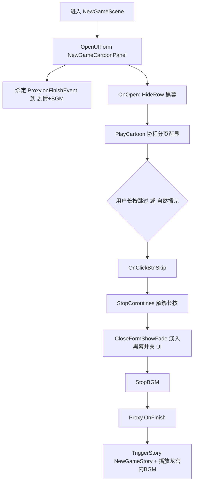

# NewGameCartoonPanel(Clone) 漫画开场策划案

## 1. 文档目的与对象

- **目的**：说明新游戏流程中 **漫画开场界面**（运行时名常为 `NewGameCartoonPanel(Clone)`）的定位、体验链路、可改参数与脚本分工。
- **适用**：策划（节奏/分页/跳过规则）、程序（联调与维护）、UI/美术（分页与 CanvasGroup 结构）。
- **说明**：`(Clone)` 为 Unity 运行时从预制体实例化生成的 **实例名**；资源预制体为 `Assets/GameRes/Prefabs/UI/NewGameCartoonPanel.prefab`。

---

## 2. 产品在流程中的位置

| 环节 | 说明 |
|------|------|
| 触发场景 | 进入 **`NewGameScene`**（新游戏专用场景） |
| 首屏 UI | **`NewGameCartoonPanel`**：静态漫画分页渐显播放 |
| 结束后 | `NewGameSceneManager` 触发对话剧情 **`NewGameStory`**，并播放 **「龙宫内BGM.ogg」** |

漫画界面是 **新游戏剧情的封面页**，与后续 NodeCanvas 剧情、BGM 强衔接，非独立彩蛋界面。

---

## 3. 入口与整体链路

### 3.1 场景侧入口

脚本：`Assets/Scripts/Game/GameRuntime/GameSceneManager/Scene/NewGame/NewGameSceneManager.cs`

- **`OnEnterScene`**：
  - 关闭主菜单打开能力：`GetModule<InputComponentGSM>().SetAllowOpenMenu(false)`。
  - 通过 **`UIComponentGM.OpenUIForm`** 打开 **`NewGameCartoonPanel`**（Bottom 组）。
  - 在 `OpenFormArgs.callBack` 里拿到 **`NewGameCartoonFormLogic`** 后，为 **`NewGameCartoonFormProxy.onFinishEvent`** 赋值：
    - **`StoryComponentGSM.TriggerStory("NewGameStory")`** — 漫画结束进入主线对话。
    - **`SoundComponentGM.PlaySound(SoundType.BGM, "龙宫内BGM.ogg", true)`** — 开始剧情 BGM。

### 3.2 界面侧生命周期（概要）

1. 面板 **Open** → 隐藏黑幕条、注册长按跳过、开始播漫画协程。
2. 用户 **长按跳过** 或 **漫画自然播完** → 黑幕 **淡入** → 关闭本 UI → **`Proxy.OnFinish()`** → 上述剧情 + BGM。
3. **`OnShutDown`（场景管理器）**：若仍持有 `cartoonFormLogic` 引用则强制关闭逻辑（异常或切场景兜底）。

---

## 4. 预制体与组件结构（工程事实）

根物体 **`NewGameCartoonPanel`**（Prefab 内）典型包含：

- **Canvas + CanvasScaler + GraphicRaycaster**：独立 UI 画布，参考分辨率 1920×1080。
- **黑色全屏 Image**：打底，可吸收射线（`Raycast Target`）。
- **`NewGameCartoonFormLogic`**（主逻辑）：序列化引用 **`skipHoldArea`**、**`cartoonPlayer`**。
- **`ComponentSystemUI`**：挂载 **黑幕等 UI 组件**（见下节）。

运行时实例名为 **`NewGameCartoonPanel(Clone)`** 属 Unity 默认命名，与逻辑无关。

---

## 5. 脚本功能分析（核心）

### 5.1 `NewGameCartoonFormLogic`

**路径**：`Assets/Scripts/Game/GameRuntime/UI/FormLogic/Cartoon/NewGameCartoonFormLogic.cs`  
**基类**：`BaseUIFormLogic`

| 职责 | 实现要点 |
|------|-----------|
| 面板初始化 | `OnInit` 中 `GetProxy<NewGameCartoonFormProxy>()`，与场景侧订阅 `onFinishEvent` 对接。 |
| 打开时 | `OnOpen`：**`BlackFadeComponent.HideRow()`** 去掉黑幕条，保证漫画可见；**`skipHoldArea.onHoldProgressEnd += OnClickBtnSkip`**；**`cartoonPlayer.PlayCartoon(OnClickBtnSkip)`**，自然结束也会走同一回调。 |
| 结束/跳过 | **`OnClickBtnSkip`**：`cartoonPlayer.StopAllCoroutines()`，取消订阅长按；**`BlackFadeComponent.CloseFormShowFade(UIForm, …)`** 在黑幕淡入后关界面；回调内 **`StopBGM`**（避免与下一首衔接冲突）、**`GetProxy<NewGameCartoonFormProxy>().OnFinish()`**。 |
| 音效 | `PlayerOpenAudio()` 空实现，漫画本身 **不自带开场专用 Sound，由后续 BGM·剧情承接**。 |

**注释代码**：曾尝试用 `AnimationEvent` 注册 `"End"` 调跳过，当前未启用，**跳过完全依赖长按区域 + `CartoonPlayer` 结束回调**。

**关联**：`CloseFormShowFade` 定义于 `BlackFadeComponent` —— **先淡入黑幕再 `CloseUIForm`**，避免闪屏。

---

### 5.2 `NewGameCartoonFormProxy`

**路径**：`Assets/Scripts/Game/GameRuntime/UI/FormLogic/Cartoon/NewGameCartoonFormProxy.cs`  
**基类**：`BaseFormProxy`

| 职责 | 说明 |
|------|------|
| **`onFinishEvent`** | `Action`，由 **`NewGameSceneManager`** 在打开面板时赋值：漫画 **彻底关闭后** 触发剧情与 BGM。 |
| **`OnFinish()`** | 执行并 **清空** `onFinishEvent`，避免重复触发。 |

**策划意义**：漫画与 **龙宫剧情、BGM** 的衔接点 **只有这一处代理**，改后续流程应动 `NewGameSceneManager` 里赋值内容或 `OnFinish` 调用链，不必改 `CartoonPlayer` 分页逻辑。

---

### 5.3 `CartoonPlayer`

**路径**：`Assets/Scripts/Game/GameRuntime/UI/FormLogic/Cartoon/CartoonPlayer.cs`  
**类型**：`MonoBehaviour`，挂在预制体上，由 `NewGameCartoonFormLogic` 引用。

**数据结构**

- **`CartoonPage`**：`pageCanvasGroup`（一页整体）+ **`PageContents[]`**（该页内多条内容区块，顺序播放）。
- **`CartoonPages`**：`List<CartoonPage>` —— **多页漫画的序列**。

**播放逻辑（`_PlayCartoon` 协程）**

1. **`ResetCartoon`**：所有页的 `pageCanvasGroup` 与 `PageContents` 的 **alpha 置 0**。
2. 对 **每一页**：
   - 将该页 **`pageCanvasGroup.alpha = 1`**；
   - 对该页每个 **`PageContents[i]`** 调用 **`ShowContent(..., 0 → 1)`**（默认 **3 秒** 从透明渐到不透明）；
   - 再对该页 **`pageCanvasGroup`** 调用 **`ShowContent(..., 1 → 0)`**（整页渐隐）。
3. 全部页播完后执行 **`PlayEndCallback`**（与打开时传入的回调相同，即 **`OnClickBtnSkip`**）。

**`ShowContent` 细节**

- 按 **`duration`（默认 3 秒）** 线性插值 alpha。
- 循环中若检测到 **`Input.GetMouseButtonDown(0)`** 会 **打断当前这一段渐变**，直接设为目标 alpha（**点一下可加快当前片段**，与「长按跳过整块界面」是两套交互）。

**策划注意**

- **总时长** ≈ 各页 `(PageContents 数量 × ~3s) + (每页收尾 ~3s)`，无配置表驱动的「单页停留时间」字段，改节奏需 **改代码默认 `duration` 或 Prefab 分页数量**。
- **纯鼠标左键**判断，触摸端是否等同需实机验证 **Unity 输入映射**。

---

### 5.4 `UIPointerHoldArea`（长按跳过）

**路径**：`Assets/Scripts/Game/GameRuntime/UI/FormLogic/Cartoon/../Component/UIPointerHoldArea.cs`（实际目录为 `UI/Component/UIPointerHoldArea.cs`）

| 行为 | 说明 |
|------|------|
| `OnEnable` | 获取或 **打开 `PointerHoldPanel`**，拿到 **`PointerHoldFormLogic`**，用于 **长按进度**。 |
| `OnPointerDown` | 向 `PointerHoldFormLogic` **注册** `OnHoldProgressEnd`。 |
| `OnPointerUp` | **移除**监听（未完成长按则不会触发结束）。 |
| **`onHoldProgressEnd`** | 长按进度走满时触发；`NewGameCartoonFormLogic` 在此与 **`OnClickBtnSkip`** 绑定。 |

**策划意义**：跳过整块漫画 **不是点一下就关**，而是 **按住直到 PointerHold 完成**（具体手感由 `PointerHoldPanel` 配置决定）。

---

### 5.5 关联：`BlackFadeComponent`

**路径**：`Assets/Scripts/Game/GameRuntime/UI/Component/BlackFade/BlackFadeComponent.cs`

- **`HideRow`**：打开漫画时 **直接隐藏黑幕**（不切淡入淡出动画）。
- **`CloseFormShowFade`**：**淡入黑幕** → 回调（此处：`StopBGM`、`Proxy.OnFinish`）→ **`CloseUIForm`**。

---

### 5.6 场景侧：`NewGameSceneManager`（衔接剧本）

| 代码意图 | 说明 |
|----------|------|
| 禁止菜单 | 防止漫画播放中被打开暂停菜单打断（可按产品改为允许）。 |
| `onFinishEvent` | **唯一**把「漫画结束」接 **`NewGameStory` + BGM** 的接口。 |

---

## 6. 体验与交互总结（给策划落地用）

| 玩家行为 | 系统反应 |
|----------|-----------|
| 进入新游戏场景 | 自动打开漫画全屏 UI，黑幕收起。 |
| 观看分页 | 按 `CartoonPages` 顺序逐块 **约 3 秒/段** 渐显；每页最后整页渐隐。 |
| 轻点屏幕 | 仅 **打断当前一段渐变**（加速当前格），**不直接结束漫画**（除非该段恰为最后一段且随后进结束回调）。 |
| 长按跳过区至完成 | 触发 **`OnClickBtnSkip`**：停协程、黑幕淡入、关面板 → **剧情 + BGM**。 |
| 不操作直至播完 | `CartoonPlayer` 调结束回调，与跳过 **同一套关界面与 `OnFinish`**。 |

---

## 7. 可扩展与维护建议

1. **时长与节奏**：若需「每格单独配秒数」或「配音轨卡点」，建议把 `CartoonPlayer` 的固定 `duration` 升级为 **序列化配置** 或 **Timeline**，本策划案不涉及实现细节。
2. **触摸与 PC**：长按依赖 `PointerHoldPanel`；点按加速依赖 `GetMouseButtonDown`，多端需统一 **输入层级** 测试。
3. **剧情与 BGM**：仅改后续内容时，优先改 **`NewGameSceneManager`** 内 `onFinishEvent`，保持 **`NewGameCartoonFormLogic` 薄封装**。
4. **资源**：漫画图在 **Prefab 中按 `CartoonPage` 结构** 填入 `CanvasGroup` 引用；换图 **不动脚本** 即可替换序列。

---

## 8. 关键文件索引

| 类型 | 路径 |
|------|------|
| 预制体 | `Assets/GameRes/Prefabs/UI/NewGameCartoonPanel.prefab` |
| 界面逻辑 | `Assets/Scripts/Game/GameRuntime/UI/FormLogic/Cartoon/NewGameCartoonFormLogic.cs` |
| 代理（结束后回调） | `Assets/Scripts/Game/GameRuntime/UI/FormLogic/Cartoon/NewGameCartoonFormProxy.cs` |
| 分页播放器 | `Assets/Scripts/Game/GameRuntime/UI/FormLogic/Cartoon/CartoonPlayer.cs` |
| 长按跳过 | `Assets/Scripts/Game/GameRuntime/UI/Component/UIPointerHoldArea.cs` |
| 黑幕 | `Assets/Scripts/Game/GameRuntime/UI/Component/BlackFade/BlackFadeComponent.cs` |
| 场景入口与衔接 | `Assets/Scripts/Game/GameRuntime/GameSceneManager/Scene/NewGame/NewGameSceneManager.cs` |
| 预加载配置 | `Assets/Scripts/Game/GameMgr/Manager/Res/SceneRes/Config/NewGameSceneResConfig.cs` |

---

## 9. 流程简图（逻辑顺序）

---

*本文依据当前仓库脚本与 `NewGameCartoonPanel.prefab` 引用关系整理；若 Prefab 结构或 `CartoonPages` 配置有变，请同步更新第 4、5、6 节。*
