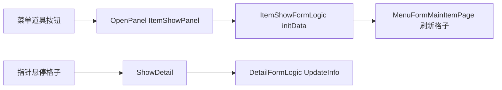

# 道具描述框功能（ItemShowPanel / DetailPage）

面向策划：说明「背包道具悬浮描述」对应的界面预制体、子物体、多语言文案来源与程序行为，便于验收与配表。

---

## 1. 功能概述

- 玩家在**菜单**中点击「道具」类入口后，会打开 **道具展示界面**（`ItemShowPanel`）。
- 界面内格子上的道具图标支持**鼠标悬停**：在**当前道具格锚点附近**弹出**描述框**（描述框左上角对齐道具格**右下角**，见 4.3），展示该道具的说明文案。
- 描述框在预制体中对应节点名为 **`DetailPage`**，逻辑脚本为 **`DetailFormLogic`**（挂在 `DetailPage` 上）。

运行时实例名通常为 **`ItemShowPanel(Clone)`**（Unity 对打开的面板实例的默认命名）。

---

## 2. 预制体与层级

| 项目 | 路径 / 名称 |
|------|-------------|
| 面板预制体 | [`Assets/GameRes/Prefabs/UI/ItemShowPanel.prefab`](f:/Yaer/yaer/Yaer/Assets/GameRes/Prefabs/UI/ItemShowPanel.prefab) |
| 运行时实例 | `ItemShowPanel(Clone)`（命名以实际为准） |
| 描述框根节点 | 子物体 **`DetailPage`**（与 `MenuFormMainItemPage` 等区域并列，属同一面板内容） |
| 描述逻辑 | `DetailPage` 上挂载 **`DetailFormLogic`** |

**说明**：`DetailPage` 下通常还有 **Frame / 文本** 等子节点；`DetailFormLogic` 使用 **TMP**（`txInfo`）与 **Legacy Text**（`textInfo`）双写一份描述，并依赖多个 **Canvas** 引用做**排序层**（保证框体与文字盖在背包格子之上）。具体引用以预制体 Inspector 为准。

---

## 3. 打开入口（从菜单到面板）

- 菜单界面逻辑：[`MenuFormLogic`](f:/Yaer/yaer/Yaer/Assets/Scripts/Game/GameRuntime/UI/FormLogic/Menu/MenuFormLogic.cs)  
- 点击道具相关按钮时调用：`UIUtils.OpenPanel("ItemShowPanel", EUIGroup.Top, ...)`，并在回调里对 **`ItemShowFormLogic`** 执行 **`initData(proxy, menuFormLogic)`**，用于刷新主道具页数据。

---

## 4. 描述框何时显示、文案从哪来

### 4.1 交互（悬停）

- 格子按钮上通过 **`MenuFormMainItemBtnMask`** 实现指针进入/离开：
  - **进入**：协程每帧调用 `MenuFormMainItemBtn.ShowDetail()`；
  - **离开**：`HideDetail()`，关闭描述节点。
- 脚本：[`MenuFormMainItemBtnMask.cs`](f:/Yaer/yaer/Yaer/Assets/Scripts/Game/GameRuntime/UI/FormLogic/Menu/MainItemPage/MenuFormMainItemBtnMask.cs)、[`MenuFormMainItemBtn.cs`](f:/Yaer/yaer/Yaer/Assets/Scripts/Game/GameRuntime/UI/FormLogic/Menu/MainItemPage/MenuFormMainItemBtn.cs)。

### 4.2 多语言字段

`MenuFormMainItemBtn.ShowDetail()` 根据当前语言从 `MenuFormMainItemInfo` 取不同字段：

| 语言 | 使用字段 |
|------|----------|
| 中文 | `detail` |
| 英文 | `detail_en` |
| 日文 | `detail_jp`（注意：项目里其它 UI 可能对日语资源有特殊处理，以实际为准） |

数据结构：[`MenuFormMainItemInfo.cs`](f:/Yaer/yaer/Yaer/Assets/Scripts/Game/GameRuntime/UI/FormLogic/Menu/MenuFormMainItemInfo.cs)。

### 4.3 位置（锚定道具格右下角）

- **`DetailFormLogic.UpdateInfo(string info, RectTransform anchorSlot)`** 在设置文案后，将 **`DetailPage`** 摆到 **`anchorSlot`（道具格 RectTransform）世界空间右下角** 处：使描述框的**左上角**与格子**右下角**重合（再叠加 Inspector 里的 **`cornerOffset`**）。
- **`MenuFormMainItemBtn`** 上可序列化 **`detailAnchorRect`** 指向「道具框」节点；未赋值时使用**本按钮**的 `RectTransform`。悬停协程**每帧**调用 `ShowDetail()`，以便**滚动背包**后描述框仍贴在格子旁。
- **出屏**：若文案过长导致框体超出屏幕，可在 `DetailFormLogic` 上后续增加边界夹紧；当前版本以策划在预制体中调整 `DetailPage` 尺寸与 `cornerOffset` 为主。

---

## 5. 与 ItemShowPanel 相关的脚本

| 脚本 | 作用 |
|------|------|
| [`ItemShowFormLogic.cs`](f:/Yaer/yaer/Yaer/Assets/Scripts/Game/GameRuntime/UI/FormLogic/ItemShowPanel/ItemShowFormLogic.cs) | 面板入口：绑定 `mainItemPage`、`detailForm`（即 `DetailFormLogic`）、关闭按钮；`OnOpen` 时先隐藏 `detailForm`；`initData` 驱动主道具页 |
| [`DetailFormLogic.cs`](f:/Yaer/yaer/Yaer/Assets/Scripts/Game/GameRuntime/UI/FormLogic/Menu/DetailFormLogic.cs) | 描述框内容、Canvas 排序与**相对道具格锚点**定位 |
| [`MenuFormMainItemBtn.cs`](f:/Yaer/yaer/Yaer/Assets/Scripts/Game/GameRuntime/UI/FormLogic/Menu/MainItemPage/MenuFormMainItemBtn.cs) | `detailAnchorRect`、`ShowDetail` 传入锚点并每帧刷新 |

---

## 6. 数据流（简图）

---

## 7. 策划验收清单

- [ ] 打开 `ItemShowPanel` 后，**有道具的格子**悬停能出现描述，`DetailPage`（或 `detailForm` 所指节点）显隐正常。
- [ ] 中文 / 英文 / 日文切换后，描述与配置表或数据源（`detail` / `detail_en` / `detail_jp`）一致。
- [ ] 鼠标移出格子后描述消失。
- [ ] 描述框贴在**当前悬停道具格右下角**附近（滚动列表后仍对齐）；若偏移不对，检查 `MenuFormMainItemBtn.detailAnchorRect` 与 `DetailFormLogic.cornerOffset`。
- [ ] 与其他全屏 UI 的遮挡关系可接受（若有问题，检查 `DetailFormLogic` 里各 Canvas 的 `sortingOrder`）。
- [ ] 关闭 `ItemShowPanel` 后，描述不应残留（依赖 `HideDetail` 与面板关闭）。

---

## 8. 与主菜单「背包」的关系

主菜单 `MenuPanel` 内也可能存在同名 **`DetailPage`** 与同一套 **`DetailFormLogic` / `MenuFormMainItemBtn`** 逻辑；**道具描述交互规则一致**，仅**打开面板的入口**不同。策划验收时以当前需求为准：本页重点为 **`ItemShowPanel` + `DetailPage`**。

---

## 9. 相关资源（便于程序/美术对齐）

- 预制体：`Assets/GameRes/Prefabs/UI/ItemShowPanel.prefab`
- 图集（返回按钮）：`ItemShowFormLogic` 中 `returnBtnAtlas`（多语言切图 `returnNor` + 语言后缀等）
