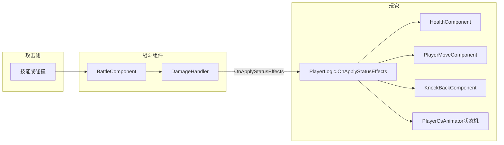

# 玩家受击系统

## 概述

玩家受击与受伤表现由 **`BattleComponent`** 经 **`DamageHandler`** 派发事件，玩家在 **`PlayerLogic`** 中订阅 **`OnApplyStatusEffects`**（`DamageData`），在同一回调里扣血并驱动移动/动画状态机（普通受伤、蹲姿受伤、击飞、死亡等）。

伤害数值与击退/击飞参数一般由**攻击方技能/碰撞**组装进 `DamageData`，玩家侧主要负责分支逻辑与组件调用。

---

## 伤害数据 `DamageData`

定义见：`Assets/Scripts/Game/GameRuntime/Entities/Component/Battle/Damage/DamageData.cs`。

| 字段 | 含义（与受击表现相关） |
|------|------------------------|
| `baseDamage` | 基础伤害，最终会参与扣血 |
| `dirPos` | 伤害来源方向；注释约定 **(1,0) 表示来自右侧的水平伤害**。玩家会据此转向，击退方向会取反（见下） |
| `attackType` | `NormalType` 普通 / `BreakType` 击飞类（见 `AttackType`） |
| `breakWidth` | 击退水平距离；会传入 `KnockBackComponent.ApplyKnockBack` |
| `breakHight` | **注意拼写为 Hight**；与击飞高度/击退竖直抖动等相关，并参与 `KnockBackComponent.SetKnockBaseData` |
| `breakTime` | 与击退持续时间等一起传入 `SetKnockBaseData` |

攻击类型枚举：`Assets/Scripts/Game/GameRuntime/Entities/Component/Battle/Attack/AttackType.cs`。

---

## 玩家处理流程 `PlayerLogic.OnApplyStatusEffects`

实现：`Assets/Scripts/Game/GameRuntime/Entities/Player/PlayerLogic.cs`（约 373–475 行）。

### 前置条件

- 玩家未死亡（`HealthComponent`）。
- **`!isProtect`**：例如对话期间会为 true，此时逻辑不进入受伤表现（与剧情无敌一致）。
- 扣血：`TakeDamage(data.baseDamage)` 在条件满足时执行。

### 霸体 `isNoBreakState`

若为真，受伤**不**打断当前动作（不进入后续受击分支），直接 return。

### 通用

- `StopMove()`，并按 `data.dirPos.x` 调用 `TurnRight()` / `TurnLeft()`。

### 分支概览（与动画状态机 Sign 相关）

| 条件（简化） | BreakType（击飞类） | 非 Break |
|--------------|---------------------|----------|
| 攀爬 `IsClimb` | 设置击飞距离/高度，切击飞相关状态 | 蹲姿受伤/死亡等 |
| 下蹲 `Squat` | 同上，击飞或切击飞状态 | 蹲姿受伤/死亡 |
| 跳跃/坐下 `IsJumping` / `IsSitting` | 设置击飞距离/高度后切击飞 | （代码以击飞分支为主） |
| **默认（地面等）** | 切击飞或死亡击飞 | 随机 `Damage1` / `Damage2` 或死亡；**若 `breakHight > 0`** 则额外走 `KnockBackComponent` |

### 默认分支下的击退（`KnockBackComponent`）

当进入「默认」分支且 **`data.breakHight > 0`** 时：

- `knockBackComponent.SetKnockBaseData(data.breakHight, data.breakTime)`
- `knockBackComponent.ApplyKnockBack(data.dirPos * -1, data.breakWidth)`  
  **击退方向与伤害来源相反**（`* -1`）。

---

## 「击飞角度」与手感：调参指哪

工程里**没有单独名为「受击角度」的字段**。观感来自：

1. **方向**  
   - `DamageData.dirPos` 二维方向（含斜向），决定击退与面向。

2. **击飞轨迹（状态机内，如 `DamageFly` 等）**  
   - `PlayerMoveComponent.SetDamageFlyDistance` / `SetDamageFlyHeight`  
   - 数值常由本次伤害的 `breakWidth`、`breakHight` 在受击时写入。  
   - 预制体上默认值见 `PlayerMoveComponent` 的 **`[Header("击飞")]`**（`damageFlyHeight`、`damageFlyDistance`）。

3. **水平击退 + 竖直抛物线抖动（`KnockBackComponent`）**  
   - 脚本：`Assets/Scripts/Game/GameRuntime/Entities/Component/Physics/KnockBackComponent.cs`  
   - 可在玩家预制体上调节：**`knockBackDuration`**、**`bounceHeight`**、**`bounceFrequency`**（`FixedUpdate` 内用 `Sin` 叠加垂直偏移）。  
   - `ApplyKnockBack(direction, backDistance)` 控制水平位移量（来自 `breakWidth`）；`SetKnockBaseData` 用 `breakHight`、`breakTime` 映射到 `bounceHeight` 与 `knockBackDuration`。

若要改「击飞远近/高度」，优先改 **攻击侧传入的 `DamageData`**；若要改「击退时上下抖动手感」，改 **`KnockBackComponent`** 上述序列化字段。

---

## 相关脚本路径（速查）

| 说明         | 路径                                                                                  |
| ---------- | ----------------------------------------------------------------------------------- |
| 玩家受击主逻辑    | `Assets/Scripts/Game/GameRuntime/Entities/Player/PlayerLogic.cs`                    |
| 伤害数据结构     | `Assets/Scripts/Game/GameRuntime/Entities/Component/Battle/Damage/DamageData.cs`    |
| 攻击类型       | `Assets/Scripts/Game/GameRuntime/Entities/Component/Battle/Attack/AttackType.cs`    |
| 战斗事件入口     | `Assets/Scripts/Game/GameRuntime/Entities/Component/Battle/BattleComponent.cs`      |
| 移动与击飞距离/高度 | `Assets/Scripts/Game/GameRuntime/Entities/Player/Components/PlayerMoveComponent.cs` |
| 击退组件       | `Assets/Scripts/Game/GameRuntime/Entities/Component/Physics/KnockBackComponent.cs`  |

---

## 调试工具（编辑器）

推荐使用 Unity 顶部菜单 **Editor → 受击击退测试**（与 **Editor → GameManagerTool** 同一菜单，实现写在 [`GameToolEditor.cs`](f:/Yaer/yaer/Yaer/Assets/Scripts/Debug/Editor/GameToolEditor.cs) 文件末尾的 `KnockbackTestEditorWindow` 类中）。窗口不遮挡 Game 视图，**需在 Play 模式**、且场景已 **`canCreatePlayer`** 并生成玩家后，再点击「执行受击/击退」。核心逻辑与运行时面板共用同一文件内的静态类 `KnockbackTestRunner`（见 [`KnockbackTestFormLogic.cs`](f:/Yaer/yaer/Yaer/Assets/Scripts/Game/GameRuntime/UI/FormLogic/KnockbackTestPanel/KnockbackTestFormLogic.cs) 文件后部）。

（可选）若仍通过 UI 系统打开预制体 `Assets/GameRes/Prefabs/UI/KnockbackTestPanel.prefab`，逻辑见 `KnockbackTestFormLogic.cs`；已不再绑定 **F2** 快捷键。

三种模式与上文「Normal 地面击退 vs Break 击飞」一致：

- **Normal 全流程**：`baseDamage = 0`，`BattleComponent.TakeDamage`，需 **`breakHight > 0`** 才会走 `KnockBackComponent`；`breakTime` 对应击退时长，`TakeDamage` 前写入 `bounceFrequency`。
- **Break 击飞**：走 `DamageFly` 分支，**不**经过 `ApplyKnockBack` 的击退曲线；击退时长/频率对击飞轨迹无直接作用。
- **纯击退**：仅 `KnockBackComponent.SetKnockBaseData` + `ApplyKnockBack`，无完整受击动画，用于快速调 `FixedUpdate` 内位移曲线。

**注意**：对话无敌（`isProtect`）或霸体（`isNoBreakState`）时表现可能不完整。编辑器内 **F1** 仍为原有 `AA_TestPanel`（若保留该快捷键）。

---

## 策划 / 测试检查清单

- [ ] 对话或 `isProtect` 为 true 时：不应出现受击打断（与无敌设定一致）。
- [ ] 地面站立：**NormalType** 与 **BreakType** 各测一次（普通受伤动画 vs 击飞/击飞状态）。
- [ ] **BreakType**：攀爬、下蹲、跳跃与默认站立至少各测一条路径。
- [ ] 修改某技能的 `breakWidth` / `breakHight` / `breakTime` 后，击退与击飞距离/手感是否符合预期。
- [ ] 搜索配置时注意字段名为 **`breakHight`**，不要用 `breakHeight` 全字匹配。
