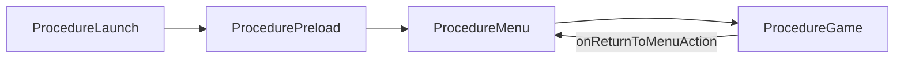

# 项目上下文说明（Project Context）

本文档面向新成员与辅助工具（如 AI 助手），概括仓库技术栈、目录约定与运行时分层。**详细打包与 AssetBundle 操作步骤见仓库根目录 `README.md`，此处不重复。**

---

## 1. 项目概览

| 项 | 说明 |
|----|------|
| 引擎 | Unity（2D 为主：2D Animation、PSD Importer、Sprite、Tilemap、Physics2D 等，见 `Packages/manifest.json`） |
| 产品名 / 公司名 | `DragonWarConcubine`（见 `ProjectSettings/ProjectSettings.asset`） |
| 代码规模 | 游戏与框架脚本主要位于 `Assets/Scripts`（体量较大，按命名空间与子目录导航） |

---

## 2. 核心技术栈

### 2.1 Game Framework

- **位置**: `Assets/Scripts/GameFramework`（`Core`、`CoreExtend`、`UnityRuntime` 等）。
- **用途**: 提供资源初始化、Procedure（流程状态机）、UI 表单、实体等基础设施；与 [Game Framework 官方范式](https://gameframework.cn/) 一致，本项目在其上挂载自研 `Game` 层。

### 2.2 自研游戏层 `Assets/Scripts/Game`

分层目的：**把「全局服务 / 持久数据 / 切场景」与「单局玩法、场景内对象、UI 表现」拆开**，避免场景逻辑直接依赖底层资源与存档细节，便于维护与测试。

| 目录 | 职责 |
|------|------|
| `GameMgr` | 全局 `GameManager`（MonoBehaviour 单例）与各类 `*ComponentGM`：UI、存档、资源、切场景、流程（Procedure）协调、PureMVC 入口等。 |
| `GameRuntime` | Procedure 具体状态、UI `FormLogic` / `Proxy`、按场景划分的 `GameSceneManager`、玩家/怪物/场景实体与交互组件。 |
| `Static` | 路径常量、枚举、资源名字符串等**无运行时单例依赖**的静态配置。 |
| `Entry` | 与 Game Framework 入口的衔接；例如 `GameRuntimeEntry.Custom.cs` 中可扩展自定义组件初始化。 |

### 2.3 PureMVC

- **位置**: `GameMgr/Component/PureMVC`（如 `MVCComponentGM`、`GameFacade`、`BaseProxy`、`BaseCommand`）。
- **用途**: UI 与流程之间的通知、存档/菜单等跨界面事件，通过 Proxy 订阅与回调集中处理（例如 `ProcedureComponentGM` 监听 `LoadGameFormProxy`、`MenuFormProxy` 等）。

### 2.4 NodeCanvas

- **位置**: `Assets/ParadoxNotion`（NodeCanvas / CanvasCore）。
- **用途**: 可视化行为与任务图；`GameRuntime` 下存在与 UI 面板联动的 `NodeCanvasNode` 等桥接代码。

### 2.5 其他常用依赖（节选）

- **异步**: UniTask（`Assets/Plugins/UniTask`）。
- **动画与补间**: DOTween / DOTween Pro（`Assets/Plugins/Demigiant`）。
- **镜头**: Cinemachine（Package）。
- **输入**: Unity Input System（Package）。
- **JSON**: `com.unity.nuget.newtonsoft-json`（Package）。
- **编辑器**: NuGetForUnity、Hot Reload（Package）；Excel 相关读取见 `Assets/Packages/ExcelDataReader*`。

---

## 3. 启动与 Procedure 流程

### 3.1 状态迁移（高层）

Game Framework 的 **Procedure** 以 FSM 方式驱动游戏阶段；本项目主要状态大致为：

1. **`ProcedureLaunch`**：语言/变体/声音等初始化占位、`ResourceComponent.InitResources`，完成后调用 `GameManager.Instance.OnInit()` / `OnEnter()`，再进入预加载。
2. **`ProcedurePreload`**：通过 `UIComponentGM` 打开 Init 界面；预加载条件满足后淡出并 `ChangeSceneComponentGM` 加载 Start 场景，再 `ChangeState<ProcedureMenu>`。
3. **`ProcedureMenu`**：订阅 `ProcedureComponentGM.onStartGameAction`，调用 `OpenMainMenu()`；当真正开始游戏时切换到 `ProcedureGame`。
4. **`ProcedureGame`**：持有 `BaseGameMode`，在非暂停时 `Update`；可通过 `ProcedureComponentGM` 回到主菜单状态。

### 3.2 流程示意图

**说明**: `ProcedureGame` → `ProcedureMenu` 的返回依赖 `ProcedureComponentGM.onReturnToMenuAction` 等事件，上图仅表达主线条。

### 3.3 关键代码锚点（便于跳转）

- 启动后进入预加载：`Assets/Scripts/Game/GameRuntime/Procedure/ProcedureLaunch.cs`（`ChangeState<ProcedurePreload>`）。
- Init UI 与切 Start 场景：`Assets/Scripts/Game/GameRuntime/Procedure/ProcedurePreload.cs`。
- 主菜单与进局：`Assets/Scripts/Game/GameRuntime/Procedure/ProcedureMenu.cs`。
- 局内循环：`Assets/Scripts/Game/GameRuntime/Procedure/ProcedureGame.cs`。

---

## 4. 全局状态与游戏进程

### 4.1 `GameManager`

- **文件**: `Assets/Scripts/Game/GameMgr/GameManager.cs`。
- **角色**: 场景间长期存在的单例，聚合**是否暂停、是否在对话、是否允许玩家操作与射线检测**等全局开关，并与 `ProcedureComponentGM`、UI、场景管理器协同。
- **设计原因**: 玩法脚本只需读/write 少量布尔状态，而不必互相引用深层 UI 或存档类型，降低耦合。

### 4.2 `ProcedureComponentGM`

- **文件**: `Assets/Scripts/Game/GameMgr/Component/ProcedureComponentGM.cs`。
- **角色**: 把「开始游戏、回主菜单、加载/保存存档、暂停」等**进程级事件**从 PureMVC Proxy 与 UI 回调接到具体流程（打开主菜单、切 Procedure 状态等）。

### 4.3 场景内：`BaseGameSceneManager`

- **文件**: `Assets/Scripts/Game/GameRuntime/GameSceneManager/Base/BaseGameSceneManager.cs`。
- **角色**: 具体游玩场景的逻辑枢纽：子管理器列表、输入/加载/剧情等 `*ComponentGSM`、实体与交互注册、与 `GameManager.Pause` 等联动。
- **与 GameMgr 的关系**: GameMgr 偏「应用级」，GSM 偏「当前场景关卡级」；新场景玩法优先在 `GameRuntime` 下扩展，需要全局服务时通过 `GameManager` / `GetGMComponent<T>()` 访问。

---

## 5. `Assets` 顶层目录（约定）

| 路径 | 说明 |
|------|------|
| `GameRes` | 需构建进 AssetBundle 的游戏资源（与根目录 `README.md` 中 AB 说明一致）。 |
| `StreamingAssets` | 运行时加载的 AB 等文件放置处；构建后需按流程拷贝对应平台包体。 |
| `Editor` | 编辑器扩展与 Game Framework 资源工具配置（如 `GFAssetBundleSettings`）。 |
| `Scripts` | `GameFramework` 与 `Game` 等业务脚本。 |
| `Plugins` | 原生插件与第三方 DLL/工具（如 UniTask、DOTween）。 |
| `ParadoxNotion` | NodeCanvas 相关资源与程序集。 |
| `Tests` | Unity Test Framework 用例（如 `Assets/Tests` 下 EditMode 测试）。 |

---

## 6. 扩展阅读

- **打包与 AB 构建、Resource Editor/Builder、Scenes in Build 菜单**：见 Unity 工程根目录 [`README.md`](../README.md)（与本 `Assets` 文件夹同级）。

---

## 7. 文档维护

- 若重大架构变更（例如新增全局组件或调整 Procedure 链），请同步更新本节与「关键代码锚点」中的路径。
- 本文件为说明性质，**不替代**设计文档或接口注释；复杂逻辑仍以代码与团队规范为准。
